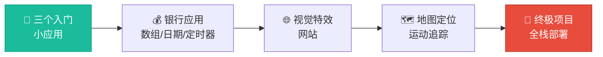
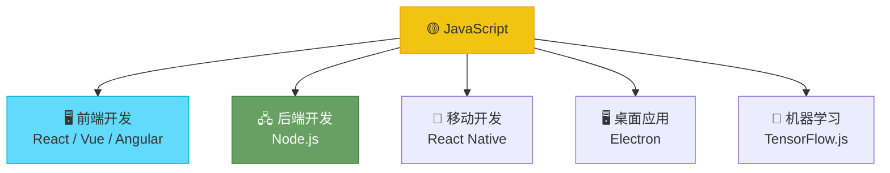

# 课程结构与项目概览

> 📺 来源：`001 Course Structure and Projects.en.srt`
> 📂 章节：第 01 章

## 📌 知识脉络
- **前置知识**：无
- **后续扩展**：JavaScript 基础语法、DOM 操作、面向对象编程、异步编程、现代开发工具链

## 🎯 概述

本节课是整门 JavaScript 课程的"导航地图"。讲师带你快速浏览课程的 20 个章节、60+小时的内容编排以及将要完成的多个实战项目，帮助你建立全局学习视野，明确学习路径，并为后续深入学习奠定信心。

## 核心知识点

### 1. 课程的整体架构

> 🧩 **生活类比**：这个课程就像一本"公路旅行攻略"——从起点（零基础）到终点（专家级开发者），沿途有风景（知识点）、加油站（练习）和地标建筑（项目），每一站都在为下一站做准备。


课程包含大约 **20 个章节**，超过 **60 小时**的视频内容，从零基础到专家级，涵盖 JavaScript 的方方面面。

### 2. 学习路径的四大阶段

> 🧩 **生活类比**：学编程就像建一栋大楼——先打地基（基础语法），再搭框架（进阶概念），然后装修（项目实战），最后验收交付（部署上线）。

```mermaid
flowchart TD
    subgraph 🏗️ ["第一阶段：打地基"]
        A1["📝 变量、数据类型<br/>运算符、控制流"]
        A2["🔧 问题解决<br/>调试、开发环境"]
    end
    subgraph 🧱 ["第二阶段：搭框架"]
        B1["🎨 DOM 操作<br/>3 个小项目"]
        B2["⚙️ JS 引擎原理<br/>深入底层"]
        B3["🚀 ES6 新特性<br/>解构、Map、闭包"]
    end
    subgraph 🎨 ["第三阶段：装修"]
        C1["💰 数组方法<br/>数字、日期、定时器"]
        C2["🌐 网站特效<br/>懒加载、滑块、选项卡"]
        C3["🏗️ OOP<br/>构造函数、ES6 类"]
        C4["⏳ 异步 JS<br/>Ajax、外部 API"]
    end
    subgraph 🚀 ["第四阶段：交付"]
        D1["📦 NPM、Babel<br/>Parcel、ES6 模块"]
        D2["🌍 部署上线<br/>Netlify + Git"]
    end

    A1 --> A2 --> B1 --> B2 --> B3 --> C1 --> C2 --> C3 --> C4 --> D1 --> D2

    style A1 fill:#2ecc71,stroke:#27ae60,color:#fff
    style B1 fill:#3498db,stroke:#2980b9,color:#fff
    style C1 fill:#e67e22,stroke:#d35400,color:#fff
    style D1 fill:#e74c3c,stroke:#c0392b,color:#fff
```

| 阶段 | 章节范围 | 核心内容 | 关键成果 |
|------|---------|---------|---------|
| 🏗️ 打地基 | S2-S6 | 基础语法、开发技能 | 能写简单 JS 程序 |
| 🧱 搭框架 | S7-S10 | DOM、引擎原理、ES6 | 能做交互式网页 |
| 🎨 装修 | S11-S16 | 数组、OOP、异步 | 能做完整应用 |
| 🚀 交付 | S17-S19 | 模块化、打包、部署 | 能部署到互联网 |

### 3. 课程中的实战项目一览

> 🧩 **生活类比**：项目就像驾校的路考——光背交规不够，必须真正上路，才能检验你是否真正掌握了驾驶技能。



| 项目 | 所在章节 | 核心技术 | 难度 |
|------|---------|---------|------|
| 🎲 三个 DOM 小应用 | S7 | DOM 操作、事件处理 | ⭐ |
| 💰 银行应用 | S11-S12 | 数组方法、日期、定时器 | ⭐⭐⭐ |
| 🌐 视觉特效网站 | S13 | 懒加载、选项卡、滑块 | ⭐⭐⭐ |
| 🗺️ 地图运动追踪 | S14-S15 | OOP、Geolocation API | ⭐⭐⭐⭐ |
| 🍴 终极全栈项目 | S17-S19 | NPM、Parcel、部署 | ⭐⭐⭐⭐⭐ |

### 4. 关于 JavaScript 的核心地位

JavaScript 是当今世界上**最流行的编程语言**，驱动着整个现代 Web 生态系统：



## 💡 关键要点

- ✅ 本课程共 20 章、60+ 小时，从零基础到专家级，覆盖 JavaScript 全部核心知识
- ✅ 学习路径分四阶段：基础 → 进阶 → 实战 → 部署，层层递进
- ✅ 课程包含多个精心设计的实战项目，每个项目对应不同的核心技术栈
- ✅ JavaScript 是全球最流行的编程语言，掌握它可以从事前端、后端、移动端等多个方向
- ✅ 零基础学员从第 2 章开始；有基础的学员可按"学习路径导航"跳选章节

## ⚠️ 常见误区

- ⚠️ **误区 1**："我已经知道一些基础，可以跳过前面所有章节" → 即使有基础，第 8 章（JS 引擎原理）和第 14 章（OOP）的深度内容也值得认真学习
- ⚠️ **误区 2**："只看视频不动手也能学会" → 编程是一项实践技能，必须通过动手写代码、做项目来真正掌握
- ⚠️ **误区 3**："必须按顺序看完每一节" → 有基础的学习者应查看课程的"学习路径导航"章节，选择适合自己的路径

## 📖 词汇速查表 (Cheat Sheet)

| 中文术语 | 英文术语 | 简明释义 | 速查代码（如有） |
|---------|---------|---------|---------------|
| 文档对象模型 | DOM | 浏览器将 HTML 解析为可操作的树形结构 | `document.querySelector()` |
| 解构 | Destructuring | ES6 从数组/对象中提取值的简写语法 | `const {name} = obj;` |
| 闭包 | Closure | 函数能记住并访问其词法作用域 | — |
| 面向对象编程 | OOP | 用构造函数/类组织代码的范式 | `class Person {}` |
| 异步 | Asynchronous | 不阻塞主线程的代码执行方式 | `async/await` |
| 模块 | Module | 可复用的代码文件单元（ES6 模块） | `import/export` |
| 部署 | Deployment | 将代码发布到服务器供公众访问 | Netlify / Git |

---

## 🧪 学习验证

### ❓ 理解检测

1. 本课程的总章节数大约是多少？
   - A) 5 章
   - B) 10 章
   - C) 20 章
   - D) 50 章

2. DOM 操作的相关项目在课程的哪个阶段出现？
   - A) 第一阶段（基础语法）
   - B) 第二阶段（搭框架）
   - C) 第三阶段（装修）
   - D) 第四阶段（交付）

3. 课程最终项目使用哪些工具进行部署？（✅ 对 / ❌ 错）
   - 使用 NPM 和 Parcel 进行打包 → ______
   - 使用 Netlify 和 Git 进行部署 → ______
   - 使用 Docker 进行容器化 → ______

<details><summary>📋 答案与解析</summary>

1. **答案：C）20 章**。讲师明确提到课程包含 "about 20 sections with over 60 hours of video content"。
2. **答案：B）第二阶段（搭框架）**。DOM 操作在第 7 章，属于"搭框架"阶段，这里会构建 3 个交互式小应用。
3. **答案**：
   - 使用 NPM 和 Parcel 进行打包 → ✅ 对（S17-S18 学习现代工具链）
   - 使用 Netlify 和 Git 进行部署 → ✅ 对（S19 部署项目到互联网）
   - 使用 Docker 进行容器化 → ❌ 错（课程中不涉及 Docker）

</details>
