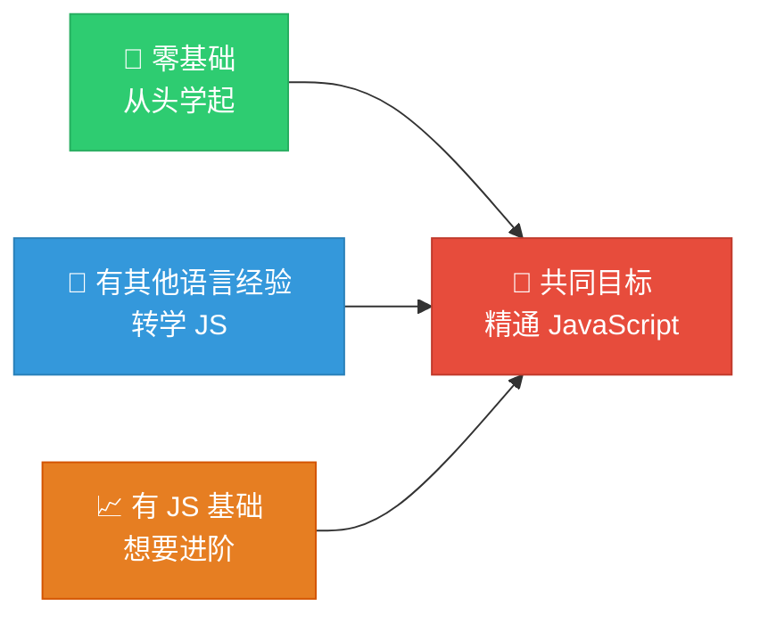
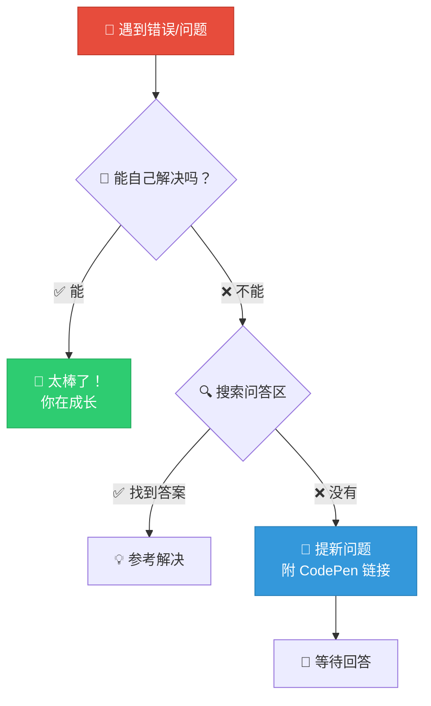

# 开始学习前的必读指南

> 📺 来源：`003 Watch Before You Start!.en.srt`
> 📂 章节：第 01 章

## 📌 知识脉络
- **前置知识**：无
- **后续扩展**：所有后续章节的学习方法论基础；调试技巧（第 4-6 章）；编码挑战（贯穿全课程）

## 🎯 概述

本节课是整个 JavaScript 学习之旅的"行前须知"。讲师总结了 **10 条高效学习建议**，涵盖学习心态、编码习惯、问题解决策略和课程使用技巧，帮助你以最高效的方式完成整门课程。

## 核心知识点

### 1. 课程适合所有水平的学习者

> 🧩 **生活类比**：这门课程就像一条高速公路的多车道设计——新手走慢车道稳步前进，有经验的司机可以切到快车道加速通过，每个人都能到达目的地。



适合你的学习调节方式：

| 你的情况 | 推荐做法 |
|---------|---------|
| 感觉太快 | 回看讲解，降低播放速度 |
| 感觉太慢 | 加速播放，跳到进阶章节 |
| 遇到困难 | 在问答区提问 |
| 早已掌握基础 | 查看"学习路径导航"章节 |

### 2. 十大高效学习法则

> 🧩 **生活类比**：学编程就像学游泳——你不可能只在岸上看教练示范就学会。你必须跳进水里，哪怕一开始会呛水，但只有亲自下水才能真正学会。

```mermaid
flowchart TD
    subgraph 💻 ["实践为王"]
        R1["⌨️ ① 跟着敲代码<br/>绝不只看不练"]
        R2["🧩 ② 尝试所有挑战<br/>卡住就看答案"]
    end
    subgraph 📝 ["知识沉淀"]
        R3["📒 ③ 做笔记<br/>语法、概念、心得"]
        R4["🔁 ④ 章节复习<br/>先理解再前进"]
    end
    subgraph 🧠 ["心态管理"]
        R5["✋ ⑤ 不要急于求成<br/>初期不必理解所有'为什么'"]
        R6["🚫 ⑥ 别否定自己<br/>每个人进度不同"]
        R7["😄 ⑦ 保持乐趣<br/>累了就休息"]
    end
    subgraph 🔧 ["问题解决"]
        R8["🔍 ⑧ 先自己尝试解决<br/>这是成长的关键"]
        R9["❓ ⑨ 善用问答区<br/>附代码链接"]
    end
    subgraph 🖥️ ["环境无关"]
        R10["💻 ⑩ Mac/Win/Linux<br/>完全一样"]
    end

    style R1 fill:#2ecc71,stroke:#27ae60,color:#fff
    style R5 fill:#f39c12,stroke:#e67e22,color:#fff
    style R8 fill:#3498db,stroke:#2980b9,color:#fff
```

#### 🔟 法则详解

**① 必须亲手敲代码**

光看视频学不到任何东西。哪怕只是跟着讲师一行一行地敲一模一样的代码，只要你在亲手输入，就比坐着看视频强一百倍。

**② 认真做编码挑战**

编码挑战是课程学习机会的"半壁江山"。无论做得好不好，都必须尝试。如果卡住太久，就看解答——没有关系，理解解答本身也是学习。

**③ 做大量笔记**

记下语法、理论概念以及你觉得重要的一切。笔记越多越好，每个人都有自己的风格，找到适合自己的方法。

**④ 章节间要复习**

课程的章节是逐层递进的。在进入下一章之前，确保你真正理解了当前章节的内容。回顾代码、笔记和项目，甚至自己写一些练习代码。

**⑤ 初期别纠结"为什么"**

在最初几章，不必追求理解每个细节背后的原理。也不用在意代码是否"优雅"或"高效"——在学习初期，只需让代码能跑起来。课程后续会系统讲解"为什么"。

**⑥ 每个人的学习速度不同**

如果进度比别人慢，这完全正常。绝对不允许冒出"也许编程不适合我"这种想法——成千上万的学员都经历过同样的过程。

**⑦ 保持乐趣**

编程本身是一件非常有趣和有成就感的事情。如果感到沮丧，暂停一下，稍后再回来。永远要在快乐的状态下写代码。

**⑧ 遇到问题先自己解决**

这对你的成长至关重要。先独立思考、调试、查资料，这个过程本身就是最好的学习。

**⑨ 善用问答区**

如果自己解决不了，先搜索问答区——很可能别人已经遇过相同的问题。如果需要提新问题，务必：
- 写简短的问题描述
- 把代码贴到 codepen.io
- 分享链接

> 没有代码，别人无法帮助你。

**⑩ 跨平台完全兼容**

课程在 Mac 上录制，但 Windows 和 Linux 上的操作完全相同。如果代码出问题，不是操作系统的原因。

### 3. 遇到错误时的正确处理流程

> 🧩 **生活类比**：遇到 Bug 就像开车遇到路障——先自己绕路（独立解决），绕不开就查地图（问答区搜索），实在不行再打电话求助（提新问题）。



## 💡 关键要点

- ✅ 不管你的水平如何，这门课程都适合你——利用播放速度和章节跳转来调节
- ✅ **必须亲手敲代码**，绝不能只看视频
- ✅ 编码挑战是学习机会的一半，必须尝试
- ✅ 做笔记、章节复习、循序渐进——这三件事决定你的学习效果
- ✅ 初期不必追求完美理解，先让代码跑起来
- ✅ 遇到问题先自己解决，这是成长的关键环节
- ✅ 保持乐趣，累了就休息，永远不要否定自己

## ⚠️ 常见误区

- ⚠️ **误区 1**："我看完视频就算学了" → 只看不练等于零学习。必须亲手敲代码
- ⚠️ **误区 2**："编码挑战我做不出来，说明我不行" → 做不出来完全正常，看解答也是学习。关键是先尝试
- ⚠️ **误区 3**："我应该从第一行代码开始就写出完美的代码" → 初学阶段追求的是"能跑就行"，优雅和高效留到后面
- ⚠️ **误区 4**："不同操作系统会导致代码不一样" → JavaScript 是跨平台语言，Mac / Windows / Linux 上运行结果完全一致

## 📖 词汇速查表 (Cheat Sheet)

| 中文术语 | 英文术语 | 简明释义 | 速查代码（如有） |
|---------|---------|---------|---------------|
| 编码挑战 | Coding Challenge | 课程中穿插的编程练习题 | — |
| 问答区 | Q&A Section | 课程平台上的提问和讨论区域 | — |
| 播放速度 | Playback Speed | 调节视频播放快慢 | — |
| 调试 | Debugging | 查找并修复代码中的错误 | — |
| 代码沙盒 | CodePen | 在线代码编辑/分享平台 | codepen.io |

---

## 🧪 学习验证

### ❓ 理解检测

1. 讲师认为学习 JavaScript 最重要的习惯是什么？
   - A) 做大量笔记
   - B) 亲手敲代码
   - C) 加速播放视频
   - D) 跳过简单章节

2. 遇到代码错误时，正确的处理顺序是？
   - A) 直接问老师 → 搜索问答 → 自己尝试
   - B) 自己尝试 → 搜索问答 → 提新问题（附代码）
   - C) 重装开发环境 → 重新看视频 → 放弃
   - D) 搜索问答 → 自己尝试 → 直接问老师

3. 在学习初期，应该追求写出优雅高效的代码。（✅ 对 / ❌ 错）

4. 如果做不出编码挑战，说明编程不适合你。（✅ 对 / ❌ 错）

<details><summary>📋 答案与解析</summary>

1. **答案：B）亲手敲代码**。讲师明确说"You will learn exactly zero JavaScript skills by just sitting and watching me code"，亲手敲代码是最核心的学习行为。
2. **答案：B）自己尝试 → 搜索问答 → 提新问题（附代码）**。先独立解决培养问题解决能力，搜索问答利用已有资源，最后才提新问题。
3. **答案：❌ 错**。讲师明确说初学阶段不要纠结代码是否高效或优雅，先让代码能跑起来，后续课程会专门讲优化。
4. **答案：❌ 错**。做不出来完全正常，"figuring out the solution is actually not even the main point"，重要的是尝试的过程和从解答中学习。

</details>
