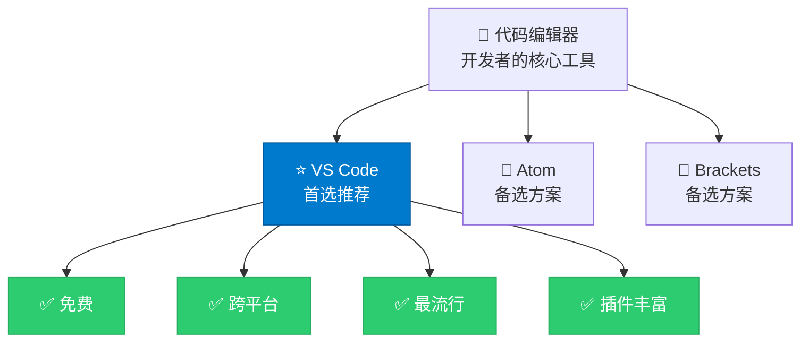
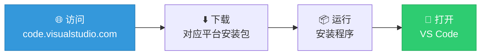
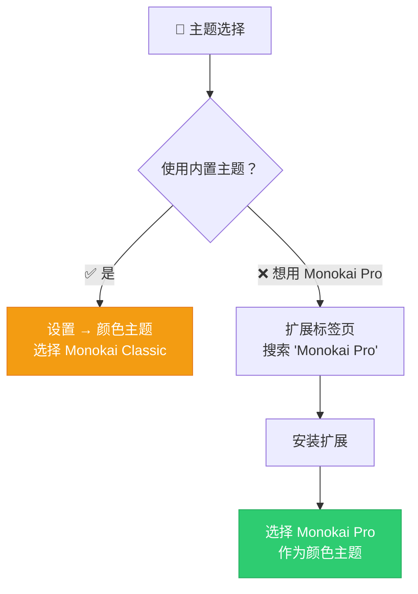
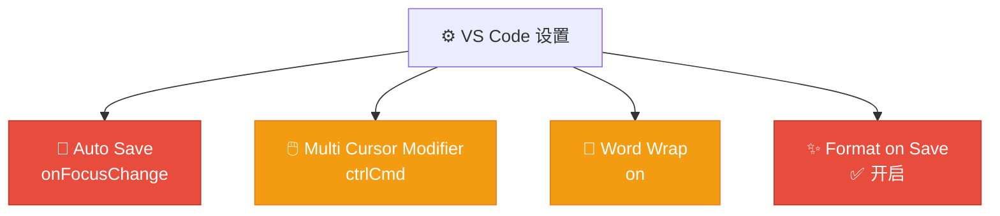

# 配置代码编辑器

> 📺 来源：`004 Setting Up Our Code Editor.en.srt`
> 📂 章节：第 01 章

## 📌 知识脉络
- **前置知识**：无
- **后续扩展**：JavaScript 基础语法（第 2 章）、代码格式化工具 Prettier（后续章节安装）、Chrome 开发者工具（调试章节）

## 🎯 概述

在正式编写 JavaScript 代码之前，需要安装并配置一个代码编辑器（Code Editor）。本节课将指导你下载安装 **Visual Studio Code（VS Code）**，并完成主题（Theme）、自动保存（Auto Save）、保存时格式化（Format on Save）等关键设置，让你的开发环境与讲师保持一致。

## 核心知识点

### 1. 为什么选择 VS Code？

> 🧩 **生活类比**：如果编程是烹饪，那么代码编辑器就是你的厨房。VS Code 就像一间"全功能智能厨房"——免费、工具齐全、布局合理，而且全球大多数厨师都在用它，你遇到问题很容易找到帮助。



**📊 编辑器对比：**

| 特性 | VS Code | Atom | Brackets |
|------|---------|------|----------|
| 价格 | 免费 | 免费 | 免费 |
| 跨平台 | ✅ Win/Mac/Linux | ✅ | ✅ |
| 社区活跃度 | ⭐⭐⭐⭐⭐ | ⭐⭐ (已停止维护) | ⭐⭐ |
| 插件生态 | 极其丰富 | 较丰富 | 有限 |
| 启动速度 | 快 | 较慢 | 中等 |
| 内置终端 | ✅ | ❌ | ❌ |

### 2. 安装与下载

> 🧩 **生活类比**：安装 VS Code 就像下载一个 App——去官网，选对应系统的版本，点击安装，完事。

**安装步骤：**



1. 访问 [code.visualstudio.com](https://code.visualstudio.com)
2. 下载适合你操作系统的安装包（Windows / macOS / Linux）
3. 运行安装程序，按默认选项完成安装
4. 打开 VS Code

### 3. 主题配置（Theme）

> 🧩 **生活类比**：主题就像给你的办公桌换上不同的桌布和台灯——不影响功能，但能让你的工作环境更舒适、更赏心悦目。

**课程推荐主题：Monokai Pro**



| 主题 | 来源 | 价格 | 说明 |
|------|------|------|------|
| Monokai Classic | VS Code 内置 | 免费 | 与 Monokai Pro 颜色相近 |
| Monokai Pro | 扩展商店 | 约 $10（可免费试用） | 课程使用的主题 |

> 💡 **记忆口诀**：**"主题只换衣裳不换芯"**——换主题只改颜色外观，不影响代码功能。

### 4. 关键设置项

> 🧩 **生活类比**：配置 VS Code 的设置就像调整新车的座椅和后视镜——花几分钟调好，后面开起来会舒服几个月。

**必须配置的 4 项核心设置：**



| 设置项 | 推荐值 | 作用 | 优先级 |
|--------|--------|------|--------|
| Auto Save | `onFocusChange` | 切换文件或窗口时自动保存 | ⭐⭐⭐⭐⭐ |
| Format on Save | `✅ 开启` | 保存时自动格式化代码（需安装格式化工具） | ⭐⭐⭐⭐⭐ |
| Word Wrap | `on` | 长行自动换行显示 | ⭐⭐⭐ |
| Multi Cursor Modifier | `ctrlCmd` | 按住 Ctrl/Cmd 可多处同时编辑 | ⭐⭐ |

**🔍 如何找到设置：**

在 VS Code 中按 `Ctrl + ,`（Windows）或 `Cmd + ,`（Mac）打开设置面板，然后在顶部搜索栏中输入关键词即可快速定位。

### 5. 文件图标主题（File Icon Theme）

除了颜色主题，还可以更改文件图标的显示风格。课程推荐使用 **Seti** 图标主题，让不同类型的文件以更清晰的图标区分。

设置路径：`设置 → 文件图标主题 → Seti (Visual Studio Code)`

### 6. 安装 Google Chrome

> ⚠️ **重要提示**：除了 VS Code，还需要安装最新版的 **Google Chrome** 浏览器，因为它将作为测试和调试 JavaScript 代码的主要工具。

## 🛠️ 代码实战与真实场景

> **💼 业务场景**：假设你是一名刚入职的前端实习生，技术主管要求你按照团队规范配置自己的开发环境。以下是一份 VS Code 的`settings.json` 配置文件示例，包含了本节提到的所有核心设置项。

**① 打开设置文件**：

在 VS Code 中按 `Ctrl + Shift + P`（Windows）或 `Cmd + Shift + P`（Mac），输入 `settings json`，选择 `Preferences: Open User Settings (JSON)`

**② 核心配置**：

```js
// VS Code 用户设置 (settings.json)
{
  // 自动保存：切换窗口或文件时自动保存
  "files.autoSave": "onFocusChange",

  // 保存时自动格式化代码（需要安装 Prettier 等格式化工具）
  "editor.formatOnSave": true,

  // 开启自动换行，避免水平滚动
  "editor.wordWrap": "on",

  // 多光标修饰键设为 Ctrl/Cmd
  "editor.multiCursorModifier": "ctrlCmd",

  // 颜色主题（你可以改成你喜欢的主题名称）
  "workbench.colorTheme": "Monokai Pro",

  // 文件图标主题
  "workbench.iconTheme": "vs-seti"
}
```

**🔍 执行追踪：**
```
第 1 行: "files.autoSave": "onFocusChange"    → 切换窗口/文件时自动保存
第 2 行: "editor.formatOnSave": true           → 保存 = 自动格式化
第 3 行: "editor.wordWrap": "on"               → 长行不用横向滚动
第 4 行: "editor.multiCursorModifier": "ctrlCmd"→ Ctrl+点击 = 多光标
第 5 行: "workbench.colorTheme": "Monokai Pro"  → 编辑器颜色风格
第 6 行: "workbench.iconTheme": "vs-seti"       → 文件图标风格
```

**📊 输入输出示例：**

| 操作 | 设置前的行为 | 设置后的行为 |
|------|------------|------------|
| 切换到另一个文件 | 需要手动 `Ctrl+S` 保存 | 自动保存✅ |
| 保存一段凌乱的代码 | 保持凌乱 | 自动格式化整齐✅ |
| 写了超长的一行代码 | 需要水平滚动查看 | 自动换行显示✅ |

## 💡 关键要点

- ✅ VS Code 是当前最流行、免费、跨平台的代码编辑器，强烈推荐使用
- ✅ 主题仅影响视觉外观，不影响代码功能；推荐 Monokai Pro 或内置 Monokai Classic
- ✅ **Auto Save（onFocusChange）** 和 **Format on Save** 是两个最重要的设置
- ✅ 可以通过 `settings.json` 直接编辑配置，也可以在设置面板中搜索
- ✅ 必须同时安装最新版 Google Chrome 作为代码测试浏览器
- ✅ VS Code 在 Windows / Mac / Linux 上功能完全一致

## ⚠️ 常见误区

- ⚠️ **误区 1**："Format on Save 开了没效果" → 需要安装格式化扩展（如 Prettier），光开设置不够
- ⚠️ **误区 2**："必须用跟讲师一样的主题才能学" → 主题是审美偏好，任何主题都不影响学习
- ⚠️ **误区 3**："我用的不是 Mac，可能会有兼容问题" → VS Code 完全跨平台，功能无差异

## 🐛 报错实验室

> 如果你不小心犯了这些错误会怎样？

**❌ 错误场景 1：忘记开启 Auto Save**
```
情况：你在 index.html 中做了修改，直接切到浏览器刷新
结果：页面没有任何变化！你的修改没保存！
```
**🔑 解读**：没有开启 Auto Save 意味着每次修改后都需要手动按 `Ctrl+S`。开启 `onFocusChange` 后，切换窗口时会自动保存。

**❌ 错误场景 2：搜索扩展时拼写错误**
```
搜索内容：monkai pro（拼错了 monokai）
结果：找不到正确的扩展
```
**🔑 解读**：扩展名称需要精确拼写。正确名称是 **Monokai Pro**（注意 `o` 的位置）。

## 📖 词汇速查表 (Cheat Sheet)

| 中文术语 | 英文术语 | 简明释义 | 速查代码（如有） |
|---------|---------|---------|---------------|
| 代码编辑器 | Code Editor | 开发者编写代码的核心工具 | VS Code |
| 主题 | Theme | 编辑器的颜色方案 | `"workbench.colorTheme"` |
| 扩展 | Extension | 为编辑器添加额外功能的插件 | 扩展面板搜索安装 |
| 自动保存 | Auto Save | 无需手动保存文件 | `"files.autoSave"` |
| 保存时格式化 | Format on Save | 保存时自动整理代码格式 | `"editor.formatOnSave"` |
| 自动换行 | Word Wrap | 长行自动折行显示 | `"editor.wordWrap"` |
| 多光标 | Multi Cursor | 同时在多处编辑代码 | `Ctrl/Cmd + 点击` |
| 文件图标主题 | File Icon Theme | 不同文件类型的图标样式 | `"workbench.iconTheme"` |

---

## 🧪 学习验证

### 📝 动手练习

**练习 1：配置你自己的 VS Code**
> 提示：按照本节课的指引，完成下面的配置清单

- [ ] 下载并安装 VS Code
- [ ] 选择一个你喜欢的颜色主题
- [ ] 将 Auto Save 设为 `onFocusChange`
- [ ] 开启 Format on Save
- [ ] 安装最新版 Google Chrome

<details><summary>💡 参考答案</summary>

完成以上所有步骤后，你的 `settings.json` 应该至少包含：

```js
{
  "files.autoSave": "onFocusChange",
  "editor.formatOnSave": true,
  "editor.wordWrap": "on"
}
```

**验证方法**：创建一个新文件，写几行代码，然后切换到浏览器——回来后文件应该已自动保存（标题栏不会显示未保存的圆点标记）。
</details>

### ❓ 理解检测

1. VS Code 被推荐的主要原因是？
   - A) 它是唯一的代码编辑器
   - B) 它免费、跨平台、社区活跃、插件丰富
   - C) 它只能在 Mac 上运行
   - D) 它比其他编辑器贵但功能更好

2. `"files.autoSave": "onFocusChange"` 的作用是什么？
   - A) 每隔 1 秒自动保存
   - B) 只有按 Ctrl+S 才保存
   - C) 切换窗口或文件时自动保存
   - D) 关闭编辑器时自动保存

3. Format on Save 开启后，保存时代码没有自动格式化，最可能的原因是？
   - A) VS Code 版本太旧
   - B) 没有安装格式化扩展（如 Prettier）
   - C) 主题不对
   - D) 操作系统不兼容

4. 主题会影响代码的运行结果。（✅ 对 / ❌ 错）

<details><summary>📋 答案与解析</summary>

1. **答案：B）免费、跨平台、社区活跃、插件丰富**。VS Code 不是唯一选择（还有 Atom、Brackets），但它凭借这些优势成为最流行的编辑器。
2. **答案：C）切换窗口或文件时自动保存**。`onFocusChange` 意味着当编辑器失去焦点（切换到浏览器等）时自动保存。
3. **答案：B）没有安装格式化扩展**。Format on Save 需要有可用的格式化工具，设置面板里也注明了"a formatter must be available"。
4. **答案：❌ 错**。主题只影响编辑器的颜色外观，与代码逻辑和运行结果完全无关。

</details>

### 🔧 代码填空

```js
// 补全 settings.json，使编辑器切换窗口时自动保存文件
{
  "files.autoSave": "_______"
}
```
<details><summary>💡 答案</summary>

```js
{
  "files.autoSave": "onFocusChange"
}
```
</details>

### 🎯 章节挑战

**项目：搭建你的完美开发环境**
> 综合运用本章学到的**课程导航、学习方法论和编辑器配置**知识，完成以下任务：

1. 安装并配置 VS Code（含主题、Auto Save、Format on Save）
2. 安装最新版 Google Chrome
3. 创建你的第一个项目文件夹 `my-first-js`
4. 在文件夹中创建 `index.html` 和 `script.js`
5. 在 `script.js` 中写下你的第一行 JavaScript 代码
6. 在 Chrome 中打开 `index.html`，通过控制台（F12）验证代码运行

<details><summary>💡 参考实现</summary>

**`index.html`：**
```html
<!DOCTYPE html>
<html lang="zh-CN">
<head>
  <meta charset="UTF-8">
  <meta name="viewport" content="width=device-width, initial-scale=1.0">
  <title>我的第一个 JS 项目</title>
</head>
<body>
  <h1>Hello JavaScript!</h1>
  <!-- 引入外部 JS 文件 -->
  <script src="script.js"></script>
</body>
</html>
```

**`script.js`：**
```js
// 我的第一行 JavaScript 代码！
console.log("🎉 恭喜！你的开发环境已成功搭建！");
console.log("📅 今天是：" + new Date().toLocaleDateString("zh-CN"));
console.log("🚀 JavaScript 学习之旅正式开始！");
```

**验证方法**：
1. 在 Chrome 中打开 `index.html`
2. 按 `F12` 打开开发者工具
3. 切换到 `Console`（控制台）标签
4. 你应该能看到三行输出信息
</details>
