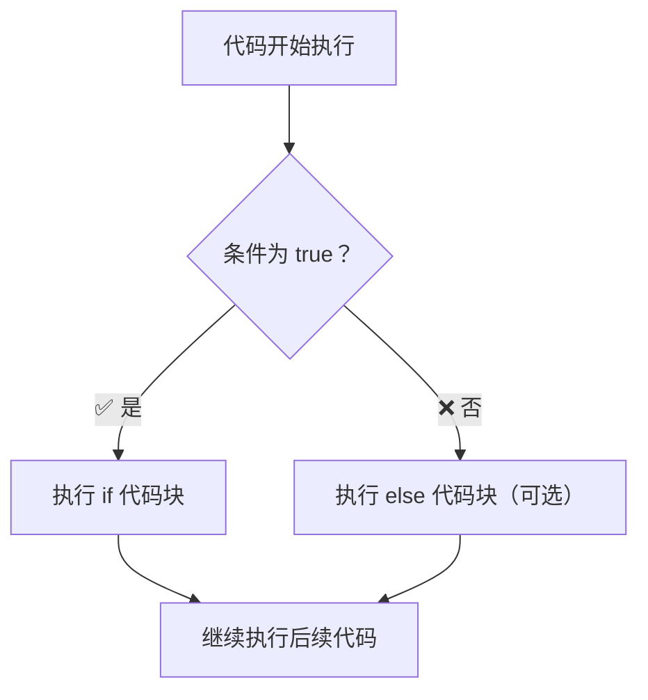
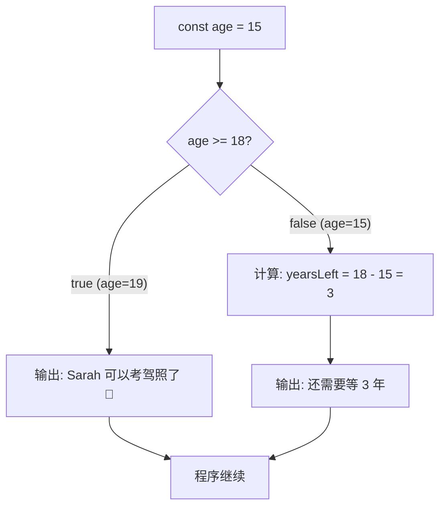
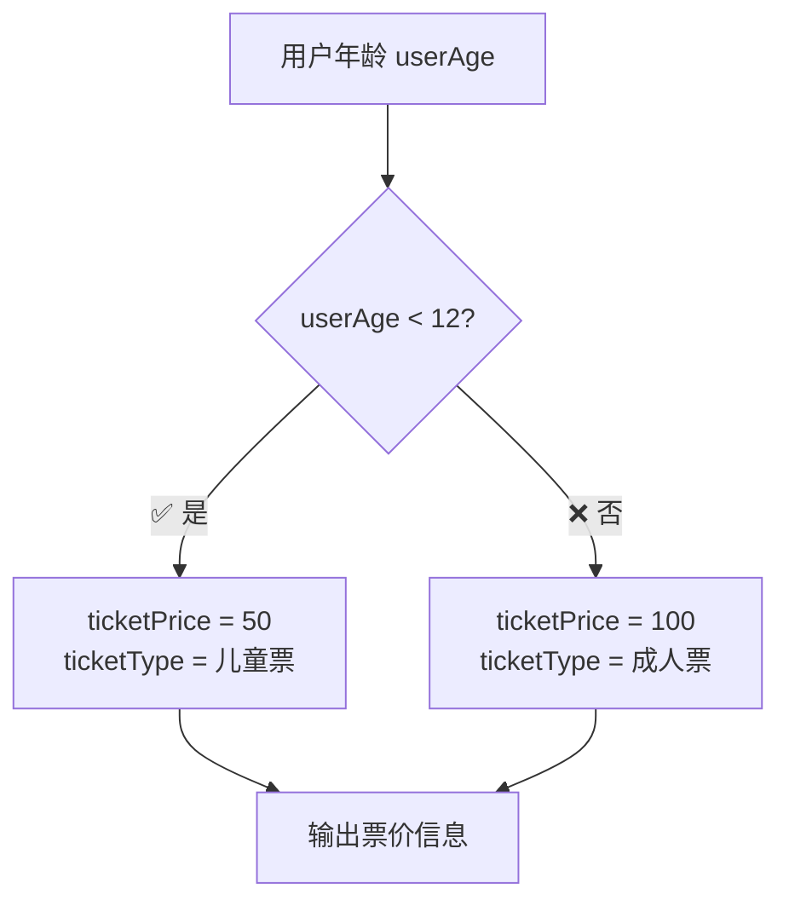

# if/else 条件判断语句

> 📺 来源：015 Taking Decisions if else Statements.en.srt
> 📂 章节：第 02 章

## 📌 知识脉络
- **前置知识**：变量声明（`let`/`const`）、数据类型（布尔值）、比较运算符（`>=`、`<=`）、模板字面量
- **后续扩展**：三元运算符、`switch` 语句、逻辑运算符（`&&`、`||`）、循环控制结构

## 🎯 概述

`if/else` 语句是 JavaScript 中最核心的**控制结构（Control Structure）**之一。它允许我们根据条件的真假来决定执行哪段代码，从而打破了代码从上到下线性执行的模式，让程序拥有了"做决策"的能力。

## 核心知识点

### 1. 什么是 if/else 语句？

> 🧩 **生活类比**：`if/else` 就像十字路口的红绿灯——**绿灯亮（条件为 true）就直行，红灯亮（条件为 false）就走另一条路**。程序执行到这里时，不会两条路都走，只会选一条。



**基本语法：**
```js
// ① 声明条件判断
if (条件) {
  // ② 条件为 true 时执行这里
} else {
  // ③ 条件为 false 时执行这里（可选）
}
```

> 💡 **记忆口诀**：**"if 问真假，true 走上，false 走下，else 可不加"**

---

### 2. 基础用法：判断年龄

> 🧩 **生活类比**：就像游乐园入口检查身高——**够高就进，不够就去旁边的儿童区**。

```js
// ① 定义年龄变量
const age = 19;

// ② 判断是否达到驾照年龄
if (age >= 18) {
  console.log("Sarah 可以考驾照了 🚗");
} else {
  // ③ 未达标则计算剩余年数
  const yearsLeft = 18 - age;
  console.log(`Sarah 还太小，还需要等 ${yearsLeft} 年`);
}
```

**🔍 执行追踪（age = 19）：**
```
第 1 行: const age = 19;           → age = 19
第 2 行: if (age >= 18)            → 19 >= 18 → true ✅
第 3 行: console.log(...)          → 输出: "Sarah 可以考驾照了 🚗"
第 4 行: else 块被跳过              → （未执行）
```

**🔍 执行追踪（age = 15）：**
```
第 1 行: const age = 15;           → age = 15
第 2 行: if (age >= 18)            → 15 >= 18 → false ❌
第 3 行: if 块被跳过                → （未执行）
第 4 行: const yearsLeft = 18 - 15 → yearsLeft = 3
第 5 行: console.log(...)          → 输出: "Sarah 还太小，还需要等 3 年"
```



---

### 3. 进阶用法：条件赋值与变量作用域

> 🧩 **生活类比**：想象你在填表格，有一栏需要写"世纪"。你需要**先准备好空格（在外部声明变量），然后根据出生年份填入 20 或 21**。如果只在括号里面写，表格外面就看不到了。

```js
// ① 先在外部声明变量（留空）
let century;

// ② 根据条件赋值
const birthYear = 1998;
if (birthYear <= 2000) {
  century = 20;  // ③ 20 世纪
} else {
  century = 21;  // ④ 21 世纪
}

// ⑤ 在 if/else 外使用变量
console.log(century); // 20
```

**🔍 执行追踪（birthYear = 2012）：**
```
第 1 行: let century;              → century = undefined
第 2 行: const birthYear = 2012;   → birthYear = 2012
第 3 行: if (2012 <= 2000)         → false ❌
第 4 行: century = 21;             → century = 21
第 5 行: console.log(century);     → 输出: 21
```

**📊 输入输出示例：**
| birthYear | birthYear <= 2000? | century | 说明 |
|-----------|-------------------|---------|------|
| `1998` | `true` ✅ | `20` | 20 世纪 |
| `2000` | `true` ✅ | `20` | 边界值，仍属 20 世纪 |
| `2012` | `false` ❌ | `21` | 21 世纪 |

> ⚠️ **关键陷阱**：变量必须在 `if/else` **外部**用 `let` 声明，在内部用 `let` 声明的变量出了花括号就"消失"了（这叫**块级作用域**，后面章节会深入讲解）。

---

### 4. else 块是可选的

不是所有判断都需要 else。如果条件为 false 且没有 else，程序会直接跳过整个 if 块继续往下执行。

```js
const temperature = 30;

if (temperature > 35) {
  console.log("今天太热了！开空调");
}
// 温度 30 不满足条件，什么都不输出，直接到这里
console.log("继续做其他事情");
```

**📊 概念对比：有 else vs 无 else**
| 情况 | 条件为 true | 条件为 false |
|------|-----------|------------|
| **有 else** | 执行 if 块 | 执行 else 块 |
| **无 else** | 执行 if 块 | 什么都不做，直接跳过 |

---

## 🛠️ 代码实战与真实场景
> **💼 业务场景**：在一个购票系统中，需要根据用户年龄自动计算票价——儿童半价、成人全价、老人免费。

**① 定义基础数据：**
```js
// 准备票价和用户年龄
const fullPrice = 100;  // 全价票 100 元
const userAge = 10;
```

**② 核心判断逻辑：**
```js
// 根据年龄判断票价
let ticketPrice;
let ticketType;

if (userAge < 12) {
  ticketPrice = fullPrice * 0.5;  // 儿童半价
  ticketType = "儿童票";
} else {
  ticketPrice = fullPrice;        // 成人全价
  ticketType = "成人票";
}
```

**③ 输出结果：**
```js
console.log(`年龄: ${userAge} → ${ticketType}: ¥${ticketPrice}`);
// 输出: "年龄: 10 → 儿童票: ¥50"
```



**📊 输入输出示例：**
| userAge | 条件结果 | ticketType | ticketPrice |
|---------|---------|-----------|------------|
| `8` | `true` | 儿童票 | `¥50` |
| `12` | `false` | 成人票 | `¥100` |
| `35` | `false` | 成人票 | `¥100` |

---

## 💡 关键要点
- ✅ `if/else` 是**控制结构**，让代码不再只能从上往下线性执行
- ✅ 条件表达式必须返回布尔值（`true` 或 `false`）
- ✅ `else` 块是**可选的**，没有也能正常运行
- ✅ 在 `if/else` 内部条件赋值时，变量必须在**外部**声明
- ✅ 比较运算符（`>=`、`<=`、`>`、`<`）天然返回布尔值，适合用作条件

## ⚠️ 常见误区
- ⚠️ **误用 `=` 代替 `==`**：`if (age = 18)` 是赋值，不是比较！应该用 `===`
- ⚠️ **忘记花括号 `{}`**：虽然单行 if 可以省略花括号，但强烈建议始终加上，避免后续添加代码引发 bug
- ⚠️ **块级作用域陷阱**：在 `if` 块内用 `let`/`const` 声明的变量，在块外无法访问

## 🐛 报错实验室
> 如果你不小心在 if 块内声明变量，然后试图在外面使用，会怎样？

**❌ 错误写法：**
```js
if (true) {
  let secret = "只在里面能看到";
}
console.log(secret); // 💥 报错！
```
**浏览器报错：**
```
Uncaught ReferenceError: secret is not defined
```
**🔑 解读**：`let` 声明的变量只在最近的 `{}` 花括号内有效。要在外面用，就必须在 `if` 之前先 `let secret;` 声明。

---

## 📖 词汇速查表 (Cheat Sheet)
| 中文术语 | 英文术语 | 简明释义 | 速查代码 |
|---------|---------|---------|---------|
| 条件语句 | if/else statement | 根据条件执行不同代码块 | `if (条件) { } else { }` |
| 控制结构 | Control Structure | 改变代码线性执行顺序的语法 | `if/else`、`switch`、`for` |
| 条件 | Condition | 返回 true/false 的表达式 | `age >= 18` |
| 代码块 | Code Block | 花括号 `{}` 包裹的一组语句 | `{ ... }` |
| 块级作用域 | Block Scope | 变量只在声明它的 `{}` 内可见 | `let` 在 `{}` 内 |
| 布尔值 | Boolean | 只有 true 和 false 两个值 | `true` / `false` |

---

## 🧪 学习验证

### 📝 动手练习

**练习 1：温度提醒器**
> 提示：用 `if/else` 根据温度输出不同提醒

```js
// 根据温度判断：>= 30 输出"天气炎热，注意防暑"，否则输出"天气宜人"
const temperature = 32;
// 在这里写你的代码
```
<details><summary>💡 参考答案</summary>

```js
const temperature = 32;
if (temperature >= 30) {
  console.log("天气炎热，注意防暑 ☀️");
} else {
  console.log("天气宜人 🌤️");
}
// 输出: "天气炎热，注意防暑 ☀️"
```
**解题思路**：直接用 `>=` 比较温度和 30，根据布尔结果走不同分支。
</details>

**练习 2：成绩等级**
> 提示：判断分数是否及格，并在 if/else 外使用结果

```js
// 变量 score = 75
// 如果 >= 60，result 为 "及格"，否则为 "不及格"
// 最后打印 result（注意变量声明位置！）
const score = 75;
// 在这里写你的代码
```
<details><summary>💡 参考答案</summary>

```js
const score = 75;
let result; // 必须在 if/else 外部声明！

if (score >= 60) {
  result = "及格 ✅";
} else {
  result = "不及格 ❌";
}

console.log(`分数: ${score}，结果: ${result}`);
// 输出: "分数: 75，结果: 及格 ✅"
```
**解题思路**：因为要在 if/else 外使用 `result`，所以必须先在外面用 `let` 声明，再在条件块内赋值。
</details>

### ❓ 理解检测

1. 以下代码的输出是什么？
   ```js
   let x = 10;
   if (x > 20) {
     console.log("A");
   } else {
     console.log("B");
   }
   ```
   - A) `A`
   - B) `B`
   - C) `A` 和 `B`
   - D) 无输出

2. `else` 块是必须的吗？（✅ 对 / ❌ 错）

3. 以下代码会报错吗？
   ```js
   if (true) {
     let msg = "hello";
   }
   console.log(msg);
   ```
   - A) 不会，输出 `hello`
   - B) 会报错：`msg is not defined`
   - C) 输出 `undefined`

<details><summary>📋 答案与解析</summary>

1. **答案：B**。`x = 10`，`10 > 20` 为 `false`，所以走 else 分支输出 `B`。
2. **答案：❌ 错**。`else` 是可选的，没有 else 时条件为 false 则跳过整个 if 块。
3. **答案：B**。`let` 声明的变量具有块级作用域，`msg` 只在 `{}` 内有效，外面访问会报 `ReferenceError`。
</details>

### 🔧 代码填空

```js
// 补全代码：判断 num 是正数还是负数
const num = -7;
_______ category;

_______ (num >= 0) {
  category = "正数";
} _______ {
  category = "负数";
}

console.log(`${num} 是${category}`);
// 期望输出: "-7 是负数"
```
<details><summary>💡 答案</summary>

```js
const num = -7;
let category;        // 第一空：let（在外部声明）

if (num >= 0) {      // 第二空：if
  category = "正数";
} else {             // 第三空：else
  category = "负数";
}

console.log(`${num} 是${category}`);
```
</details>
