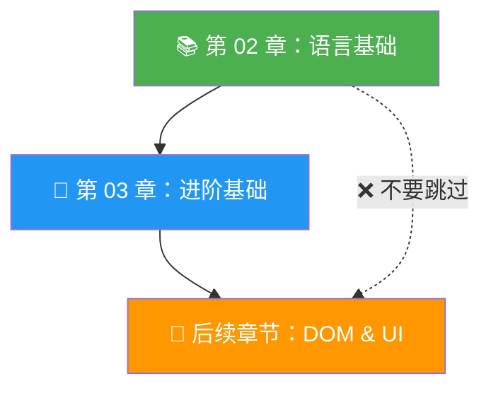

# 章节简介：JavaScript 基础

> 📺 来源：001 Section Intro.en.srt
> 📂 章节：第 02 章

## 📌 知识脉络
- **前置知识**：已安装代码编辑器（VS Code）、了解什么是编程语言
- **后续扩展**：Hello World 入门、变量与数据类型、运算符、条件判断语句

## 🎯 概述
本节是第 02 章的开篇导读。课程将从 JavaScript 语言的最基础概念讲起，包括变量（Variable）、数据类型（Data Type）、运算符（Operator）、`if/else` 条件语句等核心基础知识。在掌握语言基础之前，暂不涉及用户界面构建。

## 核心知识点

### 1. 本章学习路线图

> 🧩 **生活类比**：学一门编程语言就像学一门外语 — 你得先学会字母表（变量）、基本语法（数据类型与运算符）和简单句型（条件语句），然后才能写出流利的句子（完整应用程序）。


**🔍 执行追踪：**
本节无代码执行，但可以预览本章将涉及的核心 JavaScript 语法层级：

| 步骤 | 学习内容 | 关键语法 |
|------|---------|---------|
| 1 | 变量声明 | `let`, `const`, `var` |
| 2 | 数据类型 | `String`, `Number`, `Boolean` |
| 3 | 运算符 | `+`, `-`, `===`, `>` |
| 4 | 条件语句 | `if...else` |
| 5 | 更多控制流 | `switch`, 三元运算符 |

> 💡 **记忆口诀**：「变量装数据，类型分种类，运算出结果，条件做决策」

---

### 2. 学习策略：先基础后界面

> 🧩 **生活类比**：盖房子必须先打地基（语言基础），才能建上层建筑（漂亮的用户界面）。如果跳过地基直接盖楼，房子注定要塌。

本章所有课程专注于**语言基本功**（Language Fundamentals），不涉及 DOM 操作或 UI 构建。这种安排有明确目的：



> 💡 **记忆口诀**：「基础不牢，地动山摇」

---

## 🛠️ 代码实战与真实场景

> **💼 业务场景**：作为一名 JavaScript 初学者，你即将开始学习第一行代码。先来预览一下本章将要构建的能力矩阵。

```js {runnable} {title="chapter_preview.js"}
// 本章你将学会的核心能力预览
// 1. 声明变量
const courseName = "JavaScript 完全指南";
let currentSection = 2;

// 2. 使用运算符
const totalSections = 20;
const progress = (currentSection / totalSections) * 100;

// 3. 条件判断
if (progress < 50) {
  console.log(`📖 当前进度：${progress}%，继续加油！`);
} else {
  console.log(`🎉 已过半！当前进度：${progress}%`);
}

console.log(`课程：${courseName}`);
console.log(`当前章节：第 ${currentSection} 章`);
```

**📊 输入输出示例：**
| 输入 (currentSection) | 输出 | 说明 |
|---|---|---|
| `2` | `📖 当前进度：10%，继续加油！` | 刚开始学 |
| `10` | `🎉 已过半！当前进度：50%` | 中间进度 |
| `18` | `🎉 已过半！当前进度：90%` | 即将完成 |

## 💡 关键要点
- ✅ 第 02 章是 JavaScript 语言基础入门，是后续所有章节的基石
- ✅ 学习路径：变量 → 数据类型 → 运算符 → 条件语句 → 循环
- ✅ 先掌握语言基础，再学习 UI 构建
- ✅ 不要心急跳过基础，扎实的基本功决定后续学习效率

## ⚠️ 常见误区
- ⚠️ 误区 1：「我想直接学做漂亮网页，基础语法太无聊了」— 不掌握基础就学 DOM 操作，只会写出满是 Bug 的代码
- ⚠️ 误区 2：「基础内容太简单，随便看看就行」— 变量作用域、类型转换等细节会在后续频繁出现，忽视基础会导致大量 debug 时间

## 🐛 报错实验室
> 主动展示错误写法及报错信息，教你看懂错误提示

**❌ 错误写法：**
```js
// 尝试使用未声明的变量
console.log(myVariable);
```
**浏览器报错：**
```
Uncaught ReferenceError: myVariable is not defined
```
**🔑 解读**：JavaScript 引擎找不到名为 `myVariable` 的变量。在使用变量之前，必须先用 `let`、`const` 或 `var` 声明它。这是初学者最常遇到的错误之一。

---

## 📖 词汇速查表 (Cheat Sheet)
| 中文术语 | 英文术语 | 简明释义 | 速查代码 | 📚 官方文档 |
|---------|---------|---------|---------|----|
| 变量 | Variable | 存储数据的命名容器 | `let x = 10;` | [MDN](https://developer.mozilla.org/zh-CN/docs/Learn/JavaScript/First_steps/Variables) |
| 数据类型 | Data Type | 描述数据种类（数字、字符串等） | `typeof "hello"` | [MDN](https://developer.mozilla.org/zh-CN/docs/Web/JavaScript/Data_structures) |
| 运算符 | Operator | 对值进行计算或比较的符号 | `5 + 3` | [MDN](https://developer.mozilla.org/zh-CN/docs/Web/JavaScript/Guide/Expressions_and_operators) |
| 条件语句 | Conditional Statement | 根据条件执行不同代码 | `if (x > 0) {}` | [MDN](https://developer.mozilla.org/zh-CN/docs/Web/JavaScript/Reference/Statements/if...else) |
| 函数 | Function | 可复用的代码块 | `function fn() {}` | [MDN](https://developer.mozilla.org/zh-CN/docs/Web/JavaScript/Guide/Functions) |

---

## 🧪 学习验证

### 📝 动手练习

**练习 1：预测输出**
```js {runnable} {title="exercise1.js"}
// 预测下面代码的输出，然后运行验证
let chapter = 2;
let topic = "JavaScript Fundamentals";
console.log("第 " + chapter + " 章: " + topic);
```
<details><summary>💡 参考答案</summary>

```js
// 输出：第 2 章: JavaScript Fundamentals
// 字符串拼接：+ 运算符可以将数字和字符串连接起来
let chapter = 2;
let topic = "JavaScript Fundamentals";
console.log("第 " + chapter + " 章: " + topic);
```
**解题思路**：`+` 运算符在字符串与数字之间使用时，会将数字自动转换为字符串并拼接。
</details>

**练习 2：修改变量值**
```js {runnable} {title="exercise2.js"}
// 修改下面的变量，让控制台输出 "我正在学习第 2 章"
let sectionNumber = ___; // 填入正确的值
console.log("我正在学习第 " + sectionNumber + " 章");
```
<details><summary>💡 参考答案</summary>

```js
let sectionNumber = 2;
console.log("我正在学习第 " + sectionNumber + " 章");
// 输出：我正在学习第 2 章
```
**解题思路**：将 `sectionNumber` 赋值为数字 `2`，`+` 运算符会自动将其转为字符串拼接。
</details>

### ❓ 理解检测

:::quiz {correct="B"}
**1. 为什么本章不学习如何构建用户界面？**
- A) 因为 JavaScript 不能构建用户界面
- B) 因为需要先掌握语言基础，再学习 UI 构建
- C) 因为构建 UI 需要学习另一门语言

> **解析**：就像盖房子需要先打地基一样，掌握变量、数据类型、运算符等基础知识是后续学习 DOM 操作和 UI 构建的前提。
:::

:::quiz {correct="C"}
**2. 本章将涵盖以下哪些核心基础内容？**
- A) 仅变量和数据类型
- B) DOM 操作和事件监听
- C) 变量、数据类型、运算符和 if/else 语句

> **解析**：第 02 章聚焦语言基础，涵盖变量、数据类型、运算符、条件语句等核心概念，暂不涉及 DOM 操作。
:::

:::quiz {correct="A"}
**3. 学习编程语言基础的正确态度是？**
- A) 认真对待每个细节，因为基础决定后续学习效率
- B) 快速跳过，直接学高级内容
- C) 只需要看懂就行，不需要动手练习

> **解析**：基础不牢，地动山摇。变量作用域、类型转换等基础细节在后续章节中会反复出现，扎实的基本功能大幅减少调试时间。
:::

### 🔧 代码填空

:::fill-blank
// 声明一个变量，存储当前章节号
___const___ chapterNumber = ___2___;
console.log("欢迎来到第 " + chapterNumber + " 章");
:::
