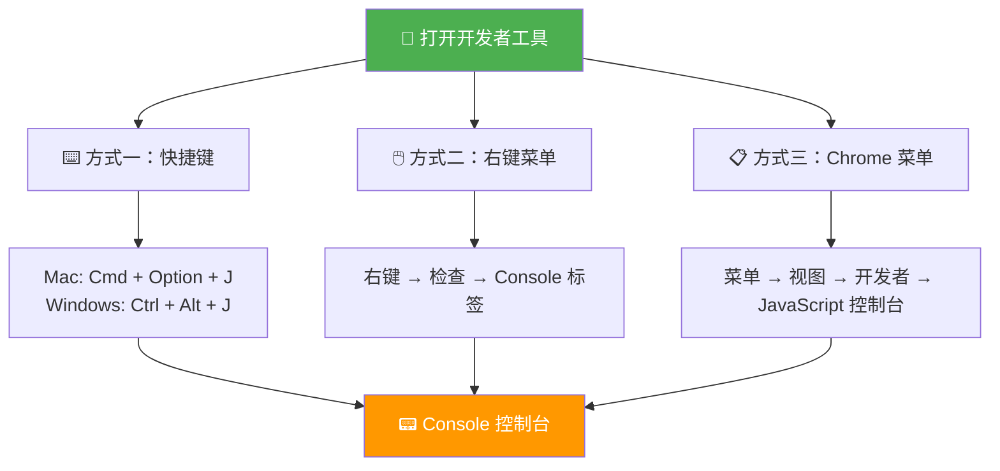
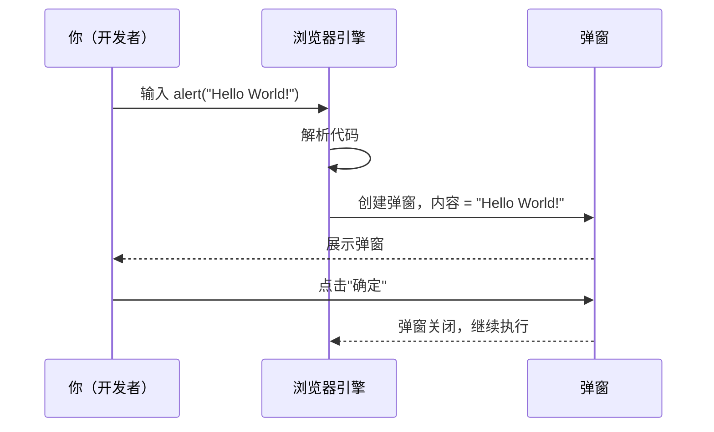
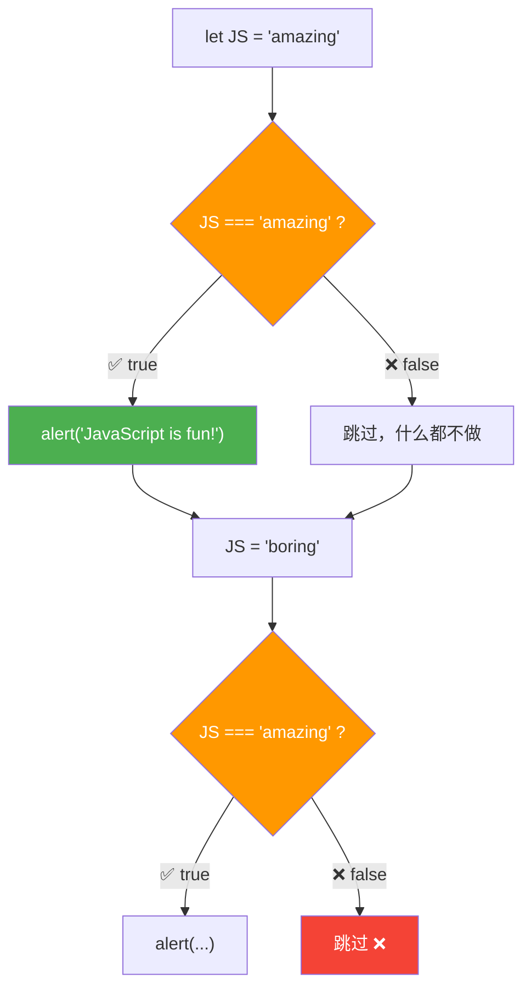
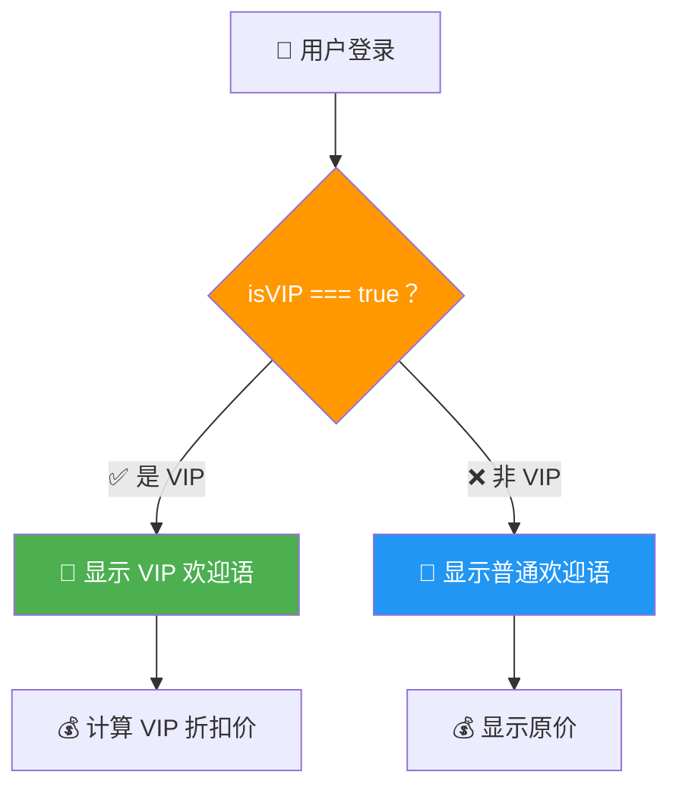

# Hello World!

> 📺 来源：002 Hello World!.en.srt
> 📂 章节：第 02 章

## 📌 知识脉络
- **前置知识**：已安装 Google Chrome 浏览器、了解基本计算机操作
- **后续扩展**：JavaScript 简史与语言特性、连接 JavaScript 文件到 HTML、变量与数据类型

## 🎯 概述
本节课带领你写出人生第一行 JavaScript 代码。我们将使用 Chrome 开发者工具的控制台（Console）来运行 `alert()` 函数，体验 JavaScript 的即时执行能力，并通过简单的变量和条件判断初步感受 JavaScript 的编程逻辑。

## 核心知识点

### 1. 打开 Chrome 开发者工具

> 🧩 **生活类比**：开发者工具就像汽车的引擎盖 — 普通用户只需开车（浏览网页），但开发者需要打开引擎盖（开发者工具）来检查和调试引擎（代码）。

Chrome 提供了三种打开开发者工具的方式：



**📊 三种方式对比：**
| 方式 | 操作 | 直接到达 Console？ | 推荐场景 |
|------|------|:---:|---------|
| 快捷键 | `Ctrl + Alt + J` (Win) / `Cmd + Option + J` (Mac) | ✅ 是 | 日常开发（最快） |
| 右键菜单 | 右键 → 检查 → Console 标签 | ❌ 先到 Elements | 需要检查具体元素时 |
| Chrome 菜单 | 菜单 → 视图 → 开发者 → JavaScript 控制台 | ✅ 是 | 初学者/不记得快捷键时 |

> 💡 **记忆口诀**：「快捷最快，右键最灵，菜单保底」

---

### 2. `alert()` 函数 — 第一行代码

> 🧩 **生活类比**：`alert()` 就像一个弹窗通知 — 你给它一条消息，它就弹出来展示给用户，就像手机的推送通知一样。

```js {runnable} {title="hello_world.js"}
// 你的第一行 JavaScript 代码！
alert("Hello World!");
```

**🔍 执行追踪：**

| 步骤 | 代码 | 发生了什么 | 结果 |
|------|------|-----------|------|
| ① | `alert("Hello World!")` | 浏览器弹出一个模态对话框 | 显示文字 "Hello World!" |
| ② | 用户点击「确定」 | 对话框关闭 | 代码执行完毕 |



> 💡 **记忆口诀**：`alert()` = 弹窗提醒，括号里放消息

---

### 3. 变量与简单条件判断（预览）

> 🧩 **生活类比**：变量就像一个贴了标签的盒子 — `let JS = "amazing"` 就是在一个叫做 `JS` 的盒子里放入了 `"amazing"` 这个值。条件判断则像门禁系统 — 只有满足条件才能通过。

```js {runnable} {title="first_logic.js"}
// ① 声明变量并赋值
let JS = "amazing";

// ② 条件判断：如果 JS 等于 "amazing"，就弹窗
if (JS === "amazing") {
  alert("JavaScript is fun!"); // 会弹出！
}

// ③ 改变变量的值
JS = "boring";

// ④ 再次判断（这次不会弹窗，因为 JS 不再是 "amazing"）
if (JS === "amazing") {
  alert("JavaScript is fun!"); // 不会执行
}

console.log("JS 现在的值是：" + JS);
```

**🔍 执行追踪：**

| 步骤 | 代码 | `JS` 的值 | 条件结果 | 弹窗？ |
|------|------|----------|---------|:---:|
| ① | `let JS = "amazing"` | `"amazing"` | — | — |
| ② | `if (JS === "amazing")` | `"amazing"` | `true` ✅ | ✅ 弹出 |
| ③ | `JS = "boring"` | `"boring"` | — | — |
| ④ | `if (JS === "amazing")` | `"boring"` | `false` ❌ | ❌ 不弹 |



---

### 4. Console 当计算器

> 🧩 **生活类比**：Console 不仅是调试工具，还可以当一个随时待命的计算器 — 输入数学表达式，立即返回结果。

```js {runnable} {title="calculator.js"}
// Console 可以直接做数学运算
console.log(40 + 8 + 23 - 10); // 61

// 更多运算
console.log(100 * 2);   // 200（乘法）
console.log(81 / 9);    // 9（除法）
console.log(2 ** 10);   // 1024（幂运算）
console.log(17 % 5);    // 2（取余）
```

**📊 输入输出示例：**
| 输入表达式 | 输出 | 运算类型 |
|-----------|------|---------|
| `40 + 8 + 23 - 10` | `61` | 加减混合 |
| `100 * 2` | `200` | 乘法 |
| `81 / 9` | `9` | 除法 |
| `2 ** 10` | `1024` | 幂运算 |
| `17 % 5` | `2` | 取余（模运算） |

---

## 🛠️ 代码实战与真实场景

> **💼 业务场景**：你是一名新入职的前端开发实习生，第一天被要求在浏览器控制台中验证一个简单的用户欢迎逻辑。

```js {runnable} {title="welcome_demo.js"}
// 模拟用户登录后的欢迎逻辑
let userName = "小明";
let isVIP = true;

if (isVIP === true) {
  console.log("🌟 尊敬的 VIP 用户 " + userName + "，欢迎回来！");
} else {
  console.log("👋 你好，" + userName + "，欢迎使用我们的服务！");
}

// 简单计算：VIP 折扣
let originalPrice = 299;
let discount = 0.8; // 8 折
let finalPrice = originalPrice * discount;
console.log("💰 原价：" + originalPrice + " 元");
console.log("🎫 VIP 折后价：" + finalPrice + " 元");
console.log("💵 节省了：" + (originalPrice - finalPrice) + " 元");
```



**📊 输入输出示例：**
| userName | isVIP | originalPrice | 输出折后价 | 说明 |
|----------|:-----:|:---:|:---:|------|
| `"小明"` | `true` | `299` | `239.2` | VIP 8 折 |
| `"小红"` | `false` | `299` | `299` | 非 VIP 原价 |

## 💡 关键要点
- ✅ Chrome 开发者工具的 Console 是学习和调试 JavaScript 的最佳入口
- ✅ `alert()` 函数可以弹出一个模态对话框，展示字符串消息
- ✅ `let` 关键字用于声明变量，变量的值可以被改变
- ✅ `if` 语句可以根据条件决定是否执行某段代码
- ✅ Console 可以像计算器一样直接执行数学运算

## ⚠️ 常见误区
- ⚠️ 误区 1：「Console 里写的代码就是正式代码」— Console 只用于临时测试和调试，正式代码应该写在 `.js` 文件中
- ⚠️ 误区 2：「`=` 和 `===` 是一样的」— `=` 是赋值运算符（给变量赋值），`===` 是严格相等比较运算符（判断两个值是否完全相同）
- ⚠️ 误区 3：「alert 和 console.log 功能相同」— `alert()` 弹出阻塞性模态框，`console.log()` 仅在控制台输出，不打断用户操作

## 🐛 报错实验室
> 主动展示错误写法及报错信息，教你看懂错误提示

**❌ 错误写法：**
```js
// 忘记引号，把字符串当成变量
alert(Hello World);
```
**浏览器报错：**
```
Uncaught SyntaxError: Unexpected identifier 'World'
```
**🔑 解读**：JavaScript 把 `Hello` 当成了一个变量名，遇到 `World` 时不知道该如何处理（两个连续的标识符没有运算符连接）。字符串必须用引号包裹：`"Hello World"` 或 `'Hello World'`。

---

## 📖 词汇速查表 (Cheat Sheet)
| 中文术语 | 英文术语 | 简明释义 | 速查代码 | 📚 官方文档 |
|---------|---------|---------|---------|----|
| 控制台 | Console | 浏览器开发者工具中的代码执行环境 | `console.log("hi")` | [MDN](https://developer.mozilla.org/zh-CN/docs/Web/API/console) |
| 弹窗 | Alert | 显示模态对话框的全局函数 | `alert("消息")` | [MDN](https://developer.mozilla.org/zh-CN/docs/Web/API/Window/alert) |
| 变量 | Variable | 存储数据的命名容器 | `let x = 10;` | [MDN](https://developer.mozilla.org/zh-CN/docs/Learn/JavaScript/First_steps/Variables) |
| 字符串 | String | 用引号包裹的文本数据 | `"Hello"` | [MDN](https://developer.mozilla.org/zh-CN/docs/Web/JavaScript/Reference/Global_Objects/String) |
| 严格相等 | Strict Equality | 不做类型转换的相等比较 | `5 === 5` → `true` | [MDN](https://developer.mozilla.org/zh-CN/docs/Web/JavaScript/Reference/Operators/Strict_equality) |

---

## 🧪 学习验证

### 📝 动手练习

**练习 1：弹窗你的名字**
```js {runnable} {title="exercise1.js"}
// 使用 alert() 弹出你自己的名字
// 在下面写你的代码

```
<details><summary>💡 参考答案</summary>

```js
alert("我的名字是小明");
// 或者使用变量
let myName = "小明";
alert("我的名字是 " + myName);
```
**解题思路**：使用 `alert()` 函数，括号内填入用引号包裹的字符串即可。
</details>

**练习 2：条件弹窗**
```js {runnable} {title="exercise2.js"}
// 声明一个变量 weather，赋值 "sunny" 或 "rainy"
// 如果 weather === "sunny"，弹出 "出去玩吧！"
// 在下面写你的代码

```
<details><summary>💡 参考答案</summary>

```js
let weather = "sunny";

if (weather === "sunny") {
  alert("出去玩吧！☀️");
}

// 测试：把 "sunny" 改成 "rainy"，弹窗就不会出现了
```
**解题思路**：先用 `let` 声明变量并赋值字符串，再用 `if` 和 `===` 进行严格比较。
</details>

### ❓ 理解检测

:::quiz {correct="C"}
**1. 以下哪个是打开 Chrome Console 的快捷键（Windows）？**
- A) Ctrl + Shift + C
- B) F12
- C) Ctrl + Alt + J

> **解析**：`Ctrl + Alt + J` 直接打开 Console 标签。`F12` 也能打开开发者工具，但默认可能停在 Elements 标签。
:::

:::quiz {correct="B"}
**2. `let JS = "amazing"` 这行代码做了什么？**
- A) 创建了一个叫 `amazing` 的变量
- B) 声明了一个变量 `JS`，并将字符串 `"amazing"` 赋值给它
- C) 检查 JS 是否等于 amazing

> **解析**：`let` 用于声明变量，`=` 是赋值运算符（不是比较），`"amazing"` 是字符串值。所以这行代码是 "创建一个叫 JS 的变量，里面存着 amazing"。
:::

:::quiz {correct="A"}
**3. 为什么第二次执行 `if (JS === "amazing")` 时不会弹窗？**
- A) 因为 JS 已经被改为 "boring"，条件不成立
- B) 因为 alert 只能执行一次
- C) 因为 if 语句只能使用一次

> **解析**：执行 `JS = "boring"` 后，变量 `JS` 的值变成了 `"boring"`。此时 `JS === "amazing"` 返回 `false`，`if` 块内的代码不会执行。
:::

### 🔧 代码填空

:::fill-blank
// 弹出一个显示 "Hello World!" 的对话框
___alert___("Hello World!");

// 声明一个变量并赋值
___let___ myVar = "JavaScript";
:::
