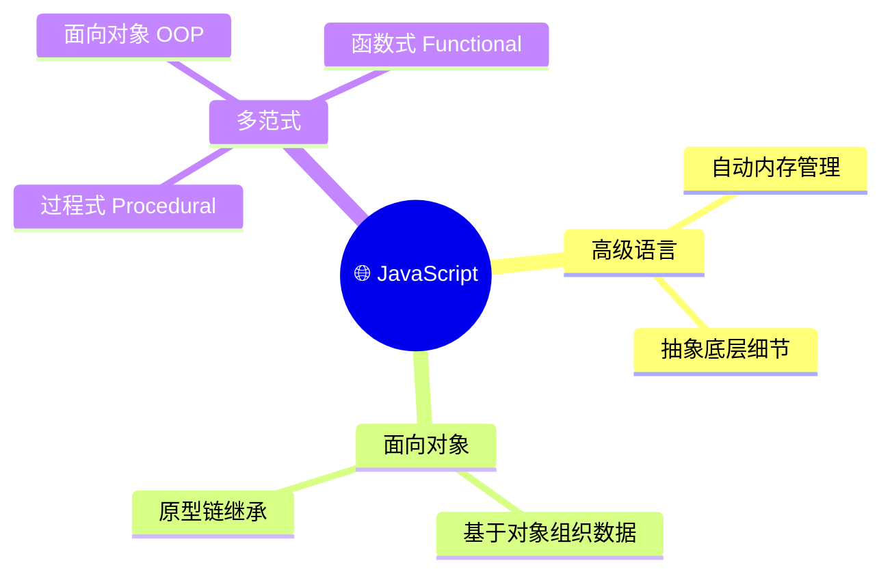
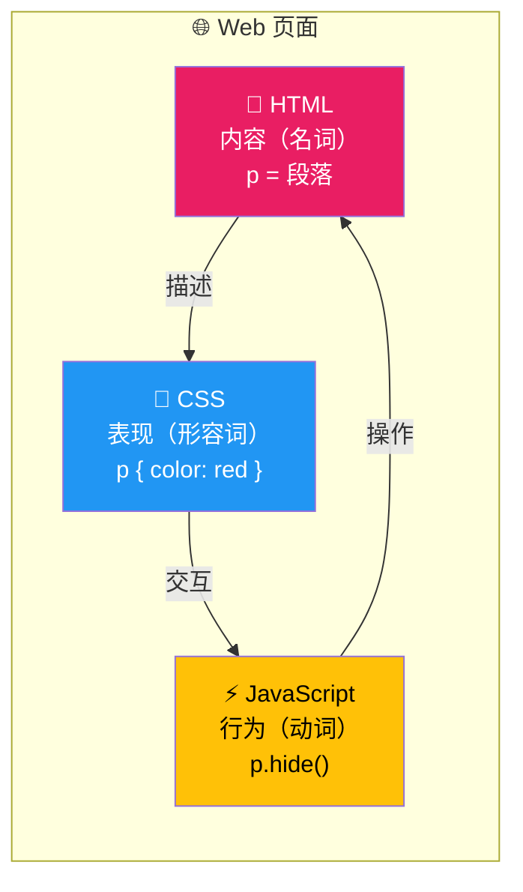
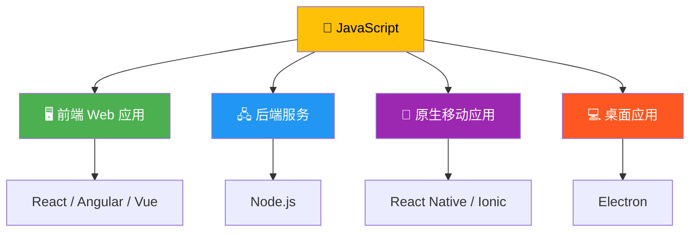
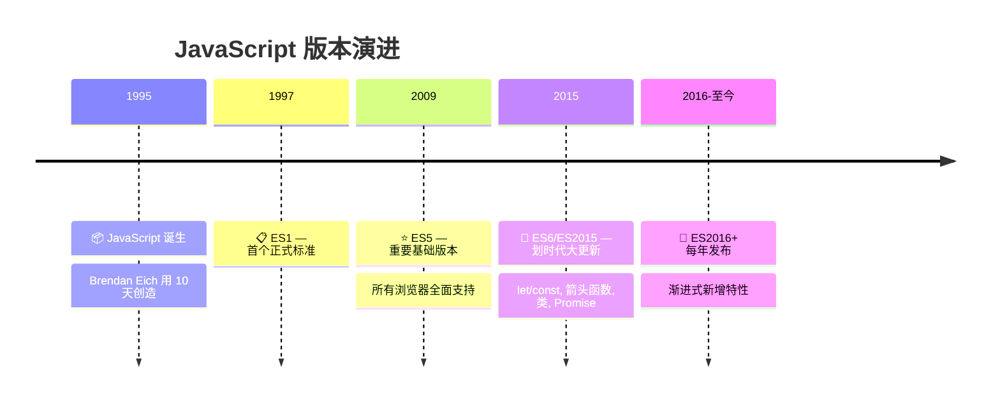
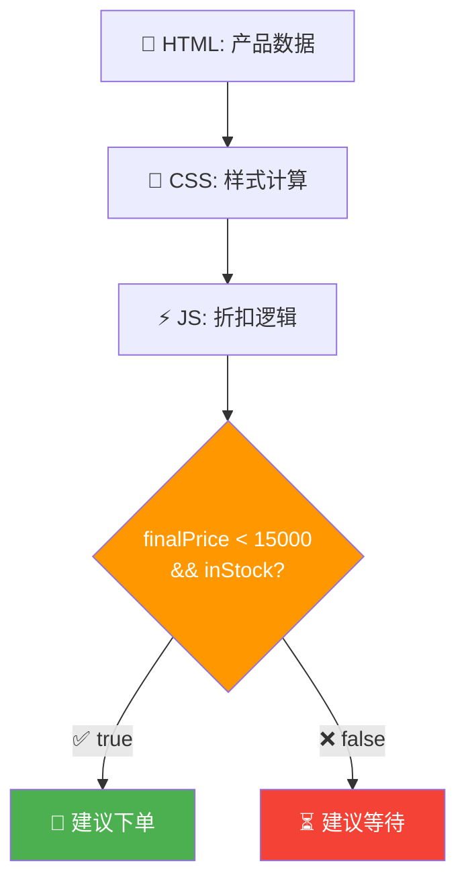

# JavaScript 简史与语言定位

> 📺 来源：003 A Brief Introduction to JavaScript.en.srt
> 📂 章节：第 02 章

## 📌 知识脉络
- **前置知识**：已完成 Hello World 实验、了解浏览器控制台基本操作
- **后续扩展**：连接 JavaScript 文件到 HTML 页面、变量与数据类型、ES6+ 现代语法

## 🎯 概述
本节课全面介绍 JavaScript 的定义、它在 Web 开发中的角色（与 HTML/CSS 的关系）、JavaScript 的多样化应用场景（前端、后端、移动端、桌面端），以及 JavaScript 版本演进（ES5 → ES6/ES2015 → 现代 JavaScript）。理解这些背景知识，能帮助你在后续学习中建立正确的全局视角。

## 核心知识点

### 1. JavaScript 的定义 — 一门高级、面向对象、多范式的编程语言

> 🧩 **生活类比**：如果把编程语言比作交通工具，JavaScript 就是一辆「多功能越野车」 — 既能上高速公路（前端 Web 应用），也能越野（后端 Node.js），还能进城市（移动端 React Native）。

JavaScript 官方定义中的关键词解析：

| 术语 | 含义 | 生活类比 |
|------|------|---------|
| 高级语言（High-Level） | 不需要手动管理内存等底层细节 | 自动挡汽车（vs 手动挡 C 语言） |
| 面向对象（Object-Oriented） | 基于对象组织代码 | 用「零件」组装机器 |
| 多范式（Multi-Paradigm） | 支持多种编程风格（过程式、OOP、函数式） | 一把瑞士军刀 |



**🔍 执行追踪：** 「多范式」意味着你可以用不同风格写 JavaScript：

```js {runnable} {title="paradigms_demo.js"}
// ① 过程式风格 (Procedural)
const radius = 5;
const area = 3.14159 * radius * radius;
console.log("过程式 → 面积:", area);

// ② 面向对象风格 (OOP)
const circle = {
  radius: 5,
  getArea() {
    return 3.14159 * this.radius * this.radius;
  }
};
console.log("OOP → 面积:", circle.getArea());

// ③ 函数式风格 (Functional)
const calcArea = (r) => 3.14159 * r * r;
console.log("函数式 → 面积:", calcArea(5));
```

> 💡 **记忆口诀**：「高级不管底层事，对象模块好组织，多种范式随你挑」

---

### 2. Web 三剑客：HTML + CSS + JavaScript 的角色分工

> 🧩 **生活类比**：用「名词、形容词、动词」来理解三者的关系 — HTML 是名词（内容是什么），CSS 是形容词（外观怎样），JavaScript 是动词（行为怎样）。



**📊 三者角色对比：**
| 技术 | 角色 | 语法类比 | 功能示例 |
|------|------|---------|---------|
| HTML | 内容/结构（名词） | `<p>` = 段落 | 定义标题、按钮、图片 |
| CSS | 样式/表现（形容词） | `p { color: red }` | 字体颜色、布局排列 |
| JavaScript | 行为/交互（动词） | `p.hide()` | 点击事件、加载数据、动画 |

```js {runnable} {title="web_trio_demo.js"}
// JavaScript 可以做的事情（模拟演示）

// 1. 操作内容（模拟 DOM 操作）
const pageTitle = "欢迎来到我的网站";
console.log("📝 HTML 内容:", pageTitle);

// 2. 操作样式（模拟修改 CSS）
const textColor = "red";
console.log("🎨 CSS 样式: color =", textColor);

// 3. 添加交互（JavaScript 的核心价值）
const isButtonClicked = true;
if (isButtonClicked) {
  console.log("⚡ JavaScript: 按钮被点击了！加载数据中...");
}
```

> 💡 **记忆口诀**：「HTML 搭骨架，CSS 穿衣裳，JS 让它活起来」

---

### 3. JavaScript 的应用疆域

> 🧩 **生活类比**：JavaScript 就像水 — 它无处不在，能适应任何形状的容器。前端、后端、手机、桌面，几乎无所不能。



**📊 应用场景总览：**
| 应用领域 | 运行环境 | 代表技术 | 代表产品 |
|---------|---------|---------|---------|
| 前端 Web | 浏览器 | React, Vue, Angular | Gmail, Twitter |
| 后端服务 | Node.js | Express, Nest.js | Netflix, PayPal 后端 |
| 移动 App | 手机操作系统 | React Native, Ionic | Instagram, Discord |
| 桌面应用 | 电脑操作系统 | Electron | VS Code, Slack |

---

### 4. JavaScript 版本演进：ES5 → ES6（ES2015）→ 现代 JavaScript

> 🧩 **生活类比**：JavaScript 的版本升级就像智能手机的年度更新 — 每年加入新功能，但旧功能永远保留，老 App 依然能正常运行。



**📊 ES5 vs ES6+ 对比：**
| 特性 | ES5（旧） | ES6+（现代） |
|------|----------|-------------|
| 变量声明 | `var` | `let`, `const` |
| 字符串拼接 | `"Hello " + name` | `` `Hello ${name}` `` |
| 函数写法 | `function(x) { return x; }` | `(x) => x` |
| 类定义 | 构造函数 + 原型 | `class` 语法糖 |

```js {runnable} {title="es5_vs_es6.js"}
// ES5 风格
var greeting1 = "Hello";
var name1 = "World";
console.log("ES5:", greeting1 + " " + name1 + "!");

// ES6+ 现代风格
const greeting2 = "Hello";
const name2 = "World";
console.log(`ES6+: ${greeting2} ${name2}!`);
```

> 💡 **记忆口诀**：「ES5 是基石，ES6 是飞跃，此后年年更新，越来越强」

---

## 🛠️ 代码实战与真实场景

> **💼 业务场景**：你正在面试一家科技公司的前端实习岗位，面试官要求你用代码演示 JavaScript 在 Web 开发中的三大角色（内容、样式、交互）。

```js {runnable} {title="interview_demo.js"}
// 模拟 Web 三剑客的协作
// ① HTML 角色 — 定义内容（数据）
const productName = "MacBook Pro";
const price = 14999;
const inStock = true;

// ② CSS 角色 — 定义展示样式（用对象模拟）
const styles = {
  titleColor: "#333",
  priceColor: inStock ? "green" : "red",
  badge: inStock ? "✅ 有货" : "❌ 缺货"
};

// ③ JavaScript 角色 — 动态交互逻辑
const discount = 0.9; // 9 折
const finalPrice = price * discount;

console.log(`📦 产品：${productName}`);
console.log(`💰 原价：¥${price}`);
console.log(`🎫 折后价：¥${finalPrice}`);
console.log(`📊 状态：${styles.badge}`);
console.log(`🎨 价格颜色：${styles.priceColor}`);

// 动态决策
if (finalPrice < 15000 && inStock) {
  console.log("🛒 建议：价格合适且有货，可以下单！");
} else {
  console.log("⏳ 建议：再等等，看看有没有更好的优惠");
}
```



**📊 输入输出示例：**
| price | discount | inStock | finalPrice | 建议 |
|:---:|:---:|:---:|:---:|------|
| 14999 | 0.9 | `true` | 13499.1 | 🛒 可以下单 |
| 14999 | 1.0 | `true` | 14999 | 🛒 可以下单 |
| 20000 | 0.9 | `false` | 18000 | ⏳ 再等等 |

## 💡 关键要点
- ✅ JavaScript 是一门高级、面向对象、多范式的编程语言
- ✅ Web 三剑客：HTML（结构）+ CSS（样式）+ JavaScript（行为）
- ✅ JavaScript 不仅限于浏览器，还可以运行在服务器（Node.js）、手机（React Native）和桌面（Electron）
- ✅ 先学好 JavaScript 基础，再学框架（React/Vue/Angular），这是最明智的投资
- ✅ ES6（2015年）是一次划时代更新，本课程从现代 JavaScript 开始教学

## ⚠️ 常见误区
- ⚠️ 误区 1：「Java 和 JavaScript 是同一种语言」— 它们完全不同！名字相似只是历史营销原因
- ⚠️ 误区 2：「学了 React 就不用学 JavaScript 了」— React 等框架100%基于 JavaScript，不掌握基础就学框架等于空中楼阁
- ⚠️ 误区 3：「JavaScript 只能做前端」— Node.js 让 JavaScript 能运行在服务器端，Electron 让它能做桌面应用

## 🐛 报错实验室
> 主动展示错误写法及报错信息，教你看懂错误提示

**❌ 错误写法：**
```js
// 使用 ES6 const 却尝试重新赋值
const language = "JavaScript";
language = "Python"; // ❌ 报错！
```
**浏览器报错：**
```
Uncaught TypeError: Assignment to constant variable.
```
**🔑 解读**：`const` 声明的变量是常量（Constant），一旦赋值就不能更改。如果需要可变的变量，应使用 `let`。这是 ES6 引入的重要特性，目的是让代码更安全、意图更明确。

---

## 📖 词汇速查表 (Cheat Sheet)
| 中文术语 | 英文术语 | 简明释义 | 速查代码 | 📚 官方文档 |
|---------|---------|---------|---------|----|
| 高级语言 | High-Level Language | 不需要手动管理内存的语言 | — | [MDN](https://developer.mozilla.org/zh-CN/docs/Glossary/High-level_programming_language) |
| 面向对象 | Object-Oriented (OOP) | 用对象组织代码和数据 | `const obj = {}` | [MDN](https://developer.mozilla.org/zh-CN/docs/Learn/JavaScript/Objects) |
| 多范式 | Multi-Paradigm | 支持多种编程风格 | — | [MDN](https://developer.mozilla.org/zh-CN/docs/Web/JavaScript/Guide) |
| ECMAScript | ECMAScript | JavaScript 的语言标准规范 | — | [MDN](https://developer.mozilla.org/zh-CN/docs/Glossary/ECMAScript) |
| DOM | Document Object Model | 网页文档的树形对象表示 | `document.getElementById()` | [MDN](https://developer.mozilla.org/zh-CN/docs/Web/API/Document_Object_Model) |
| Node.js | Node.js | 在服务器端运行 JS 的平台 | `node app.js` | [Node.js](https://nodejs.org/) |

---

## 🧪 学习验证

### 📝 动手练习

**练习 1：三种范式写同一个功能**
```js {runnable} {title="exercise1.js"}
// 用三种不同的编程范式计算矩形面积
// width = 10, height = 5

// ① 过程式
// 你的代码...

// ② 面向对象
// 你的代码...

// ③ 函数式
// 你的代码...
```
<details><summary>💡 参考答案</summary>

```js
// ① 过程式
const width = 10;
const height = 5;
const area1 = width * height;
console.log("过程式:", area1); // 50

// ② 面向对象
const rectangle = {
  width: 10,
  height: 5,
  getArea() {
    return this.width * this.height;
  }
};
console.log("OOP:", rectangle.getArea()); // 50

// ③ 函数式
const calcArea = (w, h) => w * h;
console.log("函数式:", calcArea(10, 5)); // 50
```
**解题思路**：同一个计算，三种组织方式。过程式直接运算；OOP 把数据和行为封装在对象里；函数式用纯函数接受参数返回结果。
</details>

**练习 2：描述 Web 三剑客**
```js {runnable} {title="exercise2.js"}
// 用变量描述 HTML、CSS、JavaScript 的角色
const html = "___"; // 填入 HTML 的角色描述
const css = "___";  // 填入 CSS 的角色描述
const js = "___";   // 填入 JavaScript 的角色描述

console.log("HTML:", html);
console.log("CSS:", css);
console.log("JavaScript:", js);
```
<details><summary>💡 参考答案</summary>

```js
const html = "内容与结构（名词）";
const css = "样式与表现（形容词）";
const js = "行为与交互（动词）";

console.log("HTML:", html);      // 内容与结构（名词）
console.log("CSS:", css);        // 样式与表现（形容词）
console.log("JavaScript:", js);  // 行为与交互（动词）
```
**解题思路**：回忆「名词、形容词、动词」的类比即可。
</details>

### ❓ 理解检测

:::quiz {correct="B"}
**1. JavaScript 中的「多范式」(Multi-Paradigm) 是什么意思？**
- A) JavaScript 只能用面向对象的方式写代码
- B) JavaScript 支持多种编程风格，如过程式、OOP、函数式
- C) JavaScript 有多个不同的版本

> **解析**：多范式意味着 JavaScript 不强制使用某一种编程风格，开发者可以根据场景选择过程式、面向对象或函数式编程。
:::

:::quiz {correct="C"}
**2. HTML、CSS 和 JavaScript 在 Web 中的角色分别是什么？**
- A) HTML = 交互，CSS = 内容，JS = 样式
- B) HTML = 样式，CSS = 交互，JS = 内容
- C) HTML = 内容/结构，CSS = 样式/表现，JS = 行为/交互

> **解析**：HTML 负责页面的内容和结构（名词），CSS 负责样式和外观（形容词），JavaScript 负责动态行为和交互（动词）。
:::

:::quiz {correct="A"}
**3. 为什么建议在学习 React/Vue 等框架之前先掌握 JavaScript 基础？**
- A) 因为这些框架 100% 基于 JavaScript，不懂基础会寸步难行
- B) 因为框架已经过时了
- C) 因为框架不需要 JavaScript 知识

> **解析**：React、Vue、Angular 等框架本质上都是 JavaScript 代码。扎实的 JavaScript 基础让你理解框架底层原理，也让你在框架更迭时能快速适应新工具。
:::

### 🔧 代码填空

:::fill-blank
// ES6 模板字符串语法
const lang = "JavaScript";
const year = 2015;
console.log(___`${lang} 在 ${year} 年迎来了 ES6 大更新`___);

// 箭头函数语法
const double = (x) ___=>___ x * 2;
:::
