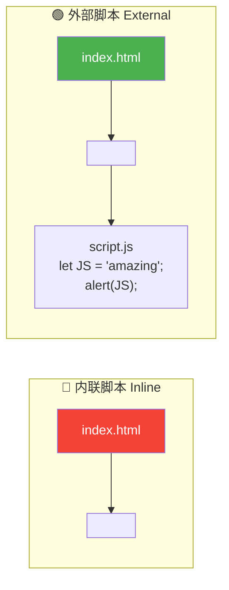
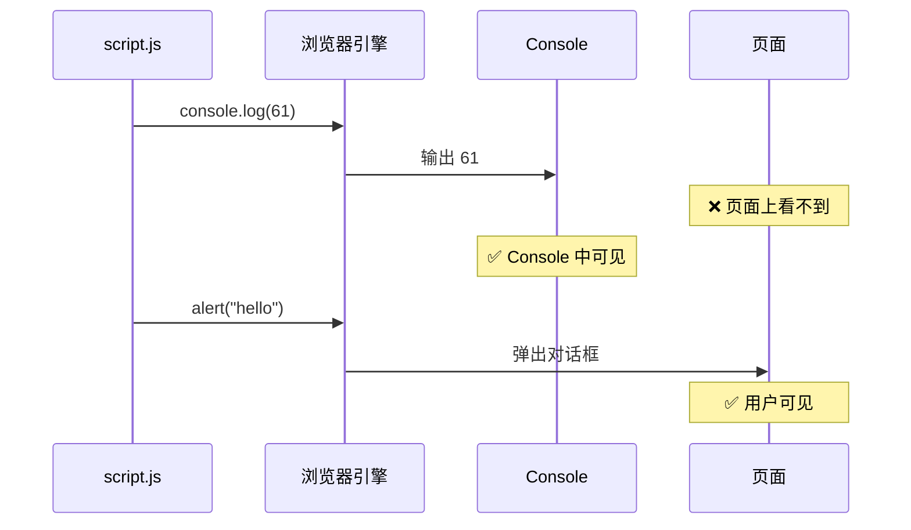
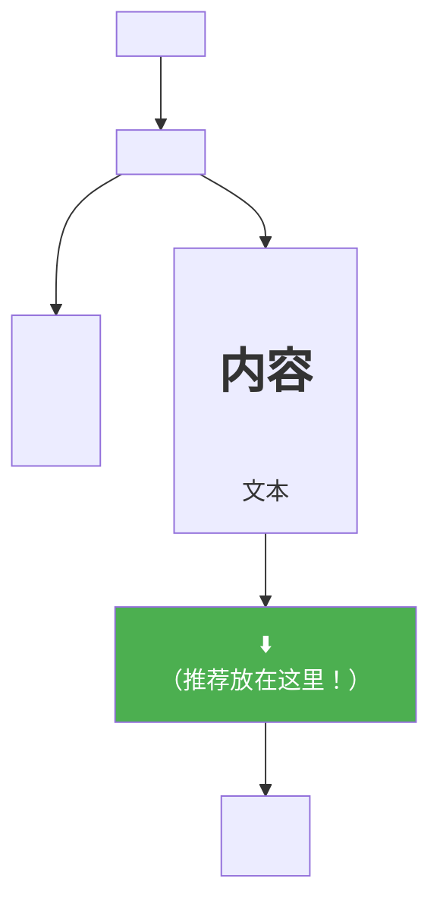
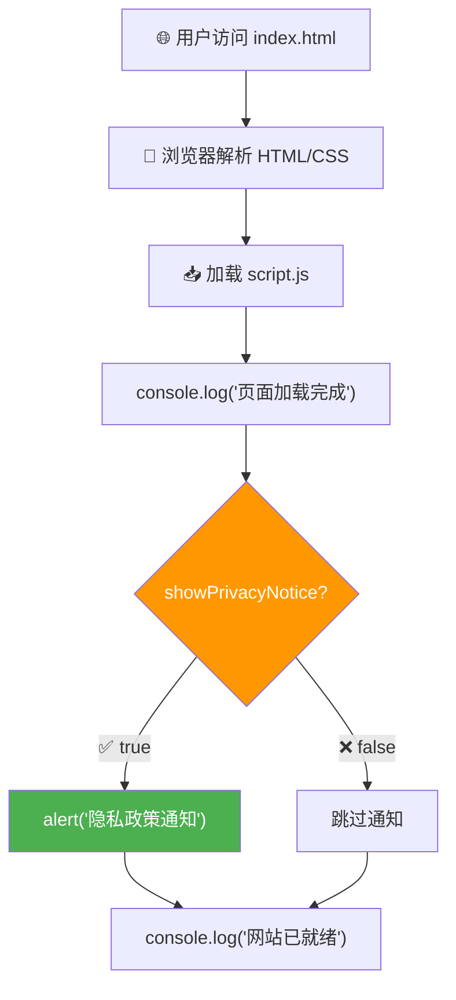

# 连接 JavaScript 文件

> 📺 来源：004 Linking a JavaScript File.en.srt
> 📂 章节：第 02 章

## 📌 知识脉络
- **前置知识**：Chrome 开发者工具 Console、`alert()` 函数基本使用、HTML 文件基本结构
- **后续扩展**：变量与值（Values & Variables）、数据类型、`console.log()` 深度使用

## 🎯 概述
本节课讲解如何将 JavaScript 代码从 Console 迁移到独立的 `.js` 文件中，并通过 `<script>` 标签连接到 HTML 文件。你将学会内联脚本（Inline Script）和外部脚本（External Script）两种方式的区别，以及 `console.log()` 的使用场景。

## 核心知识点

### 1. 内联脚本 vs 外部脚本

> 🧩 **生活类比**：内联脚本就像把食谱写在餐桌上 — 方便但混乱；外部脚本就像把食谱放在专门的菜谱本里 — 整洁且易于管理。



**📊 两种方式对比：**
| 特性 | 内联脚本 | 外部脚本 |
|------|---------|---------|
| 代码位置 | 写在 HTML 的 `<script>` 标签内 | 独立的 `.js` 文件 |
| 可维护性 | ❌ 差（HTML 与 JS 混在一起） | ✅ 好（关注点分离） |
| 可复用性 | ❌ 不可复用 | ✅ 多个页面可引用同一文件 |
| 额外请求 | 无 | 需加载外部文件 |
| 推荐场景 | 极小的测试代码 | ✅ 正式开发（推荐） |

**🔍 执行追踪：** 内联脚本写法：

```html
<!-- index.html 中的 <script> 标签 -->
<script>
  let JS = "amazing";
  if (JS === "amazing") alert("JavaScript is fun!");
</script>
```

外部脚本的标准写法：

```html
<!-- index.html 底部，</body> 之前 -->
<script src="script.js"></script>
```

```js {runnable} {title="script.js"}
// script.js — 独立的 JavaScript 文件
let JS = "amazing";

if (JS === "amazing") {
  alert("JavaScript is fun!"); // 弹窗提示
}

console.log(40 + 8 + 23 - 10); // 61，输出到控制台
```

> 💡 **记忆口诀**：「内联测试用，外部正式用；关注点分离，代码更清晰」

---

### 2. `console.log()` — 从脚本到控制台的桥梁

> 🧩 **生活类比**：`console.log()` 就像开发者的「悄悄话传声筒」— 它不会在页面上显示任何东西，但你打开 Console 就能看到消息。用户看不见，只有开发者看得见。



**🔍 执行追踪：**

| 步骤 | 代码 | Console 输出 | 页面显示 |
|------|------|:-----------:|:-------:|
| ① | `40 + 8 + 23 - 10` (无 console.log) | ❌ 无 | ❌ 无 |
| ② | `console.log(40 + 8 + 23 - 10)` | ✅ `61` | ❌ 无 |
| ③ | `alert("hello")` | ❌ 无 | ✅ 弹窗 |

**关键区别：**
- 在 **Console 直接输入**表达式 → 自动显示结果
- 在 **脚本文件中**写表达式 → 必须用 `console.log()` 才能在 Console 看到结果

```js {runnable} {title="console_log_demo.js"}
// ① 直接写运算，Console 不会显示结果（在脚本文件中）
40 + 8 + 23 - 10; // 这行什么都不会输出

// ② 使用 console.log，结果出现在 Console
console.log(40 + 8 + 23 - 10); // 61

// ③ console.log 可以输出各种类型
console.log("Hello!"); // 字符串
console.log(true);     // 布尔值
console.log(3.14);     // 数字

// ④ 还能定位源代码行号（浏览器自动标注）
console.log("这里是第 12 行"); // → script.js:12
```

> 💡 **记忆口诀**：「Console 不主动，log 来搭座桥；脚本要输出，必须手动调」

---

### 3. 连接外部脚本的正确位置与注意事项

> 🧩 **生活类比**：`<script>` 标签的位置就像邀请函的发送时机 — 放在 `<body>` 底部意味着「等客人（HTML 内容）都到齐后再上甜点（JavaScript）」。



**常见连接错误排查清单：**

| 问题 | 检查点 | 解决方案 |
|------|-------|---------|
| 弹窗/输出都没出现 | 文件路径是否正确 | 确保 `.js` 和 `.html` 在同一文件夹 |
| 拼写错误 | `src` 属性拼写 | 检查 `<script src="script.js">` |
| 代码有语法错误 | Console 报错信息 | 打开 Console 查看红色报错 |
| 引号不匹配 | 引号类型 | 确保 `src=""` 使用成对引号 |

---

## 🛠️ 代码实战与真实场景

> **💼 业务场景**：你负责一个小型企业网站，需要在页面加载完成后在控制台打印一条欢迎信息，并用弹窗通知用户隐私政策更新。

```js {runnable} {title="business_demo.js"}
// 场景：企业网站启动脚本

// ① console.log — 开发者调试信息（用户看不到）
console.log("📊 页面加载完成");
console.log("⏰ 加载时间：" + new Date().toLocaleTimeString());

// ② alert — 用户可见的通知
const showPrivacyNotice = true;
if (showPrivacyNotice) {
  console.log("🔔 弹出隐私政策通知");
  // alert("📋 我们更新了隐私政策，请查阅。"); // 取消注释可看弹窗效果
}

// ③ 页面初始化逻辑
const siteName = "TechCorp 官网";
const version = "2.1.0";
console.log(`🚀 ${siteName} v${version} 已就绪`);
```



**📊 输入输出示例：**
| showPrivacyNotice | Console 输出 | 弹窗？ |
|:-:|---|:-:|
| `true` | `页面加载完成` + `弹出隐私政策通知` + `网站已就绪` | ✅ |
| `false` | `页面加载完成` + `网站已就绪` | ❌ |

## 💡 关键要点
- ✅ 正式开发中，JavaScript 应写在独立的 `.js` 文件中，通过 `<script src="...">` 连接到 HTML
- ✅ `<script>` 标签推荐放在 `</body>` 标签之前（页面底部）
- ✅ `console.log()` 是从脚本文件向 Console 输出信息的桥梁函数
- ✅ 关注点分离（Separation of Concerns）：HTML 管内容，CSS 管样式，JS 管逻辑
- ✅ 文件路径错误是初学者最常见的连接失败原因

## ⚠️ 常见误区
- ⚠️ 误区 1：「不用 `console.log()`，表达式结果也会自动出现在 Console」— 那只在 Console 直接输入时成立；脚本文件中必须显式调用 `console.log()`
- ⚠️ 误区 2：「`<script src="script.js">代码写这里</script>`」— 当 `<script>` 有 `src` 属性时，标签之间的代码会被忽略，只执行外部文件
- ⚠️ 误区 3：「`.js` 文件可以放在任意目录，不需要调整路径」— `src` 属性的值是相对于 HTML 文件的路径，必须确保路径正确

## 🐛 报错实验室
> 主动展示错误写法及报错信息，教你看懂错误提示

**❌ 错误写法：**
```html
<!-- 文件名拼写错误 -->
<script src="scrip.js"></script>
```
**浏览器报错（Console 中）：**
```
GET http://localhost/scrip.js net::ERR_FILE_NOT_FOUND
```
**🔑 解读**：浏览器找不到名为 `scrip.js` 的文件。最常见原因：① 文件名拼写错误 ② `.js` 文件不在同一目录下 ③ 文件名大小写不匹配（Linux 服务器区分大小写）。

---

## 📖 词汇速查表 (Cheat Sheet)
| 中文术语 | 英文术语 | 简明释义 | 速查代码 | 📚 官方文档 |
|---------|---------|---------|---------|----|
| 内联脚本 | Inline Script | 写在 HTML `<script>` 标签内的代码 | `<script>代码</script>` | [MDN](https://developer.mozilla.org/zh-CN/docs/Web/HTML/Element/script) |
| 外部脚本 | External Script | 独立 `.js` 文件通过 `src` 引入 | `<script src="x.js"></script>` | [MDN](https://developer.mozilla.org/zh-CN/docs/Web/HTML/Element/script#attr-src) |
| 控制台日志 | console.log | 将信息输出到浏览器控制台 | `console.log("hi")` | [MDN](https://developer.mozilla.org/zh-CN/docs/Web/API/console/log_static) |
| 关注点分离 | Separation of Concerns | 将不同职责分到不同文件 | HTML / CSS / JS 分离 | [Wikipedia](https://en.wikipedia.org/wiki/Separation_of_concerns) |
| 分号 | Semicolon | 标记语句结束（JavaScript 中可选但推荐） | `let x = 5;` | [MDN](https://developer.mozilla.org/zh-CN/docs/Web/JavaScript/Reference/Lexical_grammar#automatic_semicolon_insertion) |

---

## 🧪 学习验证

### 📝 动手练习

**练习 1：创建并连接外部脚本**
```js {runnable} {title="exercise1.js"}
// 假设你已经创建了 index.html 和 script.js
// 在 script.js 中写入以下代码试试
console.log("我的第一个外部脚本！");
console.log("当前时间：" + new Date().toLocaleTimeString());
```
<details><summary>💡 参考答案</summary>

```js
// script.js
console.log("我的第一个外部脚本！");
console.log("当前时间：" + new Date().toLocaleTimeString());
```

```html
<!-- index.html 底部 -->
<script src="script.js"></script>
```
**解题思路**：在 HTML 文件的 `</body>` 前加入 `<script src="script.js"></script>`，然后在浏览器中打开 HTML 文件，打开 Console 查看输出。
</details>

**练习 2：对比 alert 和 console.log**
```js {runnable} {title="exercise2.js"}
// 分别用 alert 和 console.log 输出同一条消息
// 观察两者的区别
const message = "Hello JavaScript!";

// 用两种方式输出 message
console.log(message);
// alert(message); // 取消注释可看弹窗效果
```
<details><summary>💡 参考答案</summary>

```js
const message = "Hello JavaScript!";
console.log(message);  // 只在 Console 中显示，不打断用户
alert(message);        // 弹出模态框，用户必须点击才能继续
```
**解题思路**：`console.log` 是「静默输出」，适合调试；`alert` 是「强制中断」，适合紧急通知。开发中绝大多数时候用 `console.log`。
</details>

### ❓ 理解检测

:::quiz {correct="B"}
**1. 为什么在脚本文件中单独写 `40 + 8` 不会在 Console 显示结果？**
- A) 因为 JavaScript 不支持数学运算
- B) 因为脚本文件中需要用 console.log() 才能输出到 Console
- C) 因为表达式的结果自动显示在页面上了

> **解析**：在 Console 中直接输入表达式会自动返回结果，但在脚本文件中，表达式的返回值会被丢弃。必须用 `console.log()` 显式输出。
:::

:::quiz {correct="C"}
**2. `<script>` 标签通常放在 HTML 文件的哪个位置？**
- A) `<head>` 标签内的最前面
- B) `<body>` 标签的最前面
- C) `</body>` 标签之前（body 底部）

> **解析**：放在 `</body>` 之前可以确保 HTML 内容先被解析完毕再执行 JavaScript，避免脚本运行时 DOM 元素尚未加载。
:::

:::quiz {correct="A"}
**3. 当 `<script>` 标签同时有 `src` 属性和内部代码时，会怎样？**
- A) 只执行外部文件的代码，内部代码被忽略
- B) 先执行内部代码，再执行外部文件
- C) 两者都会执行

> **解析**：当 `<script>` 标签设置了 `src` 属性后，标签之间的内容会被完全忽略。这是一个常见的"坑"，一定要注意。
:::

### 🔧 代码填空

:::fill-blank
<!-- 连接外部 JavaScript 文件 -->
<___script___ ___src___="script.js"></script>

// 在脚本文件中输出信息到控制台
___console.log___("Hello from script.js!");
:::
