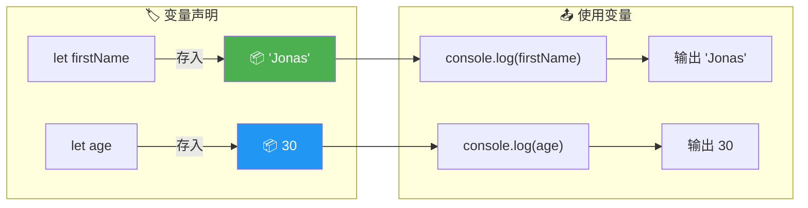
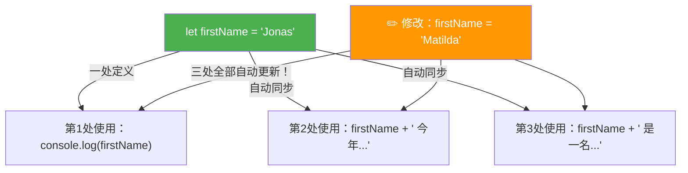
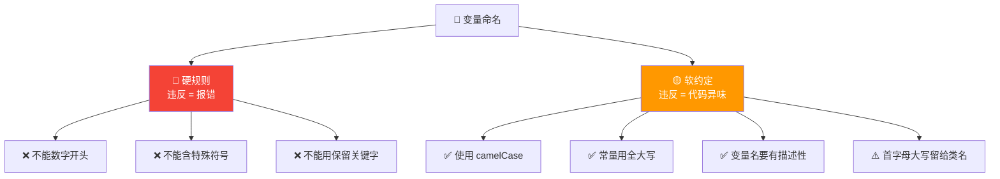
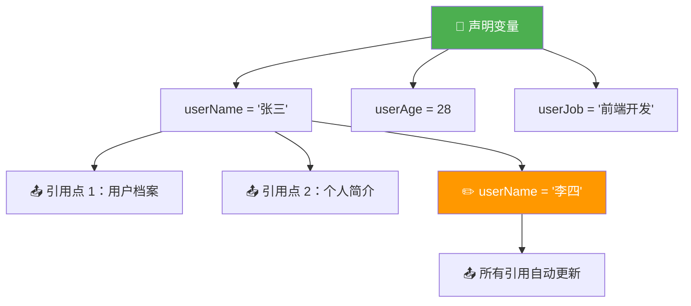

# 值与变量 (Values and Variables)

> 📺 来源：005 Values and Variables.en.srt
> 📂 章节：第 02 章

## 📌 知识脉络
- **前置知识**：`console.log()` 基本使用、`<script>` 标签连接 JavaScript 文件
- **后续扩展**：数据类型（Data Types）、`let` / `const` / `var` 声明方式、运算符

## 🎯 概述
本节课深入讲解 JavaScript 中最核心的概念之一 — **值（Value）** 与 **变量（Variable）**。你将学会如何声明变量、理解变量命名规则和约定（camelCase、保留字等），以及为什么变量是编程中最重要的基础概念之一。

## 核心知识点

### 1. 值（Value）— 编程中最小的信息单元

> 🧩 **生活类比**：值就像日常生活中的「一件物品」— 一个数字、一段文字、一个开关状态。它是编程世界中最基本的信息单位，就像原子是物质的基本单位一样。

JavaScript 中的所有数据都是值，它们大致分为以下几类（后续课程详细展开）：

```js {runnable} {title="values_demo.js"}
// 各种类型的值
console.log("Jonas");    // 字符串值 (String)
console.log(23);         // 数字值 (Number)
console.log(true);       // 布尔值 (Boolean)
console.log(undefined);  // 未定义值
console.log(null);       // 空值
```

**🔍 执行追踪：**

| 步骤 | 表达式 | 控制台输出 | 值的类型 |
|------|--------|----------|---------|
| ① | `"Jonas"` | `Jonas` | String |
| ② | `23` | `23` | Number |
| ③ | `true` | `true` | Boolean |
| ④ | `undefined` | `undefined` | Undefined |
| ⑤ | `null` | `null` | Null(Object) |

> 💡 **记忆口诀**：「值是数据本身，变量是存值的盒子」

---

### 2. 变量（Variable）— 给值贴标签的盒子

> 🧩 **生活类比**：变量就像一个贴了标签的收纳盒 — 你在盒子上写个名字（变量名），然后把东西（值）放进去。以后想用这个东西，只需喊盒子的名字就行。



```js {runnable} {title="variables_demo.js"}
// ① 声明变量并赋值
let firstName = "Jonas";
let age = 30;

// ② 使用变量（引用变量名即可获取对应的值）
console.log(firstName); // "Jonas"
console.log(age);       // 30

// ③ 变量的核心价值 — 一处修改，处处更新
console.log("我叫 " + firstName);
console.log(firstName + " 今年 " + age + " 岁");
console.log(firstName + " 是一名教师");
```

**🔍 执行追踪：**

| 步骤 | 代码 | 内存中 firstName | 内存中 age | 控制台输出 |
|------|------|:---:|:---:|---------|
| ① | `let firstName = "Jonas"` | `"Jonas"` | — | — |
| ② | `let age = 30` | `"Jonas"` | `30` | — |
| ③ | `console.log(firstName)` | `"Jonas"` | `30` | `Jonas` |
| ④ | `console.log(age)` | `"Jonas"` | `30` | `30` |



**变量的核心价值：一处修改，处处更新！**

```js {runnable} {title="change_once.js"}
// 把 firstName 改为 Matilda，所有引用自动更新
let firstName = "Matilda"; // 只改这一处

console.log("我叫 " + firstName);          // 我叫 Matilda
console.log(firstName + " 今年 30 岁");    // Matilda 今年 30 岁
console.log(firstName + " 是一名教师");    // Matilda 是一名教师
```

> 💡 **记忆口诀**：「变量就是复用，改一处，全更新」

---

### 3. 变量命名规则（硬性规定 vs 软性约定）

> 🧩 **生活类比**：变量命名规则就像取名字 — 法律规定名字不能包含特殊符号（硬规则），但大家约定俗成给男孩取阳刚的名字、女孩取柔美的名字（软约定）。

#### 硬性规则（违反会报错 ❌）

```js {runnable} {title="naming_rules.js"}
// ❌ 不能以数字开头
// let 3years = 3; // SyntaxError: Invalid or unexpected token

// ❌ 不能包含特殊符号（只允许字母、数字、_、$）
// let jonas&matilda = "JM"; // SyntaxError: Unexpected token '&'

// ❌ 不能使用保留关键字
// let new = 27; // SyntaxError: Unexpected token 'new'
// let function = "test"; // SyntaxError

// ✅ 合法的变量名
let _private = "ok";    // 下划线开头
let $jquery = "ok";     // 美元符号开头
let firstName = "ok";   // 字母开头 + camelCase
console.log(_private, $jquery, firstName);
```

**📊 命名规则总览：**

| 规则 | 示例 | 合法？ | 说明 |
|------|------|:---:|------|
| 字母开头 | `firstName` | ✅ | 最常用 |
| `_` 开头 | `_count` | ✅ | 常表示私有变量 |
| `$` 开头 | `$element` | ✅ | jQuery 常用 |
| 数字开头 | `3years` | ❌ | 语法错误 |
| 特殊符号 | `my&var` | ❌ | 只允许 `_` 和 `$` |
| 保留关键字 | `new`, `function` | ❌ | 被 JS 占用 |
| `name` | `name` | ⚠️ | 合法但可能冲突 |

#### 软性约定（不遵守不报错，但会被同事「鄙视」👀）

```js {runnable} {title="naming_conventions.js"}
// ✅ camelCase — JavaScript 标准命名法
let firstName = "Jonas";
let myFirstJob = "Programmer";
let myCurrentJob = "Teacher";

// ⚠️ 不推荐：首字母大写（留给 OOP 类名）
// let Person = "Jonas"; // 能运行但不规范

// ✅ 全大写 = 常量（永远不变的值）
const PI = 3.1415926;
const MAX_SIZE = 100;

// ❌ 不推荐：含糊不清的变量名
let job1 = "Programmer"; // 不如 myFirstJob 清晰
let job2 = "Teacher";    // 不如 myCurrentJob 清晰

console.log(myFirstJob, "→", myCurrentJob);
console.log("PI =", PI);
```



> 💡 **记忆口诀**：「数字开头不可以，特殊符号只有俩（_ $），保留字别去碰，驼峰命名是主流」

---

## 🛠️ 代码实战与真实场景

> **💼 业务场景**：你在开发一个用户Profile页面，需要存储用户的个人信息，并在多处引用。

```js {runnable} {title="user_profile.js"}
// 用户信息变量声明
let userName = "张三";
let userAge = 28;
let userJob = "前端开发工程师";
let userCity = "上海";

// 多处引用 — 体现变量的复用价值
console.log("=== 用户档案 ===");
console.log("姓名：" + userName);
console.log("年龄：" + userAge + " 岁");
console.log("职业：" + userJob);
console.log("城市：" + userCity);
console.log("================");

// 个人简介（复用同一组变量）
console.log(
  userName + "，" + userAge + "岁，" +
  "来自" + userCity + "，" +
  "职业是" + userJob + "。"
);

// 修改一处 → 全部更新
userName = "李四";
console.log("\n--- 修改后 ---");
console.log("姓名：" + userName); // 李四
```



**📊 输入输出示例：**
| userName | userAge | userCity | 档案输出 |
|---------|:---:|------|---------|
| `"张三"` | `28` | `"上海"` | `张三，28岁，来自上海` |
| `"李四"` | `28` | `"上海"` | `李四，28岁，来自上海` |

## 💡 关键要点
- ✅ 值（Value）是编程中最基本的信息单元，可以是数字、字符串、布尔值等
- ✅ 变量（Variable）是存储值的容器，用 `let` 声明
- ✅ 变量的核心价值：一处定义，多处引用，一处修改，全部更新
- ✅ 命名必须遵守硬规则：不能数字开头、不能含特殊符号（`_`和`$`除外）、不能用保留字
- ✅ 命名应遵守软约定：使用 camelCase、常量全大写、变量名要有描述性

## ⚠️ 常见误区
- ⚠️ 误区 1：「变量名可以随便取」— 好的命名是代码可读性的关键，`myFirstJob` 远好于 `job1`
- ⚠️ 误区 2：「`name` 可以放心当变量名」— `name` 在某些环境中是保留属性，会导致意外行为，应避免单独使用
- ⚠️ 误区 3：「变量名首字母大写也没关系」— 首字母大写在 JavaScript 中约定留给类（Class），随意使用会让同事误解

## 🐛 报错实验室
> 主动展示错误写法及报错信息，教你看懂错误提示

**❌ 错误写法 1：数字开头**
```js
let 3years = 3;
```
**浏览器报错：**
```
Uncaught SyntaxError: Invalid or unexpected token
```
**🔑 解读**：JavaScript 解析器遇到以数字开头的标识符时无法识别，因为数字开头的 token 被认为是数字字面量，后面紧跟字母会导致语法错误。

**❌ 错误写法 2：使用保留关键字**
```js
let function = "test";
```
**浏览器报错：**
```
Uncaught SyntaxError: Unexpected token 'function'
```
**🔑 解读**：`function` 是 JavaScript 的保留关键字，引擎看到它就知道后面应该是函数定义，而不是赋值语句。

---

## 📖 词汇速查表 (Cheat Sheet)
| 中文术语 | 英文术语 | 简明释义 | 速查代码 | 📚 官方文档 |
|---------|---------|---------|---------|----|
| 值 | Value | 编程中最小的数据单元 | `"Jonas"`, `23` | [MDN](https://developer.mozilla.org/zh-CN/docs/Glossary/Value) |
| 变量 | Variable | 存储值的命名容器 | `let x = 10;` | [MDN](https://developer.mozilla.org/zh-CN/docs/Learn/JavaScript/First_steps/Variables) |
| 驼峰命名 | camelCase | 首字母小写，后续单词首字母大写 | `firstName` | [Wikipedia](https://en.wikipedia.org/wiki/Camel_case) |
| 保留关键字 | Reserved Keyword | 被语言占用的标识符 | `function`, `let`, `new` | [MDN](https://developer.mozilla.org/zh-CN/docs/Web/JavaScript/Reference/Lexical_grammar#keywords) |
| 声明 | Declaration | 创建变量的动作 | `let age;` | [MDN](https://developer.mozilla.org/zh-CN/docs/Web/JavaScript/Reference/Statements/let) |
| 赋值 | Assignment | 给变量存入值 | `age = 30;` | [MDN](https://developer.mozilla.org/zh-CN/docs/Web/JavaScript/Reference/Operators/Assignment) |

---

## 🧪 学习验证

### 📝 动手练习

**练习 1：个人信息卡**
```js {runnable} {title="exercise1.js"}
// 声明以下变量并输出你的个人信息
// 1. 姓名 (yourName)
// 2. 年龄 (yourAge)
// 3. 爱好 (yourHobby)

// 你的代码...

// 输出格式："我叫 xxx，今年 xx 岁，爱好是 xxx。"
```
<details><summary>💡 参考答案</summary>

```js
let yourName = "小明";
let yourAge = 20;
let yourHobby = "编程";

console.log("我叫 " + yourName + "，今年 " + yourAge + " 岁，爱好是 " + yourHobby + "。");
```
**解题思路**：用 `let` 声明三个描述性变量名（camelCase），再用 `+` 拼接字符串输出。
</details>

**练习 2：找出非法变量名**
```js {runnable} {title="exercise2.js"}
// 以下哪些变量声明是合法的？哪些会报错？
// 逐一取消注释测试

// let firstName = "Tom";    // ?
// let 1stPlace = "Gold";   // ?
// let _score = 100;        // ?
// let $price = 9.99;       // ?
// let my-name = "Alice";   // ?
// let const = "fixed";     // ?
// let PI = 3.14;           // ?
```
<details><summary>💡 参考答案</summary>

```js
let firstName = "Tom";    // ✅ 合法 — 字母开头 camelCase
// let 1stPlace = "Gold"; // ❌ 非法 — 不能以数字开头
let _score = 100;         // ✅ 合法 — 下划线开头
let $price = 9.99;        // ✅ 合法 — 美元符号开头
// let my-name = "Alice"; // ❌ 非法 — 连字符不允许
// let const = "fixed";   // ❌ 非法 — const 是保留关键字
let PI = 3.14;            // ✅ 合法 — 全大写常量约定
```
**解题思路**：记住三条硬规则 — 不能数字开头、只能用 `_` 和 `$` 作为特殊符号、不能用保留关键字。
</details>

### ❓ 理解检测

:::quiz {correct="B"}
**1. 变量最核心的价值是什么？**
- A) 让代码看起来更长
- B) 一处定义多处引用，一处修改全部更新
- C) 让浏览器运行更快

> **解析**：变量的核心价值在于复用 — 你只需在一个地方修改变量的值，所有引用该变量的地方都会自动更新，避免了手动逐一修改的麻烦和出错风险。
:::

:::quiz {correct="C"}
**2. 以下哪个是合法的 JavaScript 变量名？**
- A) `2ndName`
- B) `my-variable`
- C) `$_value123`

> **解析**：`$_value123` 以 `$` 开头，只包含字母、数字和 `_`，完全合法。`2ndName` 以数字开头违规，`my-variable` 包含连字符 `-` 违规。
:::

:::quiz {correct="A"}
**3. JavaScript 中推荐的变量命名方式是？**
- A) camelCase（如 `firstName`）
- B) snake_case（如 `first_name`）
- C) PascalCase（如 `FirstName`）

> **解析**：camelCase 是 JavaScript 社区的标准命名约定。snake_case 在 Python/Ruby 中更常见，PascalCase 在 JavaScript 中约定留给类（Class）名。
:::

### 🔧 代码填空

:::fill-blank
// 声明一个变量存储城市名
___let___ cityName = "北京";

// 在控制台输出城市名
___console.log___(cityName);
:::
