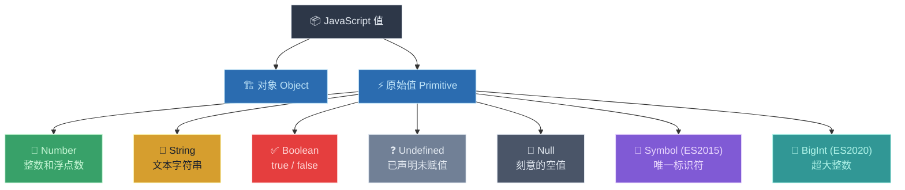
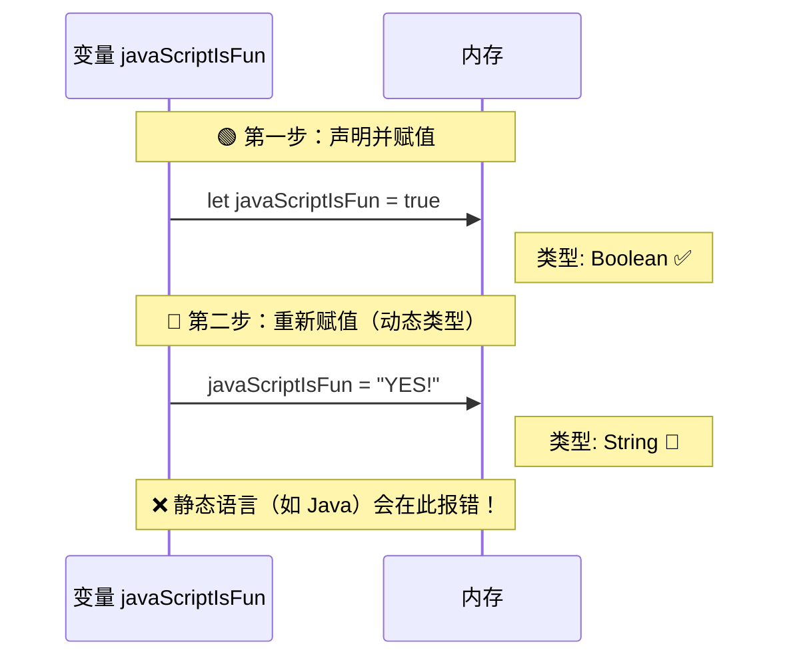
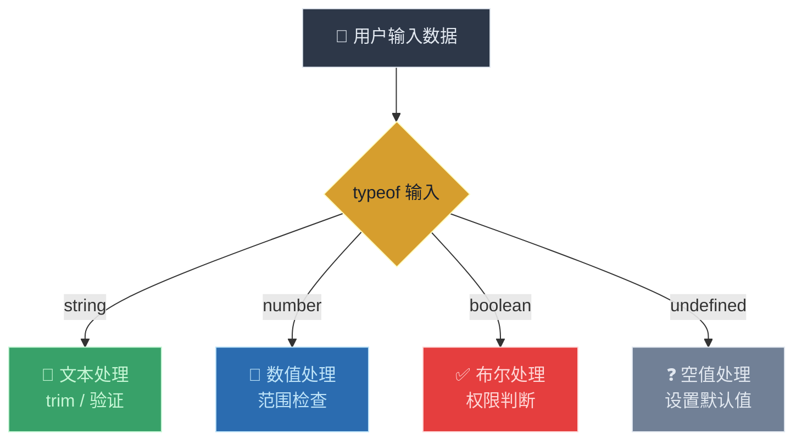

# 数据类型（Data Types）

> 📺 来源：007 Data Types.en.srt
> 📂 章节：第 02 章

## 📌 知识脉络
- **前置知识**：值与变量（Values and Variables）、JavaScript 基本语法
- **后续扩展**：类型转换与类型强制（Type Conversion and Coercion）、真值与假值（Truthy and Falsy Values）、相等运算符（Equality Operators）

## 🎯 概述
JavaScript 中的每个值要么是**对象（Object）**，要么是**原始值（Primitive）**。本节课深入讲解 JavaScript 的 **7 种原始数据类型**：Number、String、Boolean、Undefined、Null、Symbol 和 BigInt。同时介绍 `typeof` 运算符的用法及其著名的历史 Bug，以及 JavaScript **动态类型（Dynamic Typing）** 的核心特性。

## 核心知识点

### 1. JavaScript 的 7 种原始数据类型

> 🧩 **生活类比**：数据类型就像不同种类的容器——水杯装水（Number）、信封装信（String）、开关控制灯（Boolean）、空盒子等待物品（Undefined）、空盒子但标记了"刻意为空"（Null）。每种容器有各自的用途，不能混用。



**7 种原始类型详解：**

| # | 类型 | 说明 | 示例 | 📚 官方文档 |
|---|------|------|------|------------|
| 1 | **Number** | 浮点数，用于整数和小数 | `23`, `3.14` | [MDN](https://developer.mozilla.org/zh-CN/docs/Web/JavaScript/Reference/Global_Objects/Number) |
| 2 | **String** | 文本序列，必须用引号包裹 | `"Hello"`, `'Hi'` | [MDN](https://developer.mozilla.org/zh-CN/docs/Web/JavaScript/Reference/Global_Objects/String) |
| 3 | **Boolean** | 逻辑值，只有 `true` 或 `false` | `true`, `false` | [MDN](https://developer.mozilla.org/zh-CN/docs/Web/JavaScript/Reference/Global_Objects/Boolean) |
| 4 | **Undefined** | 已声明但未赋值的变量的默认值 | `let x;` → `undefined` | [MDN](https://developer.mozilla.org/zh-CN/docs/Web/JavaScript/Reference/Global_Objects/undefined) |
| 5 | **Null** | 刻意设置的空值 | `null` | [MDN](https://developer.mozilla.org/zh-CN/docs/Glossary/Null) |
| 6 | **Symbol** | ES2015 引入，唯一且不可变的值 | `Symbol('id')` | [MDN](https://developer.mozilla.org/zh-CN/docs/Web/JavaScript/Reference/Global_Objects/Symbol) |
| 7 | **BigInt** | ES2020 引入，可表示任意大的整数 | `9007199254740991n` | [MDN](https://developer.mozilla.org/zh-CN/docs/Web/JavaScript/Reference/Global_Objects/BigInt) |

> 💡 **记忆口诀**：**"数字串布尔，空空符大整"** — Number、String、Boolean、Undefined、Null、Symbol、BigInt

---

### 2. `typeof` 运算符 —— 检测数据类型

> 🧩 **生活类比**：`typeof` 就像一个"类型探测仪"——你把任何东西放进去，它就告诉你这是什么类别的东西。把一本书放进去显示"书籍"，把一个苹果放进去显示"水果"。

```js {runnable} {title="typeof_demo.js"}
// typeof 运算符返回一个字符串，描述值的类型
console.log(typeof true);        // "boolean"
console.log(typeof 23);          // "number"
console.log(typeof "Jonas");     // "string"
console.log(typeof undefined);   // "undefined"

// ⚠️ 著名的历史 Bug！
console.log(typeof null);        // "object" ← 这是一个 Bug！
```

**🔍 执行追踪：**

| 步骤 | 表达式 | 返回值 | 说明 |
|------|--------|--------|------|
| ① | `typeof true` | `"boolean"` | 布尔值 → 返回 `"boolean"` |
| ② | `typeof 23` | `"number"` | 数字 → 返回 `"number"` |
| ③ | `typeof "Jonas"` | `"string"` | 字符串 → 返回 `"string"` |
| ④ | `typeof undefined` | `"undefined"` | 未定义 → 返回 `"undefined"` |
| ⑤ | `typeof null` | `"object"` | 🐛 应该返回 `"null"` 但返回了 `"object"` |

> ⚠️ **`typeof null` 返回 `"object"` 是 JavaScript 的一个历史遗留 Bug**，至今未被修复（为了向后兼容）。实际上 `null` **不是**对象——它是原始类型。

---

### 3. 动态类型（Dynamic Typing）

> 🧩 **生活类比**：想象一个箱子，你先放了一本书（Boolean），后来取出书放进一部手机（String）。箱子（变量）不在乎里面装什么——重要的是里面的东西（值）本身。这就是动态类型：**类型归属于值，而非变量**。



```js {runnable} {title="dynamic_typing.js"}
// ① 声明变量并赋值为布尔值
let javaScriptIsFun = true;
console.log(typeof javaScriptIsFun); // "boolean"

// ② 重新赋值为字符串 —— 动态类型允许这样做！
javaScriptIsFun = "YES!";  // 注意：不需要再写 let
console.log(typeof javaScriptIsFun); // "string"

// ③ 动态类型体现：同一个变量，类型可以自由切换
```

**🔍 执行追踪：**

| 步骤 | 代码 | `javaScriptIsFun` 的值 | 类型 |
|------|------|----------------------|------|
| ① | `let javaScriptIsFun = true` | `true` | `boolean` |
| ② | `javaScriptIsFun = "YES!"` | `"YES!"` | `string` |

> 💡 **记忆口诀**：**"类型跟值走，变量无所谓"** —— 数据类型是值的属性，不是变量的属性。

---

### 4. Undefined —— "空盒子"

> 🧩 **生活类比**：声明但未赋值的变量就像准备好了一个空箱子——箱子存在，但里面什么也没有。JavaScript 自动往里贴了个标签：`undefined`（未定义）。

```js {runnable} {title="undefined_demo.js"}
// ① 声明变量但不赋值
let year;
console.log(year);          // undefined —— 值是 undefined
console.log(typeof year);   // "undefined" —— 类型也是 undefined

// ② 后续赋值 —— 动态类型再次体现
year = 1991;
console.log(typeof year);   // "number" —— 类型变成了 number
```

**🔍 执行追踪：**

| 步骤 | 代码 | `year` 的值 | 类型 |
|------|------|------------|------|
| ① | `let year;` | `undefined` | `"undefined"` |
| ② | `year = 1991` | `1991` | `"number"` |

> 💡 **关键理解**：`undefined` 既是一个**值**（value），也是一种**类型**（type）。这在所有原始类型中是独特的。

---

### 5. 字符串的引号规则

> 🧩 **生活类比**：创建字符串就像给文字加"书名号"——没有书名号，JavaScript 会把它当成一个变量名去查找，找不到就报错。

```js {runnable} {title="string_quotes.js"}
// ✅ 正确：单引号或双引号都可以
console.log("Jonas");   // 双引号 → 字符串
console.log('Jonas');   // 单引号 → 字符串

// ❌ 错误：不加引号，JavaScript 会认为这是变量名
// console.log(Jonas);  // ReferenceError: Jonas is not defined
```

---

## 🛠️ 代码实战与真实场景

> **💼 业务场景**：用户注册系统——根据用户输入的不同类型数据进行类型检测和数据预处理。



```js {runnable} {title="user_registration.js"}
// 模拟用户注册系统的数据类型处理
let userName = "Alice";
let userAge = 28;
let isPremium = true;
let phoneNumber;  // 用户未填写

// 使用 typeof 检测每个字段的类型
console.log(`用户名: ${userName} (${typeof userName})`);
console.log(`年龄: ${userAge} (${typeof userAge})`);
console.log(`会员: ${isPremium} (${typeof isPremium})`);
console.log(`电话: ${phoneNumber} (${typeof phoneNumber})`);

// 根据 typeof 结果进行防御性编程
if (typeof phoneNumber === "undefined") {
  console.log("⚠️ 电话号码未填写，设置默认值");
  phoneNumber = "未提供";
}

console.log(`电话(处理后): ${phoneNumber} (${typeof phoneNumber})`);
```

**📊 输入输出示例：**

| 变量 | 值 | `typeof` 结果 | 处理策略 |
|------|-----|--------------|---------|
| `userName` | `"Alice"` | `"string"` | 文本验证 |
| `userAge` | `28` | `"number"` | 范围检查 |
| `isPremium` | `true` | `"boolean"` | 权限判断 |
| `phoneNumber` | `undefined` | `"undefined"` | 设置默认值 |
| `null` | `null` | `"object"` | ⚠️ Bug！需特殊判断 |

## 💡 关键要点
- ✅ JavaScript 有 **7 种原始数据类型**：Number、String、Boolean、Undefined、Null、Symbol、BigInt
- ✅ **数据类型属于值**，不属于变量——同一变量可以在不同时刻持有不同类型的值（动态类型）
- ✅ `typeof` 运算符返回一个**字符串**，描述操作数的数据类型
- ✅ 声明变量但不赋值时，其值和类型都是 `undefined`
- ✅ 创建字符串必须使用**引号**（单引号或双引号），否则 JavaScript 会将其当作变量名

## ⚠️ 常见误区
- ⚠️ **误区 1**：认为 `typeof null` 返回 `"null"`。实际返回 `"object"`——这是 JavaScript 的历史 Bug，**null 并不是对象**。
- ⚠️ **误区 2**：重新赋值时再次使用 `let`。重新赋值应省略 `let`，否则会尝试重新声明同名变量，导致报错。
- ⚠️ **误区 3**：忘记给字符串加引号。`Jonas`（无引号）会被当作变量名查找，如果不存在就会抛出 `ReferenceError`。

## 🐛 报错实验室

**❌ 错误写法 1：字符串忘加引号**
```js
console.log(Jonas); // 没有加引号！
```
**浏览器报错：**
```
Uncaught ReferenceError: Jonas is not defined
```
**🔑 解读**：JavaScript 把 `Jonas` 当成了**变量名**去查找，但没有找到名为 `Jonas` 的变量，所以抛出「引用错误」。修复方法：加上引号 `"Jonas"` 或 `'Jonas'`。

**❌ 错误写法 2：重新赋值时写了 let**
```js
let age = 25;
let age = 30; // 重复声明！
```
**浏览器报错：**
```
Uncaught SyntaxError: Identifier 'age' has already been declared
```
**🔑 解读**：`let` 关键字只用于**首次声明**。后续修改值直接写 `age = 30` 即可。

---

## 📖 词汇速查表 (Cheat Sheet)

| 中文术语 | 英文术语 | 简明释义 | 速查代码 | 📚 官方文档 |
|---------|---------|---------|---------|-----------|
| 数据类型 | Data Type | 值所属的分类 | `typeof value` | [MDN](https://developer.mozilla.org/zh-CN/docs/Web/JavaScript/Data_structures) |
| 原始类型 | Primitive | 不是对象的 7 种基础类型 | `number, string, boolean...` | [MDN](https://developer.mozilla.org/zh-CN/docs/Glossary/Primitive) |
| 动态类型 | Dynamic Typing | 变量可随时改变所持值的类型 | `let x = 1; x = "hi";` | [MDN](https://developer.mozilla.org/zh-CN/docs/Glossary/Dynamic_typing) |
| typeof 运算符 | typeof Operator | 返回操作数的类型字符串 | `typeof 42 // "number"` | [MDN](https://developer.mozilla.org/zh-CN/docs/Web/JavaScript/Reference/Operators/typeof) |
| 未定义 | Undefined | 声明但未赋值的变量的默认状态 | `let x; // undefined` | [MDN](https://developer.mozilla.org/zh-CN/docs/Web/JavaScript/Reference/Global_Objects/undefined) |
| 空值 | Null | 刻意设置的空值 | `let x = null;` | [MDN](https://developer.mozilla.org/zh-CN/docs/Glossary/Null) |

---

## 🧪 学习验证

### 📝 动手练习

**练习 1：类型探测器**
```js {runnable} {title="exercise1.js"}
// 创建以下变量，然后用 typeof 打印它们的类型：
// 1. 一个名为 country 的字符串变量
// 2. 一个名为 population 的数字变量
// 3. 一个名为 isIsland 的布尔变量
// 4. 一个名为 capital 的未赋值变量

// 在这里写你的代码
```
<details><summary>💡 参考答案</summary>

```js
let country = "China";
let population = 1400000000;
let isIsland = false;
let capital;

console.log(typeof country);     // "string"
console.log(typeof population);  // "number"
console.log(typeof isIsland);    // "boolean"
console.log(typeof capital);     // "undefined"
```
**解题思路**：按照要求逐一声明变量，注意 `capital` 不赋值即可自动获得 `undefined`。
</details>

**练习 2：动态类型实验**
```js {runnable} {title="exercise2.js"}
// 1. 声明一个变量 mystery 并赋值为 42
// 2. 打印 mystery 的类型
// 3. 将 mystery 重新赋值为 "The answer"
// 4. 再次打印 mystery 的类型
// 5. 将 mystery 重新赋值为 true
// 6. 最后一次打印 mystery 的类型

// 在这里写你的代码
```
<details><summary>💡 参考答案</summary>

```js
let mystery = 42;
console.log(typeof mystery);  // "number"

mystery = "The answer";
console.log(typeof mystery);  // "string"

mystery = true;
console.log(typeof mystery);  // "boolean"
```
**解题思路**：体会动态类型——同一变量依次持有 Number、String、Boolean 三种类型的值。注意重新赋值时**不写 `let`**。
</details>

### ❓ 理解检测

:::quiz {correct="C"}
**1. JavaScript 中，数据类型属于谁？**
- A) 属于变量
- B) 属于变量名
- C) 属于值

> **解析**：JavaScript 是动态类型语言，数据类型归属于**值**本身，而不是变量。同一变量可以随时持有不同类型的值。
:::

:::quiz {correct="B"}
**2. `typeof null` 的返回值是什么？**
- A) `"null"`
- B) `"object"`
- C) `"undefined"`

> **解析**：这是 JavaScript 的一个著名历史 Bug。`typeof null` 返回 `"object"`，但 null 实际上是原始类型，不是对象。
:::

:::quiz {correct="A"}
**3. 下面哪种写法会导致错误？**
- A) `console.log(Hello)`（不加引号）
- B) `console.log("Hello")`（双引号）
- C) `console.log('Hello')`（单引号）

> **解析**：不加引号时，JavaScript 会把 `Hello` 当成变量名去查找，如果该变量没有声明过，就会抛出 `ReferenceError`。
:::

### 🔧 代码填空

:::fill-blank
// 声明一个空变量，它的值自动为 ___undefined___
let emptyVar;

// 检测一个值的类型，使用 ___typeof___ 运算符
console.log(typeof emptyVar);

// 重新赋值时不需要写 ___let___
emptyVar = 2024;
:::
