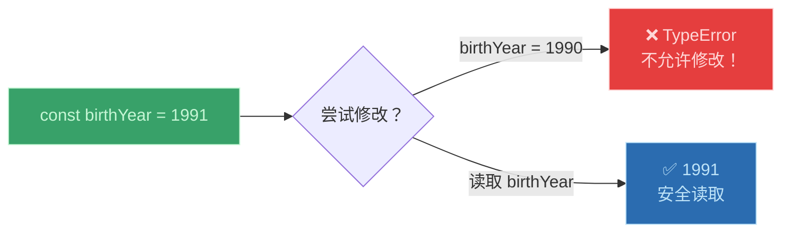
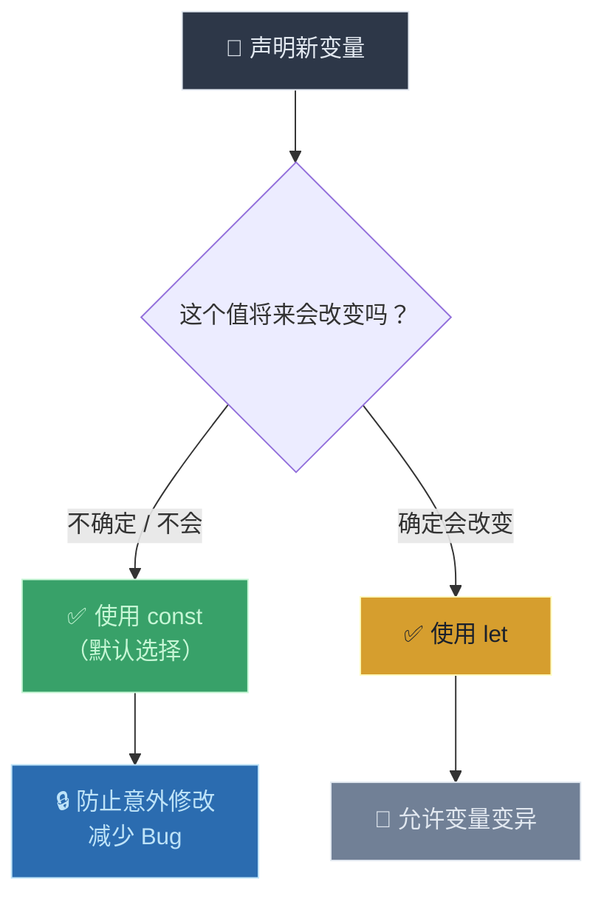
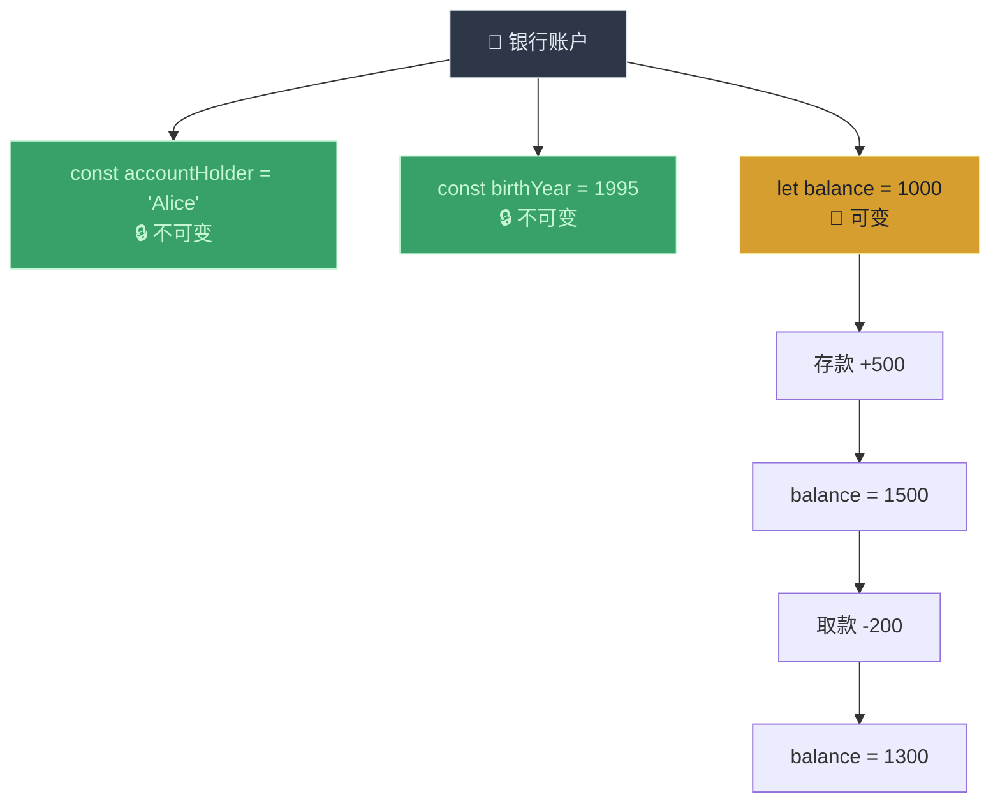

# let、const 和 var

> 📺 来源：008 let, const and var.en.srt
> 📂 章节：第 02 章

## 📌 知识脉络
- **前置知识**：值与变量（Values and Variables）、数据类型（Data Types）
- **后续扩展**：作用域与作用域链（Scope and Scope Chain）、变量提升（Hoisting）、块作用域 vs 函数作用域

## 🎯 概述
JavaScript 提供三种声明变量的方式：`let`、`const` 和 `var`。`let` 和 `const` 是 ES6 引入的现代语法，而 `var` 是旧式写法。本节课讲解三者的区别、各自的使用场景，以及为什么**优先使用 `const`** 是最佳实践。

## 核心知识点

### 1. `let` —— 可变变量声明

> 🧩 **生活类比**：`let` 就像用铅笔在白板上写字——你可以随时擦掉重写新内容。变量的值是可以被修改（"变异/mutate"）的。

```js {runnable} {title="let_demo.js"}
// ① 用 let 声明变量
let age = 30;
console.log(age); // 30

// ② 重新赋值（Reassign / Mutate）—— 完全合法！
age = 31;
console.log(age); // 31

// ③ 也可以先声明空变量，稍后再赋值
let year;
console.log(year); // undefined
year = 2024;
console.log(year); // 2024
```

**🔍 执行追踪：**

| 步骤 | 代码 | `age` | `year` |
|------|------|-------|--------|
| ① | `let age = 30` | `30` | — |
| ② | `age = 31` | `31` | — |
| ③ | `let year` | `31` | `undefined` |
| ④ | `year = 2024` | `31` | `2024` |

**`let` 的两种经典使用场景：**
1. **值会改变的变量**（如计数器、年龄、状态标记）
2. **先声明后赋值**（如根据条件决定初始值）

---

### 2. `const` —— 不可变变量声明

> 🧩 **生活类比**：`const` 就像用永久记号笔刻在石板上——一旦写上就不能修改。出生年份不会变，所以适合用 `const`。

```js {runnable} {title="const_demo.js"}
// ① 用 const 声明不可变变量
const birthYear = 1991;
console.log(birthYear); // 1991

// ② 尝试重新赋值 → 报错！
// birthYear = 1990; // ❌ TypeError: Assignment to constant variable.

// ③ const 必须在声明时就赋初始值
// const job; // ❌ SyntaxError: Missing initializer in const declaration
```



**`const` 的两条铁律：**
1. ❌ 不可重新赋值（Immutable binding）
2. ❌ 不可声明空变量（必须有初始值）

---

### 3. `let` vs `const` —— 选择策略

> 🧩 **生活类比**：去超市购物时，默认把商品放进"安全锁柜"（`const`）——只在确实需要经常拿取替换的时候才放进"开放货架"（`let`）。



**📊 三种声明方式对比：**

| 特性 | `let` | `const` | `var` |
|------|-------|---------|-------|
| 引入版本 | ES6 (2015) | ES6 (2015) | ES1 (1997) |
| 可重新赋值 | ✅ 可以 | ❌ 不可以 | ✅ 可以 |
| 可声明空变量 | ✅ 可以 | ❌ 不可以 | ✅ 可以 |
| 作用域 | 块作用域 | 块作用域 | 函数作用域 |
| 推荐使用 | ✅ 需要变的值 | ✅✅ 默认首选 | ❌ 避免使用 |

> 💡 **记忆口诀**：**"const 为王，let 为臣，var 已退休"** —— 默认用 `const`，确需改变用 `let`，永远不用 `var`。

---

### 4. `var` —— 已过时，仅做了解

> 🧩 **生活类比**：`var` 就像老式的没有锁的信箱——任何人都能随意拿走和放入信件，而且它还有"穿墙术"（函数作用域 vs 块作用域），容易引发混乱。

```js {runnable} {title="var_demo.js"}
// var 表面上和 let 类似
var job = "programmer";
job = "teacher"; // 也可以重新赋值
console.log(job); // "teacher"

// ⚠️ 但底层行为完全不同（函数作用域 vs 块作用域）
// 这些差异将在第 7 章详细讲解
```

---

### 5. 不使用关键字声明变量 —— 危险操作

```js {runnable} {title="no_keyword.js"}
// ⚠️ 危险！不用任何关键字也能"声明"变量
// lastName = "Schmedtmann";
// console.log(lastName); // 能运行，但...

// 它不会创建局部变量，而是在全局对象上创建属性
// 这是极其糟糕的做法，永远不要这样做！
```

---

## 🛠️ 代码实战与真实场景

> **💼 业务场景**：一个简单的银行账户余额管理——出生年份不变（`const`），余额会变（`let`）。



```js {runnable} {title="bank_account.js"}
// 不变的信息 → const
const accountHolder = "Alice";
const birthYear = 1995;

// 会变的信息 → let
let balance = 1000;

console.log(`账户持有人: ${accountHolder}`);
console.log(`出生年份: ${birthYear}`);
console.log(`初始余额: ¥${balance}`);

// 存款
balance = balance + 500;
console.log(`存款后余额: ¥${balance}`); // ¥1500

// 取款
balance = balance - 200;
console.log(`取款后余额: ¥${balance}`); // ¥1300
```

**📊 输入输出示例：**

| 操作 | balance 变化 | 最终值 |
|------|-------------|--------|
| 初始化 | — | `1000` |
| 存款 +500 | `1000 + 500` | `1500` |
| 取款 -200 | `1500 - 200` | `1300` |

## 💡 关键要点
- ✅ **`const` 是默认首选**——减少变量变异，降低 Bug 风险
- ✅ **`let` 用于确实需要改变的值**——计数器、状态、累加器等
- ✅ **`var` 已过时**——了解即可，新代码中永远不要使用
- ✅ 重新赋值时**不需要再写 `let`/`const`/`var`**
- ✅ **永远不要**不用关键字就直接使用变量（会污染全局对象）

## ⚠️ 常见误区
- ⚠️ **误区 1**：认为 `const` 声明的对象/数组内部也不能修改。实际上 `const` 只保证**绑定不可变**——对象内部的属性仍然可以修改（这将在后续课程讲解）。
- ⚠️ **误区 2**：重新赋值时再次写 `let`。例如 `let age = 30; let age = 31;` 会报错——正确写法是 `age = 31;`。
- ⚠️ **误区 3**：所有变量都用 `let`。这是一种坏习惯——应该默认用 `const`，除非明确需要修改。

## 🐛 报错实验室

**❌ 错误写法 1：修改 const 变量**
```js
const birthYear = 1991;
birthYear = 1990;
```
**浏览器报错：**
```
Uncaught TypeError: Assignment to constant variable.
```
**🔑 解读**：`const` 声明的变量是不可变绑定。如果确实需要修改，应该改用 `let` 声明。

**❌ 错误写法 2：const 不给初始值**
```js
const job;
```
**浏览器报错：**
```
Uncaught SyntaxError: Missing initializer in const declaration
```
**🔑 解读**：`const` 必须在声明的同时赋初始值。如果暂时不确定值，可以先用 `let`。

---

## 📖 词汇速查表 (Cheat Sheet)

| 中文术语 | 英文术语 | 简明释义 | 速查代码 | 📚 官方文档 |
|---------|---------|---------|---------|-----------|
| 可变声明 | let | 声明可重新赋值的变量 | `let x = 1; x = 2;` | [MDN](https://developer.mozilla.org/zh-CN/docs/Web/JavaScript/Reference/Statements/let) |
| 常量声明 | const | 声明不可重新赋值的变量 | `const PI = 3.14;` | [MDN](https://developer.mozilla.org/zh-CN/docs/Web/JavaScript/Reference/Statements/const) |
| 旧式声明 | var | ES6 之前的变量声明方式 | `var x = 1;` | [MDN](https://developer.mozilla.org/zh-CN/docs/Web/JavaScript/Reference/Statements/var) |
| 变异/重赋值 | Mutate / Reassign | 修改变量中存储的值 | `age = 31;` | — |
| 不可变 | Immutable | 值一旦设定便不可更改 | `const` 绑定 | — |

---

## 🧪 学习验证

### 📝 动手练习

**练习 1：选择正确的声明方式**
```js {runnable} {title="exercise1.js"}
// 为以下变量选择最合适的声明方式（let 或 const）：
// 1. 一个人的名字（不会改变）
// 2. 当前温度（会改变）
// 3. 圆周率（不会改变）
// 4. 购物车中的商品数量（会改变）

// 在这里写你的代码
```
<details><summary>💡 参考答案</summary>

```js
const name = "Alice";        // 名字不变 → const
let temperature = 22;        // 温度会变 → let
const PI = 3.14159;          // 圆周率不变 → const
let cartItems = 0;           // 商品数量会变 → let

temperature = 25;            // ✅ let 允许修改
cartItems = 3;               // ✅ let 允许修改
// name = "Bob";             // ❌ const 不允许修改
```
**解题思路**：判断标准是"这个值在程序运行过程中是否需要改变"。不变的用 `const`，会变的用 `let`。
</details>

**练习 2：找出错误**
```js {runnable} {title="exercise2.js"}
// 以下代码有 3 处错误，找出并修复它们

const score = 100;
score = 200;          // 错误 1

let greeting;
let greeting = "hi";  // 错误 2

const username;       // 错误 3
```
<details><summary>💡 参考答案</summary>

```js
// 修复 1：score 需要修改，应该用 let
let score = 100;
score = 200;

// 修复 2：重新赋值时不需要再写 let
let greeting;
greeting = "hi";

// 修复 3：const 必须有初始值
const username = "Alice";
```
**解题思路**：三条核心规则——`const` 不可重赋值、`let` 变量不可重复声明、`const` 必须有初始值。
</details>

### ❓ 理解检测

:::quiz {correct="B"}
**1. 声明新变量时应该优先使用哪个关键字？**
- A) `let`
- B) `const`
- C) `var`

> **解析**：最佳实践是**默认使用 `const`**，仅在确实需要修改变量值时才使用 `let`。`var` 应完全避免。
:::

:::quiz {correct="C"}
**2. 以下哪段代码会报错？**
- A) `let age = 30; age = 31;`
- B) `var job = "dev"; job = "designer";`
- C) `const year = 2024; year = 2025;`

> **解析**：`const` 声明的变量不允许重新赋值，会抛出 `TypeError: Assignment to constant variable`。
:::

:::quiz {correct="A"}
**3. 关于 `var`，以下哪个说法正确？**
- A) `var` 是函数作用域（Function-scoped），`let` 和 `const` 是块作用域（Block-scoped）
- B) `var` 是块作用域，`let` 和 `const` 是函数作用域
- C) 三者的作用域完全相同

> **解析**：`var` 的作用域是函数级别的，这意味着它可以"穿透"代码块（如 `if`、`for`），而 `let`/`const` 被限制在声明所在的块中。
:::

### 🔧 代码填空

:::fill-blank
// 声明不可变变量使用 ___const___
const birthYear = 1991;

// 声明可变变量使用 ___let___
let age = 30;

// 重新赋值时不需要写关键字
age = ___31___;
:::
