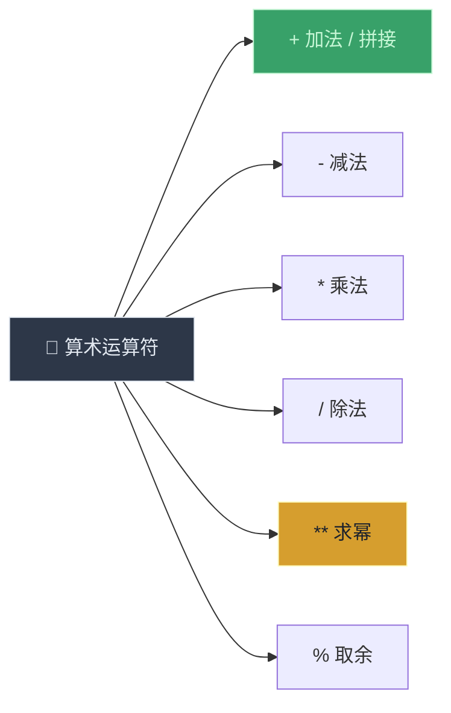
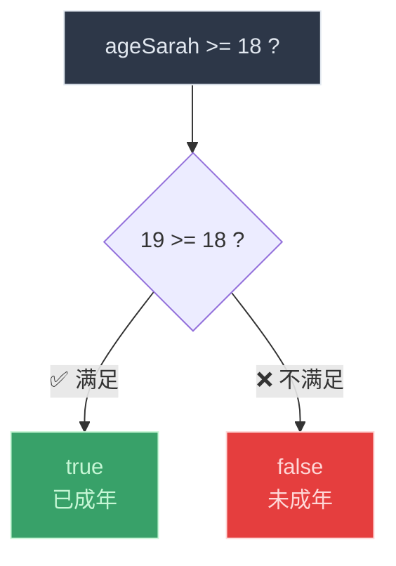
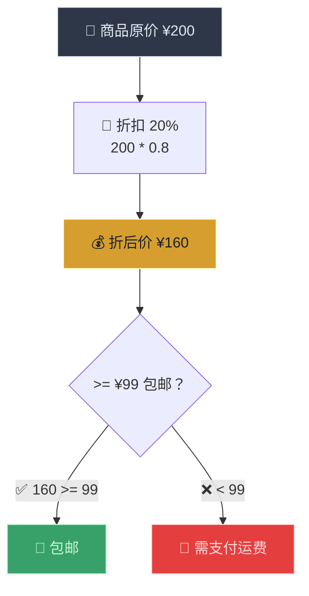

# 基本运算符（Basic Operators）

> 📺 来源：009 Basic Operators.en.srt
> 📂 章节：第 02 章

## 📌 知识脉络
- **前置知识**：值与变量（Values and Variables）、数据类型（Data Types）、let/const 声明
- **后续扩展**：运算符优先级（Operator Precedence）、相等运算符（Equality Operators）、逻辑运算符（Logical Operators）

## 🎯 概述
运算符（Operator）是对值进行操作和变换的特殊符号。本节课涵盖三大类运算符：**算术运算符**（加减乘除、求幂、字符串拼接）、**赋值运算符**（`=`、`+=`、`*=`、`++`、`--`）以及**比较运算符**（`>`、`<`、`>=`、`<=`），并展示如何用比较运算符产生 Boolean 值。

## 核心知识点

### 1. 算术运算符（Math Operators）

> 🧩 **生活类比**：算术运算符就像计算器上的按钮——加号是"增加"，减号是"减少"，乘号是"倍增"，除号是"均分"，幂号是"指数级增长"。

```js {runnable} {title="math_operators.js"}
const now = 2037;
const ageJonas = now - 1991;
const ageSarah = now - 2018;
console.log(ageJonas, ageSarah); // 46 19

// 基本四则运算 + 求幂
console.log(ageJonas * 2);        // 92  （乘法）
console.log(ageJonas / 10);       // 4.6 （除法）
console.log(2 ** 3);              // 8   （2 的 3 次方，求幂）

// 字符串拼接（+ 运算符的特殊用途）
const firstName = "Jonas";
const lastName = "Schmedtmann";
console.log(firstName + " " + lastName); // "Jonas Schmedtmann"
```

**🔍 执行追踪：**

| 步骤 | 表达式 | 计算过程 | 结果 |
|------|--------|---------|------|
| ① | `now - 1991` | `2037 - 1991` | `46` |
| ② | `now - 2018` | `2037 - 2018` | `19` |
| ③ | `ageJonas * 2` | `46 * 2` | `92` |
| ④ | `2 ** 3` | `2×2×2` | `8` |
| ⑤ | `firstName + " " + lastName` | 字符串连接 | `"Jonas Schmedtmann"` |



> 💡 **记忆口诀**：**"`+` 号身兼两职"** —— 用于数字是加法运算，用于字符串是拼接（Concatenation）。

---

### 2. 赋值运算符（Assignment Operators）

> 🧩 **生活类比**：赋值运算符就像"记账本的简写"——`x += 10` 就是"在原来的基础上加 10"，免去了写出完整公式的麻烦。

```js {runnable} {title="assignment_operators.js"}
// ① 基本赋值：= 本身就是运算符
let x = 10 + 5; // x = 15
console.log(x);

// ② 复合赋值 += ：x = x + 10
x += 10; // x = 25
console.log(x);

// ③ 复合赋值 *= ：x = x * 4
x *= 4;  // x = 100
console.log(x);

// ④ 自增 ++ ：x = x + 1
x++;     // x = 101
console.log(x);

// ⑤ 自减 -- ：x = x - 1
x--;     // x = 100
x--;     // x = 99
console.log(x);
```

**🔍 执行追踪：**

| 步骤 | 代码 | 等价写法 | x 的值 |
|------|------|---------|--------|
| ① | `let x = 10 + 5` | — | `15` |
| ② | `x += 10` | `x = x + 10` | `25` |
| ③ | `x *= 4` | `x = x * 4` | `100` |
| ④ | `x++` | `x = x + 1` | `101` |
| ⑤ | `x--` × 2 | `x = x - 1` × 2 | `99` |

**📊 赋值运算符速查：**

| 运算符 | 等价形式 | 示例 |
|--------|---------|------|
| `=` | 直接赋值 | `x = 5` |
| `+=` | `x = x + n` | `x += 3` → `x = x + 3` |
| `-=` | `x = x - n` | `x -= 2` → `x = x - 2` |
| `*=` | `x = x * n` | `x *= 4` → `x = x * 4` |
| `/=` | `x = x / n` | `x /= 2` → `x = x / 2` |
| `++` | `x = x + 1` | `x++` |
| `--` | `x = x - 1` | `x--` |

---

### 3. 比较运算符（Comparison Operators）

> 🧩 **生活类比**：比较运算符就像一个裁判——你问它"A 是否比 B 大？"，它只会回答"是"（`true`）或"不是"（`false`）。结果永远是布尔值。

```js {runnable} {title="comparison_operators.js"}
const ageJonas = 46;
const ageSarah = 19;

// 比较运算符产生 Boolean 值
console.log(ageJonas > ageSarah);   // true  （46 > 19）
console.log(ageSarah < ageJonas);   // true  （19 < 46）
console.log(ageSarah >= 18);        // true  （19 >= 18）
console.log(ageSarah >= 20);        // false （19 >= 20）

// 可以将比较结果存入变量
const isFullAge = ageSarah >= 18;
console.log(isFullAge); // true
```



**📊 比较运算符速查：**

| 运算符 | 含义 | 示例 | 结果 |
|--------|------|------|------|
| `>` | 大于 | `5 > 3` | `true` |
| `<` | 小于 | `5 < 3` | `false` |
| `>=` | 大于或等于 | `5 >= 5` | `true` |
| `<=` | 小于或等于 | `4 <= 3` | `false` |

> 💡 **记忆口诀**：**"比较出对错"** —— 比较运算符的结果永远是布尔值（`true` 或 `false`）。

---

## 🛠️ 代码实战与真实场景

> **💼 业务场景**：电商网站的折扣计算器——计算商品的折后价，并判断是否符合包邮条件。



```js {runnable} {title="discount_calculator.js"}
// 电商折扣计算器
const originalPrice = 200;
const discount = 0.8; // 8 折
const finalPrice = originalPrice * discount;

console.log("原价: ¥" + originalPrice);
console.log("折后价: ¥" + finalPrice);

// 判断是否包邮（满 99 包邮）
const freeShipping = finalPrice >= 99;
console.log("是否包邮: " + freeShipping); // true

// 使用赋值运算符累加购物车
let cartTotal = 0;
cartTotal += finalPrice;     // 第一件商品
cartTotal += 49;             // 第二件商品
console.log("购物车总价: ¥" + cartTotal); // ¥209
```

**📊 输入输出示例：**

| 原价 | 折扣 | 折后价 | `>= 99` | 是否包邮 |
|------|------|--------|---------|---------|
| ¥200 | 8折 | ¥160 | `true` | ✅ |
| ¥80 | 8折 | ¥64 | `false` | ❌ |
| ¥125 | 8折 | ¥100 | `true` | ✅ |

## 💡 关键要点
- ✅ `+` 运算符对数字做加法，对字符串做**拼接**（Concatenation）
- ✅ `**` 是求幂运算符，`2 ** 3` 等于 `Math.pow(2, 3)` 即 8
- ✅ `+=`、`*=`、`++`、`--` 等复合赋值运算符是简写形式
- ✅ 比较运算符（`>`、`<`、`>=`、`<=`）的结果始终是 **Boolean 值**
- ✅ 比较结果可以存入变量供后续逻辑判断使用

## ⚠️ 常见误区
- ⚠️ **误区 1**：混淆 `=`（赋值）和 `==`（比较）。`x = 5` 是把 5 赋给 x，`x == 5` 是判断 x 是否等于 5。
- ⚠️ **误区 2**：以为 `"5" + 3` 结果是 `8`。实际结果是字符串 `"53"`——当 `+` 有一边是字符串时，会进行拼接而非加法。
- ⚠️ **误区 3**：写 `=>` 代替 `>=`。`=>` 是箭头函数语法，`>=` 才是"大于等于"比较运算符。

## 🐛 报错实验室

**❌ 错误写法：对 const 变量使用 ++ 自增**
```js
const count = 10;
count++; // 尝试自增
```
**浏览器报错：**
```
Uncaught TypeError: Assignment to constant variable.
```
**🔑 解读**：`count++` 等价于 `count = count + 1`，是一种**重新赋值**操作。`const` 声明的变量不允许重新赋值。如果需要自增，请改用 `let` 声明。

---

## 📖 词汇速查表 (Cheat Sheet)

| 中文术语 | 英文术语 | 简明释义 | 速查代码 | 📚 官方文档 |
|---------|---------|---------|---------|-----------|
| 算术运算符 | Arithmetic Operator | 执行数学运算 | `+  -  *  /  **  %` | [MDN](https://developer.mozilla.org/zh-CN/docs/Web/JavaScript/Guide/Expressions_and_operators#arithmetic_operators) |
| 赋值运算符 | Assignment Operator | 给变量赋值 | `=  +=  -=  *=  /=` | [MDN](https://developer.mozilla.org/zh-CN/docs/Web/JavaScript/Guide/Expressions_and_operators#assignment_operators) |
| 比较运算符 | Comparison Operator | 比较两个值，返回布尔 | `>  <  >=  <=` | [MDN](https://developer.mozilla.org/zh-CN/docs/Web/JavaScript/Guide/Expressions_and_operators#comparison_operators) |
| 字符串拼接 | Concatenation | 用 `+` 连接字符串 | `"a" + "b" // "ab"` | [MDN](https://developer.mozilla.org/zh-CN/docs/Web/JavaScript/Reference/Operators/Addition) |
| 求幂运算符 | Exponentiation | 计算幂 | `2 ** 3 // 8` | [MDN](https://developer.mozilla.org/zh-CN/docs/Web/JavaScript/Reference/Operators/Exponentiation) |

---

## 🧪 学习验证

### 📝 动手练习

**练习 1：BMI 计算器**
```js {runnable} {title="exercise1.js"}
// 计算 Mark 和 John 的 BMI（体重 / 身高²）
// Mark: 78kg, 1.69m
// John: 92kg, 1.95m
// 1. 计算两人的 BMI
// 2. 判断 Mark 的 BMI 是否大于 John 的 BMI

// 在这里写你的代码
```
<details><summary>💡 参考答案</summary>

```js
const massMark = 78;
const heightMark = 1.69;
const massJohn = 92;
const heightJohn = 1.95;

const bmiMark = massMark / heightMark ** 2;
const bmiJohn = massJohn / heightJohn ** 2;

console.log("Mark 的 BMI:", bmiMark);   // ≈ 27.31
console.log("John 的 BMI:", bmiJohn);   // ≈ 24.19
console.log("Mark 的 BMI 更高:", bmiMark > bmiJohn); // true
```
**解题思路**：用 `**` 求幂计算身高的平方，再用 `/` 除法得到 BMI，最后用 `>` 比较两个值。
</details>

**练习 2：累加器**
```js {runnable} {title="exercise2.js"}
// 使用赋值运算符模拟以下场景：
// 1. 初始分数为 0
// 2. 第一关 +25 分
// 3. 第二关 +35 分
// 4. 失误扣 10 分
// 5. 奖励分数翻倍
// 6. 打印最终分数

// 在这里写你的代码
```
<details><summary>💡 参考答案</summary>

```js
let score = 0;
score += 25;  // 25
score += 35;  // 60
score -= 10;  // 50
score *= 2;   // 100
console.log("最终分数:", score); // 100
```
**解题思路**：按顺序使用 `+=`、`-=`、`*=` 复合赋值运算符逐步修改变量值。
</details>

### ❓ 理解检测

:::quiz {correct="B"}
**1. `"Hello" + 5` 的结果是什么？**
- A) `"Hello5"` 且类型为 number
- B) `"Hello5"` 且类型为 string
- C) 报错

> **解析**：当 `+` 运算符的任意一侧是字符串时，会执行字符串拼接。数字 `5` 被自动转换为字符串 `"5"`，结果为 `"Hello5"`，类型为 `string`。
:::

:::quiz {correct="C"}
**2. `let x = 10; x += 5; x *= 2;` 执行后 x 的值是？**
- A) `20`
- B) `25`
- C) `30`

> **解析**：`x = 10` → `x += 5` 即 `x = 15` → `x *= 2` 即 `x = 30`。
:::

:::quiz {correct="A"}
**3. 比较运算符的返回值是什么类型？**
- A) Boolean（布尔值）
- B) Number（数字）
- C) String（字符串）

> **解析**：比较运算符（`>`、`<`、`>=`、`<=`）的结果永远是布尔值：`true` 或 `false`。
:::

### 🔧 代码填空

:::fill-blank
// 求幂运算符：2 的 4 次方
const result = 2 ___**___ 4; // 16

// 复合赋值：在原值基础上加 10
let count = 5;
count ___+=___ 10; // 15

// 比较运算符：判断是否大于等于 18
const isAdult = 20 ___>=___ 18; // true
:::
