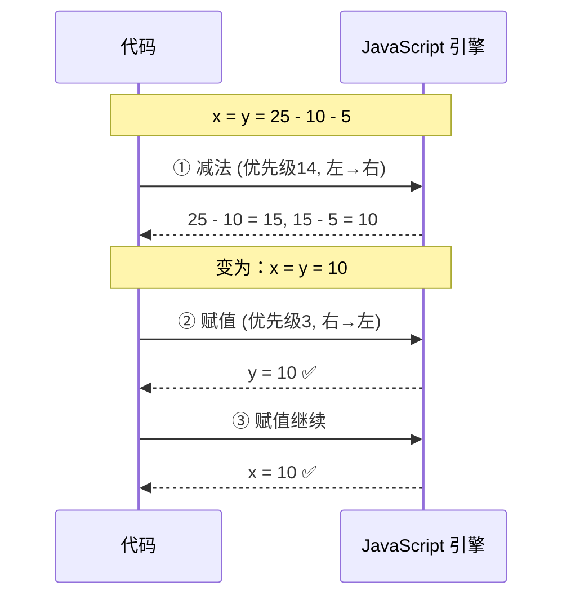
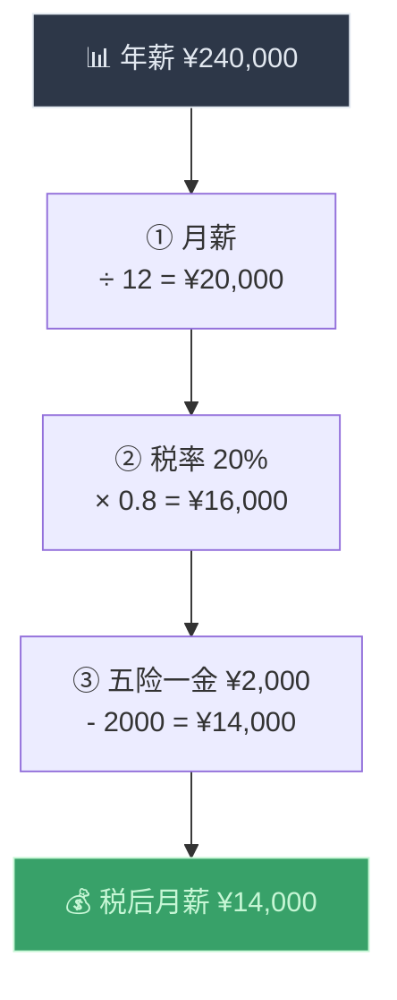

# 运算符优先级（Operator Precedence）

> 📺 来源：010 Operator Precedence.en.srt
> 📂 章节：第 02 章

## 📌 知识脉络
- **前置知识**：基本运算符（Basic Operators）、数据类型（Data Types）
- **后续扩展**：逻辑运算符（Logical Operators）、相等运算符（Equality Operators）、短路求值（Short-circuit Evaluation）

## 🎯 概述
当一行代码中出现多个运算符时，JavaScript 按照**优先级（Precedence）**和**结合性（Associativity）**来决定执行顺序。本节课通过 MDN 优先级参考表，讲解为什么数学运算先于比较运算执行，以及为什么赋值运算符是**从右到左**结合的。同时展示了**圆括号**如何覆盖默认优先级。

## 核心知识点

### 1. 优先级决定执行顺序

> 🧩 **生活类比**：运算符优先级就像交通规则里的"先行权"——红灯让绿灯，直行先于转弯。同理，乘除先于加减，数学运算先于比较运算。

```js {runnable} {title="precedence_demo.js"}
const now = 2037;
const ageJonas = now - 1991;  // 46
const ageSarah = now - 2018;  // 19

// 为什么这行代码能正确工作？
console.log(now - 1991 > now - 2018); // true

// 因为减法（优先级 14）先于大于号（优先级 12）执行
// 实际执行顺序：
// Step 1: 2037 - 1991 = 46
// Step 2: 2037 - 2018 = 19
// Step 3: 46 > 19 = true
```


**🔍 执行追踪：**

| 步骤 | 执行的运算符 | 优先级 | 得到的中间结果 |
|------|------------|--------|--------------|
| ① | `-`（左侧减法） | 14 | `2037 - 1991` → `46` |
| ② | `-`（右侧减法） | 14 | `2037 - 2018` → `19` |
| ③ | `>`（比较） | 12 | `46 > 19` → `true` |

---

### 2. 结合性（Associativity）—— 同级运算符的执行方向

> 🧩 **生活类比**：结合性就像阅读方向——大多数运算像读中文一样从左到右，但赋值运算是特例，像写阿拉伯文一样从右到左。

**左到右（Left-to-Right）—— 大多数运算符**

```js {runnable} {title="left_to_right.js"}
// 减法是左到右结合
console.log(25 - 10 - 5); // 10

// 执行过程：
// Step 1: 25 - 10 = 15（先算左边的）
// Step 2: 15 - 5 = 10（再算右边的）

// 如果反过来（右到左），结果会不同：
// 10 - 5 = 5，然后 25 - 5 = 20 ← 错误！
```

**右到左（Right-to-Left）—— 赋值运算符**

```js {runnable} {title="right_to_left.js"}
let x, y; // 同时声明两个空变量

x = y = 25 - 10 - 5;
console.log(x, y); // 10 10

// 执行过程：
// Step 1: 25 - 10 - 5 = 10（减法，优先级 14，左到右）
// Step 2: y = 10（赋值从右到左，先执行右边的 =）
// Step 3: x = 10（再执行左边的 =）
```



> 💡 **记忆口诀**：**"赋值靠右行，运算靠左行"** —— 赋值 `=` 从右到左，其他大多数从左到右。

---

### 3. 圆括号 —— 最高优先级（21）

> 🧩 **生活类比**：圆括号就像"VIP 通道"——不管原来的优先级如何，加了括号就优先处理，和数学课上学的"先算括号里的"完全一样。

```js {runnable} {title="parentheses.js"}
const ageJonas = 46;
const ageSarah = 19;

// ❌ 错误：不加括号，除法先执行
const wrongAvg = ageJonas + ageSarah / 2;
console.log("错误平均值:", wrongAvg); // 55.5（不合理！）

// ✅ 正确：加括号，加法先执行
const correctAvg = (ageJonas + ageSarah) / 2;
console.log("正确平均值:", correctAvg); // 32.5
```

**🔍 执行追踪：**

| 场景 | 执行顺序 | 计算过程 | 结果 |
|------|---------|---------|------|
| 无括号 | `/` 先于 `+` | `46 + (19/2)` = `46 + 9.5` | `55.5` ❌ |
| 有括号 | `()` 内先执行 | `(46+19) / 2` = `65 / 2` | `32.5` ✅ |

---

## 🛠️ 代码实战与真实场景

> **💼 业务场景**：工资计算器 —— 计算员工的税后月薪，包含多个运算符的优先级交互。



```js {runnable} {title="salary_calculator.js"}
const annualSalary = 240000;
const taxRate = 0.2;
const insurance = 2000;

// 需要用括号确保正确的计算顺序
const monthlyNet = (annualSalary / 12) * (1 - taxRate) - insurance;
console.log("税后月薪: ¥" + monthlyNet); // ¥14000

// 如果不加括号会怎样？
const wrongCalc = annualSalary / 12 * 1 - taxRate - insurance;
console.log("错误计算: ¥" + wrongCalc); // ¥17999.8（错误！）
```

**📊 输入输出示例：**

| 年薪 | 税率 | 五险一金 | 正确税后月薪 | 不加括号结果 |
|------|------|---------|------------|------------|
| ¥240,000 | 20% | ¥2,000 | ¥14,000 ✅ | ¥17,999.8 ❌ |
| ¥360,000 | 25% | ¥3,000 | ¥19,500 ✅ | — |

## 💡 关键要点
- ✅ 运算符**优先级**决定哪个运算符先执行——数字越高越先执行
- ✅ **结合性**决定同优先级运算符的执行方向（左→右 或 右→左）
- ✅ **数学运算符**（`+ - * /`）优先级高于**比较运算符**（`> < >= <=`）
- ✅ **赋值运算符**（`=`）优先级最低（3），且从**右到左**执行
- ✅ **圆括号**（优先级 21）可以覆盖所有默认优先级

## ⚠️ 常见误区
- ⚠️ **误区 1**：以为代码总是从左到右顺序执行。实际上运算符按优先级和结合性决定执行顺序。
- ⚠️ **误区 2**：计算平均值时忘记加括号。`a + b / 2` ≠ `(a + b) / 2`。
- ⚠️ **误区 3**：试图死记所有优先级数字。不需要记住数字，只需理解一般规律：数学 > 比较 > 逻辑 > 赋值。

## 🐛 报错实验室

**❌ 错误写法：平均值计算陷阱**
```js
const a = 10, b = 20;
const avg = a + b / 2;    // 想要平均值
console.log(avg);          // 20，不是 15！
```
**浏览器输出：**
```
20
```
**🔑 解读**：除法 `/` 的优先级（15）高于加法 `+`（14），所以先计算 `b / 2 = 10`，再计算 `a + 10 = 20`。修复方法：`(a + b) / 2`。

---

## 📖 词汇速查表 (Cheat Sheet)

| 中文术语 | 英文术语 | 简明释义 | 速查代码 | 📚 官方文档 |
|---------|---------|---------|---------|-----------|
| 运算符优先级 | Operator Precedence | 决定多个运算符的执行先后 | — | [MDN](https://developer.mozilla.org/zh-CN/docs/Web/JavaScript/Reference/Operators/Operator_precedence) |
| 结合性 | Associativity | 相同优先级运算符的执行方向 | 左→右 / 右→左 | [MDN](https://developer.mozilla.org/zh-CN/docs/Web/JavaScript/Reference/Operators/Operator_precedence#associativity) |
| 分组 | Grouping `()` | 强制指定运算顺序，优先级最高 | `(a + b) / 2` | [MDN](https://developer.mozilla.org/zh-CN/docs/Web/JavaScript/Reference/Operators/Grouping) |

---

## 🧪 学习验证

### 📝 动手练习

**练习 1：预测输出**
```js {runnable} {title="exercise1.js"}
// 不要运行！先在脑中推算每行的输出，然后运行验证
console.log(2 + 3 * 4);          // ?
console.log((2 + 3) * 4);        // ?
console.log(10 - 3 - 2);         // ?
console.log(2 ** 3 ** 2);        // ? (提示：** 是右结合的)
```
<details><summary>💡 参考答案</summary>

```js
console.log(2 + 3 * 4);    // 14（先 3*4=12，再 2+12=14）
console.log((2 + 3) * 4);  // 20（先括号 2+3=5，再 5*4=20）
console.log(10 - 3 - 2);   // 5 （左到右：10-3=7，7-2=5）
console.log(2 ** 3 ** 2);  // 512（右到左：3**2=9，2**9=512）
```
**解题思路**：`**` 是唯一右结合的算术运算符，先计算 `3 ** 2 = 9`，再计算 `2 ** 9 = 512`。
</details>

**练习 2：温度转换**
```js {runnable} {title="exercise2.js"}
// 华氏度转摄氏度公式：C = (F - 32) * 5 / 9
// 请计算 98.6°F 对应的摄氏度
// 注意括号的使用！

// 在这里写你的代码
```
<details><summary>💡 参考答案</summary>

```js
const fahrenheit = 98.6;
const celsius = (fahrenheit - 32) * 5 / 9;
console.log(celsius); // 37（人体正常体温）
```
**解题思路**：必须用括号确保减法先于乘除执行。不加括号 `fahrenheit - 32 * 5 / 9` 会先计算 `32 * 5 / 9 ≈ 17.78`，得到错误结果。
</details>

### ❓ 理解检测

:::quiz {correct="B"}
**1. `20 - 5 * 3` 的结果是？**
- A) `45`
- B) `5`
- C) `15`

> **解析**：乘法 `*` 优先级高于减法 `-`，先计算 `5 * 3 = 15`，再计算 `20 - 15 = 5`。
:::

:::quiz {correct="C"}
**2. 赋值运算符 `=` 的结合性是？**
- A) 无结合性
- B) 左到右
- C) 右到左

> **解析**：赋值运算符从右到左执行，这就是为什么 `x = y = 10` 能让 x 和 y 都等于 10。
:::

:::quiz {correct="A"}
**3. 哪个运算符拥有最高优先级？**
- A) `()` 分组（21）
- B) `*` 乘法（15）
- C) `=` 赋值（3）

> **解析**：分组运算符 `()` 的优先级为 21，是所有运算符中最高的。
:::

### 🔧 代码填空

:::fill-blank
// 计算两个数的平均值，必须用圆括号
const avg = ___(___10 + 20___) / 2___; // 15

// 赋值运算符从___右到左___执行
let a, b;
a = b = 100; // a 和 b 都是 100
:::
