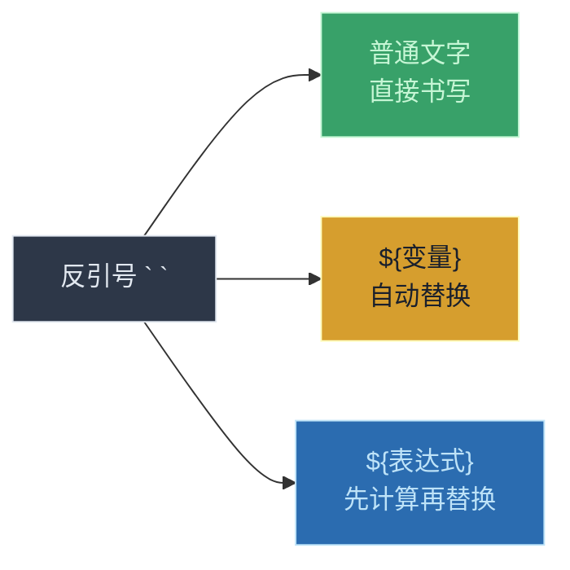
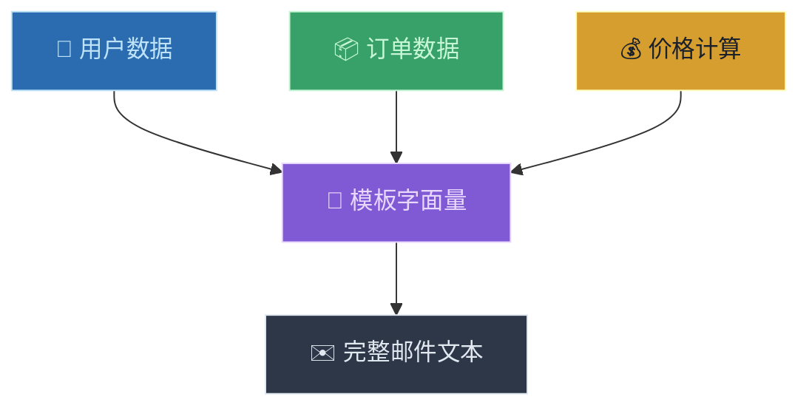

# 字符串与模板字面量（Strings and Template Literals）

> 📺 来源：014 Strings and Template Literals.en.srt
> 📂 章节：第 02 章

## 📌 知识脉络
- **前置知识**：值与变量（Values and Variables）、数据类型（Data Types）、基本运算符
- **后续扩展**：类型转换与类型强制（Type Conversion and Coercion）、字符串方法（String Methods）、DOM 操作中的 HTML 模板

## 🎯 概述
本节课讲解传统的**字符串拼接（Concatenation）**方式，以及 ES6 引入的更强大的**模板字面量（Template Literals）**语法。模板字面量使用反引号包裹，可以轻松嵌入变量和表达式，还能创建多行字符串——这是现代 JavaScript 中最常用的 ES6 特性之一。

## 核心知识点

### 1. 传统字符串拼接 —— 用 `+` 连接

> 🧩 **生活类比**：传统字符串拼接就像手动拼图——你需要在每块拼图之间小心翼翼地插入空格和符号，一不注意就拼错。

```js {runnable} {title="old_concat.js"}
const firstName = "Jonas";
const job = "teacher";
const birthYear = 1991;
const year = 2037;

// 传统拼接：需要大量 + 号和空格管理
const jonas = "I'm " + firstName + ", a " + (year - birthYear) + " year old " + job + "!";
console.log(jonas);
// "I'm Jonas, a 46 year old teacher!"
```

**痛点 ⚠️：**
- 需要手动管理每个空格的位置
- 容易忘记空格或多加空格
- 复杂表达式需要圆括号包裹
- 引号嵌套会导致混乱（如 `I'm` 中的单引号）

---

### 2. 模板字面量（Template Literals）—— ES6 的鼎力之作

> 🧩 **生活类比**：模板字面量就像填空作文——句子结构已经写好了，你只需要在空白处（`${}`）填入内容即可。写起来自然流畅，不需要手动拼接。

```js {runnable} {title="template_literal.js"}
const firstName = "Jonas";
const job = "teacher";
const birthYear = 1991;
const year = 2037;

// 模板字面量：用反引号 `` 包裹，用 ${} 插入变量
const jonasNew = `I'm ${firstName}, a ${year - birthYear} year old ${job}!`;
console.log(jonasNew);
// "I'm Jonas, a 46 year old teacher!"
```



**🔍 执行追踪：**

| `${}` 占位符 | 替换为 | 最终文本 |
|-------------|--------|---------|
| `${firstName}` | `"Jonas"` | `I'm Jonas, a ...` |
| `${year - birthYear}` | `2037 - 1991` → `46` | `... a 46 year old ...` |
| `${job}` | `"teacher"` | `... teacher!` |

**核心语法规则：**
1. 使用**反引号** `` ` `` 包裹整个字符串（不是单引号或双引号）
2. 用 `${}` 插入**变量**或**任何 JavaScript 表达式**
3. 空格、标点自然书写，无需手动拼接

> 💡 **记忆口诀**：**"反引号套美元花括号"** —— `` ` ... ${expression} ... ` ``

---

### 3. 模板字面量 vs 传统拼接

:::code-comparison
```js {title="🚨 传统拼接（繁琐）"}
const msg = "Hello, " + name + "! You are " 
  + (year - birthYear) + " years old.";
// 需要手动管理空格
// 需要 + 号连接
// 需要括号包裹表达式
```
```js {title="✨ 模板字面量（优雅）"}
const msg = `Hello, ${name}! You are ${year - birthYear} years old.`;
// 空格自然书写
// 无需 + 号
// 表达式直接在 ${} 中
```
:::

---

### 4. 反引号的通用性

```js {runnable} {title="backtick_always.js"}
// 反引号也可以用于普通字符串（不插入变量）
console.log(`Just a regular string`);
// 完全合法！很多开发者默认所有字符串都用反引号
```

> 💡 **提示**：许多开发者养成了所有字符串都用反引号的习惯，这样需要插入变量时就不用来回切换引号类型。

---

### 5. 多行字符串

> 🧩 **生活类比**：以前写多行字符串就像在打字机上强制换行——需要手动插入特殊符号 `\n`。现在用模板字面量写多行字符串就像在文本编辑器里直接按回车一样自然。

:::code-comparison
```js {title="🚨 旧式多行（ES6 之前）"}
console.log("String with \n\
multiple \n\
lines");
// 需要 \n 换行符
// 还需要 \ 行尾续行符
```
```js {title="✨ 模板字面量多行（ES6）"}
console.log(`String with
multiple
lines`);
// 直接按回车！
// 干净利落
```
:::

---

## 🛠️ 代码实战与真实场景

> **💼 业务场景**：电商订单确认邮件模板——用模板字面量动态生成个性化的订单通知信息。



```js {runnable} {title="order_email.js"}
const customerName = "Alice";
const orderId = "ORD-20240315";
const product = "JavaScript 权威指南";
const price = 128;
const quantity = 2;

// 使用模板字面量生成邮件内容
const email = `尊敬的 ${customerName} 您好！

您的订单 ${orderId} 已确认：
  📦 商品：${product}
  📊 数量：${quantity}
  💰 单价：¥${price}
  💎 总计：¥${price * quantity}

感谢您的购物！`;

console.log(email);
```

**📊 输入输出示例：**

| 变量 | 值 | 模板中的 `${}` | 输出 |
|------|-----|---------------|------|
| `customerName` | `"Alice"` | `${customerName}` | `Alice` |
| `orderId` | `"ORD-20240315"` | `${orderId}` | `ORD-20240315` |
| `price * quantity` | `128 * 2` | `${price * quantity}` | `256` |

## 💡 关键要点
- ✅ 模板字面量使用**反引号** `` ` `` 包裹，是 ES6 引入的核心特性
- ✅ `${}` 内可以放入**任何 JavaScript 表达式**（变量、运算、函数调用等）
- ✅ 模板字面量可以直接创建**多行字符串**，无需 `\n`
- ✅ 反引号也可以用于普通字符串，很多开发者将其作为默认引号
- ✅ 模板字面量在后续的 DOM 操作和 HTML 模板生成中将大量使用

## ⚠️ 常见误区
- ⚠️ **误区 1**：用单引号或双引号写模板字面量语法 `${}`。只有**反引号**才支持 `${}` 插值，普通引号会将其当作普通文本输出。
- ⚠️ **误区 2**：忘记 `$` 符号只写 `{variable}`。必须是完整的 `${variable}` 语法。
- ⚠️ **误区 3**：在包含单引号的字符串中纠结引号选择（如 `I'm`）。使用反引号可以完全规避这个问题：`` `I'm happy` ``。

## 🐛 报错实验室

**❌ 错误写法：用普通引号但使用 ${} 语法**
```js
const name = "Alice";
console.log("Hello ${name}!"); // ← 用了双引号
```
**浏览器输出：**
```
Hello ${name}!
```
**🔑 解读**：`${}` 语法只在**反引号**中有效。双引号或单引号会把 `${name}` 当作普通文本原样输出。修复：换成反引号 `` `Hello ${name}!` ``。

---

## 📖 词汇速查表 (Cheat Sheet)

| 中文术语 | 英文术语 | 简明释义 | 速查代码 | 📚 官方文档 |
|---------|---------|---------|---------|-----------|
| 模板字面量 | Template Literal | 使用反引号的字符串增强语法 | `` `Hello ${name}` `` | [MDN](https://developer.mozilla.org/zh-CN/docs/Web/JavaScript/Reference/Template_literals) |
| 字符串拼接 | Concatenation | 用 `+` 连接多个字符串 | `"a" + "b"` | [MDN](https://developer.mozilla.org/zh-CN/docs/Web/JavaScript/Reference/Operators/Addition) |
| 反引号 | Backtick | 键盘 Tab 键上方的 `` ` `` 符号 | `` ` `` | — |
| 占位符 | Placeholder | `${}` 中的可替换表达式 | `${variable}` | — |
| 多行字符串 | Multiline String | 跨越多行的字符串 | 模板字面量直接换行 | — |

---

## 🧪 学习验证

### 📝 动手练习

**练习 1：个人名片生成器**
```js {runnable} {title="exercise1.js"}
// 用模板字面量生成一张"个人名片"
// 包含：姓名、年龄（通过出生年份计算）、职业、城市
// 格式示例：
// "大家好！我是 Alice，今年 28 岁。
//  我是一名工程师，住在上海。"

// 在这里写你的代码
```
<details><summary>💡 参考答案</summary>

```js
const name = "Alice";
const birthYear = 1996;
const currentYear = 2024;
const job = "工程师";
const city = "上海";

const card = `大家好！我是 ${name}，今年 ${currentYear - birthYear} 岁。
我是一名${job}，住在${city}。`;

console.log(card);
```
**解题思路**：利用模板字面量的两大特性——`${}` 插值和多行能力，一行代码生成完整名片。
</details>

**练习 2：将传统拼接改写为模板字面量**
```js {runnable} {title="exercise2.js"}
// 将以下传统拼接代码改写为模板字面量
const product = "笔记本电脑";
const brand = "Apple";
const price = 9999;
const stock = 42;

// 原始代码（请改写为模板字面量）：
const info = brand + " " + product + " | 价格: ¥" + price + " | 库存: " + stock + " 台";
console.log(info);
```
<details><summary>💡 参考答案</summary>

```js
const product = "笔记本电脑";
const brand = "Apple";
const price = 9999;
const stock = 42;

const info = `${brand} ${product} | 价格: ¥${price} | 库存: ${stock} 台`;
console.log(info);
```
**解题思路**：用反引号替换所有引号，把变量放入 `${}`，空格和标点直接写在文本中。
</details>

### ❓ 理解检测

:::quiz {correct="C"}
**1. 模板字面量使用什么符号包裹？**
- A) 单引号 `'...'`
- B) 双引号 `"..."`
- C) 反引号 `` `...` ``

> **解析**：模板字面量专用反引号（位于键盘 Tab 键上方），只有反引号才支持 `${}` 占位符语法。
:::

:::quiz {correct="B"}
**2. `${2 + 3}` 在模板字面量中会输出什么？**
- A) `${2 + 3}`（原样）
- B) `5`
- C) `2 + 3`

> **解析**：`${}` 内可以放入任何表达式，JavaScript 会先计算表达式的值，再将结果插入字符串。
:::

:::quiz {correct="A"}
**3. 以下哪种方式可以创建多行字符串？**
- A) 使用反引号并直接按回车换行
- B) 使用双引号并直接按回车换行
- C) 在任何引号内使用 `\t` 符号

> **解析**：模板字面量（反引号）支持直接换行创建多行字符串。双引号中直接换行会导致语法错误。`\t` 是制表符不是换行。
:::

### 🔧 代码填空

:::fill-blank
// 模板字面量使用反引号
const greeting = ___`___Hello, ${name}!___`___;

// 在模板字面量中插入表达式
const msg = `You are ___${___year - birthYear___}___ years old`;

// 创建多行字符串（直接在反引号内换行）
const multiline = `First line
___Second line___
Third line`;
:::
