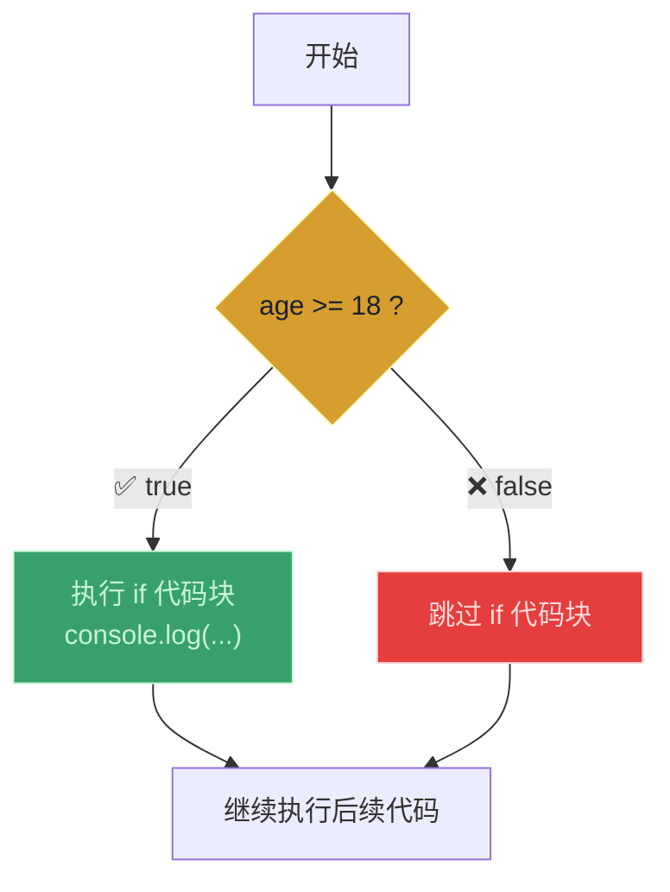
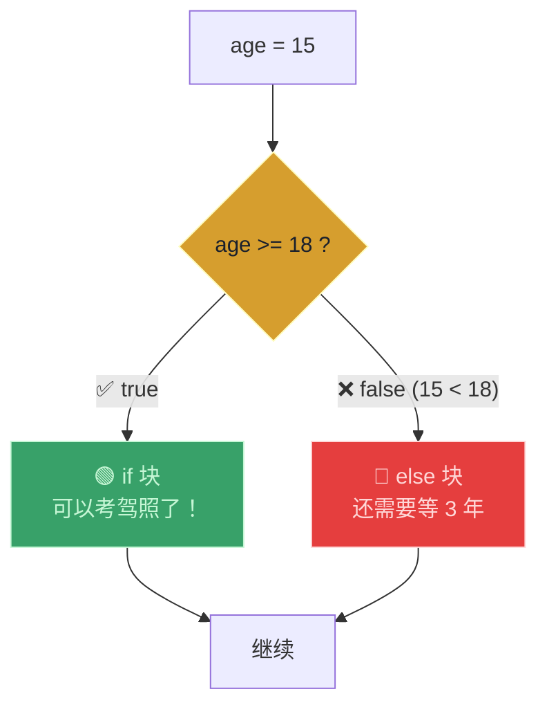
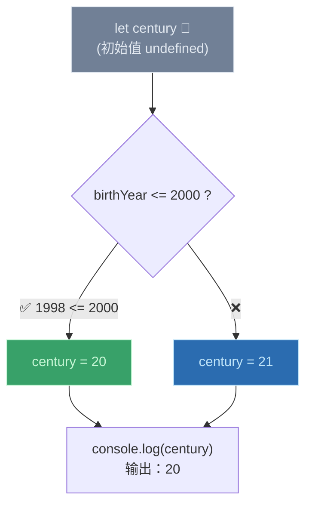
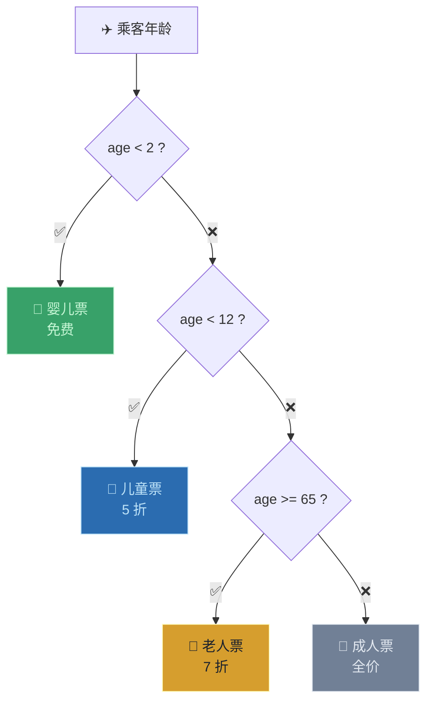

# 做决策：if/else 语句（Taking Decisions: if/else Statements）

> 📺 来源：015 Taking Decisions if else Statements.en.srt
> 📂 章节：第 02 章

## 📌 知识脉络
- **前置知识**：布尔值（Boolean）、比较运算符（Comparison Operators）、模板字面量
- **后续扩展**：逻辑运算符（Logical Operators）、switch 语句、三元运算符（Ternary Operator）

## 🎯 概述
`if/else` 语句是 JavaScript 中最重要的**控制结构（Control Structure）**之一。它让代码不再只是从上到下线性执行，而是可以根据条件决定执行哪个代码块。本节课讲解 `if/else` 的语法、"条件"的本质（布尔值）、`else` 块的可选性，以及在代码块内声明变量的作用域问题。

## 核心知识点

### 1. `if` 语句基础

> 🧩 **生活类比**：`if/else` 就像一个十字路口的交通灯——绿灯（条件为 `true`）走这条路，红灯（条件为 `false`）走另一条路。

```js {runnable} {title="if_basic.js"}
const age = 19;

if (age >= 18) {
  console.log("Sarah can start her driving license 🚗");
}
// 输出：Sarah can start her driving license 🚗
// 因为 19 >= 18 为 true，所以执行 if 块内的代码
```



**关键语法：**
- 条件放在圆括号 `()` 内，必须是一个**布尔值**（或可转为布尔值的表达式）
- 代码块放在花括号 `{}` 内
- 如果条件为 `true` → 执行花括号内的代码
- 如果条件为 `false` → 跳过花括号内的代码

---

### 2. `if/else` 完整结构

> 🧩 **生活类比**：就像考试的及格线——分数 ≥ 60 分显示"及格"，否则显示"不及格，还需要努力 N 分"。

```js {runnable} {title="if_else.js"}
const age = 15;

if (age >= 18) {
  console.log("Sarah can start her driving license 🚗");
} else {
  const yearsLeft = 18 - age;
  console.log(`Sarah is too young. Wait another ${yearsLeft} years 😢`);
}
// 输出：Sarah is too young. Wait another 3 years 😢
```



**🔍 执行追踪：**

| 步骤 | 代码 | 判断/结果 |
|------|------|----------|
| ① | `age = 15` | 变量赋值 |
| ② | `age >= 18` | `15 >= 18` → `false` |
| ③ | 跳过 `if` 块 | 条件为 `false`，不执行 |
| ④ | 进入 `else` 块 | `yearsLeft = 18 - 15 = 3` |
| ⑤ | `console.log(...)` | 输出 "Wait another 3 years" |

> 💡 **记忆口诀**：**"if 问真假，true 走上路，false 走下路"**

---

### 3. 条件赋值 —— 在 if/else 中给变量赋不同的值

> 🧩 **生活类比**：就像根据出生年份判断"你是 90 后还是 00 后"——根据条件给同一个标签贴上不同的内容。

```js {runnable} {title="conditional_assignment.js"}
const birthYear = 1998;

// ⚠️ 变量必须在 if/else 外部声明
let century;

if (birthYear <= 2000) {
  century = 20;  // 20 世纪
} else {
  century = 21;  // 21 世纪
}

console.log(century); // 20
```



**⚠️ 重要**：变量 `century` 必须在 `if/else` **外部**用 `let` 声明。在代码块 `{}` 内部用 `let` 或 `const` 声明的变量只在**该块内可见**（块作用域）。

**🔍 执行追踪：**

| `birthYear` | `birthYear <= 2000` | `century` 赋值 |
|-------------|-------------------|---------------|
| `1998` | `true` | `20` |
| `2012` | `false` | `21` |

---

## 🛠️ 代码实战与真实场景

> **💼 业务场景**：航班票价系统——根据乘客年龄决定票价类别和折扣。



```js {runnable} {title="ticket_pricing.js"}
const passengerAge = 8;
const basePrice = 1000;
let ticketPrice;
let category;

if (passengerAge < 2) {
  ticketPrice = 0;
  category = "婴儿票（免费）";
} else if (passengerAge < 12) {
  ticketPrice = basePrice * 0.5;
  category = "儿童票（5 折）";
} else if (passengerAge >= 65) {
  ticketPrice = basePrice * 0.7;
  category = "老人票（7 折）";
} else {
  ticketPrice = basePrice;
  category = "成人票（全价）";
}

console.log(`乘客年龄: ${passengerAge} 岁`);
console.log(`票种: ${category}`);
console.log(`票价: ¥${ticketPrice}`);
```

**📊 输入输出示例：**

| 年龄 | 类别 | 折扣 | 票价 |
|------|------|------|------|
| 1 | 婴儿票 | 免费 | ¥0 |
| 8 | 儿童票 | 5 折 | ¥500 |
| 35 | 成人票 | 全价 | ¥1000 |
| 70 | 老人票 | 7 折 | ¥700 |

## 💡 关键要点
- ✅ `if/else` 是**控制结构**——让代码可以根据条件走不同的路径
- ✅ 条件必须是**布尔值**（或能转换为布尔值的表达式）
- ✅ `else` 块是**可选的**——没有 `else` 时，条件为 `false` 则什么都不执行
- ✅ 需要在 `if/else` 之后使用的变量必须在**块外声明**
- ✅ 可以用 `else if` 链接多个条件判断

## ⚠️ 常见误区
- ⚠️ **误区 1**：在条件中用 `=`（赋值）代替 `==` 或 `>=`（比较）。`if (x = 5)` 是赋值不是比较！
- ⚠️ **误区 2**：在 `if` 块内用 `const`/`let` 声明变量，然后在块外使用。块内声明的变量在块外不可见。
- ⚠️ **误区 3**：忘记给条件加圆括号。`if age >= 18` 是语法错误，必须写 `if (age >= 18)`。

## 🐛 报错实验室

**❌ 错误写法：块内声明变量在块外使用**
```js
if (true) {
  let message = "Hello";
}
console.log(message); // 在 if 块外访问
```
**浏览器报错：**
```
Uncaught ReferenceError: message is not defined
```
**🔑 解读**：`let` 和 `const` 声明的变量具有**块作用域**——只在声明所在的 `{}` 内有效。修复方法：在 `if` 之前就用 `let` 声明变量。

---

## 📖 词汇速查表 (Cheat Sheet)

| 中文术语 | 英文术语 | 简明释义 | 速查代码 | 📚 官方文档 |
|---------|---------|---------|---------|-----------|
| 控制结构 | Control Structure | 控制代码执行路径的语法结构 | `if/else`, `for`, `while` | [MDN](https://developer.mozilla.org/zh-CN/docs/Web/JavaScript/Guide/Control_flow_and_error_handling) |
| 条件 | Condition | if 括号内的布尔表达式 | `age >= 18` | — |
| 代码块 | Code Block | 花括号 `{}` 包裹的代码区域 | `{ ... }` | — |
| 块作用域 | Block Scope | let/const 变量仅在块内可访问 | — | [MDN](https://developer.mozilla.org/zh-CN/docs/Web/JavaScript/Reference/Statements/block) |

---

## 🧪 学习验证

### 📝 动手练习

**练习 1：温度提示器**
```js {runnable} {title="exercise1.js"}
// 根据温度给出穿衣建议：
// - 温度 >= 30：输出"穿短袖，注意防晒☀️"
// - 温度 >= 20：输出"穿长袖，舒适宜人🌤️"
// - 温度 >= 10：输出"穿外套，有点凉🧥"
// - 温度 < 10：输出"穿棉衣，注意保暖❄️"

const temperature = 25;
// 在这里写你的代码
```
<details><summary>💡 参考答案</summary>

```js
const temperature = 25;

if (temperature >= 30) {
  console.log("穿短袖，注意防晒☀️");
} else if (temperature >= 20) {
  console.log("穿长袖，舒适宜人🌤️");
} else if (temperature >= 10) {
  console.log("穿外套，有点凉🧥");
} else {
  console.log("穿棉衣，注意保暖❄️");
}
```
**解题思路**：使用 `else if` 链从高到低逐级判断温度区间。
</details>

**练习 2：世纪判断器增强版**
```js {runnable} {title="exercise2.js"}
// 判断一个人出生在哪个世纪（支持 19、20、21 世纪）
// birthYear <= 1900 → 19 世纪
// birthYear <= 2000 → 20 世纪
// birthYear > 2000 → 21 世纪

const birthYear = 1888;
// 在这里写你的代码
```
<details><summary>💡 参考答案</summary>

```js
const birthYear = 1888;
let century;

if (birthYear <= 1900) {
  century = 19;
} else if (birthYear <= 2000) {
  century = 20;
} else {
  century = 21;
}

console.log(`出生年份 ${birthYear}：第 ${century} 世纪`);
```
**解题思路**：注意 `century` 必须在 `if/else` 外部用 `let` 声明，才能在后续使用。
</details>

### ❓ 理解检测

:::quiz {correct="B"}
**1. 如果 if 条件为 false 且没有 else 块，会发生什么？**
- A) 报错
- B) 什么都不执行，继续后续代码
- C) 程序停止运行

> **解析**：`else` 块是可选的。如果条件为 `false` 且没有 `else`，JavaScript 直接跳过 `if` 块，继续执行后续代码。
:::

:::quiz {correct="C"}
**2. 以下代码的输出是什么？**
```js
const x = 5;
if (x > 10) {
  console.log("A");
} else if (x > 3) {
  console.log("B");
} else {
  console.log("C");
}
```
- A) A
- B) C
- C) B

> **解析**：`5 > 10` 为 `false`，跳到 `else if`；`5 > 3` 为 `true`，输出 "B"。一旦匹配到条件，就不再检查后续 `else if`/`else`。
:::

:::quiz {correct="A"}
**3. 为什么需要在 if/else 外部声明变量？**
- A) 因为 let/const 有块作用域，在块 {} 内声明的变量在块外不可访问
- B) 因为 if/else 内部不允许使用 let
- C) 因为 JavaScript 不允许在函数外声明变量

> **解析**：`let` 和 `const` 具有块作用域——在 `{}` 内声明的变量只在该块中有效。如果需要在 `if/else` 之后访问变量，必须提前在外部声明。
:::

### 🔧 代码填空

:::fill-blank
// if/else 的基本语法
___if___ (score >= 60) {
  console.log("及格");
} ___else___ {
  console.log("不及格");
}

// 变量必须在块外声明
___let___ result;
if (condition) {
  result = "A";
}
:::
