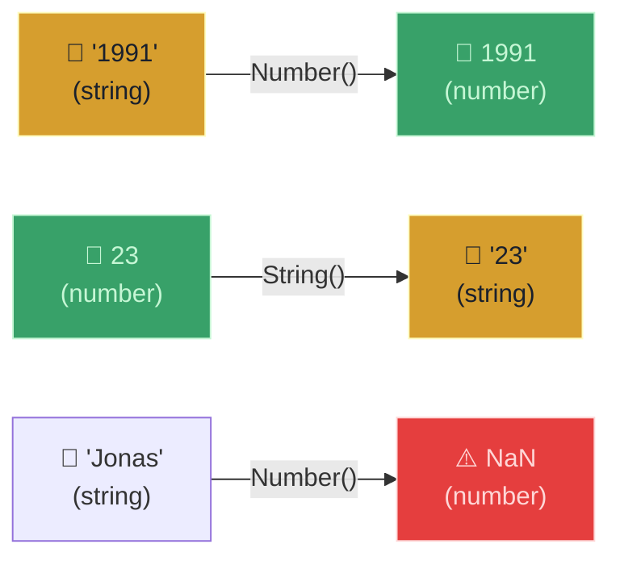
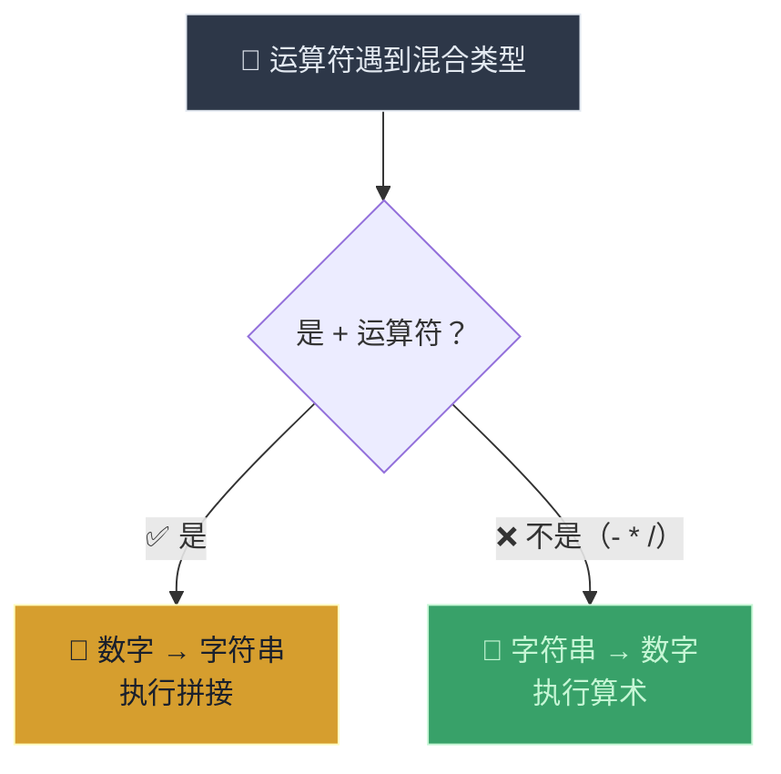
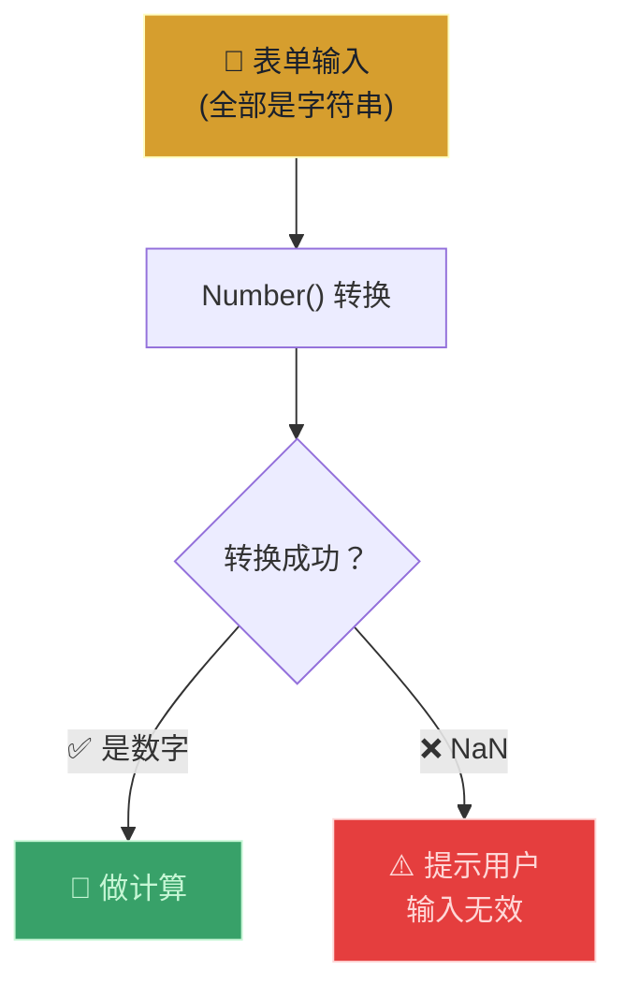

# 类型转换与类型强制（Type Conversion and Coercion）

> 📺 来源：018 Type Conversion and Coercion.en.srt
> 📂 章节：第 02 章

## 📌 知识脉络
- **前置知识**：数据类型（Data Types）、基本运算符、`typeof` 运算符
- **后续扩展**：真值与假值（Truthy and Falsy Values）、相等运算符（`==` vs `===`）

## 🎯 概述
JavaScript 有两种改变数据类型的机制：**类型转换（Type Conversion）** 是开发者手动执行的显式转换，而**类型强制（Type Coercion）** 是 JavaScript 在不同类型的值之间运算时自动执行的隐式转换。本节课揭示 `+` 运算符触发字符串拼接、而 `-` `*` `/` 触发数字转换的关键区别。

## 核心知识点

### 1. 类型转换（Type Conversion）—— 手动显式转换

> 🧩 **生活类比**：类型转换就像翻译官——你明确地告诉它"请把这个英文翻译成中文"，它就帮你转换。`Number()` 把字符串翻译成数字，`String()` 把数字翻译成字符串。

```js {runnable} {title="type_conversion.js"}
// 字符串 → 数字：使用 Number() 函数
const inputYear = "1991";
console.log(Number(inputYear)); // 1991（数字）
console.log(Number(inputYear) + 18); // 2009

// 无法转换的情况 → NaN
console.log(Number("Jonas")); // NaN（Not a Number）
console.log(typeof NaN);      // "number"（虽然名字叫"不是数字"，类型却是 number！）

// 数字 → 字符串：使用 String() 函数
console.log(String(23));       // "23"（字符串）
console.log(typeof String(23)); // "string"
```

**🔍 执行追踪：**

| 步骤 | 表达式 | 结果 | 类型 |
|------|--------|------|------|
| ① | `Number("1991")` | `1991` | `number` |
| ② | `Number("Jonas")` | `NaN` | `number` |
| ③ | `String(23)` | `"23"` | `string` |



> 💡 **记忆口诀**：**"NaN 是数字界的'无效值'标签"** —— `typeof NaN` 返回 `"number"`，它表示"转换失败的数字"。

**JavaScript 只能转换为三种类型：**
- `Number()` → 转为数字
- `String()` → 转为字符串
- `Boolean()` → 转为布尔（下一课详解）

---

### 2. 类型强制（Type Coercion）—— 自动隐式转换

> 🧩 **生活类比**：类型强制就像一个"善解人意的服务员"——你点了一杯"23号饮品"又点了一个"苹果"，服务员自己猜测你要的组合，自动帮你混搭。有时猜对了，有时猜错了。

```js {runnable} {title="type_coercion.js"}
// + 运算符：遇到字符串 → 数字转字符串（拼接）
console.log("I am " + 23 + " years old"); 
// "I am 23 years old"

// - * / 运算符：字符串转数字（运算）
console.log("23" - "10" - 3); // 10（全部转为数字）
console.log("23" * "2");      // 46（转为数字后做乘法）
console.log("23" / "2");      // 11.5（转为数字后做除法）

// ⚠️ + 运算符是唯一触发字符串拼接的！
console.log("23" + "10" + 3); // "23103"（全部变字符串拼接）
```



**📊 运算符类型强制规则：**

| 运算符 | 强制方向 | 示例 | 结果 |
|--------|---------|------|------|
| `+`（有字符串时）| 数字 → 字符串 | `"5" + 3` | `"53"` |
| `-` | 字符串 → 数字 | `"5" - 3` | `2` |
| `*` | 字符串 → 数字 | `"5" * 3` | `15` |
| `/` | 字符串 → 数字 | `"6" / 3` | `2` |

> 💡 **记忆口诀**：**"加号爱拼接，减乘除爱数学"** —— `+` 遇到字符串做拼接，其他运算符做数学运算。

---

### 3. 🎮 猜输出游戏

```js {runnable} {title="guess_output.js"}
// 🎮 先在脑中推算，再运行验证！

let n = "1" + 1; // ?
n = n - 1;       // ?
console.log(n);  // ?

console.log(2 + 3 + 4 + "5"); // ?
console.log("10" - "4" - "3" - 2 + "5"); // ?
```

**🔍 执行追踪——谜题 1：**

| 步骤 | 代码 | 过程 | `n` 的值 | 类型 |
|------|------|------|---------|------|
| ① | `"1" + 1` | `+` 触发字符串拼接 | `"11"` | `string` |
| ② | `n - 1` | `-` 触发数字转换：`11 - 1` | `10` | `number` |

**🔍 执行追踪——谜题 2：**

| 步骤 | 表达式 | 过程 | 中间结果 |
|------|--------|------|---------|
| ① | `2 + 3` | 数字加法 | `5` |
| ② | `5 + 4` | 数字加法 | `9` |
| ③ | `9 + "5"` | `+` 遇字符串 → 拼接 | `"95"` |

**🔍 执行追踪——谜题 3：**

| 步骤 | 表达式 | 过程 | 中间结果 |
|------|--------|------|---------|
| ① | `"10" - "4"` | `-` 转数字 | `6` |
| ② | `6 - "3"` | `-` 转数字 | `3` |
| ③ | `3 - 2` | 数字减法 | `1` |
| ④ | `1 + "5"` | `+` 遇字符串 → 拼接 | `"15"` |

---

## 🛠️ 代码实战与真实场景

> **💼 业务场景**：表单数据处理——用户输入的所有值都是字符串，需要转换为数字后进行计算。



```js {runnable} {title="form_processing.js"}
// 模拟表单输入（用户输入的值都是字符串）
const inputPrice = "199";
const inputQty = "3";

// 方式 1：显式转换（推荐）
const total1 = Number(inputPrice) * Number(inputQty);
console.log("显式转换:", total1); // 597

// 方式 2：利用类型强制（- * / 自动转换）
const total2 = inputPrice * inputQty;
console.log("隐式转换:", total2); // 597

// ⚠️ 用 + 号的陷阱！
const wrongTotal = inputPrice + inputQty;
console.log("错误结果:", wrongTotal); // "1993"（字符串拼接！）
```

**📊 输入输出示例：**

| 输入价格 | 输入数量 | `*` 运算 | `+` 运算 | 正确结果 |
|---------|---------|---------|---------|---------|
| `"199"` | `"3"` | `597`（数字）| `"1993"`（字符串❌）| `597` |
| `"50"` | `"10"` | `500`（数字）| `"5010"`（字符串❌）| `500` |

## 💡 关键要点
- ✅ **类型转换**是手动的：`Number()`、`String()`、`Boolean()`
- ✅ **类型强制**是自动的：运算符遇到不同类型时触发
- ✅ `+` 运算符遇到字符串时做**拼接**（数字转字符串）
- ✅ `-` `*` `/` 运算符把字符串转成**数字**做运算
- ✅ `NaN` 的类型是 `"number"`——它表示"无效的数字转换结果"

## ⚠️ 常见误区
- ⚠️ **误区 1**：以为 `"5" + 3` 等于 `8`。实际等于 `"53"`（字符串拼接）。
- ⚠️ **误区 2**：以为 `NaN` 不是数字类型。`typeof NaN` 返回 `"number"`。
- ⚠️ **误区 3**：表单输入直接用 `+` 求和。用户输入都是字符串，`+` 会拼接而非加法。

## 🐛 报错实验室

**❌ 错误写法：表单输入直接相加**
```js
const price = "100";
const tax = "20";
const total = price + tax;
console.log(total);
```
**浏览器输出：**
```
10020
```
**🔑 解读**：`+` 遇到字符串做拼接，`"100" + "20"` 变成 `"10020"` 而非 `120`。修复：先用 `Number()` 转换，或用 `-` 运算符（`price - (-tax)`）。

---

## 📖 词汇速查表 (Cheat Sheet)

| 中文术语 | 英文术语 | 简明释义 | 速查代码 | 📚 官方文档 |
|---------|---------|---------|---------|-----------|
| 类型转换 | Type Conversion | 手动显式转换数据类型 | `Number("23")` | [MDN](https://developer.mozilla.org/zh-CN/docs/Glossary/Type_Conversion) |
| 类型强制 | Type Coercion | 运算符自动隐式转换 | `"5" - 3 // 2` | [MDN](https://developer.mozilla.org/zh-CN/docs/Glossary/Type_coercion) |
| NaN | Not a Number | 无效的数字转换结果 | `Number("abc") // NaN` | [MDN](https://developer.mozilla.org/zh-CN/docs/Web/JavaScript/Reference/Global_Objects/NaN) |

---

## 🧪 学习验证

### 📝 动手练习

**练习 1：猜输出**
```js {runnable} {title="exercise1.js"}
// 先用脑推算，再运行验证！
console.log("10" - "5" + "3");   // ?
console.log("10" + "5" - "3");   // ?
console.log("5" * "4" + "2");    // ?
```
<details><summary>💡 参考答案</summary>

```js
console.log("10" - "5" + "3");   // "53" — 先减得5(数字)，再+字串拼接
console.log("10" + "5" - "3");   // 102  — 先+拼接得"105"，再-转数字减3
console.log("5" * "4" + "2");    // "202" — 先*乘得20(数字)，再+字串拼接
```
**解题思路**：从左到右逐个运算符分析，`+` 遇字符串拼接，`-``*``/` 转数字。
</details>

**练习 2：安全的表单计算**
```js {runnable} {title="exercise2.js"}
// 用户在表单中输入了价格和折扣：
const userPrice = "299";
const userDiscount = "15"; // 百分比

// 请安全地计算折后价（先转换再计算）
// 在这里写你的代码
```
<details><summary>💡 参考答案</summary>

```js
const userPrice = "299";
const userDiscount = "15";

const price = Number(userPrice);
const discount = Number(userDiscount);
const finalPrice = price * (1 - discount / 100);

console.log(`原价: ¥${price}, 折扣: ${discount}%, 折后价: ¥${finalPrice}`);
// 原价: ¥299, 折扣: 15%, 折后价: ¥254.15
```
**解题思路**：表单输入都是字符串，必须先用 `Number()` 转换后再做计算。
</details>

### ❓ 理解检测

:::quiz {correct="A"}
**1. `"6" / "2"` 的结果是？**
- A) `3`（数字）
- B) `"3"`（字符串）
- C) `NaN`

> **解析**：除法 `/` 运算符触发类型强制，将两个字符串都转换为数字后做除法，结果为数字 `3`。
:::

:::quiz {correct="C"}
**2. `typeof NaN` 返回什么？**
- A) `"NaN"`
- B) `"undefined"`
- C) `"number"`

> **解析**：`NaN` 虽然意为"Not a Number"，但它的数据类型仍然是 `number`。它代表的是"无效的数字运算结果"。
:::

:::quiz {correct="B"}
**3. 以下哪个选项中两个表达式的结果相同？**
- A) `"5" + 3` 和 `"5" - 3`
- B) `"5" * 2` 和 `"5" - (-2) * 0 + 5 * 2`
- C) `"5" + "3"` 和 `Number("5") + Number("3")`

> **解析**：C 选项中 `"5" + "3"` 得到 `"53"`（拼接），而 `Number("5") + Number("3")` 得到 `8`（加法），结果不同。
:::

### 🔧 代码填空

:::fill-blank
// 手动转换字符串为数字
const age = ___Number___("25"); // 25

// + 号遇到字符串做___拼接___
console.log("3" + 5); // "35"

// - 号遇到字符串做___数学运算___
console.log("10" - 5); // 5
:::
