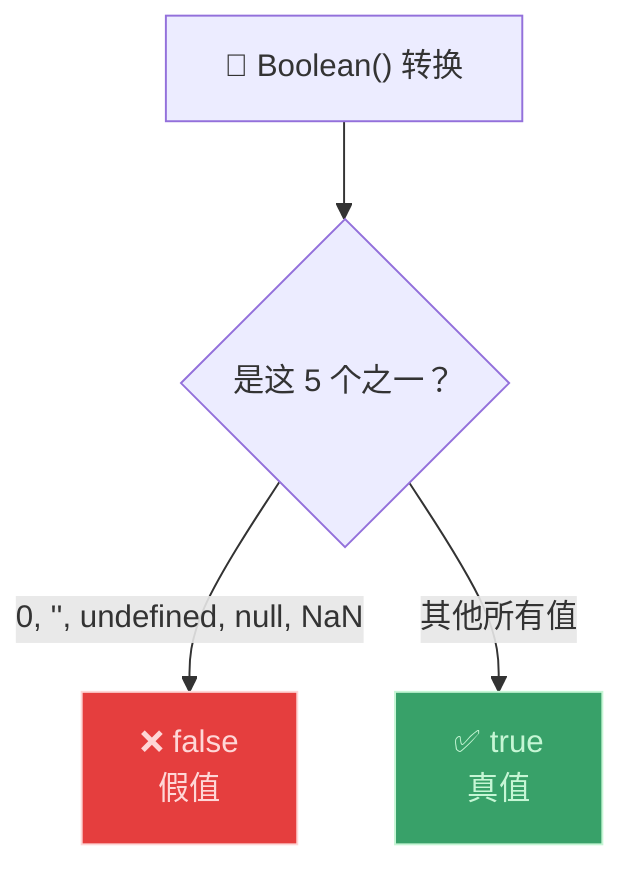
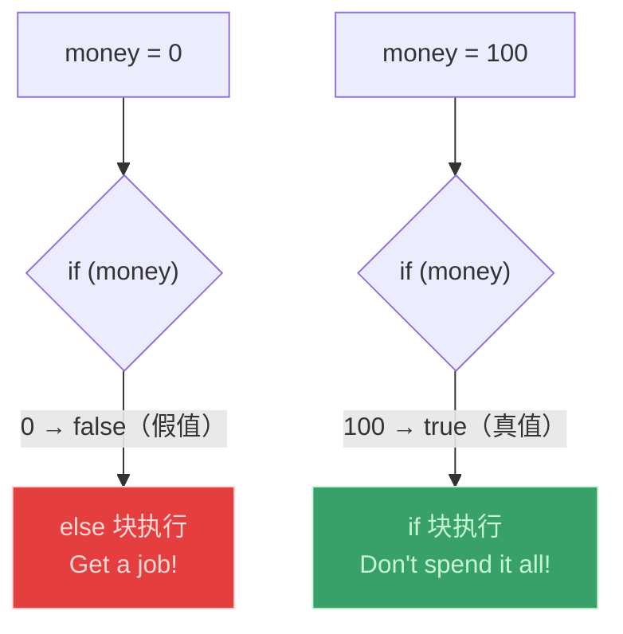
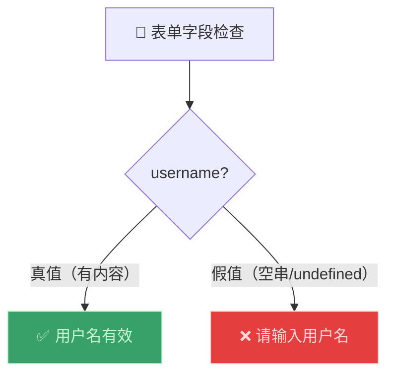

# 真值与假值（Truthy and Falsy Values）

> 📺 来源：019 Truthy and Falsy Values.en.srt
> 📂 章节：第 02 章

## 📌 知识脉络
- **前置知识**：数据类型（Data Types）、类型转换与类型强制（Type Conversion and Coercion）、if/else 语句
- **后续扩展**：相等运算符（`==` vs `===`）、逻辑运算符（Logical Operators）、短路求值

## 🎯 概述
JavaScript 中有 **5 个假值（Falsy Values）**：`0`、`""`（空字符串）、`undefined`、`null` 和 `NaN`。除此之外的所有值都是**真值（Truthy Values）**。这个概念在 `if/else` 条件判断中极其重要——JavaScript 会自动将条件中的值转换为 Boolean。

## 核心知识点

### 1. 5 个假值（Falsy Values）

> 🧩 **生活类比**：假值就像"无效票"——你去验票口刷卡，如果票是空白的（`""`）、金额为零（`0`）、票不存在（`undefined`/`null`）或票号读取失败（`NaN`），都会被拒绝。其他所有票（有内容、有金额）都会通过。

```js {runnable} {title="falsy_values.js"}
// 5 个假值——转为 Boolean 后都是 false
console.log(Boolean(0));          // false
console.log(Boolean(""));         // false
console.log(Boolean(undefined));  // false
console.log(Boolean(null));       // false
console.log(Boolean(NaN));        // false

// 真值——除了上面 5 个之外都是 true
console.log(Boolean("Jonas"));    // true（非空字符串）
console.log(Boolean(42));         // true（非零数字）
console.log(Boolean({}));         // true（空对象也是真值！）
```



**📊 假值清单（必须背下来！）：**

| 假值 | 类型 | 说明 |
|------|------|------|
| `0` | Number | 零 |
| `""` | String | 空字符串 |
| `undefined` | Undefined | 未赋值 |
| `null` | Null | 刻意空值 |
| `NaN` | Number | 无效数字 |

> 💡 **记忆口诀**：**"零空未空非"** —— 零(0)、空串("")、未定义(undefined)、空值(null)、非数字(NaN)。

---

### 2. 隐式 Boolean 转换 —— if/else 中的自动判断

> 🧩 **生活类比**：`if` 就像一个门卫——不管你拿来的是数字、字符串还是其他东西，门卫都会自动判断"这算有还是算没有"，然后决定放不放你进去。

```js {runnable} {title="implicit_boolean.js"}
// 示例 1：检查是否有钱
const money = 0;
if (money) {
  console.log("Don't spend it all! 💰");
} else {
  console.log("You should get a job! 💼");
}
// 输出："You should get a job!" — 因为 0 是假值

// 示例 2：改为 100
const money2 = 100;
if (money2) {
  console.log("Don't spend it all! 💰"); // ← 执行这个
} else {
  console.log("You should get a job! 💼");
}
```



---

### 3. 用假值检查变量是否已定义

```js {runnable} {title="check_defined.js"}
// 常见技巧：用 if 检测变量是否有值
let height;           // undefined（假值）

if (height) {
  console.log("YAY! Height is defined! 📏");
} else {
  console.log("Height is UNDEFINED ❌");
}
// 输出："Height is UNDEFINED" — undefined 是假值

// 赋值后再试
height = 180;
if (height) {
  console.log("YAY! Height is defined! 📏"); // ← 执行这个
}
```

**⚠️ 陷阱警示：** 当值为 `0` 时会产生 Bug！

```js {runnable} {title="zero_trap.js"}
let height = 0;  // 0 是一个合法的身高吗？可能是！

if (height) {
  console.log("Height 已定义");
} else {
  console.log("Height 未定义");  // ← 0 也走了这个分支！Bug！
}
// 输出："Height 未定义" — 但 0 是合法值！这是 Bug！
// 修复方法需要逻辑运算符（后续课程）
```

---

## 🛠️ 代码实战与真实场景

> **💼 业务场景**：用户登录系统——检查用户是否填写了各个表单字段。



```js {runnable} {title="form_validation.js"}
// 模拟表单字段
const username = "Alice";
const email = "";       // 空字符串 → 假值
const age = 0;          // 0 → 假值（但这可能是 bug！）

if (username) {
  console.log(`✅ 用户名: ${username}`);
} else {
  console.log("❌ 请输入用户名");
}

if (email) {
  console.log(`✅ 邮箱: ${email}`);
} else {
  console.log("❌ 请输入邮箱");  // ← 空字符串走了这里
}
```

**📊 输入输出示例：**

| 字段值 | 真值/假值 | if 判断 | 结果 |
|--------|----------|---------|------|
| `"Alice"` | 真值 | `true` | ✅ 有效 |
| `""` | **假值** | `false` | ❌ 空 |
| `0` | **假值** | `false` | ❌ 可能是 Bug |
| `undefined` | **假值** | `false` | ❌ 未填写 |

## 💡 关键要点
- ✅ JavaScript 只有 **5 个假值**：`0`、`""`、`undefined`、`null`、`NaN`
- ✅ 其他所有值都是**真值**（包括 `{}` 空对象、`"0"` 非空字符串等）
- ✅ `if` 条件中的非布尔值会被自动转换为布尔值（隐式类型强制）
- ✅ 利用假值检测变量是否有值时，要注意 **`0` 的陷阱**
- ✅ 实际开发中几乎不会手动使用 `Boolean()` 函数

## ⚠️ 常见误区
- ⚠️ **误区 1**：以为空对象 `{}` 或空数组 `[]` 是假值。它们都是**真值**！
- ⚠️ **误区 2**：用 `if (value)` 检测变量是否存在时忘记 `0` 也是假值。`0` 可能是合法数据。

## 🐛 报错实验室

**❌ 易错场景：0 是合法值却被当作"未定义"**
```js
let score = 0; // 比赛刚开始，得分为 0
if (score) {
  console.log("比赛进行中");
} else {
  console.log("还没有得分数据"); // ← 错误！0 分也是得分
}
```
**浏览器输出：**
```
还没有得分数据
```
**🔑 解读**：`0` 是假值，但在这个场景中 `0` 是合法的分数。应该用 `if (score !== undefined)` 替代。

---

## 📖 词汇速查表 (Cheat Sheet)

| 中文术语 | 英文术语 | 简明释义 | 速查代码 | 📚 官方文档 |
|---------|---------|---------|---------|-----------|
| 假值 | Falsy Value | 转为 Boolean 后为 false 的值 | `0, "", undefined, null, NaN` | [MDN](https://developer.mozilla.org/zh-CN/docs/Glossary/Falsy) |
| 真值 | Truthy Value | 转为 Boolean 后为 true 的值 | 除 5 个假值外的所有值 | [MDN](https://developer.mozilla.org/zh-CN/docs/Glossary/Truthy) |

---

## 🧪 学习验证

### 📝 动手练习

**练习 1：判断真假**
```js {runnable} {title="exercise1.js"}
// 判断以下值是真值还是假值，先猜再运行验证
console.log(Boolean("0"));       // ?
console.log(Boolean("false"));   // ?
console.log(Boolean(-1));        // ?
console.log(Boolean([]));        // ?
console.log(Boolean(0));         // ?
```
<details><summary>💡 参考答案</summary>

```js
console.log(Boolean("0"));       // true  — 非空字符串
console.log(Boolean("false"));   // true  — 非空字符串（内容不重要）
console.log(Boolean(-1));        // true  — 非零数字
console.log(Boolean([]));        // true  — 空数组也是真值
console.log(Boolean(0));         // false — 零是假值
```
**解题思路**：只有 5 个假值，其余都是真值。`"0"` 和 `"false"` 虽然"看起来"像假值，但它们是**非空字符串**，所以是真值。
</details>

**练习 2：安全的变量存在检查**
```js {runnable} {title="exercise2.js"}
// 改进以下代码，使得 temperature 为 0 时也被视为"已定义"
let temperature = 0;

// 原始写法（有 Bug）
if (temperature) {
  console.log(`温度: ${temperature}°C`);
} else {
  console.log("温度未设置");
}

// 请写出改进版本
```
<details><summary>💡 参考答案</summary>

```js
let temperature = 0;

// 改进：显式检查 undefined
if (temperature !== undefined) {
  console.log(`温度: ${temperature}°C`); // 输出：温度: 0°C
} else {
  console.log("温度未设置");
}
```
**解题思路**：用严格不等于 `!== undefined` 代替隐式布尔检查，这样 `0` 也能被正确识别为"已定义"。
</details>

### ❓ 理解检测

:::quiz {correct="B"}
**1. 以下哪个是真值（Truthy Value）？**
- A) `0`
- B) `"0"`
- C) `""`

> **解析**：`"0"` 是**非空字符串**，因此是真值。字符串的内容不影响真假判断——只有空字符串 `""` 才是假值。
:::

:::quiz {correct="A"}
**2. JavaScript 中有几个假值？**
- A) 5 个
- B) 3 个
- C) 7 个

> **解析**：5 个假值：`0`、`""`、`undefined`、`null`、`NaN`。
:::

:::quiz {correct="C"}
**3. `if ({})` 会执行 if 块还是 else 块？**
- A) else 块
- B) 报错
- C) if 块

> **解析**：空对象 `{}` 是真值！只有那 5 个特定的假值才会让条件为 `false`。
:::

### 🔧 代码填空

:::fill-blank
// 5 个假值
// ___0___, "", ___undefined___, null, ___NaN___

// if 中的隐式类型转换
let name = "";
if (___name___) {       // "" 是假值
  console.log("有名字");
} else {
  console.log("没有名字");  // ← 执行这个
}
:::
