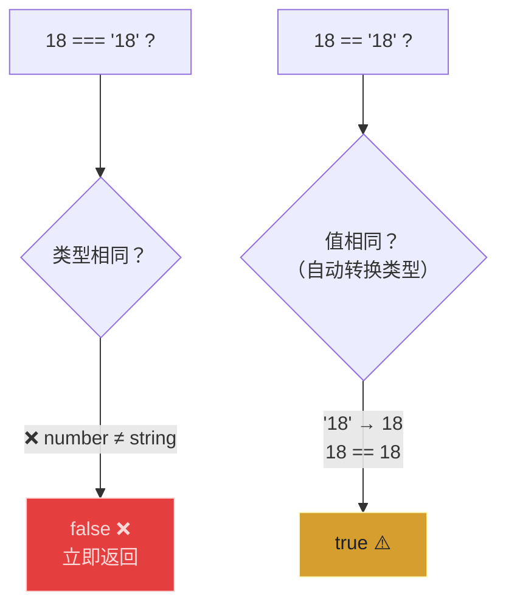
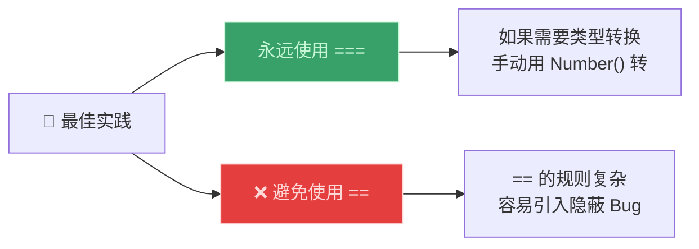
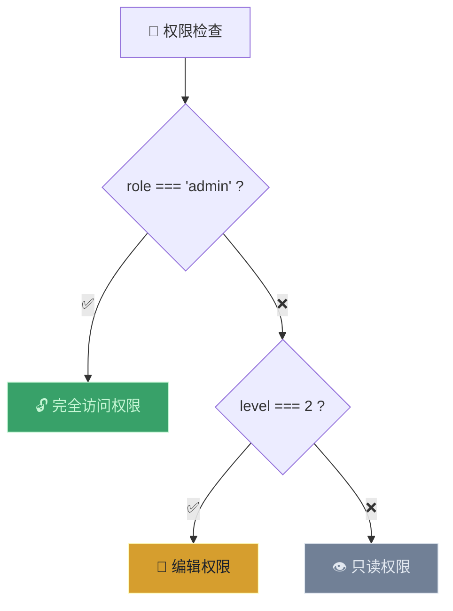

# 相等运算符：== vs ===（Equality Operators）

> 📺 来源：020 Equality Operators == vs. ===.en.srt
> 📂 章节：第 02 章

## 📌 知识脉络
- **前置知识**：类型转换与类型强制（Type Conversion and Coercion）、真值与假值（Truthy / Falsy）、if/else 语句
- **后续扩展**：布尔逻辑（Boolean Logic）、逻辑运算符、switch 语句

## 🎯 概述
JavaScript 有两种相等比较方式：**严格相等 `===`**（不做类型转换）和**宽松相等 `==`**（会做类型强制）。本节课用清晰的对比讲解两者差异，并明确最佳实践——**永远使用 `===`**。同时介绍 `else if` 链式条件、`prompt()` 函数获取用户输入，以及不等运算符 `!==` 和 `!=`。

## 核心知识点

### 1. 严格相等 `===` vs 宽松相等 `==`

> 🧩 **生活类比**：严格相等 `===` 就像"实名制验票"——不仅要号码对，身份证类型也要对。宽松相等 `==` 像"只看票号"——号码对了就行，不管是纸质票还是电子票。

```js {runnable} {title="equality_demo.js"}
// 严格相等 === ：值 AND 类型都必须相同
console.log(18 === 18);    // true  ✅ 值和类型都相同
console.log(18 === "18");  // false ❌ 类型不同（number vs string）

// 宽松相等 == ：只比较值，会做类型强制
console.log(18 == "18");   // true  ⚠️ 字符串 "18" 被转为数字 18
console.log(18 == 18);     // true
```



**📊 对比表：**

| 比较 | `===`（严格） | `==`（宽松） |
|------|:------------:|:-----------:|
| `18 === 18` | ✅ `true` | ✅ `true` |
| `18 === "18"` | ❌ `false` | ⚠️ `true` |
| `null === undefined` | ❌ `false` | ⚠️ `true` |
| `0 === false` | ❌ `false` | ⚠️ `true` |
| `"" === false` | ❌ `false` | ⚠️ `true` |

> 💡 **记忆口诀**：**"三等严格不转型，两等宽松会变身"** —— 永远用 `===`。

---

### 2. 最佳实践：永远用 `===`



---

### 3. `prompt()` 获取用户输入 + 类型转换

```js {runnable} {title="prompt_example.js"}
// prompt() 返回的永远是字符串！
// const favorite = prompt("What's your favorite number?");
// console.log(typeof favorite); // "string"

// 正确做法：手动转换后再用 === 比较
const favorite = Number("23"); // 模拟 prompt 输入
if (favorite === 23) {
  console.log("Cool! 23 is an amazing number! 🎉");
} else if (favorite === 7) {
  console.log("7 is also a cool number 🌟");
} else if (favorite === 9) {
  console.log("9 is also a cool number ✨");
} else {
  console.log("Number is not 23, 7, or 9 😢");
}
```

**🔍 执行追踪：**

| 输入 | `Number()` 转换 | `=== 23` | `=== 7` | `=== 9` | 输出 |
|------|----------------|----------|---------|---------|------|
| `"23"` | `23` | ✅ | — | — | "23 is amazing!" |
| `"7"` | `7` | ❌ | ✅ | — | "7 is cool!" |
| `"42"` | `42` | ❌ | ❌ | ❌ | "Not 23, 7, or 9" |

---

### 4. 不等运算符 `!==` 和 `!=`

```js {runnable} {title="not_equal.js"}
const favorite = 9;

// 严格不等 !== ：推荐使用
if (favorite !== 23) {
  console.log("Why not 23? 🤔");
}

// 宽松不等 != ：避免使用（同理）
// if (favorite != "23") { ... }
```

---

## 🛠️ 代码实战与真实场景

> **💼 业务场景**：权限验证系统——判断用户角色和权限等级。



```js {runnable} {title="permission_check.js"}
const role = "editor";
const level = 2;

// 使用严格相等进行权限判断
if (role === "admin") {
  console.log("🔓 完全访问权限");
} else if (role === "editor" && level === 2) {
  console.log("📝 编辑权限");
} else {
  console.log("👁️ 只读权限");
}
```

**📊 输入输出示例：**

| role | level | 权限 |
|------|-------|------|
| `"admin"` | 任意 | 🔓 完全访问 |
| `"editor"` | `2` | 📝 编辑 |
| `"viewer"` | `1` | 👁️ 只读 |

## 💡 关键要点
- ✅ `===` 严格相等：**不做**类型转换，值和类型都必须相同
- ✅ `==` 宽松相等：**会做**类型强制，容易产生意外行为
- ✅ **永远使用 `===` 和 `!==`**，假装 `==` 和 `!=` 不存在
- ✅ `prompt()` 返回的永远是**字符串**，比较前需用 `Number()` 转换
- ✅ `else if` 可以链接**多个条件**判断

## ⚠️ 常见误区
- ⚠️ **误区 1**：用 `==` 做比较然后困惑于 `"0" == false` 为 `true`。改用 `===` 就不会有这个问题。
- ⚠️ **误区 2**：`prompt()` 输入 `23` 后直接用 `=== 23` 比较。`prompt` 返回字符串 `"23"`，和数字 `23` 严格不等。

## 🐛 报错实验室

**❌ 易错场景：prompt 返回字符串导致 === 不匹配**
```js
const input = "23";   // 模拟 prompt 返回值
if (input === 23) {
  console.log("Match!");
}
// 没有输出！因为 "23"（string）!== 23（number）
```
**🔑 解读**：`===` 不做类型转换，字符串 `"23"` 和数字 `23` 类型不同。修复：`Number(input) === 23`。

---

## 📖 词汇速查表 (Cheat Sheet)

| 中文术语 | 英文术语 | 简明释义 | 速查代码 | 📚 官方文档 |
|---------|---------|---------|---------|-----------|
| 严格相等 | Strict Equality `===` | 值和类型都相同 | `18 === 18` | [MDN](https://developer.mozilla.org/zh-CN/docs/Web/JavaScript/Reference/Operators/Strict_equality) |
| 宽松相等 | Loose Equality `==` | 只比较值，自动类型转换 | `18 == "18"` | [MDN](https://developer.mozilla.org/zh-CN/docs/Web/JavaScript/Reference/Operators/Equality) |
| 严格不等 | Strict Inequality `!==` | 值或类型不同 | `18 !== "18"` | [MDN](https://developer.mozilla.org/zh-CN/docs/Web/JavaScript/Reference/Operators/Strict_inequality) |

---

## 🧪 学习验证

### 📝 动手练习

**练习 1：判断相等结果**
```js {runnable} {title="exercise1.js"}
// 先猜结果，再运行验证
console.log(0 === false);       // ?
console.log(0 == false);        // ?
console.log("" === false);      // ?
console.log("" == false);       // ?
console.log(null === undefined); // ?
console.log(null == undefined);  // ?
```
<details><summary>💡 参考答案</summary>

```js
console.log(0 === false);       // false — 类型不同
console.log(0 == false);        // true  — 0 被转为 false
console.log("" === false);      // false — 类型不同
console.log("" == false);       // true  — "" 被转为 false
console.log(null === undefined); // false — 不同类型
console.log(null == undefined);  // true  — 宽松相等的特殊规则
```
</details>

**练习 2：用 === 重写代码**
```js {runnable} {title="exercise2.js"}
// 以下代码使用了 ==（宽松相等），请改为 ===（严格相等）
// 并确保功能不变（可能需要添加 Number() 转换）

const userInput = "100";
if (userInput == 100) {
  console.log("输入的是 100");
}
// 请重写上面的代码
```
<details><summary>💡 参考答案</summary>

```js
const userInput = "100";
if (Number(userInput) === 100) {
  console.log("输入的是 100");
}
```
**解题思路**：把隐式转换变成显式转换——先 `Number()` 再 `===`。
</details>

### ❓ 理解检测

:::quiz {correct="C"}
**1. 为什么应该永远使用 `===` 而不是 `==`？**
- A) `===` 运行更快
- B) `==` 会报错
- C) `==` 的隐式类型转换规则复杂，容易引入难以发现的 Bug

> **解析**：`==` 有很多反直觉的转换规则（如 `"" == false` 为 `true`），容易在代码中引入隐蔽 Bug。`===` 简单明了。
:::

:::quiz {correct="B"}
**2. `"18" === 18` 的结果是？**
- A) `true`
- B) `false`
- C) 报错

> **解析**：`===` 不做类型转换，字符串 `"18"` 和数字 `18` 类型不同，结果为 `false`。
:::

:::quiz {correct="A"}
**3. `prompt()` 函数返回值的类型是什么？**
- A) String
- B) Number
- C) 取决于用户输入的内容

> **解析**：`prompt()` 总是返回字符串，即使用户输入的是数字。需要手动用 `Number()` 转换。
:::

### 🔧 代码填空

:::fill-blank
// 严格相等运算符
if (age ___===___ 18) { ... }

// 严格不等运算符  
if (name ___!==___ "admin") { ... }

// prompt 输入需要转换类型
const input = ___Number___(prompt("Enter age:"));
:::
