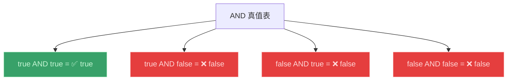
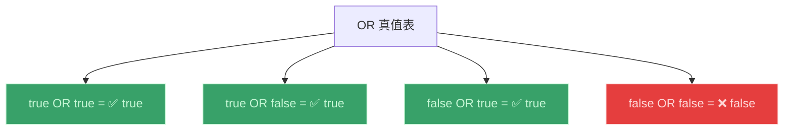
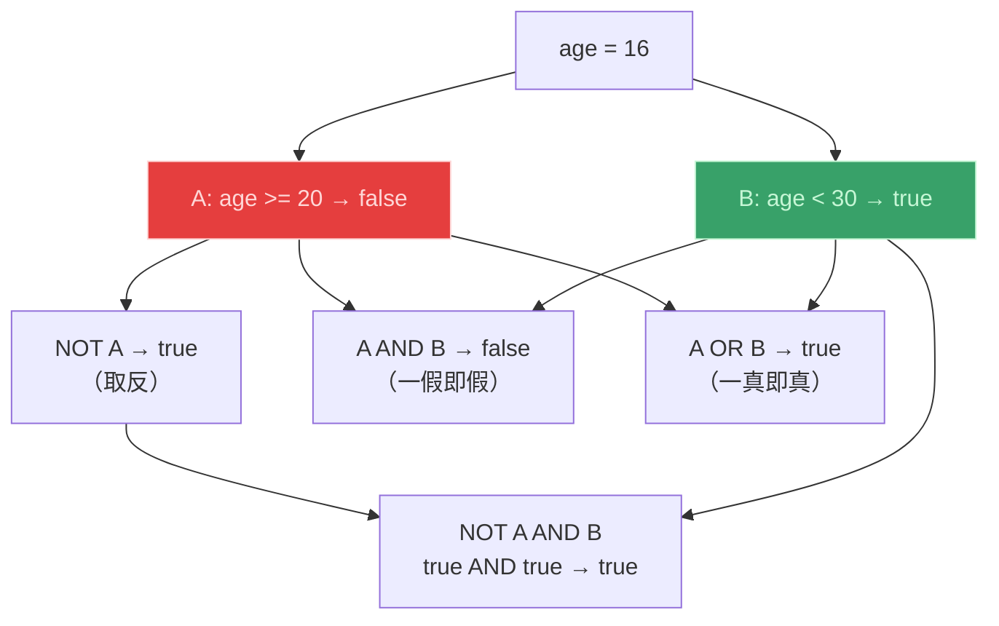
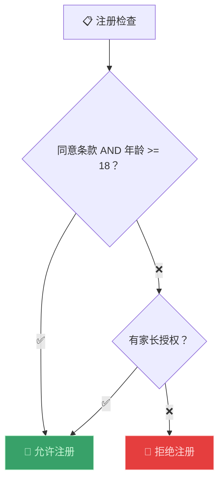

# 布尔逻辑（Boolean Logic）

> 📺 来源：021 Boolean Logic.en.srt
> 📂 章节：第 02 章

## 📌 知识脉络
- **前置知识**：布尔值（Boolean）、比较运算符、if/else 语句
- **后续扩展**：逻辑运算符实践（Logical Operators）、短路求值（Short-circuit Evaluation）

## 🎯 概述
布尔逻辑是计算机科学的分支，用 `true` 和 `false` 值解决复杂的逻辑问题。本节课讲解三个最基本的逻辑运算符：**AND（与）**、**OR（或）** 和 **NOT（非）**，以及它们的**真值表（Truth Table）**。注意：布尔逻辑不是 JavaScript 专属的，它适用于所有编程语言。

## 核心知识点

### 1. AND 运算符（与）—— 两者都满足

> 🧩 **生活类比**：AND 就像"双重门禁"——你既需要刷工牌又需要输指纹，两个都通过才能进门。只要有一个不通过就被拒绝。



**📊 AND 真值表：**

| A | B | A AND B |
|---|---|:-------:|
| true | true | ✅ **true** |
| true | false | ❌ false |
| false | true | ❌ false |
| false | false | ❌ false |

> 💡 **记忆口诀**：**"AND 全真才真，一假即假"**

---

### 2. OR 运算符（或）—— 至少一个满足

> 🧩 **生活类比**：OR 就像"多通道入口"——普通票或 VIP 票都能进场，只要有一张有效票就行。两张都无效才被拒绝。



**📊 OR 真值表：**

| A | B | A OR B |
|---|---|:------:|
| true | true | ✅ true |
| true | false | ✅ true |
| false | true | ✅ true |
| false | false | ❌ **false** |

> 💡 **记忆口诀**：**"OR 一真即真，全假才假"**

---

### 3. NOT 运算符（非）—— 取反

> 🧩 **生活类比**：NOT 就像一个"反转开关"——开灯变关灯，关灯变开灯。

| A | NOT A |
|---|:-----:|
| true | ❌ false |
| false | ✅ true |

> 💡 **记忆口诀**：**"NOT 翻转一切"**

---

### 4. 组合运算的完整示例



**🔍 执行追踪：**

| 表达式 | 替换值 | 结果 |
|--------|--------|------|
| `NOT A` | `NOT false` | `true` |
| `A AND B` | `false AND true` | `false` |
| `A OR B` | `false OR true` | `true` |
| `NOT A AND B` | `true AND true` | `true` |
| `A OR NOT B` | `false OR false` | `false` |

---

## 🛠️ 代码实战与真实场景

> **💼 业务场景**：网站注册验证——用户必须同意条款 AND 年龄达标，或者拥有家长授权。



```js {runnable} {title="registration.js"}
const age = 16;
const agreedTerms = true;
const hasParentalConsent = true;

// 条件：(同意条款 AND 年满18) OR 有家长授权
const canRegister = (agreedTerms && age >= 18) || hasParentalConsent;

console.log(`年龄: ${age}, 同意条款: ${agreedTerms}, 家长授权: ${hasParentalConsent}`);
console.log(`可以注册: ${canRegister}`); // true（虽未满18但有家长授权）
```

**📊 输入输出示例：**

| 同意条款 | 年龄 ≥ 18 | 家长授权 | 可注册？ |
|----------|----------|---------|---------|
| ✅ | ✅ | 任意 | ✅ true |
| ✅ | ❌ | ✅ | ✅ true |
| ✅ | ❌ | ❌ | ❌ false |
| ❌ | ✅ | ❌ | ❌ false |

## 💡 关键要点
- ✅ **AND** 运算：所有条件都为 `true` → 结果才为 `true`
- ✅ **OR** 运算：任一条件为 `true` → 结果就为 `true`
- ✅ **NOT** 运算：取反——`true` 变 `false`，`false` 变 `true`
- ✅ NOT 的优先级**高于** AND 和 OR
- ✅ 布尔逻辑是所有编程语言通用的，不是 JavaScript 独有

## ⚠️ 常见误区
- ⚠️ **误区 1**：认为 `A AND B` 和 `A OR B` 的结果一样。AND 更严格（全真才真），OR 更宽松（一真即真）。
- ⚠️ **误区 2**：忘记 NOT 的优先级高于 AND/OR。`NOT A AND B` 等价于 `(NOT A) AND B`，不是 `NOT (A AND B)`。

## 🐛 报错实验室

**❌ 易错场景：混淆 AND 与 OR 的语义**
```js
// 想要表达"年龄不在 18~65 之间"
const age = 20;
// 错误写法：
const outOfRange = age < 18 && age > 65; // 永远是 false！
// 正确写法：
const outOfRangeCorrect = age < 18 || age > 65;
```
**🔑 解读**：一个数不可能同时 `< 18` AND `> 65`。"不在范围内"应该用 OR：小于下限 OR 大于上限。

---

## 📖 词汇速查表 (Cheat Sheet)

| 中文术语 | 英文术语 | 简明释义 | 速查代码 | 📚 官方文档 |
|---------|---------|---------|---------|-----------|
| 与运算 | AND | 全真才真 | `true && true` | [MDN](https://developer.mozilla.org/zh-CN/docs/Web/JavaScript/Reference/Operators/Logical_AND) |
| 或运算 | OR | 一真即真 | `true \|\| false` | [MDN](https://developer.mozilla.org/zh-CN/docs/Web/JavaScript/Reference/Operators/Logical_OR) |
| 非运算 | NOT | 取反 | `!true // false` | [MDN](https://developer.mozilla.org/zh-CN/docs/Web/JavaScript/Reference/Operators/Logical_NOT) |
| 真值表 | Truth Table | 列出所有输入组合及结果 | — | — |

---

## 🧪 学习验证

### 📝 动手练习

**练习 1：填写真值表**
```js {runnable} {title="exercise1.js"}
// 验证你对真值表的理解
console.log(true && true);    // ?
console.log(true && false);   // ?
console.log(false || true);   // ?
console.log(false || false);  // ?
console.log(!true);           // ?
console.log(!(true && false)); // ?
```
<details><summary>💡 参考答案</summary>

```js
console.log(true && true);     // true
console.log(true && false);    // false
console.log(false || true);    // true
console.log(false || false);   // false
console.log(!true);            // false
console.log(!(true && false)); // true (NOT false = true)
```
</details>

**练习 2：实际场景判断**
```js {runnable} {title="exercise2.js"}
// 电影院入场条件：
// 1. 年满 13 岁 OR 有家长陪同
// 2. AND 购买了票
const age = 10;
const withParent = true;
const hasTicket = true;

// 请写出判断条件并输出结果
```
<details><summary>💡 参考答案</summary>

```js
const age = 10;
const withParent = true;
const hasTicket = true;

const canEnter = (age >= 13 || withParent) && hasTicket;
console.log(`可以入场: ${canEnter}`); // true
```
**解题思路**：先用 OR 判断年龄或家长条件，再用 AND 确认有票。注意括号保证优先级。
</details>

### ❓ 理解检测

:::quiz {correct="B"}
**1. `true && false && true` 的结果是？**
- A) `true`
- B) `false`
- C) 报错

> **解析**：AND 运算中只要有一个 `false`，结果就是 `false`。
:::

:::quiz {correct="A"}
**2. `false || false || true` 的结果是？**
- A) `true`
- B) `false`
- C) `undefined`

> **解析**：OR 运算中只要有一个 `true`，结果就是 `true`。
:::

:::quiz {correct="C"}
**3. NOT 运算符的优先级是？**
- A) 低于 AND 和 OR
- B) 与 AND 和 OR 相同
- C) 高于 AND 和 OR

> **解析**：NOT（`!`）的优先级最高，会先于 AND（`&&`）和 OR（`||`）执行。
:::

### 🔧 代码填空

:::fill-blank
// AND 运算：全真才真
const result1 = true ___&&___ true; // true

// OR 运算：一真即真
const result2 = false ___||___ true; // true

// NOT 运算：取反
const result3 = ___!___false; // true
:::
