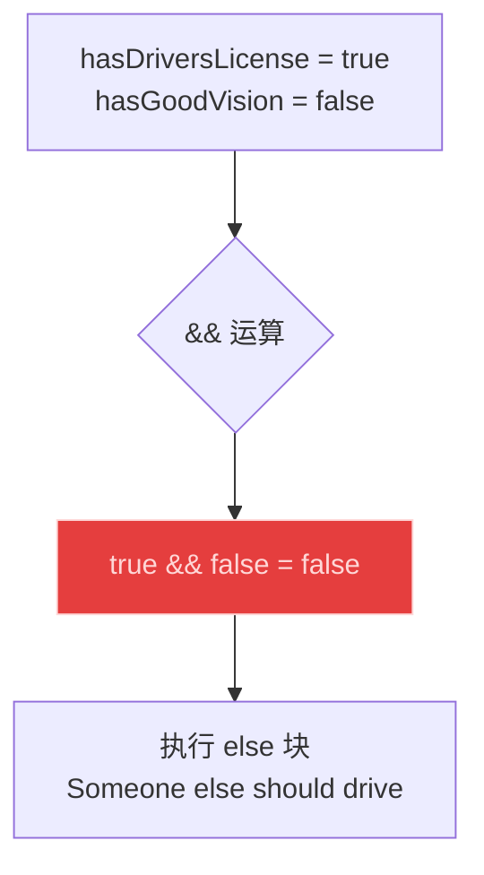
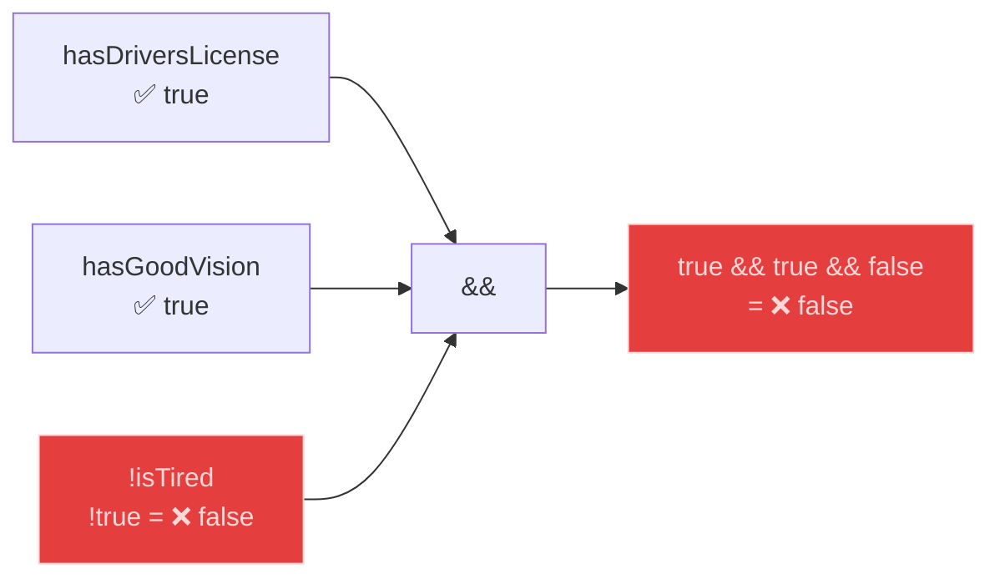
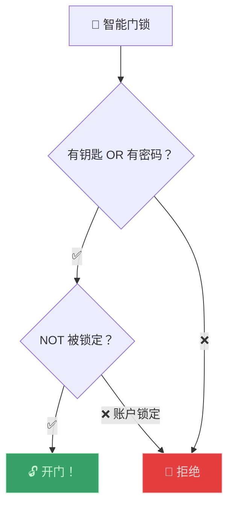

# 逻辑运算符（Logical Operators）

> 📺 来源：022 Logical Operators.en.srt
> 📂 章节：第 02 章

## 📌 知识脉络
- **前置知识**：布尔逻辑（Boolean Logic）、真值表、if/else 语句
- **后续扩展**：短路求值（Short-circuit Evaluation）、空值合并运算符（Nullish Coalescing `??`）

## 🎯 概述
上一节课学习了布尔逻辑的理论，本节课将其付诸实践。在 JavaScript 中，AND 是 `&&`、OR 是 `||`、NOT 是 `!`。通过一个"Sarah 是否能开车"的场景，综合运用三个逻辑运算符来做复杂的条件判断。

## 核心知识点

### 1. JavaScript 中的逻辑运算符语法

> 🧩 **生活类比**：逻辑运算符就像"评委打分规则"——AND (`&&`) 要求全体评委一致通过，OR (`||`) 只要一个评委点头就行，NOT (`!`) 是"一票否决权"。

**📊 语法速查：**

| 逻辑概念 | JavaScript 语法 | 示例 |
|---------|:---------------:|------|
| AND（与） | `&&` | `true && false` → `false` |
| OR（或） | `\|\|` | `true \|\| false` → `true` |
| NOT（非） | `!` | `!true` → `false` |

```js {runnable} {title="operators_syntax.js"}
const hasDriversLicense = true;  // A
const hasGoodVision = true;      // B

console.log(hasDriversLicense && hasGoodVision); // true  (AND)
console.log(hasDriversLicense || hasGoodVision); // true  (OR)
console.log(!hasDriversLicense);                 // false (NOT)
```

---

### 2. 用逻辑运算符做决策

```js {runnable} {title="should_drive.js"}
const hasDriversLicense = true;
const hasGoodVision = false;

// 条件：必须有驾照 AND 视力好
if (hasDriversLicense && hasGoodVision) {
  console.log("Sarah is able to drive! 🚗");
} else {
  console.log("Someone else should drive... 🚌");
}
// 输出："Someone else should drive..."
// 因为 true && false = false
```



**🔍 执行追踪：**

| 变量 | 值 | `&&` 结果 | 执行块 |
|------|-----|----------|--------|
| `true`, `true` | `true && true` | `true` | ✅ if 块 |
| `true`, `false` | `true && false` | `false` | ❌ else 块 |

---

### 3. 三变量组合 —— 加入 NOT 运算符

```js {runnable} {title="three_conditions.js"}
const hasDriversLicense = true;
const hasGoodVision = true;
const isTired = true;

// 条件：有驾照 AND 视力好 AND 不疲劳
if (hasDriversLicense && hasGoodVision && !isTired) {
  console.log("Sarah is able to drive! 🚗");
} else {
  console.log("Someone else should drive... 🚌");
}
// 输出："Someone else should drive..."
// 因为 !isTired = !true = false → true && true && false = false
```



**🔍 执行追踪：**

| `hasDriversLicense` | `hasGoodVision` | `isTired` | `!isTired` | 整体条件 | 结果 |
|:-------------------:|:---------------:|:---------:|:----------:|:--------:|:----:|
| true | true | true | **false** | `true && true && false` | ❌ |
| true | true | **false** | **true** | `true && true && true` | ✅ |

---

## 🛠️ 代码实战与真实场景

> **💼 业务场景**：智能家居门锁系统——多条件安全验证。



```js {runnable} {title="smart_lock.js"}
const hasKey = false;
const hasPassword = true;
const isLocked = false;

// 条件：(有钥匙 OR 有密码) AND 账户未被锁定
const canOpen = (hasKey || hasPassword) && !isLocked;

console.log(`钥匙: ${hasKey}, 密码: ${hasPassword}, 锁定: ${isLocked}`);
console.log(`能否开门: ${canOpen}`); // true
```

**📊 输入输出示例：**

| 有钥匙 | 有密码 | 被锁定 | 能开门？ |
|--------|--------|--------|---------|
| ❌ | ✅ | ❌ | ✅ |
| ✅ | ❌ | ❌ | ✅ |
| ❌ | ❌ | ❌ | ❌ |
| ✅ | ✅ | ✅ | ❌ |

## 💡 关键要点
- ✅ JavaScript 中 `&&` 是 AND，`||` 是 OR，`!` 是 NOT
- ✅ 多个 `&&` 可以链接：`a && b && c`——全部为 `true` 才为 `true`
- ✅ `!` 运算符用于**取反**，优先级高于 `&&` 和 `||`
- ✅ 复杂条件可以用**括号**明确优先级
- ✅ 逻辑运算符常与 `if/else` 配合做多条件决策

## ⚠️ 常见误区
- ⚠️ **误区 1**：写 `and` / `or` 而不是 `&&` / `||`。JavaScript 只认符号，不认英文单词。
- ⚠️ **误区 2**：混淆 `||`（逻辑或）和 `|`（按位或）。逻辑运算用双竖线 `||`。

## 🐛 报错实验室

**❌ 错误写法：使用英文单词 and/or**
```js
if (hasKey and hasPassword) { // ❌ SyntaxError!
  console.log("Open!");
}
```
**浏览器报错：**
```
Uncaught SyntaxError: Unexpected identifier
```
**🔑 解读**：JavaScript 不支持 `and`/`or` 关键字。必须使用 `&&` 和 `||` 符号。

---

## 📖 词汇速查表 (Cheat Sheet)

| 中文术语 | 英文术语 | 简明释义 | 速查代码 | 📚 官方文档 |
|---------|---------|---------|---------|-----------|
| 逻辑与 | Logical AND `&&` | 所有条件为真才为真 | `a && b` | [MDN](https://developer.mozilla.org/zh-CN/docs/Web/JavaScript/Reference/Operators/Logical_AND) |
| 逻辑或 | Logical OR `\|\|` | 任一条件为真即为真 | `a \|\| b` | [MDN](https://developer.mozilla.org/zh-CN/docs/Web/JavaScript/Reference/Operators/Logical_OR) |
| 逻辑非 | Logical NOT `!` | 取反 | `!a` | [MDN](https://developer.mozilla.org/zh-CN/docs/Web/JavaScript/Reference/Operators/Logical_NOT) |

---

## 🧪 学习验证

### 📝 动手练习

**练习 1：游乐园入场条件**
```js {runnable} {title="exercise1.js"}
// 游乐园过山车入场要求：
// 1. 身高 >= 140cm
// 2. 年龄 >= 10
// 3. 没有心脏病
// 三个条件全部满足才能乘坐

const height = 150;
const age = 12;
const hasHeartDisease = false;

// 在这里写你的代码
```
<details><summary>💡 参考答案</summary>

```js
const height = 150;
const age = 12;
const hasHeartDisease = false;

if (height >= 140 && age >= 10 && !hasHeartDisease) {
  console.log("🎢 欢迎乘坐过山车！");
} else {
  console.log("🚫 抱歉，不符合乘坐条件");
}
```
**解题思路**：三个条件用 `&&` 连接，心脏病条件用 `!` 取反。
</details>

**练习 2：VIP 或老客户折扣**
```js {runnable} {title="exercise2.js"}
// 享受折扣的条件：
// (VIP 会员 OR 消费满 500) AND 非促销黑名单

const isVIP = false;
const totalSpent = 600;
const isBlacklisted = false;

// 在这里写你的代码
```
<details><summary>💡 参考答案</summary>

```js
const isVIP = false;
const totalSpent = 600;
const isBlacklisted = false;

const getsDiscount = (isVIP || totalSpent >= 500) && !isBlacklisted;
console.log(`享受折扣: ${getsDiscount}`); // true
```
**解题思路**：OR 连接"VIP 或消费达标"，AND 连接"非黑名单"，注意括号。
</details>

### ❓ 理解检测

:::quiz {correct="B"}
**1. `true && true && false` 的结果是？**
- A) `true`
- B) `false`
- C) 报错

> **解析**：AND 链中只要有一个 `false`，整体结果就是 `false`。
:::

:::quiz {correct="A"}
**2. `!false && true` 的结果是？**
- A) `true`
- B) `false`
- C) `!true`

> **解析**：`!` 优先级最高，先计算 `!false` = `true`，然后 `true && true` = `true`。
:::

:::quiz {correct="C"}
**3. JavaScript 中逻辑与的写法是？**
- A) `and`
- B) `&`
- C) `&&`

> **解析**：JavaScript 使用 `&&` 表示逻辑与。`and` 不是有效语法，`&` 是按位与运算符。
:::

### 🔧 代码填空

:::fill-blank
const hasLicense = true;
const hasVision = true;
const isTired = false;

// 三条件判断
if (hasLicense ___&&___ hasVision ___&&___ ___!___isTired) {
  console.log("Can drive!");
}
:::
