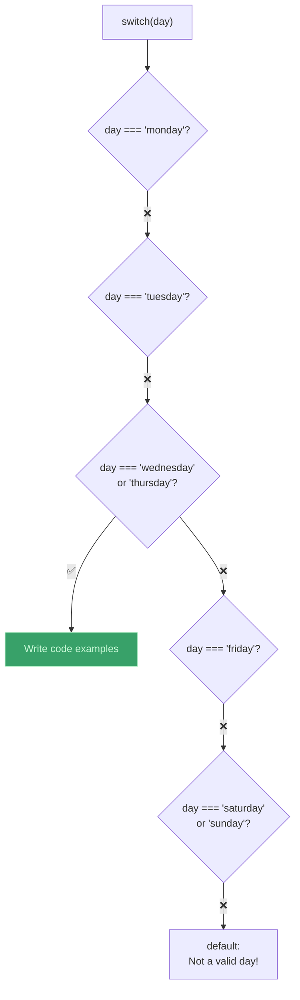

# switch 语句（The switch Statement）

> 📺 来源：025 The switch Statement.en.srt
> 📂 章节：第 02 章

## 📌 知识脉络
- **前置知识**：if/else 语句、严格相等 `===`、逻辑运算符
- **后续扩展**：语句与表达式（Statements and Expressions）、三元运算符（Ternary Operator）

## 🎯 概述
`switch` 语句是另一种条件判断结构，特别适合**将一个变量与多个固定值逐一比较**的场景。它使用**严格相等 `===`** 进行比较，语法比长 `if/else if` 链更简洁。本节课讲解 `switch` 的语法、`break` 的必要性、`default` 分支，以及多个 `case` 共享代码的技巧。

## 核心知识点

### 1. switch 基本语法

> 🧩 **生活类比**：`switch` 就像自动售货机的按键面板——你按下一个编号（比如 "Monday"），机器就精确匹配到对应的出口，吐出对应的商品。如果没有匹配的编号，就走 `default` 出口。

```js {runnable} {title="switch_basic.js"}
const day = "wednesday";

switch (day) {
  case "monday":
    console.log("Plan course structure");
    console.log("Go to coding meetup");
    break;
  case "tuesday":
    console.log("Prepare theory videos");
    break;
  case "wednesday":
  case "thursday":
    console.log("Write code examples"); // 合并两个 case！
    break;
  case "friday":
    console.log("Record videos");
    break;
  case "saturday":
  case "sunday":
    console.log("Enjoy the weekend 😎");
    break;
  default:
    console.log("Not a valid day!");
}
```



---

### 2. `break` 的作用 —— 防止"穿透"

> 🧩 **生活类比**：`break` 就像电梯的"到站停"——没有 `break`，代码会像不停站的电梯一样"穿透"到下面的所有楼层。

```js {runnable} {title="no_break_demo.js"}
const day = "monday";

switch (day) {
  case "monday":
    console.log("Plan course structure");
    // ⚠️ 没有 break！代码会继续执行下面的 case
  case "tuesday":
    console.log("Prepare theory videos");
    break; // 到这里才停
}
// 输出两行！"Plan course structure" 和 "Prepare theory videos"
```

---

### 3. switch vs if/else —— 等价对比

:::code-comparison
```js {title="✨ switch 写法（干净）"}
switch (day) {
  case "monday":
    console.log("Plan");
    break;
  case "tuesday":
    console.log("Prepare");
    break;
  case "wednesday":
  case "thursday":
    console.log("Code");
    break;
  default:
    console.log("Invalid");
}
```
```js {title="🚨 if/else 写法（冗长）"}
if (day === "monday") {
  console.log("Plan");
} else if (day === "tuesday") {
  console.log("Prepare");
} else if (day === "wednesday"
  || day === "thursday") {
  console.log("Code");
} else {
  console.log("Invalid");
}
```
:::

---

## 🛠️ 代码实战与真实场景

> **💼 业务场景**：客服系统的工单分类——根据工单类型自动分配到对应部门。

```js {runnable} {title="ticket_routing.js"}
const ticketType = "refund";

switch (ticketType) {
  case "bug":
  case "crash":
    console.log("🔧 转交技术部门");
    break;
  case "refund":
  case "billing":
    console.log("💰 转交财务部门");
    break;
  case "feedback":
    console.log("📝 转交产品部门");
    break;
  default:
    console.log("📬 转交通用客服");
}
```

**📊 输入输出示例：**

| 工单类型 | 匹配 case | 分配部门 |
|---------|-----------|---------|
| `"bug"` / `"crash"` | 合并 case | 🔧 技术部门 |
| `"refund"` / `"billing"` | 合并 case | 💰 财务部门 |
| `"other"` | default | 📬 通用客服 |

## 💡 关键要点
- ✅ `switch` 使用**严格相等 `===`** 比较值
- ✅ 每个 `case` 后必须加 `break`，否则代码会"穿透"到下一个 case
- ✅ 多个 `case` 可以**共享**同一段代码（连续写多个 `case:`）
- ✅ `default` 是兜底分支，类似 if/else 中的 `else`
- ✅ `switch` 适合"一个值对多个选项"的场景，不适合范围比较

## ⚠️ 常见误区
- ⚠️ **误区 1**：忘记写 `break`，导致代码穿透执行了多个 case 的内容。
- ⚠️ **误区 2**：以为 `switch` 可以做范围比较（如 `case > 18`）。`switch` 只做精确匹配。

## 🐛 报错实验室

**❌ 错误写法：忘记 break**
```js
const fruit = "apple";
switch (fruit) {
  case "apple":
    console.log("🍎");
  case "banana":
    console.log("🍌");
    break;
}
```
**浏览器输出：**
```
🍎
🍌
```
**🔑 解读**：匹配 `"apple"` 后没有 `break`，代码"穿透"到 `"banana"` 的代码也执行了。修复：在 `console.log("🍎")` 后加 `break;`。

---

## 📖 词汇速查表 (Cheat Sheet)

| 中文术语 | 英文术语 | 简明释义 | 速查代码 | 📚 官方文档 |
|---------|---------|---------|---------|-----------|
| switch 语句 | switch Statement | 多值精确匹配分支 | `switch(x) { case: ... }` | [MDN](https://developer.mozilla.org/zh-CN/docs/Web/JavaScript/Reference/Statements/switch) |
| 穿透 | Fall-through | 没有 break 时代码继续执行 | — | — |
| 默认分支 | default | 所有 case 都不匹配时执行 | `default: ...` | — |

---

## 🧪 学习验证

### 📝 动手练习

**练习 1：成绩等级（用 switch）**
```js {runnable} {title="exercise1.js"}
// 将 if/else 版的成绩等级改写为 switch
// A: 90-100, B: 80-89, C: 60-79, D: 0-59
// 提示：用 Math.floor(score / 10) 转为整数再 switch

const score = 85;
// 在这里写你的代码
```
<details><summary>💡 参考答案</summary>

```js
const score = 85;
const grade = Math.floor(score / 10);

switch (grade) {
  case 10:
  case 9:
    console.log("A（优秀）");
    break;
  case 8:
    console.log("B（良好）");
    break;
  case 7:
  case 6:
    console.log("C（及格）");
    break;
  default:
    console.log("D（不及格）");
}
```
</details>

### ❓ 理解检测

:::quiz {correct="B"}
**1. switch 使用哪种方式比较值？**
- A) 宽松相等 `==`
- B) 严格相等 `===`
- C) 引用相等

> **解析**：switch 内部使用 `===` 严格相等比较，不做类型转换。
:::

:::quiz {correct="A"}
**2. 忘记写 break 会发生什么？**
- A) 代码会"穿透"继续执行下一个 case 的内容
- B) 报错
- C) 什么都不会发生

> **解析**：没有 `break`，switch 会继续执行后面所有 case 的代码，直到遇到 `break` 或 switch 结束。
:::

:::quiz {correct="C"}
**3. switch 中的 default 对应 if/else 中的什么？**
- A) `if`
- B) `else if`
- C) `else`

> **解析**：`default` 在所有 `case` 都不匹配时执行，等同于 if/else 链最后的 `else` 兜底块。
:::

### 🔧 代码填空

:::fill-blank
switch (color) {
  ___case___ "red":
    console.log("Stop!");
    ___break___;
  case "green":
    console.log("Go!");
    break;
  ___default___:
    console.log("Unknown color");
}
:::
