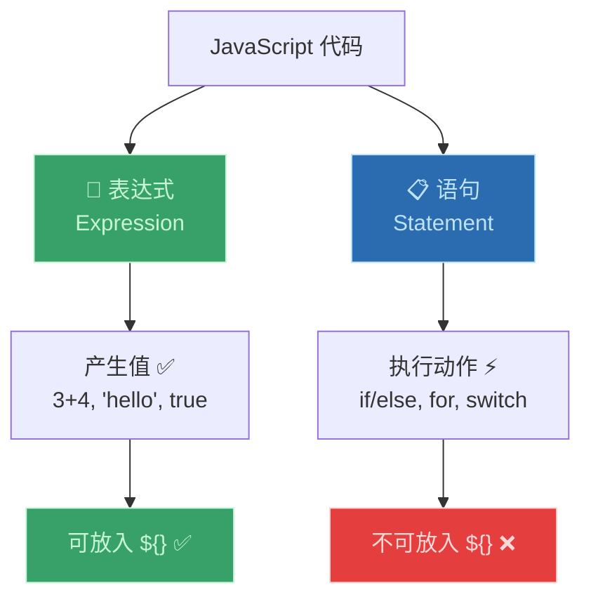

# 语句与表达式（Statements and Expressions）

> 📺 来源：026 Statements and Expressions.en.srt
> 📂 章节：第 02 章

## 📌 知识脉络
- **前置知识**：所有之前的 JavaScript 基础知识
- **后续扩展**：三元运算符（Ternary Operator，它是表达式！）、模板字面量中的插值

## 🎯 概述
JavaScript 代码由**表达式（Expression）**和**语句（Statement）**两种基本构成单元组成。**表达式产生值**，**语句执行动作**。理解这个区别非常重要——例如在模板字面量 `${}` 中只能放入**表达式**，不能放入语句。

## 核心知识点

### 1. 表达式（Expression）—— 产生值的代码

> 🧩 **生活类比**：表达式就像"一句回答"——别人问你"3+4 等于几？"，你给出一个具体的数字答案。表达式总是会产生一个值。

```js {runnable} {title="expressions.js"}
// 以下全部是表达式（都会产生一个值）
3 + 4          // 产生 7
1991           // 产生 1991
true && false  // 产生 false
"Jonas"        // 产生 "Jonas"
```

---

### 2. 语句（Statement）—— 执行动作的代码

> 🧩 **生活类比**：语句就像"一个完整的命令"——"如果下雨，就带伞"是一条完整的指令，它执行了一个动作但本身不产生一个"值"。

```js
// 以下是语句（执行动作，不产生值）
if (23 > 10) {
  const str = "23 is bigger";  // 这一整个 if/else 结构是语句
}

// for 循环也是语句
// switch 也是语句
```

---

### 3. 核心区别：模板字面量只接受表达式

```js {runnable} {title="template_expression.js"}
const str = "23 is bigger";

// ✅ 表达式可以放在 ${} 中
console.log(`${2037 - 1991} years old`);  // 计算表达式
console.log(`Value is ${str}`);            // 变量引用（也是表达式）

// ❌ 语句不能放在 ${} 中
// console.log(`${if (true) { "yes" }}`);  // SyntaxError!
```



> 💡 **记忆口诀**：**"表达式有值，语句有分号"** —— 表达式产生值，语句以分号结尾执行动作。

---

## 🛠️ 代码实战与真实场景

> **💼 业务场景**：动态生成用户界面文本——模板字面量中只能用表达式。

```js {runnable} {title="ui_text.js"}
const userName = "Alice";
const age = 28;
const isVIP = true;

// ✅ 这些都是表达式，可以放在 ${} 中
const greeting = `Hello ${userName}, you are ${2024 - 1996} years old. ${isVIP ? "Welcome, VIP! 🌟" : "Welcome!"}`;
console.log(greeting);
```

**📊 输入输出示例：**

| 代码片段 | 是表达式？ | 原因 |
|---------|:---------:|------|
| `3 + 4` | ✅ | 产生值 7 |
| `"hello"` | ✅ | 产生值 "hello" |
| `true && false` | ✅ | 产生值 false |
| `if (x > 5) {}` | ❌ | 是语句，不产生值 |
| `const x = 5;` | ❌ | 是声明语句 |

## 💡 关键要点
- ✅ **表达式**产生值——数字、字符串、运算结果、变量引用都是表达式
- ✅ **语句**执行动作——if/else、for、switch、变量声明都是语句
- ✅ 模板字面量 `${}` 中只能放**表达式**
- ✅ 语句像"完整的句子"，表达式像"句子中的词语"

## ⚠️ 常见误区
- ⚠️ **误区 1**：以为 if/else 可以放在 `${}` 中。if/else 是语句，只有三元运算符（表达式）可以代替。
- ⚠️ **误区 2**：过于纠结分类。实际编码中不需要精确记忆哪些是表达式哪些是语句，只需知道 `${}` 需要表达式。

## 🐛 报错实验室

**❌ 错误写法：在模板字面量中插入语句**
```js
const msg = `Result: ${if (true) { "yes" }}`;
```
**浏览器报错：**
```
Uncaught SyntaxError: Unexpected token 'if'
```
**🔑 解读**：`${}` 只接受表达式，`if` 是语句。修复：使用三元运算符 `${true ? "yes" : "no"}`。

---

## 📖 词汇速查表 (Cheat Sheet)

| 中文术语 | 英文术语 | 简明释义 | 速查代码 | 📚 官方文档 |
|---------|---------|---------|---------|-----------|
| 表达式 | Expression | 产生值的代码片段 | `3+4`, `"hi"` | [MDN](https://developer.mozilla.org/zh-CN/docs/Web/JavaScript/Guide/Expressions_and_operators) |
| 语句 | Statement | 执行动作的完整指令 | `if () {}`, `for () {}` | [MDN](https://developer.mozilla.org/zh-CN/docs/Web/JavaScript/Reference/Statements) |

---

## 🧪 学习验证

### 📝 动手练习

**练习 1：判断表达式 vs 语句**
```js {runnable} {title="exercise1.js"}
// 判断以下哪些是表达式（E），哪些是语句（S）：
// 1. 42
// 2. let x = 10;
// 3. x > 5
// 4. if (x > 5) { console.log("hi"); }
// 5. x > 5 ? "yes" : "no"

// 答案写在注释中
```
<details><summary>💡 参考答案</summary>

```
1. 42              → E（产生值 42）
2. let x = 10;     → S（声明语句）
3. x > 5           → E（产生布尔值）
4. if (x > 5) {}   → S（if 语句）
5. x > 5 ? "yes" : "no" → E（三元运算符是表达式！）
```
</details>

### ❓ 理解检测

:::quiz {correct="A"}
**1. 模板字面量 `${}` 中可以放什么？**
- A) 表达式（产生值的代码）
- B) 语句（执行动作的代码）
- C) 两者都可以

> **解析**：`${}` 只接受表达式——因为它需要一个可以被插入字符串的**值**。
:::

:::quiz {correct="C"}
**2. 以下哪个是表达式？**
- A) `if (true) {}`
- B) `const x = 5;`
- C) `2024 - 1991`

> **解析**：`2024 - 1991` 产生值 `33`，是表达式。if 和 const 声明都是语句。
:::

:::quiz {correct="B"}
**3. 三元运算符 `a ? b : c` 是表达式还是语句？**
- A) 语句
- B) 表达式
- C) 取决于上下文

> **解析**：三元运算符是**表达式**——它产生一个值，因此可以用在 `${}` 中、赋值给变量等。
:::

### 🔧 代码填空

:::fill-blank
// 在模板字面量中只能使用___表达式___
const msg = `Age: ${2024 ___-___ 1991}`;

// 三元运算符是___表达式___，可以放在 ${} 中
const drink = `I drink ${age >= 18 ___?___ "wine" ___:___ "water"}`;
:::
