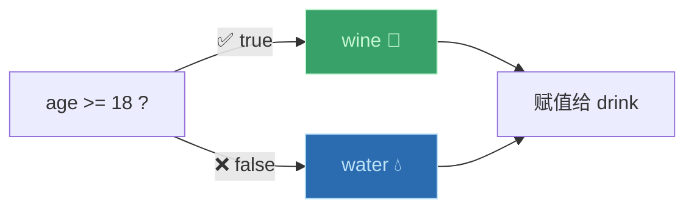
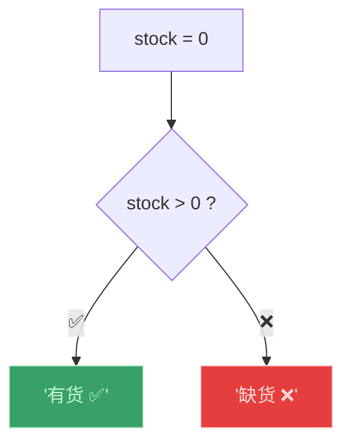

# 条件（三元）运算符（The Conditional/Ternary Operator）

> 📺 来源：027 The Conditional (Ternary) Operator.en.srt
> 📂 章节：第 02 章

## 📌 知识脉络
- **前置知识**：if/else 语句、表达式与语句的区别、模板字面量
- **后续扩展**：短路求值（Short-circuit Evaluation）、可选链运算符（Optional Chaining）

## 🎯 概述
三元运算符（也叫条件运算符）允许我们在一行代码中写出 if/else 逻辑。它是一个**表达式**（产生值），因此可以用在 `${}` 模板字面量中、赋值给变量等——这是 if/else 语句做不到的。语法：`condition ? valueIfTrue : valueIfFalse`。

## 核心知识点

### 1. 三元运算符基本语法

> 🧩 **生活类比**：三元运算符就像"二选一快餐"——服务员问你"饮料选咖啡还是茶？"，你一句话就回答了。而 if/else 像是要填一张复杂的点餐单。

```js {runnable} {title="ternary_basic.js"}
const age = 23;

// 三元运算符：一行搞定
const drink = age >= 18 ? "wine 🍷" : "water 💧";
console.log(drink); // "wine 🍷"

// 三个部分：条件 ? 真值 : 假值
//           -----   -------   --------
//           Part 1   Part 2    Part 3
```



> 💡 **记忆口诀**：**"问号分真假，冒号隔两边"** —— `condition ? trueValue : falseValue`

---

### 2. 三元运算符 vs if/else —— 对比

:::code-comparison
```js {title="✨ 三元运算符（1 行）"}
const drink = age >= 18 ? "wine" : "water";
```
```js {title="🚨 if/else 语句（5 行）"}
let drink;
if (age >= 18) {
  drink = "wine";
} else {
  drink = "water";
}
```
:::

**关键区别**：三元运算符是**表达式**（产生值），if/else 是**语句**（执行动作）。

---

### 3. 在模板字面量中使用三元运算符

```js {runnable} {title="ternary_template.js"}
const age = 23;

// ✅ 三元运算符是表达式，可以放在 ${} 中
console.log(`I like to drink ${age >= 18 ? "wine 🍷" : "water 💧"}`);
// "I like to drink wine 🍷"

// ❌ if/else 是语句，不能放在 ${} 中
// console.log(`I like ${if (age >= 18) { "wine" }}`); // SyntaxError!
```

---

## 🛠️ 代码实战与真实场景

> **💼 业务场景**：电商页面动态显示库存状态。



```js {runnable} {title="stock_status.js"}
const productName = "JavaScript 权威指南";
const stock = 0;
const price = 128;

// 用三元运算符在模板字面量中动态显示状态
console.log(`📚 ${productName}`);
console.log(`💰 ¥${price}`);
console.log(`📦 ${stock > 0 ? `有货（剩余 ${stock} 件）✅` : "缺货 ❌"}`);
console.log(`🛒 ${stock > 0 ? "加入购物车" : "到货通知"}`);
```

**📊 输入输出示例：**

| stock | `stock > 0 ?` | 显示 |
|-------|:------------:|------|
| `15` | `true` | `有货（剩余 15 件）✅` |
| `0` | `false` | `缺货 ❌` |

## 💡 关键要点
- ✅ 三元运算符语法：`condition ? valueIfTrue : valueIfFalse`
- ✅ 它是**表达式**——产生值，可赋值给变量、放在 `${}` 中
- ✅ 适合**快速的二选一**判断，不适合替代复杂的 if/else 逻辑
- ✅ `else` 部分（冒号后）是**必须的**——不能省略
- ✅ 叫"三元"是因为有三个操作数（条件、真值、假值）

## ⚠️ 常见误区
- ⚠️ **误区 1**：以为三元运算符可以完全替代 if/else。它只适合简单的单行判断。
- ⚠️ **误区 2**：嵌套多层三元运算符。`a ? b : c ? d : e` 虽然合法但极难阅读，应该用 if/else。

## 🐛 报错实验室

**❌ 错误写法：省略 else（冒号）部分**
```js
const result = age >= 18 ? "adult"; // ❌ 缺少冒号和 else 值
```
**浏览器报错：**
```
Uncaught SyntaxError: Unexpected token ';'
```
**🔑 解读**：三元运算符的三个部分缺一不可。必须有 `: falseValue`。

---

## 📖 词汇速查表 (Cheat Sheet)

| 中文术语 | 英文术语 | 简明释义 | 速查代码 | 📚 官方文档 |
|---------|---------|---------|---------|-----------|
| 三元运算符 | Ternary Operator | 三个操作数的条件表达式 | `a ? b : c` | [MDN](https://developer.mozilla.org/zh-CN/docs/Web/JavaScript/Reference/Operators/Conditional_operator) |
| 条件运算符 | Conditional Operator | 三元运算符的正式名称 | `a ? b : c` | — |

---

## 🧪 学习验证

### 📝 动手练习

**练习 1：用三元运算符重写**
```js {runnable} {title="exercise1.js"}
// 将以下 if/else 改写为三元运算符
const score = 75;
let grade;

if (score >= 60) {
  grade = "及格";
} else {
  grade = "不及格";
}

// 用三元运算符重写（一行代码）
```
<details><summary>💡 参考答案</summary>

```js
const score = 75;
const grade = score >= 60 ? "及格" : "不及格";
console.log(grade); // "及格"
```
</details>

**练习 2：模板字面量 + 三元运算符**
```js {runnable} {title="exercise2.js"}
// 根据温度输出穿衣建议（在模板字面量中使用三元运算符）
const temp = 28;
// 输出格式：「当前 28°C，建议穿 短袖/外套」（>= 25 穿短袖，否则穿外套）
```
<details><summary>💡 参考答案</summary>

```js
const temp = 28;
console.log(`当前 ${temp}°C，建议穿${temp >= 25 ? "短袖 👕" : "外套 🧥"}`);
```
</details>

### ❓ 理解检测

:::quiz {correct="B"}
**1. 为什么三元运算符可以放在 `${}` 中但 if/else 不行？**
- A) 因为三元运算符更高级
- B) 因为三元运算符是表达式（产生值），if/else 是语句（不产生值）
- C) 因为 JavaScript 有特殊规则

> **解析**：`${}` 只接受表达式。三元运算符是一个产生值的表达式，而 if/else 是执行动作的语句。
:::

:::quiz {correct="C"}
**2. `true ? "A" : "B"` 的结果是？**
- A) `true`
- B) `"B"`
- C) `"A"`

> **解析**：条件为 `true`，返回问号后面的值 `"A"`。
:::

:::quiz {correct="A"}
**3. 三元运算符叫"三元"是因为？**
- A) 它有三个操作数（条件、真值、假值）
- B) 它有三种返回类型
- C) 它可以嵌套三层

> **解析**：Ternary 源自拉丁语"三"，指该运算符有三个部分：条件、`?` 后的真值、`:` 后的假值。
:::

### 🔧 代码填空

:::fill-blank
// 三元运算符语法
const status = age >= 18 ___?___ "成年" ___:___ "未成年";

// 在模板字面量中使用
console.log(`Status: ___${___isActive ? "在线" : "离线"___}___`);
:::
