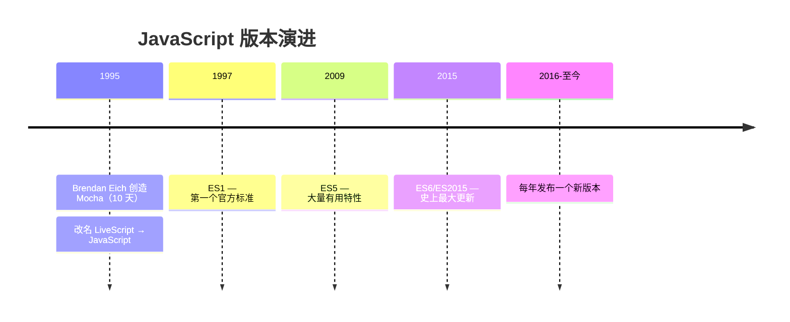
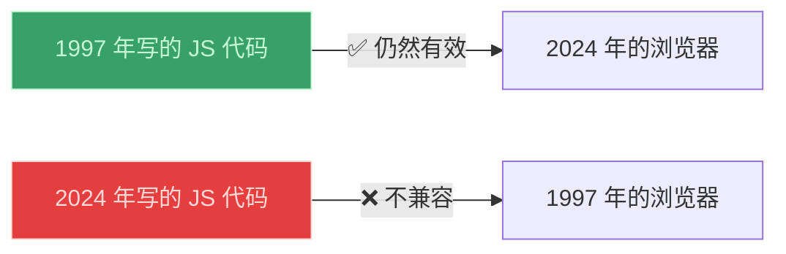
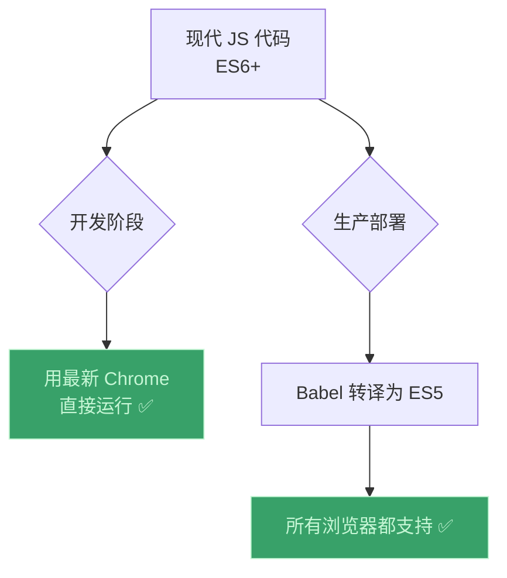

# JavaScript 版本：ES5、ES6+ 与 ESNext

> 📺 来源：030 JavaScript Releases ES5, ES6+ and ESNext.en.srt
> 📂 章节：第 02 章

## 📌 知识脉络
- **前置知识**：本章所有 JavaScript 基础知识
- **后续扩展**：整个课程将持续混合使用 ES5 和 ES6+ 特性

## 🎯 概述
JavaScript 的版本演进经历了漫长的历史——从 1995 年 Brendan Eich 仅用 10 天创造的 Mocha，到 2015 年里程碑式的 ES6（ES2015），再到如今每年发布新特性的年度更新模式。本节课讲解 JavaScript 的历史背景、向后兼容性原则（"不要破坏 Web"）、以及如何在现代开发中使用最新特性。

## 核心知识点

### 1. JavaScript 简史

**关键年份：**
- **1995 年**：Brendan Eich 用 10 天为 Netscape 浏览器创造了 JavaScript（最初叫 Mocha）
- **1997 年**：ES1 发布，JavaScript 正式被 ECMA 标准化
- **2009 年**：ES5 发布，带来了许多至今仍在使用的重要特性
- **2015 年**：ES6（ES2015）发布——**JavaScript 史上最大的更新**，引入了 `let`/`const`、箭头函数、类、模板字面量等

---

### 2. 向后兼容 —— "不要破坏 Web"

> 🧩 **生活类比**：JavaScript 的向后兼容就像城市的老公路——即使修了新路，老路也不会被拆掉，保证 1997 年画的地图今天还能用。

**两个关键原则：**
- ✅ **向后兼容**：旧代码在新浏览器中永远能运行
- ❌ **不向前兼容**：新代码在旧浏览器中不一定能运行

---

### 3. 如何在今天使用现代 JavaScript

| 阶段 | 策略 | 工具 |
|------|------|------|
| **开发** | 使用最新 Chrome | — |
| **生产** | 转译（Transpile）+ 垫片（Polyfill） | Babel |
| **目标** | ES5（全浏览器支持） | — |

---

### 4. 为什么还要学 ES5

- 🔍 理解 ES6 特性的**底层原理**（如 Class 背后的原型链）
- 📚 网上大量教程和示例仍用 ES5 编写
- 💼 工作中可能接手包含 ES5 的老代码库

## 💡 关键要点
- ✅ ES6（2015）是 JavaScript 历史上**最重要的更新**
- ✅ JavaScript **向后兼容**——旧代码永远不会失效
- ✅ 但 JavaScript **不向前兼容**——新特性在旧浏览器上需要 Babel 转译
- ✅ 开发时用最新 Chrome，部署时用 Babel 转为 ES5
- ✅ 学 ES5 有助于理解底层原理和阅读老代码

## 📖 词汇速查表 (Cheat Sheet)

| 中文术语 | 英文术语 | 简明释义 |
|---------|---------|---------|
| 向后兼容 | Backwards Compatible | 旧代码在新环境中能运行 |
| 转译 | Transpiling | 将新语法转换为旧语法（如 Babel） |
| 垫片 | Polyfill | 为旧浏览器补充缺失的新功能 |
| ECMAScript | ECMAScript | JavaScript 的官方标准名称 |
| ESNext | ESNext | 尚未正式发布的未来 JS 特性的统称 |

## 🧪 学习验证

:::quiz {correct="B"}
**1. ES6 发布于哪一年？**
- A) 2009
- B) 2015
- C) 2020

> **解析**：ES6（也叫 ES2015）发布于 2015 年，是 JavaScript 最大的一次更新。
:::

:::quiz {correct="A"}
**2. 为什么 1997 年的 JS 代码今天仍然能运行？**
- A) 因为 JavaScript 向后兼容——新引擎支持所有旧语法
- B) 因为浏览器内置了翻译器
- C) 因为代码会自动更新

> **解析**：JavaScript 遵循"不要破坏 Web"原则，只添加新特性，不删除旧特性。
:::

:::quiz {correct="C"}
**3. 生产环境中如何让 ES6+ 代码在旧浏览器上运行？**
- A) 让用户更新浏览器
- B) 写两个版本的代码
- C) 使用 Babel 转译为 ES5

> **解析**：Babel 可以将现代 JavaScript 自动转译为 ES5，确保旧浏览器兼容。
:::
