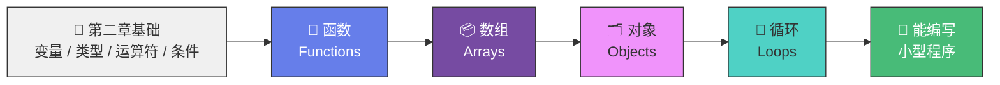

# 第三章导言：JavaScript 基础（下）

> 📺 来源：001 Section Intro.en.srt
> 📂 章节：第 03 章

## 📌 知识脉络
- **前置知识**：第二章所有基础知识（变量、数据类型、运算符、条件语句）
- **后续扩展**：本章将学习函数（Function）、对象（Object）、数组（Array）和循环（Loop）—— 这些是编写完整程序的核心工具

## 🎯 概述

在本章中，我们将继续深入学习 JavaScript 的核心基础知识。学完本章后，你将具备使用 JavaScript 编写小型程序的能力。

## 本章学习路线图

## 📖 词汇速查表 (Cheat Sheet)
| 中文术语 | 英文术语 | 简明释义 | 速查代码 | 📚 官方文档 |
|---------|---------|---------|---------|-----------|
| 函数 | Function | 可复用的代码块 | `function greet() {}` | [MDN](https://developer.mozilla.org/zh-CN/docs/Web/JavaScript/Guide/Functions) |
| 数组 | Array | 有序数据集合 | `const arr = [1,2,3];` | [MDN](https://developer.mozilla.org/zh-CN/docs/Web/JavaScript/Reference/Global_Objects/Array) |
| 对象 | Object | 键值对数据结构 | `const obj = {a: 1};` | [MDN](https://developer.mozilla.org/zh-CN/docs/Web/JavaScript/Reference/Global_Objects/Object) |
| 循环 | Loop | 重复执行代码的结构 | `for (let i=0; i<5; i++){}` | [MDN](https://developer.mozilla.org/zh-CN/docs/Web/JavaScript/Guide/Loops_and_iteration) |
