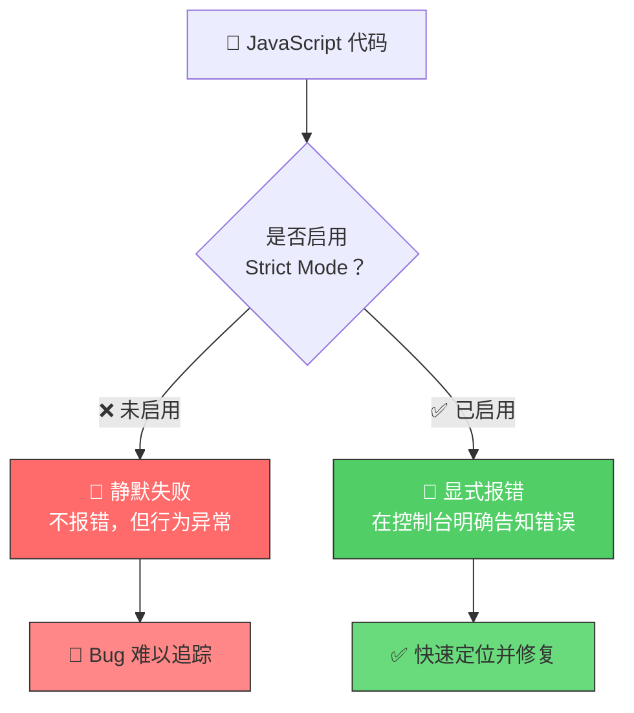
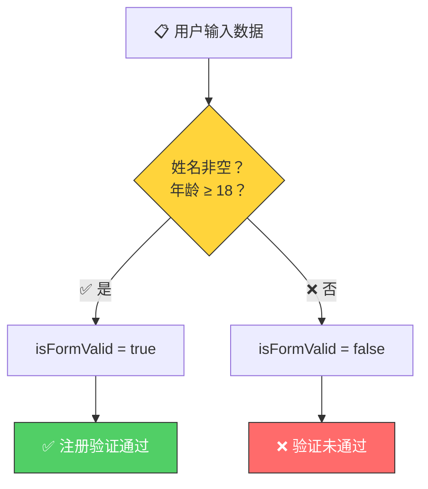

# 激活严格模式（Strict Mode）

> 📺 来源：002 Activating Strict Mode.en.srt
> 📂 章节：第 03 章

## 📌 知识脉络
- **前置知识**：变量声明（`let`、`const`）、布尔值（Boolean）、`if` 条件语句
- **后续扩展**：函数（Function）、对象（Object）、类（Class）中的严格模式约束

## 🎯 概述

严格模式（Strict Mode）是 JavaScript 的一种特殊运行模式，通过在脚本顶部写 `'use strict';` 激活。它能**禁止某些不安全操作**并**让隐性错误变成显式报错**，帮助开发者更早发现 Bug。从本课开始，所有代码都将在严格模式下运行。

## 核心知识点

### 1. 什么是严格模式？

> 🧩 **生活类比**：想象你在一个无限宽容的老师班里（非严格模式），即使你作业写错了老师也不会告诉你。而严格模式就像换了一位严厉的老师——任何小错误都会被立刻指出来，帮你在"考试"（上线）前改正。



**激活方式**：在脚本**最顶部**添加一行字符串字面量：

```js {runnable} {title="strict_mode.js"}
'use strict';

// ✅ 所有代码都在严格模式下运行
let hasDriversLicense = false;
const passTest = true;

if (passTest) hasDriversLicense = true;
if (hasDriversLicense) console.log('I can drive 🚗');
```

> ⚠️ **注意**：`'use strict';` 必须是脚本的**第一条语句**（注释除外）。如果前面有其他代码，严格模式将不会被激活。

---

### 2. 严格模式如何帮助捕获 Bug

> 🧩 **生活类比**：你在搬家时给箱子贴标签，如果不小心将 "Kitchen Utensils" 写成了 "Kitchen Ustensils"——在「宽容模式」下没人告诉你拼错了，导致你永远找不到这个箱子；而「严格模式」会立即喊停："这个标签不存在！"

**🔍 执行追踪**：下面展示一个"意外创建新变量"的 Bug

**不使用严格模式：**
```js
// ❌ 没有 'use strict';
let hasDriversLicense = false;
const passTest = true;

if (passTest) hasDriverLicense = true;  // 注意：少写了一个 's'
// JavaScript 静默创建了一个新的全局变量 hasDriverLicense
// 而原始的 hasDriversLicense 仍然是 false

if (hasDriversLicense) console.log('I can drive');
// 什么都不会输出！但也不报错 😱
```

| 步骤 | 变量 | 值 | 说明 |
|------|------|----|------|
| ① | `hasDriversLicense` | `false` | 正确声明 |
| ② | `passTest` | `true` | 条件为真 |
| ③ | `hasDriverLicense` ⚠️ | `true` | 少写了 's'，**意外创建新变量** |
| ④ | `hasDriversLicense` | `false` | 原变量未被修改！ |

**使用严格模式：**
```js
'use strict';

let hasDriversLicense = false;
const passTest = true;

if (passTest) hasDriverLicense = true;  // 少写了 's'
// 🚨 ReferenceError: hasDriverLicense is not defined
```

> 💡 **记忆口诀**：**严格出错找得到，宽松静默 Bug 满跑**

---

### 3. 保留字（Reserved Words）

严格模式还会**保留一些可能在未来 JavaScript 版本中使用的关键字**，禁止用作变量名：

```js
'use strict';

// ❌ 以下变量名在严格模式下会报错
const interface = 'Audio';   // SyntaxError: Unexpected strict mode reserved word
const private = 534;         // SyntaxError: Unexpected strict mode reserved word
```

**📊 常见保留字一览：**

| 保留字 | 可能的未来用途 | 严格模式行为 |
|--------|--------------|-------------|
| `interface` | 接口定义 | ❌ 报错 |
| `private` | 私有属性 | ❌ 报错 |
| `protected` | 受保护属性 | ❌ 报错 |
| `implements` | 接口实现 | ❌ 报错 |
| `static` | 静态成员 | ❌ 报错 |
| `package` | 包管理 | ❌ 报错 |

> 这与不能用 `if`、`let`、`const` 等已有关键字作为变量名是同一逻辑。

---

## 🛠️ 代码实战与真实场景

> **💼 业务场景**：你正在开发一个用户注册表单验证系统。严格模式帮助你在开发阶段就捕获变量名拼写错误，而不是上线后才发现。

```js {runnable} {title="form_validation.js"}
'use strict';

// 表单验证函数
let isFormValid = false;
const userName = 'Alice';
const userAge = 25;

// 模拟验证逻辑
if (userName.length > 0 && userAge >= 18) {
  isFormValid = true; // ✅ 正确修改原变量
}

if (isFormValid) {
  console.log(`✅ 用户 ${userName} 注册信息验证通过！`);
} else {
  console.log('❌ 验证未通过');
}
```



**📊 输入输出示例：**
| 输入 (userName / userAge) | isFormValid | 输出 | 说明 |
|--------------------------|-------------|------|------|
| `'Alice'` / `25` | `true` | ✅ 注册验证通过 | 两项条件都满足 |
| `''` / `25` | `false` | ❌ 验证未通过 | 姓名为空 |
| `'Bob'` / `16` | `false` | ❌ 验证未通过 | 年龄不足 |

## 💡 关键要点
- ✅ 始终在脚本**最顶部**写 `'use strict';` 以激活严格模式
- ✅ 严格模式将**静默错误**变为**显式报错**，帮你更快找到 Bug
- ✅ 严格模式**禁止使用未声明的变量**（防止拼写错误变量名创建全局变量）
- ✅ 严格模式**保留未来可能使用的关键字**，如 `interface`、`private`
- ✅ 从现在起，本课程所有代码都默认使用严格模式

## ⚠️ 常见误区
- ⚠️ **误区 1**：把 `'use strict';` 放在其他代码后面——那样严格模式**不会**被激活
- ⚠️ **误区 2**：以为严格模式会让代码运行变慢——实际上恰恰相反，某些情况下它能让 JavaScript 引擎做更好的**优化**
- ⚠️ **误区 3**：只在某个函数内用 `'use strict';` 就够了——推荐在**脚本顶部全局启用**，而非局部使用

## 🐛 报错实验室

**❌ 错误写法：**
```js
'use strict';

let hasDriversLicense = false;
const passTest = true;

if (passTest) hasDriverLicense = true;  // 拼写错误！
```

**浏览器报错：**
```
Uncaught ReferenceError: hasDriverLicense is not defined
    at script.js:6:17
```

**🔑 解读**：严格模式检测到 `hasDriverLicense` 从未被声明过（因为正确的变量名是 `hasDriversLicense`，多了一个 `s`），直接抛出 `ReferenceError`。如果没有严格模式，JavaScript 会静默地在全局作用域创建一个新变量，导致 Bug 难以追踪。

---

## 📖 词汇速查表 (Cheat Sheet)
| 中文术语 | 英文术语 | 简明释义 | 速查代码 | 📚 官方文档 |
|---------|---------|---------|---------|-----------|
| 严格模式 | Strict Mode | 让 JS 更严格、更安全的运行模式 | `'use strict';` | [MDN](https://developer.mozilla.org/zh-CN/docs/Web/JavaScript/Reference/Strict_mode) |
| 引用错误 | ReferenceError | 使用了未声明的变量时抛出的错误 | — | [MDN](https://developer.mozilla.org/zh-CN/docs/Web/JavaScript/Reference/Global_Objects/ReferenceError) |
| 保留字 | Reserved Words | 被语言保留、不能用作标识符的词 | `interface`, `private` | [MDN](https://developer.mozilla.org/zh-CN/docs/Web/JavaScript/Reference/Lexical_grammar#reserved_words) |

---

## 🧪 学习验证

### 📝 动手练习

**练习 1：找出 Bug**
```js {runnable} {title="exercise1.js"}
'use strict';

// 下面代码有一个 Bug，请找出并修复它
let isLoggedIn = false;
const password = 'correct123';

const userInput = 'correct123';
if (userInput === password) {
  isLogedIn = true;  // 🐛 找到错误了吗？
}

if (isLoggedIn) {
  console.log('✅ 登录成功');
} else {
  console.log('❌ 登录失败');
}
```
<details><summary>💡 参考答案</summary>

```js
'use strict';

let isLoggedIn = false;
const password = 'correct123';

const userInput = 'correct123';
if (userInput === password) {
  isLoggedIn = true;  // ✅ 修正：isLogedIn → isLoggedIn（补了一个 g）
}

if (isLoggedIn) {
  console.log('✅ 登录成功');
} else {
  console.log('❌ 登录失败');
}
```
**解题思路**：`isLogedIn` 拼写少了一个 `g`，严格模式会抛出 `ReferenceError: isLogedIn is not defined`，提示我们变量名有误。
</details>

**练习 2：保留字测试**
```js {runnable} {title="exercise2.js"}
'use strict';

// 尝试运行下面的代码，看看会发生什么
// 然后将变量名改为合法名称

const interface = 'USB-C';
console.log(interface);
```
<details><summary>💡 参考答案</summary>

```js
'use strict';

// 将保留字 interface 改为 interfaceType
const interfaceType = 'USB-C';
console.log(interfaceType); // 输出: USB-C
```
**解题思路**：`interface` 是严格模式下的保留字，不能用作变量名。只需将其改为语义相近但非保留的名称即可。
</details>

### ❓ 理解检测

:::quiz {correct="A"}
**1. 激活严格模式的正确方式是什么？**
- A) 在脚本最顶部写 `'use strict';`
- B) 在 HTML 的 `<script>` 标签上添加 `strict` 属性
- C) 在浏览器设置中开启「严格模式」
- D) 使用 `strict(true);` 函数调用

> **解析**：严格模式通过在脚本**最开头**写 `'use strict';` 字符串字面量来激活，它必须是第一条语句（注释除外）。
:::

:::quiz {correct="B"}
**2. 在非严格模式下，给一个未声明的变量赋值会怎样？**
- A) 抛出 ReferenceError 错误
- B) 静默地创建一个全局变量
- C) 什么都不发生，赋值被忽略
- D) 浏览器会弹出警告框

> **解析**：在非严格模式下，给未声明的变量赋值会在全局对象上创建一个属性（即全局变量），这是很多隐蔽 Bug 的来源。严格模式会将其变为 `ReferenceError`。
:::

:::quiz {correct="C"}
**3. 以下哪个不是严格模式的保留字？**
- A) `interface`
- B) `private`
- C) `name`
- D) `implements`

> **解析**：`name` 不是严格模式的保留字，它可以作为变量名使用。而 `interface`、`private`、`implements` 都是为未来语言特性预留的关键字。
:::

### 🔧 代码填空

:::fill-blank
___'use strict'___;

let count = 0;
___count___ = 10;
console.log(count); // 输出: 10
:::
