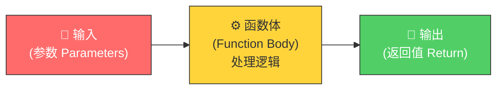
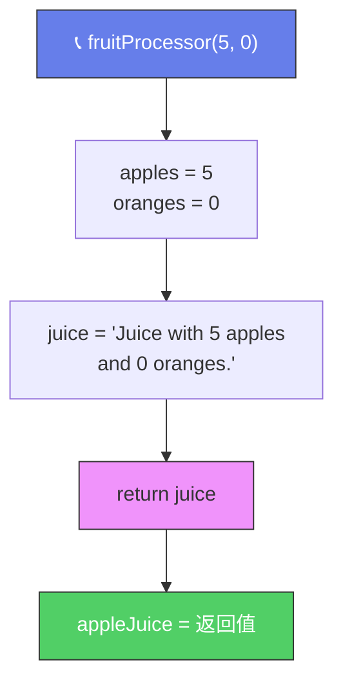
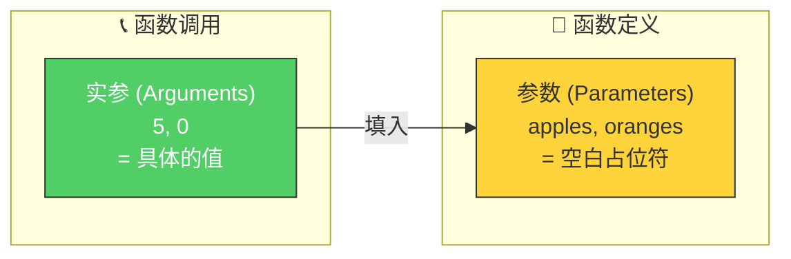
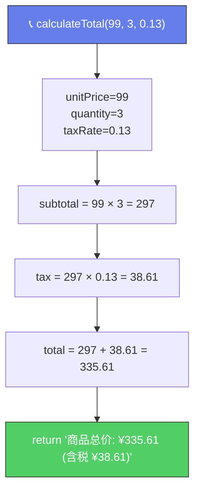

# 函数（Functions）

> 📺 来源：003 Functions.en.srt
> 📂 章节：第 03 章

## 📌 知识脉络
- **前置知识**：变量声明（`let`、`const`）、数据类型（String / Number）、严格模式（`'use strict'`）
- **后续扩展**：函数声明 vs 函数表达式、箭头函数（Arrow Function）、函数调用函数、作用域链（Scope Chain）

## 🎯 概述

函数（Function）是 JavaScript 最基本的构建模块之一。它是一段**可复用的代码块**，可以接收输入（参数），执行操作，并返回输出（返回值）。掌握函数是编写可维护代码和践行 DRY 原则（Don't Repeat Yourself）的关键。

## 核心知识点

### 1. 函数的基本概念

> 🧩 **生活类比**：函数就像一台**榨汁机**🧃——你往里面放入水果（参数/输入），按下启动按钮（调用函数），它内部经过一系列处理（函数体），最后吐出果汁（返回值/输出）。你可以用同一台榨汁机处理不同的水果组合，得到不同的果汁。



**函数的三个关键概念：**

| 概念 | 英文 | 说明 | 类比 |
|------|------|------|------|
| **参数** | Parameter | 函数定义时的占位符变量 | 榨汁机上写的"水果入口" |
| **实参** | Argument | 调用函数时传入的实际值 | 你真正放进去的苹果和橙子 |
| **返回值** | Return Value | 函数执行后输出的结果 | 榨出来的果汁 |

---

### 2. 定义与调用函数

> 🧩 **生活类比**：**定义函数** = 设计一份食谱；**调用函数** = 照着食谱做菜。食谱写好后可以反复使用。

#### ① 无参数、无返回值的简单函数

```js {runnable} {title="simple_function.js"}
'use strict';

// 定义函数
function logger() {
  console.log('My name is Jonas');
}

// 调用（执行）函数 —— 可以多次调用
logger(); // My name is Jonas
logger(); // My name is Jonas
logger(); // My name is Jonas
```

#### ② 有参数、有返回值的完整函数

```js {runnable} {title="fruit_processor.js"}
'use strict';

// 定义函数：接收 apples 和 oranges 两个参数
function fruitProcessor(apples, oranges) {
  console.log(apples, oranges);
  const juice = `Juice with ${apples} apples and ${oranges} oranges.`;
  return juice; // 将 juice 返回给调用者
}

// 调用函数并捕获返回值
const appleJuice = fruitProcessor(5, 0);
console.log(appleJuice);
// 输出: Juice with 5 apples and 0 oranges.

// 再次调用，传入不同的参数
const appleOrangeJuice = fruitProcessor(2, 4);
console.log(appleOrangeJuice);
// 输出: Juice with 2 apples and 4 oranges.
```

**🔍 执行追踪**：`fruitProcessor(5, 0)` 的执行过程

| 步骤 | 代码行 | `apples` | `oranges` | `juice` | 说明 |
|------|--------|----------|-----------|---------|------|
| ① | 调用 `fruitProcessor(5, 0)` | `5` | `0` | — | 实参 5→apples, 0→oranges |
| ② | `console.log(apples, oranges)` | `5` | `0` | — | 控制台输出 `5 0` |
| ③ | `const juice = ...` | `5` | `0` | `"Juice with 5 apples and 0 oranges."` | 字符串拼接 |
| ④ | `return juice` | — | — | — | 将 juice 返回，函数结束 |
| ⑤ | `const appleJuice = ...` | — | — | — | 接收返回值 |



---

### 3. 参数（Parameter）vs 实参（Argument）



> 💡 **记忆口诀**：**参数是坑，实参是萝卜** —— 定义函数时挖好坑（Parameters），调用时把具体的萝卜种进去（Arguments）。

---

### 4. `return` 关键字与函数的返回值

- `return` 做两件事：① 将一个值**送出函数**；② **终止函数**执行
- 没有 `return` 的函数返回 `undefined`
- 可以直接使用返回值，也可以存入变量

```js
// 直接使用返回值（不存入变量）
console.log(fruitProcessor(3, 1));
// 输出: Juice with 3 apples and 1 oranges.
```

---

### 5. DRY 原则与函数的价值

> 🧩 **生活类比**：在快餐店里，你不需要每次都从头做汉堡——只需要按一次「汉堡按钮」，机器就会重复同样的步骤。函数就是你的「汉堡按钮」。

**DRY = Don't Repeat Yourself（不要重复自己）**

函数让代码不重复——定义一次，调用多次。这是编写**可维护、可读**代码的核心原则。

---

### 6. 内置函数：你一直在使用函数！

```js
// console.log() 是一个内置函数
console.log('Hello'); // 调用 console.log，传入参数 'Hello'

// Number() 也是一个内置函数
const num = Number('23'); // 将字符串 '23' 转为数字 23
```

---

## 🛠️ 代码实战与真实场景

> **💼 业务场景**：电商平台需要计算商品总价（含税），你可以写一个通用的计算函数，传入商品单价和数量即可。

```js {runnable} {title="price_calculator.js"}
'use strict';

function calculateTotal(unitPrice, quantity, taxRate) {
  const subtotal = unitPrice * quantity;          // 小计
  const tax = subtotal * taxRate;                 // 税额
  const total = subtotal + tax;                   // 总价
  return `商品总价: ¥${total.toFixed(2)} (含税 ¥${tax.toFixed(2)})`;
}

// 调用函数：单价 99 元，数量 3，税率 13%
const result1 = calculateTotal(99, 3, 0.13);
console.log(result1);
// 输出: 商品总价: ¥335.61 (含税 ¥38.61)

// 再次调用：不同参数
const result2 = calculateTotal(29.9, 10, 0.06);
console.log(result2);
// 输出: 商品总价: ¥316.94 (含税 ¥17.94)
```



**📊 输入输出示例：**
| 单价 (unitPrice) | 数量 (quantity) | 税率 (taxRate) | 输出 |
|----------|----------|----------|------|
| `99` | `3` | `0.13` | 商品总价: ¥335.61 (含税 ¥38.61) |
| `29.9` | `10` | `0.06` | 商品总价: ¥316.94 (含税 ¥17.94) |
| `1000` | `1` | `0` | 商品总价: ¥1000.00 (含税 ¥0.00) |

## 💡 关键要点
- ✅ 函数是**可复用的代码块**，用于避免代码重复（DRY 原则）
- ✅ **参数（Parameter）**是函数定义时的占位符，**实参（Argument）**是调用时传入的具体值
- ✅ `return` 将值从函数送出并终止函数执行
- ✅ 返回值可以**存入变量**，也可以**直接使用**
- ✅ `console.log()` 和 `Number()` 都是内置函数

## ⚠️ 常见误区
- ⚠️ **误区 1**：混淆 `console.log()` 和 `return`——`console.log()` 只是把值打印到控制台，**不等于**从函数返回值
- ⚠️ **误区 2**：定义了函数但忘记调用——函数体中的代码只有在**调用时**才会执行
- ⚠️ **误区 3**：以为 `return` 后面的代码还会执行——`return` 一旦执行，函数立即终止

## 🐛 报错实验室

**❌ 错误写法：**
```js
'use strict';

function greet(name) {
  console.log(`Hello, ${name}!`);
  return;                         // return 后面没有值
}

const message = greet('Alice');
console.log(message);
// Hello, Alice!
// undefined   ← 意料之外！
```

**浏览器报错：**
```
（无报错，但 message 为 undefined）
```

**🔑 解读**：`return;` 不带任何值等同于 `return undefined;`。如果你想返回一个值，必须写 `return 值;`。这里 `console.log` 确实在控制台打印了消息，但函数并没有**返回**任何有用的值。

---

## 📖 词汇速查表 (Cheat Sheet)
| 中文术语 | 英文术语 | 简明释义 | 速查代码 | 📚 官方文档 |
|---------|---------|---------|---------|-----------|
| 函数 | Function | 可复用的代码块 | `function fn() {}` | [MDN](https://developer.mozilla.org/zh-CN/docs/Web/JavaScript/Guide/Functions) |
| 参数 | Parameter | 函数定义中的占位变量 | `function fn(param) {}` | [MDN](https://developer.mozilla.org/zh-CN/docs/Glossary/Parameter) |
| 实参 | Argument | 调用函数时传入的实际值 | `fn(42)` | [MDN](https://developer.mozilla.org/zh-CN/docs/Glossary/Argument) |
| 返回值 | Return Value | 函数输出的结果 | `return value;` | [MDN](https://developer.mozilla.org/zh-CN/docs/Web/JavaScript/Reference/Statements/return) |
| DRY 原则 | Don't Repeat Yourself | 避免代码重复 | — | — |

---

## 🧪 学习验证

### 📝 动手练习

**练习 1：温度转换器**
```js {runnable} {title="exercise1.js"}
'use strict';

// 编写一个函数 celsiusToFahrenheit，接收摄氏温度，返回华氏温度
// 公式：F = C × 9/5 + 32
// 你的代码写在这里：


// 测试
console.log(celsiusToFahrenheit(0));    // 应输出 32
console.log(celsiusToFahrenheit(100));  // 应输出 212
console.log(celsiusToFahrenheit(37));   // 应输出 98.6
```
<details><summary>💡 参考答案</summary>

```js
'use strict';

function celsiusToFahrenheit(celsius) {
  return celsius * 9 / 5 + 32;
}

console.log(celsiusToFahrenheit(0));    // 32
console.log(celsiusToFahrenheit(100));  // 212
console.log(celsiusToFahrenheit(37));   // 98.6
```
**解题思路**：定义函数接收一个参数 `celsius`，在函数体内按公式计算并用 `return` 返回结果。
</details>

**练习 2：自我介绍生成器**
```js {runnable} {title="exercise2.js"}
'use strict';

// 编写函数 introduce，接收 name（字符串）和 age（数字）
// 返回格式：「我叫{name}，今年{age}岁，出生于{当前年-age}年。」
// 提示：用 new Date().getFullYear() 获取当前年份


// 测试
console.log(introduce('小明', 20));
console.log(introduce('小红', 28));
```
<details><summary>💡 参考答案</summary>

```js
'use strict';

function introduce(name, age) {
  const birthYear = new Date().getFullYear() - age;
  return `我叫${name}，今年${age}岁，出生于${birthYear}年。`;
}

console.log(introduce('小明', 20));
// 我叫小明，今年20岁，出生于2006年。
console.log(introduce('小红', 28));
// 我叫小红，今年28岁，出生于1998年。
```
**解题思路**：在函数内部用 `new Date().getFullYear()` 获取当前年份减去年龄得到出生年，然后用模板字符串拼接并返回。
</details>

### ❓ 理解检测

:::quiz {correct="C"}
**1. 以下代码输出什么？**
```js
function add(a, b) {
  console.log(a + b);
}
const result = add(3, 4);
console.log(result);
```
- A) `7` 然后 `7`
- B) `7` 然后什么都没有
- C) `7` 然后 `undefined`
- D) `undefined` 然后 `7`

> **解析**：函数 `add` 只有 `console.log`，没有 `return`。因此 `add(3,4)` 执行时输出 `7`，但返回值为 `undefined`，所以 `result` 是 `undefined`。
:::

:::quiz {correct="B"}
**2. 参数（Parameter）和实参（Argument）的区别是？**
- A) 它们是完全一样的，只是叫法不同
- B) Parameter 是函数定义时的占位符，Argument 是调用时传入的实际值
- C) Parameter 只能是字符串，Argument 可以是任何类型
- D) 一个函数只能有一个 Parameter 但可以有多个 Arguments

> **解析**：Parameter 是定义函数时在括号内声明的变量名（如 `function fn(a, b)`），而 Argument 是调用函数时传入的实际值（如 `fn(3, 5)`）。
:::

:::quiz {correct="A"}
**3. DRY 原则的核心思想是？**
- A) 通过复用代码（如函数）来避免重复
- B) 代码应该尽可能短
- C) 每个变量只能使用一次
- D) 函数应该尽量不接收参数

> **解析**：DRY（Don't Repeat Yourself）的核心是避免代码重复。当同一段逻辑出现多次时，应将其抽取为函数，需要时调用即可。
:::

### 🔧 代码填空

:::fill-blank
function greet(___name___) {
  ___return___ `Hello, ${name}!`;
}

const msg = ___greet___('World');
console.log(msg); // Hello, World!
:::
