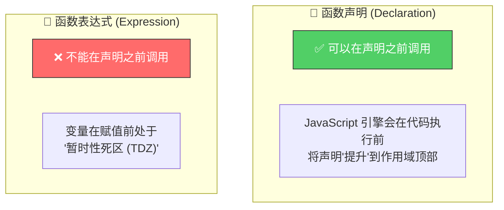
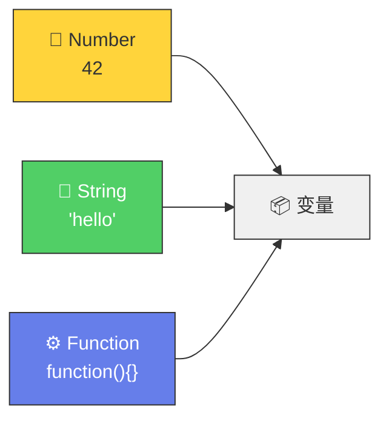
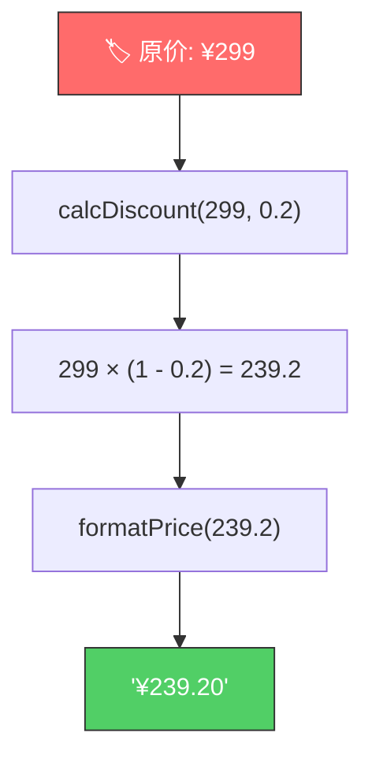

# 函数声明 vs 函数表达式（Function Declarations vs. Expressions）

> 📺 来源：004 Function Declarations vs. Expressions.en.srt
> 📂 章节：第 03 章

## 📌 知识脉络
- **前置知识**：函数基础（定义、调用、参数、返回值）、变量声明（`let`、`const`）
- **后续扩展**：箭头函数（Arrow Function）、提升（Hoisting）、一等公民（First-Class Functions）

## 🎯 概述

JavaScript 中有两种基本的函数创建方式：**函数声明（Function Declaration）** 和 **函数表达式（Function Expression）**。它们语法相似、功能相同，但在**提升行为（Hoisting）** 上有关键区别。理解这两者是掌握 JavaScript 函数系统的基础。

## 核心知识点

### 1. 函数声明（Function Declaration）

> 🧩 **生活类比**：函数声明就像在公司给一个**正式员工**起名字——HR 档案里有他的名字，即使你还没见过他本人，直接在公司喊他名字他就会来报到（可以在声明前调用）。

```js {runnable} {title="declaration.js"}
'use strict';

// 函数声明：使用 function 关键字 + 函数名
function calcAge1(birthYear) {
  return 2037 - birthYear;
}

const age1 = calcAge1(1991);
console.log(age1); // 46
```

**特点**：使用 `function` 关键字直接定义一个**具名函数**。

---

### 2. 函数表达式（Function Expression）

> 🧩 **生活类比**：函数表达式就像雇佣了一个**匿名临时工**——他没有自己的名牌，而是你把他安排在一个工位上（存入变量），以后通过工位号（变量名）来找他。

```js {runnable} {title="expression.js"}
'use strict';

// 函数表达式：将匿名函数赋值给变量
const calcAge2 = function (birthYear) {
  return 2037 - birthYear;
};

const age2 = calcAge2(1991);
console.log(age2); // 46
```

**特点**：函数本身没有名字（匿名函数 / Anonymous Function），被当作**值**存储在变量中。

---

### 3. 核心区别：提升行为（Hoisting）



**🔍 执行追踪**：提升行为对比

```js
// ✅ 函数声明：可以在定义前调用
const age1 = calcAge1(1991); // 正常工作！返回 46
console.log(age1);           // 46

function calcAge1(birthYear) {
  return 2037 - birthYear;
}
```

```js
// ❌ 函数表达式：不能在定义前调用
const age2 = calcAge2(1991); // 🚨 ReferenceError!

const calcAge2 = function (birthYear) {
  return 2037 - birthYear;
};
```

| 步骤 | 函数声明 | 函数表达式 |
|------|---------|-----------|
| ① 代码加载 | 函数被**提升**到顶部，立即可用 | 变量 `calcAge2` 存在但尚未赋值 |
| ② 调用 `calcAge(1991)` | ✅ 正常执行，返回 `46` | ❌ `ReferenceError` |
| ③ 到达定义位置 | —（已在步骤①就绑定了） | 此时才将函数赋值给变量 |

---

### 4. 函数是"值"—— JavaScript 的一等公民

> 🧩 **生活类比**：在 JavaScript 的世界里，函数不是什么高高在上的特殊公民——它和数字 `42`、字符串 `'hello'` 一样，只是一个**可以存入变量、传来传去的值**。



这就是为什么我们可以把函数表达式存入变量——因为**函数就是值**。

---

### 5. 该用哪种？个人偏好

**📊 函数声明 vs 函数表达式 全面对比：**

| 维度 | 函数声明 (Declaration) | 函数表达式 (Expression) |
|------|----------------------|----------------------|
| 语法 | `function name() {}` | `const name = function() {}` |
| 函数名 | 有名字（具名） | 通常匿名 |
| 提升 | ✅ 声明前可调用 | ❌ 必须先定义后调用 |
| 值特性 | 是语句 | 产生值，可赋给变量 |
| Jonas 偏好 | — | ✅ 强制先定义后使用，代码更有结构 |

> 💡 **记忆口诀**：**声明会"飞"（提升），表达式要"排队"（先定义后调用）**

---

## 🛠️ 代码实战与真实场景

> **💼 业务场景**：电商平台需要根据会员等级计算折扣价，分别用两种写法实现。

```js {runnable} {title="discount_calc.js"}
'use strict';

// 方式一：函数声明
function calcDiscount(price, discountRate) {
  return price * (1 - discountRate);
}

// 方式二：函数表达式
const formatPrice = function (amount) {
  return `¥${amount.toFixed(2)}`;
};

// 使用
const originalPrice = 299;
const vipDiscount = 0.2; // VIP 打 8 折

const finalPrice = calcDiscount(originalPrice, vipDiscount);
console.log(formatPrice(finalPrice));
// 输出: ¥239.20
```



**📊 输入输出示例：**
| 原价 | 折扣率 | 最终价格 | 说明 |
|------|--------|---------|------|
| `299` | `0.2` | ¥239.20 | VIP 打 8 折 |
| `99` | `0.1` | ¥89.10 | 普通会员 9 折 |
| `599` | `0` | ¥599.00 | 无折扣 |

## 💡 关键要点
- ✅ **函数声明**使用 `function name() {}` 语法，可以在声明之前调用（提升）
- ✅ **函数表达式**将匿名函数赋给变量，必须先定义后调用
- ✅ 在 JavaScript 中，**函数就是值**（一等公民），可以存入变量
- ✅ 两种写法功能相同，选择哪一种主要看**个人偏好**
- ✅ 两种都必须掌握，因为在不同场景下都会用到

## ⚠️ 常见误区
- ⚠️ **误区 1**：以为函数表达式也能在定义前调用——不行！会抛出 `ReferenceError`
- ⚠️ **误区 2**：以为两种写法完全等价——提升行为是实实在在的差异
- ⚠️ **误区 3**：把函数表达式的分号忘了——它本质是赋值语句，末尾应有 `;`

## 🐛 报错实验室

**❌ 错误写法：**
```js
'use strict';

// 试图在函数表达式定义前调用
const result = calcAge(1991);

const calcAge = function (birthYear) {
  return 2037 - birthYear;
};
```

**浏览器报错：**
```
Uncaught ReferenceError: Cannot access 'calcAge' before initialization
    at script.js:4:16
```

**🔑 解读**：用 `const` 声明的变量在赋值前处于**暂时性死区（TDZ, Temporal Dead Zone）**，尝试在初始化之前访问会直接报错。函数表达式依赖变量赋值，所以必须在赋值语句**之后**才能调用。

---

## 📖 词汇速查表 (Cheat Sheet)
| 中文术语 | 英文术语 | 简明释义 | 速查代码 | 📚 官方文档 |
|---------|---------|---------|---------|-----------|
| 函数声明 | Function Declaration | 用 function 关键字定义的具名函数 | `function fn() {}` | [MDN](https://developer.mozilla.org/zh-CN/docs/Web/JavaScript/Reference/Statements/function) |
| 函数表达式 | Function Expression | 将匿名函数赋给变量的写法 | `const fn = function() {}` | [MDN](https://developer.mozilla.org/zh-CN/docs/Web/JavaScript/Reference/Operators/function) |
| 匿名函数 | Anonymous Function | 没有名字的函数 | `function() {}` | [MDN](https://developer.mozilla.org/zh-CN/docs/Web/JavaScript/Reference/Functions) |
| 提升 | Hoisting | 声明被"移到"作用域顶部的行为 | — | [MDN](https://developer.mozilla.org/zh-CN/docs/Glossary/Hoisting) |
| 一等公民 | First-Class Citizen | 函数可以当作值来使用 | — | — |

---

## 🧪 学习验证

### 📝 动手练习

**练习 1：BMI 计算器——两种写法**
```js {runnable} {title="exercise1.js"}
'use strict';

// 用函数声明写一个 calcBMI 函数
// BMI = 体重(kg) / 身高(m)²
// 你的代码：


// 用函数表达式写一个 describeBMI 函数
// 返回: "BMI 为 XX.X，属于 YY"
// BMI < 18.5 → 偏瘦，18.5~24.9 → 正常，25+ → 偏重
// 你的代码：


// 测试
console.log(describeBMI(calcBMI(70, 1.75)));
console.log(describeBMI(calcBMI(55, 1.70)));
```
<details><summary>💡 参考答案</summary>

```js
'use strict';

// 函数声明
function calcBMI(weight, height) {
  return weight / (height ** 2);
}

// 函数表达式
const describeBMI = function (bmi) {
  const rounded = bmi.toFixed(1);
  if (bmi < 18.5) return `BMI 为 ${rounded}，属于偏瘦`;
  if (bmi < 25) return `BMI 为 ${rounded}，属于正常`;
  return `BMI 为 ${rounded}，属于偏重`;
};

console.log(describeBMI(calcBMI(70, 1.75)));
// BMI 为 22.9，属于正常
console.log(describeBMI(calcBMI(55, 1.70)));
// BMI 为 19.0，属于正常
```
**解题思路**：`calcBMI` 用函数声明，负责纯计算；`describeBMI` 用函数表达式，负责格式化输出。两个函数各司其职。
</details>

**练习 2：验证提升行为**
```js {runnable} {title="exercise2.js"}
'use strict';

// 思考题：下面代码能正常运行吗？为什么？
// 先猜测结果，再运行验证

console.log(multiply(3, 4));

function multiply(a, b) {
  return a * b;
}
```
<details><summary>💡 参考答案</summary>

```js
// ✅ 能正常运行！输出 12
// 因为 multiply 是函数声明，会被提升到作用域顶部
// 所以即使在定义之前调用也不会报错
```
**解题思路**：函数声明具有**提升（Hoisting）**特性，JavaScript 引擎在执行代码前会先处理所有函数声明，使其在整个作用域内都可用。
</details>

### ❓ 理解检测

:::quiz {correct="B"}
**1. 函数声明和函数表达式的最大实际区别是什么？**
- A) 函数声明不能有返回值
- B) 函数声明可以在定义之前调用，函数表达式不行
- C) 函数表达式执行速度更快
- D) 函数声明必须有参数

> **解析**：函数声明具有提升（Hoisting）特性，可以在代码中定义之前就被调用。函数表达式存储在变量中，必须在赋值之后才能使用。
:::

:::quiz {correct="C"}
**2. 以下哪个说法是正确的？**
- A) JavaScript 中函数是一种特殊的数据类型
- B) 函数表达式必须有名字
- C) JavaScript 中函数是值（value），可以存储在变量中
- D) 函数声明不能存在变量中

> **解析**：在 JavaScript 中，函数是值（一等公民），可以像数字、字符串一样存入变量、传递给其他函数。函数表达式正是利用了这一特性。
:::

:::quiz {correct="A"}
**3. `const greet = function(name) { return 'Hi ' + name; };` 这是什么类型的函数？**
- A) 函数表达式
- B) 函数声明
- C) 箭头函数
- D) 构造函数

> **解析**：将一个匿名函数赋值给变量 `greet`，这就是典型的函数表达式（Function Expression）。
:::

### 🔧 代码填空

:::fill-blank
// 函数声明
___function___ calcAge(birthYear) {
  return 2037 - birthYear;
}

// 函数表达式
const calcAge2 = ___function___ (birthYear) {
  ___return___ 2037 - birthYear;
};
:::
