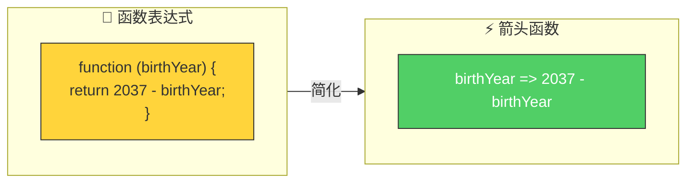
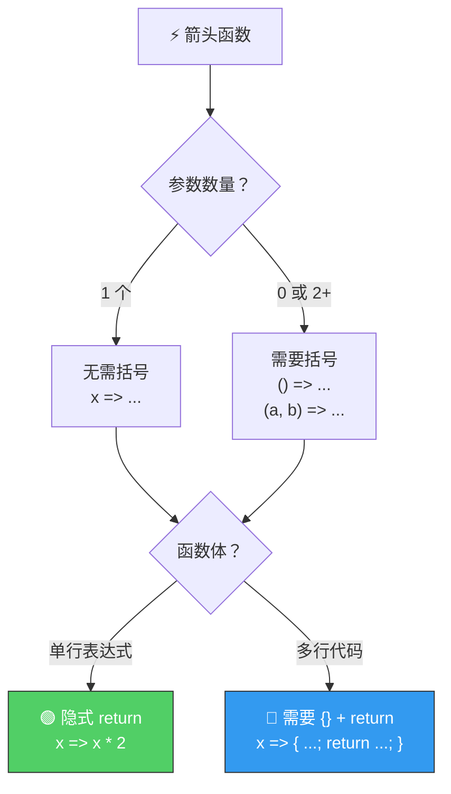
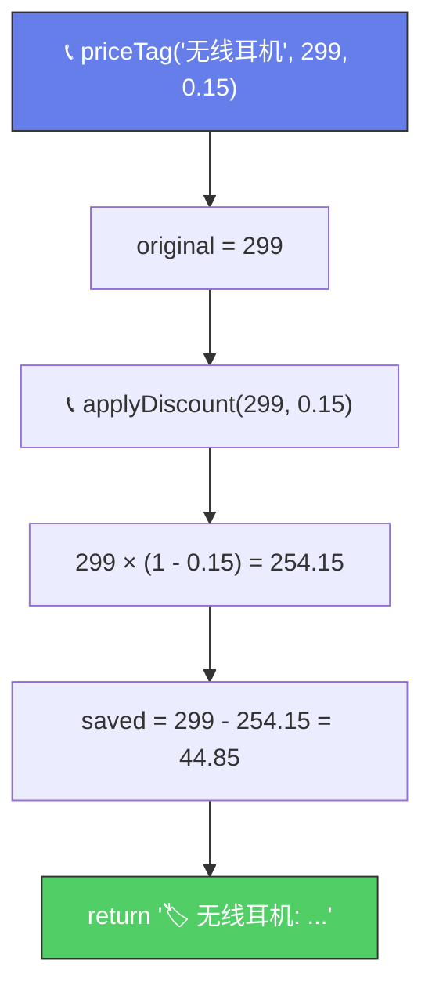

# 箭头函数（Arrow Functions）

> 📺 来源：005 Arrow Functions.en.srt
> 📂 章节：第 03 章

## 📌 知识脉络
- **前置知识**：函数声明（Function Declaration）、函数表达式（Function Expression）、模板字符串
- **后续扩展**：`this` 关键字、回调函数（Callback）、数组方法中的箭头函数（`.map()`、`.filter()`）

## 🎯 概述

箭头函数（Arrow Function）是 ES6 新增的第三种函数写法，是函数表达式的简写形式。它语法更简洁，特别适合**一行即返回**的简单场景。但箭头函数没有自己的 `this` 关键字，这在后续课程中会深入讲解。

## 核心知识点

### 1. 最简形式：一个参数 + 一行代码

> 🧩 **生活类比**：如果说函数声明是写一封**正式信件**（信头、正文、落款一个都不能少），那箭头函数就是发一条**短信**——省去一切格式，核心信息直接发出。

```js {runnable} {title="arrow_basic.js"}
'use strict';

// 函数表达式（传统写法）
const calcAge2 = function (birthYear) {
  return 2037 - birthYear;
};

// 箭头函数（简写）
const calcAge3 = birthYear => 2037 - birthYear;

const age = calcAge3(1991);
console.log(age); // 46
```

**三大简化：**
1. 不需要 `function` 关键字
2. 不需要花括号 `{}`
3. 不需要 `return` 关键字（**隐式返回**）



---

### 2. 多行代码：需要花括号 + 显式 return

当函数体超过一行时，必须用 `{}` 包裹并显式写 `return`：

```js {runnable} {title="arrow_multiline.js"}
'use strict';

const yearsUntilRetirement = birthYear => {
  const age = 2037 - birthYear;
  const retirement = 65 - age;
  return retirement; // 多行时必须显式 return
};

console.log(yearsUntilRetirement(1991)); // 19
console.log(yearsUntilRetirement(1980)); // 8
```

**🔍 执行追踪**：`yearsUntilRetirement(1991)`

| 步骤 | 代码 | `birthYear` | `age` | `retirement` | 说明 |
|------|------|------------|-------|-------------|------|
| ① | 调用函数 | `1991` | — | — | 参数传入 |
| ② | `const age = 2037 - 1991` | `1991` | `46` | — | 计算年龄 |
| ③ | `const retirement = 65 - 46` | `1991` | `46` | `19` | 距退休年数 |
| ④ | `return retirement` | — | — | — | 返回 19 |

---

### 3. 多个参数：需要括号包裹

```js {runnable} {title="arrow_params.js"}
'use strict';

// 多参数 + 多行
const yearsUntilRetirement = (birthYear, firstName) => {
  const age = 2037 - birthYear;
  const retirement = 65 - age;
  return `${firstName} retires in ${retirement} years`;
};

console.log(yearsUntilRetirement(1991, 'Jonas')); 
// Jonas retires in 19 years
console.log(yearsUntilRetirement(1980, 'Bob'));   
// Bob retires in 8 years
```

---

### 4. 箭头函数的三种形态总结



**📊 箭头函数形态对比：**

| 场景 | 语法 | 示例 |
|------|------|------|
| 1 参数 + 1 行 | `param => expr` | `x => x * 2` |
| 0 参数 + 1 行 | `() => expr` | `() => 42` |
| 多参数 + 1 行 | `(a, b) => expr` | `(a, b) => a + b` |
| 1 参数 + 多行 | `param => { ... return }` | `x => { ...; return x; }` |
| 多参数 + 多行 | `(a, b) => { ... return }` | `(a, b) => { ...; return a + b; }` |

> 💡 **记忆口诀**：**一参一行最省力，多参多行回老路** —— 参数和代码一多，就需要括号和 `return` 回归"正常形态"。

---

### 5. 箭头函数 vs 传统函数

| 维度 | 函数声明 / 表达式 | 箭头函数 |
|------|------------------|---------|
| `this` 关键字 | ✅ 有自己的 `this` | ❌ 没有，继承外层的 `this` |
| `arguments` 对象 | ✅ 有 | ❌ 没有 |
| 提升（Hoisting） | 声明可提升 | ❌ 不可提升 |
| 简洁度 | 较冗长 | ⚡ 简洁（尤其单行） |
| 适用场景 | 对象方法、需要 `this` | 回调函数、简单逻辑 |

> ⚠️ 关于 `this` 的区别将在后续章节详细讲解。目前阶段，主要使用**函数表达式**，仅在简单一行函数时使用箭头函数。

---

## 🛠️ 代码实战与真实场景

> **💼 业务场景**：在线商城需要批量计算商品的折扣价和最终显示价格，用箭头函数简化计算逻辑。

```js {runnable} {title="shop_pricing.js"}
'use strict';

// 一行箭头函数：计算折扣价
const applyDiscount = (price, rate) => price * (1 - rate);

// 多行箭头函数：生成价格标签
const priceTag = (name, price, discountRate) => {
  const original = price;
  const final = applyDiscount(price, discountRate);
  const saved = original - final;
  return `🏷️ ${name}: 原价¥${original} → 折后¥${final.toFixed(2)} (省¥${saved.toFixed(2)})`;
};

console.log(priceTag('无线耳机', 299, 0.15));
// 🏷️ 无线耳机: 原价¥299 → 折后¥254.15 (省¥44.85)
console.log(priceTag('机械键盘', 599, 0.3));
// 🏷️ 机械键盘: 原价¥599 → 折后¥419.30 (省¥179.70)
```



**📊 输入输出示例：**
| 商品名 | 原价 | 折扣率 | 输出 |
|--------|------|--------|------|
| 无线耳机 | `299` | `0.15` | 原价¥299 → 折后¥254.15 (省¥44.85) |
| 机械键盘 | `599` | `0.3` | 原价¥599 → 折后¥419.30 (省¥179.70) |
| 鼠标垫 | `49` | `0` | 原价¥49 → 折后¥49.00 (省¥0.00) |

## 💡 关键要点
- ✅ 箭头函数是 ES6 新增的函数表达式简写形式
- ✅ 单行单参数时最简洁：`param => expression`（隐式返回）
- ✅ 多行代码必须用 `{}` 包裹并显式 `return`
- ✅ 多参数必须用 `()` 包裹
- ✅ 箭头函数**没有自己的 `this`**——目前阶段，复杂函数优先用函数表达式

## ⚠️ 常见误区
- ⚠️ **误区 1**：多行箭头函数忘写 `return`——有 `{}` 就必须显式 `return`，否则返回 `undefined`
- ⚠️ **误区 2**：以为箭头函数可以完全替代传统函数——由于 `this` 行为差异，在对象方法中**不适合**使用箭头函数
- ⚠️ **误区 3**：单参数时多写了括号——虽然 `(x) => x * 2` 也合法，但 `x => x * 2` 更简洁

## 🐛 报错实验室

**❌ 错误写法：**
```js
'use strict';

const calcAge = birthYear => {
  const age = 2037 - birthYear;
  age; // ⚠️ 忘记写 return！
};

console.log(calcAge(1991)); // undefined 😱
```

**浏览器报错：**
```
（无报错，但输出 undefined）
```

**🔑 解读**：使用了 `{}` 就意味着进入了"多行模式"，此时**隐式返回失效**。必须显式写 `return age;` 才能返回值。没有 `return` 的函数默认返回 `undefined`。

---

## 📖 词汇速查表 (Cheat Sheet)
| 中文术语 | 英文术语 | 简明释义 | 速查代码 | 📚 官方文档 |
|---------|---------|---------|---------|-----------|
| 箭头函数 | Arrow Function | ES6 简写函数表达式 | `x => x * 2` | [MDN](https://developer.mozilla.org/zh-CN/docs/Web/JavaScript/Reference/Functions/Arrow_functions) |
| 隐式返回 | Implicit Return | 单行箭头函数自动返回表达式值 | `x => x + 1` | — |
| 显式返回 | Explicit Return | 多行时必须手写 return | `x => { return x + 1; }` | — |

---

## 🧪 学习验证

### 📝 动手练习

**练习 1：用箭头函数重写**
```js {runnable} {title="exercise1.js"}
'use strict';

// 将下面的函数表达式改写为箭头函数（尽量简洁）
const double = function (n) {
  return n * 2;
};

const greet = function (name) {
  return `Hello, ${name}!`;
};

const add = function (a, b) {
  return a + b;
};

// 测试（不要修改下面的测试代码）
console.log(double(5));     // 10
console.log(greet('Jonas')); // Hello, Jonas!
console.log(add(3, 7));     // 10
```
<details><summary>💡 参考答案</summary>

```js
'use strict';

const double = n => n * 2;
const greet = name => `Hello, ${name}!`;
const add = (a, b) => a + b;

console.log(double(5));      // 10
console.log(greet('Jonas')); // Hello, Jonas!
console.log(add(3, 7));      // 10
```
**解题思路**：这三个函数都是单行逻辑，非常适合用箭头函数的最简形式。`double` 和 `greet` 只有一个参数，连括号都不需要。`add` 有两个参数，需要用括号包裹。
</details>

**练习 2：退休年龄计算器**
```js {runnable} {title="exercise2.js"}
'use strict';

// 编写箭头函数 canRetire，接收 birthYear 和 country
// - 中国退休年龄: 60
// - 欧洲退休年龄: 65
// - 美国退休年龄: 67
// 返回格式: "还需工作 X 年" 或 "已可退休！"
// 假设当前年份为 2037


// 测试
console.log(canRetire(1991, '中国'));  // 还需工作 14 年
console.log(canRetire(1970, '欧洲'));  // 已可退休！
```
<details><summary>💡 参考答案</summary>

```js
'use strict';

const canRetire = (birthYear, country) => {
  const age = 2037 - birthYear;
  let retireAge;
  if (country === '中国') retireAge = 60;
  else if (country === '欧洲') retireAge = 65;
  else retireAge = 67;
  
  const yearsLeft = retireAge - age;
  return yearsLeft > 0 ? `还需工作 ${yearsLeft} 年` : '已可退休！';
};

console.log(canRetire(1991, '中国'));  // 还需工作 14 年
console.log(canRetire(1970, '欧洲'));  // 已可退休！
```
**解题思路**：多行逻辑用 `{}`，根据国家选择退休年龄，计算剩余年数后用三元运算符返回不同消息。
</details>

### ❓ 理解检测

:::quiz {correct="C"}
**1. 以下箭头函数的返回值是什么？`const fn = x => { x * 2 };  fn(5);`**
- A) `10`
- B) `5`
- C) `undefined`
- D) 报错

> **解析**：使用了 `{}`（花括号），进入多行模式，隐式返回**失效**。`x * 2` 只是一个表达式，没有被 `return`，所以函数返回 `undefined`。正确写法：`x => { return x * 2; }` 或 `x => x * 2`。
:::

:::quiz {correct="B"}
**2. 下面哪个箭头函数的写法是正确的？**
- A) `const fn = => 42;`
- B) `const fn = () => 42;`
- C) `const fn = => () 42;`
- D) `const fn = () 42 =>;`

> **解析**：零参数的箭头函数必须用空括号 `()` 表示"没有参数"，然后跟箭头 `=>`，再写返回值。
:::

:::quiz {correct="A"}
**3. 箭头函数和传统函数的最重要区别是什么？**
- A) 箭头函数没有自己的 `this` 关键字
- B) 箭头函数不能接收参数
- C) 箭头函数不能返回值
- D) 箭头函数运行速度更快

> **解析**：箭头函数不绑定自己的 `this`，而是继承外层作用域的 `this`。这在对象方法和事件处理中有重要影响（后续章节详解）。
:::

### 🔧 代码填空

:::fill-blank
// 一行箭头函数（隐式返回）
const square = ___x => x * x___;

// 多行箭头函数（显式返回）
const describe = name ___=>___ {
  const msg = `My name is ${name}`;
  ___return___ msg;
};
:::
