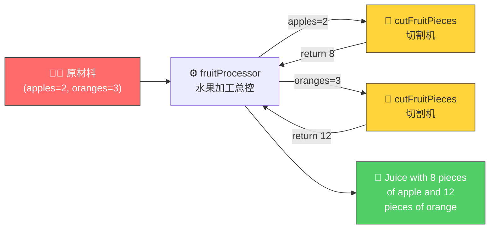
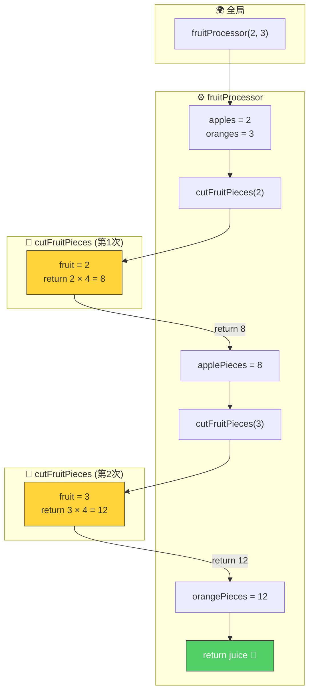
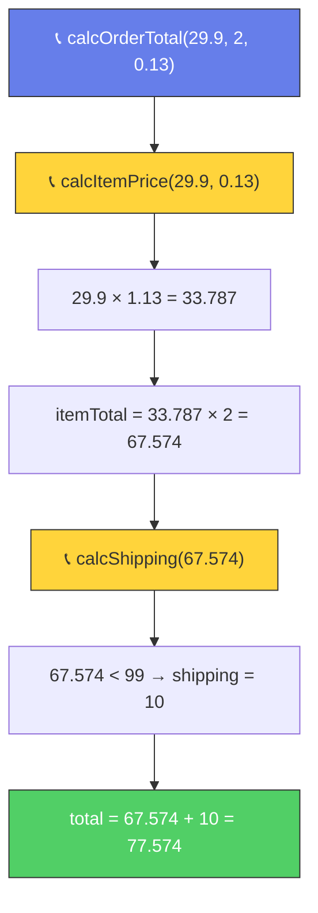

# 函数调用函数（Functions Calling Other Functions）

> 📺 来源：006 Functions Calling Other Functions.en.srt
> 📂 章节：第 03 章

## 📌 知识脉络
- **前置知识**：函数基础（定义、参数、返回值、调用）、DRY 原则
- **后续扩展**：回调函数（Callback）、调用栈（Call Stack）、执行上下文（Execution Context）

## 🎯 概述

在 JavaScript 中，一个函数可以在其内部**调用另一个函数**。这是日常开发中极其常见的模式，也是践行 DRY 原则的关键手段。理解函数间的**数据流动**是掌握这一模式的核心。

## 核心知识点

### 1. 函数调用函数的基本模式

> 🧩 **生活类比**：想象一条**工厂流水线**🏭——「榨汁机」（fruitProcessor）负责制作果汁，但它需要先把水果交给「切割机」（cutFruitPieces）切成小块，切好后再拿回来榨汁。两台机器**各司其职**，通过传递物料（数据）协作完成任务。



```js {runnable} {title="functions_calling.js"}
'use strict';

// 切割机：将水果切成 4 块
function cutFruitPieces(fruit) {
  return fruit * 4;
}

// 榨汁机：调用切割机后制作果汁
function fruitProcessor(apples, oranges) {
  const applePieces = cutFruitPieces(apples);   // 调用切割函数
  const orangePieces = cutFruitPieces(oranges); // 再次调用

  const juice = `Juice with ${applePieces} pieces of apple and ${orangePieces} pieces of orange.`;
  return juice;
}

console.log(fruitProcessor(2, 3));
// Juice with 8 pieces of apple and 12 pieces of orange.
```

---

### 2. 数据流动详解

**🔍 执行追踪**：`fruitProcessor(2, 3)` 的完整数据流

| 步骤 | 所在函数 | 代码 | 关键变量 | 说明 |
|------|---------|------|---------|------|
| ① | 全局 | `fruitProcessor(2, 3)` | `apples=2, oranges=3` | 调用主函数 |
| ② | fruitProcessor | `cutFruitPieces(apples)` | `apples=2` | 将 2 传入切割函数 |
| ③ | cutFruitPieces | `return fruit * 4` | `fruit=2` → `return 8` | 2 × 4 = 8 |
| ④ | fruitProcessor | `applePieces = 8` | `applePieces=8` | 捕获返回值 |
| ⑤ | fruitProcessor | `cutFruitPieces(oranges)` | `oranges=3` | 将 3 传入切割函数 |
| ⑥ | cutFruitPieces | `return fruit * 4` | `fruit=3` → `return 12` | 3 × 4 = 12 |
| ⑦ | fruitProcessor | `orangePieces = 12` | `orangePieces=12` | 捕获返回值 |
| ⑧ | fruitProcessor | `return juice` | — | 返回最终果汁字符串 |



> 💡 **记忆口诀**：**数据像快递——从外函数"发货"给内函数，内函数"签收"处理后再"退回"结果**

---

### 3. 为什么不直接写 `apples * 4`？ —— DRY 原则

:::code-comparison
```js {title="🚨 重复写法 (The Naive Way)"}
function fruitProcessor(apples, oranges) {
  // ⚠️ 如果要改成切 3 块，需要改两处！
  const applePieces = apples * 4;
  const orangePieces = oranges * 4;
  // 如果有 10 种水果，就要改 10 处...
  return `${applePieces} + ${orangePieces}`;
}
```
```js {title="✨ DRY 重构写法 (The Refactored Way)"}
function cutFruitPieces(fruit) {
  return fruit * 4; // ✅ 只需改这一处！
}

function fruitProcessor(apples, oranges) {
  const applePieces = cutFruitPieces(apples);
  const orangePieces = cutFruitPieces(oranges);
  return `${applePieces} + ${orangePieces}`;
}
```
:::

**优势**：当切割逻辑需要变化时（比如从 4 块改为 3 块），只需修改 `cutFruitPieces` 一处，所有调用它的代码自动生效。

---

## 🛠️ 代码实战与真实场景

> **💼 业务场景**：电商平台的订单系统——订单总价的计算需要调用「单品价格计算」和「运费计算」两个独立函数。

```js {runnable} {title="order_system.js"}
'use strict';

// 计算单品含税价格
function calcItemPrice(price, taxRate) {
  return price * (1 + taxRate);
}

// 计算运费（满 99 免运费）
function calcShipping(subtotal) {
  return subtotal >= 99 ? 0 : 10;
}

// 订单总价：调用上面两个函数
function calcOrderTotal(price, quantity, taxRate) {
  const itemTotal = calcItemPrice(price, taxRate) * quantity;
  const shipping = calcShipping(itemTotal);
  const total = itemTotal + shipping;
  return `小计: ¥${itemTotal.toFixed(2)} | 运费: ¥${shipping} | 总计: ¥${total.toFixed(2)}`;
}

console.log(calcOrderTotal(29.9, 2, 0.13));
// 小计: ¥67.57 | 运费: ¥10 | 总计: ¥77.57

console.log(calcOrderTotal(99, 1, 0.13));
// 小计: ¥111.87 | 运费: ¥0 | 总计: ¥111.87
```



**📊 输入输出示例：**
| 单价 | 数量 | 税率 | 小计 | 运费 | 总计 |
|------|------|------|------|------|------|
| `29.9` | `2` | `0.13` | ¥67.57 | ¥10 | ¥77.57 |
| `99` | `1` | `0.13` | ¥111.87 | ¥0 | ¥111.87 |
| `15` | `5` | `0.06` | ¥79.50 | ¥10 | ¥89.50 |

## 💡 关键要点
- ✅ 函数可以在内部**调用其他函数**，这是 JavaScript 中极其常见的模式
- ✅ 内层函数的**返回值**可以被外层函数**捕获并使用**
- ✅ 将逻辑拆分到独立函数中是践行 **DRY 原则**的重要手段
- ✅ 数据通过**参数传入**、**返回值传出**在函数间流动
- ✅ 修改被调用函数的逻辑时，所有调用处**自动生效**

## ⚠️ 常见误区
- ⚠️ **误区 1**：忘记捕获内层函数的返回值——调用了函数但没用变量接收结果，返回值就丢失了
- ⚠️ **误区 2**：以为内层函数能直接访问外层函数的参数名——它们有各自独立的参数（除非是嵌套定义的闭包，后续章节讲解）

## 🐛 报错实验室

**❌ 错误写法：**
```js
'use strict';

function double(x) {
  return x * 2;
}

function processAndLog(value) {
  double(value);  // ⚠️ 调用了但没用返回值！
  console.log(value); // 仍然是原始值
}

processAndLog(5); // 输出 5，而非 10
```

**浏览器报错：**
```
（无报错，但输出 5 而非预期的 10）
```

**🔑 解读**：`double(value)` 虽然被调用了，也正确返回了 `10`，但这个返回值**没有被任何变量捕获**。`value` 仍然是传入时的 `5`。正确做法：`const result = double(value); console.log(result);`

---

## 📖 词汇速查表 (Cheat Sheet)
| 中文术语 | 英文术语 | 简明释义 | 速查代码 | 📚 官方文档 |
|---------|---------|---------|---------|-----------|
| 函数调用 | Function Call / Invocation | 执行函数 | `fn()` | [MDN](https://developer.mozilla.org/zh-CN/docs/Web/JavaScript/Guide/Functions#calling_functions) |
| 调用栈 | Call Stack | 跟踪函数调用顺序的机制 | — | [MDN](https://developer.mozilla.org/zh-CN/docs/Glossary/Call_stack) |
| DRY 原则 | Don't Repeat Yourself | 避免代码重复 | — | — |

---

## 🧪 学习验证

### 📝 动手练习

**练习 1：温度警报系统**
```js {runnable} {title="exercise1.js"}
'use strict';

// 1. 写一个函数 celsiusToFahrenheit(c) 将摄氏度转为华氏度
//    公式: F = C × 9/5 + 32

// 2. 写一个函数 checkTemp(celsius) 调用上面的函数
//    如果华氏温度 > 104 返回 "🚨 高温警报！XX°C = YY°F"
//    否则返回 "✅ 温度正常：XX°C = YY°F"


// 测试
console.log(checkTemp(38));  // ✅ 温度正常
console.log(checkTemp(42));  // 🚨 高温警报
```
<details><summary>💡 参考答案</summary>

```js
'use strict';

function celsiusToFahrenheit(c) {
  return c * 9 / 5 + 32;
}

function checkTemp(celsius) {
  const fahrenheit = celsiusToFahrenheit(celsius);
  if (fahrenheit > 104) {
    return `🚨 高温警报！${celsius}°C = ${fahrenheit}°F`;
  }
  return `✅ 温度正常：${celsius}°C = ${fahrenheit}°F`;
}

console.log(checkTemp(38));  // ✅ 温度正常：38°C = 100.4°F
console.log(checkTemp(42));  // 🚨 高温警报！42°C = 107.6°F
```
**解题思路**：`checkTemp` 内部调用 `celsiusToFahrenheit` 获取华氏温度，再根据阈值判断返回不同字符串。
</details>

**练习 2：成绩等级计算器**
```js {runnable} {title="exercise2.js"}
'use strict';

// 1. 写 calcAverage(a, b, c) 计算三科平均分
// 2. 写 getGrade(average) 返回等级：90+ A，80+ B，70+ C，60+ D，否则 F
// 3. 写 reportCard(math, eng, sci) 调用上面两个函数
//    返回 "平均分: XX, 等级: Y"


// 测试
console.log(reportCard(95, 88, 92));  // 平均分: 91.67, 等级: A
console.log(reportCard(70, 65, 72));  // 平均分: 69, 等级: D
```
<details><summary>💡 参考答案</summary>

```js
'use strict';

function calcAverage(a, b, c) {
  return (a + b + c) / 3;
}

function getGrade(average) {
  if (average >= 90) return 'A';
  if (average >= 80) return 'B';
  if (average >= 70) return 'C';
  if (average >= 60) return 'D';
  return 'F';
}

function reportCard(math, eng, sci) {
  const avg = calcAverage(math, eng, sci);
  const grade = getGrade(avg);
  return `平均分: ${avg.toFixed(2)}, 等级: ${grade}`;
}

console.log(reportCard(95, 88, 92));  // 平均分: 91.67, 等级: A
console.log(reportCard(70, 65, 72));  // 平均分: 69.00, 等级: D
```
**解题思路**：三个函数各负其责——`calcAverage` 纯计算，`getGrade` 做判断，`reportCard` 做总控和格式化输出。
</details>

### ❓ 理解检测

:::quiz {correct="B"}
**1. 在 `fruitProcessor` 内调用 `cutFruitPieces(apples)` 时，`cutFruitPieces` 的 `fruit` 参数的值是什么？**
- A) 字符串 `'apples'`
- B) `apples` 变量当前的值（即传给 `fruitProcessor` 的实参）
- C) `undefined`
- D) 数字 `4`

> **解析**：`cutFruitPieces(apples)` 中的 `apples` 是 `fruitProcessor` 的参数，它持有调用时传入的实际数值。这个值被作为实参传给 `cutFruitPieces`，赋给其 `fruit` 参数。
:::

:::quiz {correct="C"}
**2. 为什么要把切割逻辑单独写成 `cutFruitPieces` 函数？**
- A) 因为 JavaScript 要求必须这样写
- B) 因为箭头函数不能写在主函数里
- C) 遵循 DRY 原则——修改切割逻辑时只需改一处
- D) 因为这样代码运行速度更快

> **解析**：将切割逻辑抽成独立函数后，如果需要修改（比如从切 4 块改为 3 块），只需修改一个位置，所有调用处自动生效。
:::

:::quiz {correct="A"}
**3. 以下代码的输出是什么？**
```js
function add(a, b) { return a + b; }
function multiply(x) { return x * 3; }
console.log(multiply(add(2, 3)));
```
- A) `15`
- B) `9`
- C) `5`
- D) `6`

> **解析**：先执行 `add(2, 3)` 返回 `5`，这个返回值 `5` 作为实参传给 `multiply(5)`，返回 `5 × 3 = 15`。
:::

### 🔧 代码填空

:::fill-blank
function double(n) {
  ___return___ n * 2;
}

function quadruple(n) {
  return ___double___(double(n));
}

console.log(quadruple(3)); // 12
:::
