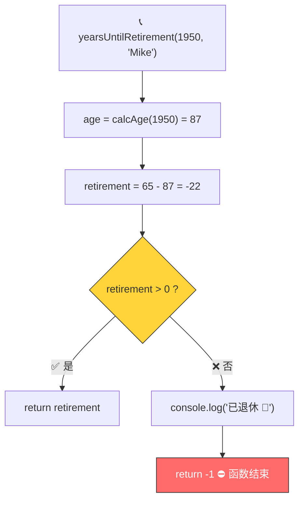
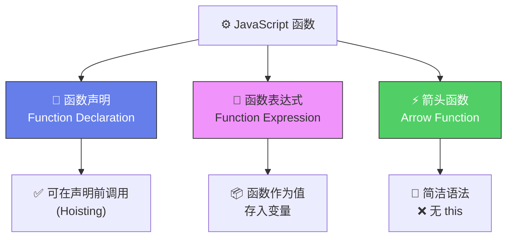
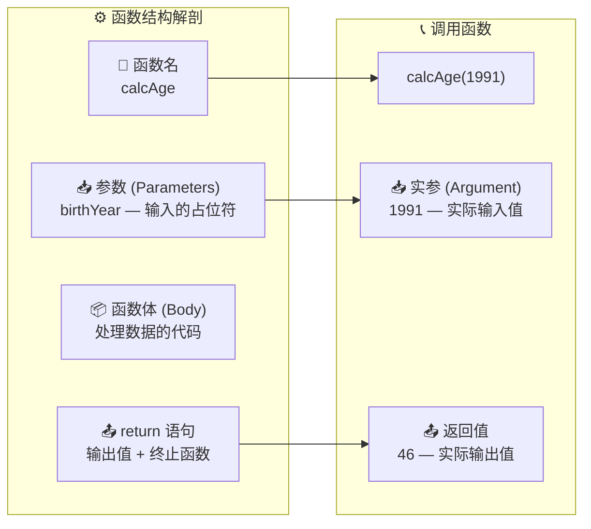
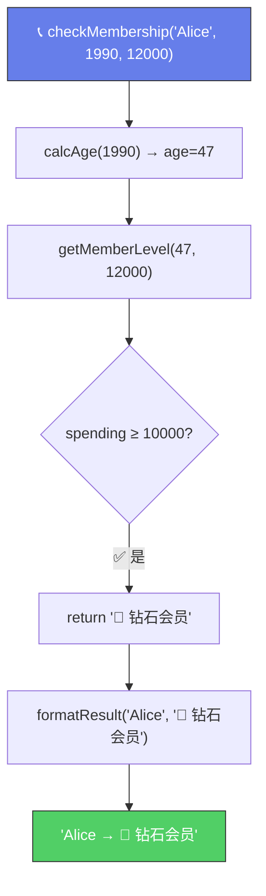

# 函数总结与回顾（Reviewing Functions）

> 📺 来源：007 Reviewing Functions.en.srt
> 📂 章节：第 03 章

## 📌 知识脉络
- **前置知识**：函数声明、函数表达式、箭头函数、参数与返回值、函数调用函数
- **后续扩展**：Coding Challenge #1、数组（Array）、对象方法（Object Methods）

## 🎯 概述

本节是对前几节所学的函数知识的全面回顾和总结。我们将通过一个综合示例复习 `return` 的行为（立即终止函数执行），并系统梳理三种函数类型的异同。

## 核心知识点

### 1. `return` 立即终止函数执行

> 🧩 **生活类比**：`return` 就像**快递签收**——一旦包裹交给收件人（调用者），快递员（函数）的任务就结束了，不会再做接下来的事（后续代码不执行）。

```js {runnable} {title="return_exits.js"}
'use strict';

const calcAge = function (birthYear) {
  return 2037 - birthYear;
};

const yearsUntilRetirement = function (birthYear, firstName) {
  const age = calcAge(birthYear);
  const retirement = 65 - age;
  
  if (retirement > 0) {
    console.log(`${firstName} retires in ${retirement} years`);
    return retirement;
    // ⚠️ 这行之后的代码不会执行！
  } else {
    console.log(`${firstName} has already retired 🎉`);
    return -1;
  }
};

console.log(yearsUntilRetirement(1991, 'Jonas')); // 19
console.log(yearsUntilRetirement(1950, 'Mike'));   // -1
```

**🔍 执行追踪**：`yearsUntilRetirement(1950, 'Mike')`

| 步骤 | 代码 | 变量状态 | 说明 |
|------|------|---------|------|
| ① | `calcAge(1950)` | `age = 87` | 调用内部函数计算年龄 |
| ② | `65 - 87` | `retirement = -22` | 负数意味着已退休 |
| ③ | `retirement > 0` ? | `false` | 进入 else 分支 |
| ④ | `console.log(...)` | — | 输出 "Mike has already retired 🎉" |
| ⑤ | `return -1` | — | 函数**立即终止**，返回 -1 |



> ⚠️ `return` 之后的代码永远不会执行——这叫做**死代码（Dead Code）**。

---

### 2. 三种函数类型全面对比



**📊 三种函数类型对比表：**

| 特性 | 函数声明 | 函数表达式 | 箭头函数 |
|------|---------|-----------|---------|
| 语法 | `function name() {}` | `const fn = function() {}` | `const fn = () => {}` |
| 提升（Hoisting） | ✅ 可以 | ❌ 不行 | ❌ 不行 |
| `this` 关键字 | ✅ 有 | ✅ 有 | ❌ 没有 |
| `arguments` 对象 | ✅ 有 | ✅ 有 | ❌ 没有 |
| 隐式返回 | ❌ 需 return | ❌ 需 return | ✅ 单行可省略 |
| 适用场景 | 通用 | 通用 | 简短回调 |

---

### 3. 函数解剖图



> 💡 **记忆口诀**：**名参体返——函数四要素；声表箭——函数三兄弟**

---

### 4. `console.log()` ≠ `return`

| 维度 | `console.log()` | `return` |
|------|-----------------|----------|
| 作用 | 打印内容到**开发者控制台** | 将值**送出函数** |
| 是否产生值 | ❌ 仅用于调试查看 | ✅ 产生可使用的值 |
| 是否终止函数 | ❌ 不终止 | ✅ 立即终止 |
| 本质 | 是另一个函数调用 | 是语句 |

---

## 🛠️ 代码实战与真实场景

> **💼 业务场景**：会员资格判断系统——根据用户年龄和消费金额判断会员等级，综合运用三种函数类型。

```js {runnable} {title="membership.js"}
'use strict';

// 函数声明：计算年龄
function calcAge(birthYear) {
  return 2037 - birthYear;
}

// 函数表达式：判断会员等级
const getMemberLevel = function (age, spending) {
  if (age < 18) return '🎓 青少年会员';
  if (spending >= 10000) return '💎 钻石会员';
  if (spending >= 5000) return '🥇 金牌会员';
  if (spending >= 1000) return '🥈 银牌会员';
  return '🥉 普通会员';
};

// 箭头函数：格式化输出
const formatResult = (name, level) => `${name} → ${level}`;

// 组合使用
function checkMembership(name, birthYear, spending) {
  const age = calcAge(birthYear);
  const level = getMemberLevel(age, spending);
  return formatResult(name, level);
}

console.log(checkMembership('Alice', 1990, 12000));
// Alice → 💎 钻石会员
console.log(checkMembership('Bob', 2025, 500));
// Bob → 🎓 青少年会员
console.log(checkMembership('Charlie', 1985, 3000));
// Charlie → 🥈 银牌会员
```



**📊 输入输出示例：**
| 姓名 | 出生年 | 消费额 | 年龄 | 会员等级 |
|------|--------|--------|------|---------|
| Alice | 1990 | 12000 | 47 | 💎 钻石会员 |
| Bob | 2025 | 500 | 12 | 🎓 青少年会员 |
| Charlie | 1985 | 3000 | 52 | 🥈 银牌会员 |

## 💡 关键要点
- ✅ `return` 做两件事：**输出值** + **终止函数**，之后的代码不会执行
- ✅ 三种函数类型（声明、表达式、箭头）都能接收参数、处理数据、返回值
- ✅ 函数声明独有**提升**特性，箭头函数独有**没有 `this`** 特性
- ✅ `console.log()` 是**打印**，`return` 是**输出**——两者完全不同
- ✅ 返回 `-1` 是编程中表示"无意义结果"或"错误状态"的常见惯例

## ⚠️ 常见误区
- ⚠️ **误区 1**：在 `return` 之后写代码以为会执行——`return` 后面的代码是**死代码**，永远不会被执行
- ⚠️ **误区 2**：把 `console.log()` 当成 `return`——`console.log` 只是打印到控制台，不会让函数产生可使用的返回值

## 🐛 报错实验室

**❌ 错误写法：**
```js
'use strict';

function getAge(birthYear) {
  const age = 2037 - birthYear;
  console.log(age); // 只是打印，不是返回！
}

const myAge = getAge(1991);
console.log(`I am ${myAge} years old`); 
// I am undefined years old 😱
```

**浏览器报错：**
```
46
I am undefined years old
```

**🔑 解读**：函数内部的 `console.log(age)` 确实在控制台打印了 `46`，但函数没有 `return age`，所以 `getAge()` 的返回值是 `undefined`。解决：把 `console.log(age)` 改为 `return age`。

---

## 📖 词汇速查表 (Cheat Sheet)
| 中文术语 | 英文术语 | 简明释义 | 速查代码 | 📚 官方文档 |
|---------|---------|---------|---------|-----------|
| 返回 | Return | 终止函数并输出值 | `return value;` | [MDN](https://developer.mozilla.org/zh-CN/docs/Web/JavaScript/Reference/Statements/return) |
| 死代码 | Dead Code | return 之后永远不会执行的代码 | — | — |
| 调用 / 执行 | Call / Invoke / Execute | 运行一个函数 | `fn()` | [MDN](https://developer.mozilla.org/zh-CN/docs/Web/JavaScript/Guide/Functions#calling_functions) |

---

## 🧪 学习验证

### 📝 动手练习

**练习 1：三种函数写法练习**
```js {runnable} {title="exercise1.js"}
'use strict';

// 用三种不同方式实现同一个功能：判断一个数是否为偶数
// 1. 函数声明 isEvenDeclaration
// 2. 函数表达式 isEvenExpression
// 3. 箭头函数 isEvenArrow


// 测试
console.log(isEvenDeclaration(4));  // true
console.log(isEvenExpression(7));   // false
console.log(isEvenArrow(10));       // true
```
<details><summary>💡 参考答案</summary>

```js
'use strict';

// 1. 函数声明
function isEvenDeclaration(num) {
  return num % 2 === 0;
}

// 2. 函数表达式
const isEvenExpression = function (num) {
  return num % 2 === 0;
};

// 3. 箭头函数
const isEvenArrow = num => num % 2 === 0;

console.log(isEvenDeclaration(4));  // true
console.log(isEvenExpression(7));   // false
console.log(isEvenArrow(10));       // true
```
**解题思路**：三种写法实现完全相同的逻辑，用 `%` 取余运算符判断是否整除 2。箭头函数最为简洁。
</details>

**练习 2：return 终止测试**
```js {runnable} {title="exercise2.js"}
'use strict';

// 预测下面函数的输出，先想后运行
function mystery(x) {
  if (x > 10) {
    return 'big';
    console.log('这行会执行吗？');
  }
  console.log('函数继续执行');
  return 'small';
  console.log('这行会执行吗？');
}

console.log(mystery(15));
console.log('---');
console.log(mystery(5));
```
<details><summary>💡 参考答案</summary>

```
// mystery(15):
// 输出: big
// （两个 console.log 都不执行——第一个在 return 之后是死代码，第二个因为进了 if 分支直接 return 不会到达）

// mystery(5):
// 输出: 函数继续执行
// 输出: small
// （"这行会执行吗？"不输出——在 return 'small' 之后是死代码）
```
**解题思路**：`return` 立即终止函数，它后面的代码永远不会执行。
</details>

### ❓ 理解检测

:::quiz {correct="C"}
**1. `return` 语句的作用是什么？**
- A) 仅输出值，函数继续执行
- B) 仅终止函数，不输出任何值
- C) 输出值并立即终止函数执行
- D) 将值打印到控制台

> **解析**：`return` 做两件事：① 将指定的值**输出**给调用者；② **立即终止**函数执行。两者同时发生。
:::

:::quiz {correct="B"}
**2. 以下代码的输出是什么？**
```js
function test() {
  return 42;
  return 100;
}
console.log(test());
```
- A) `100`
- B) `42`
- C) `142`
- D) 报错

> **解析**：第一个 `return 42` 已经终止了函数执行，第二个 `return 100` 是死代码，永远不会被执行。所以返回 `42`。
:::

:::quiz {correct="A"}
**3. 下面哪种函数可以在定义之前调用？**
- A) 函数声明
- B) 函数表达式
- C) 箭头函数
- D) 以上都可以

> **解析**：只有函数声明具有提升（Hoisting）特性，可以在代码中定义之前调用。函数表达式和箭头函数都存储在变量中，受暂时性死区（TDZ）限制。
:::

### 🔧 代码填空

:::fill-blank
function greet(name) {
  ___return___ `Hello, ${name}!`;
  console.log('这行是死代码'); // 永远不执行
}

const msg = greet('World');
___console.log___(msg); // Hello, World!
:::
