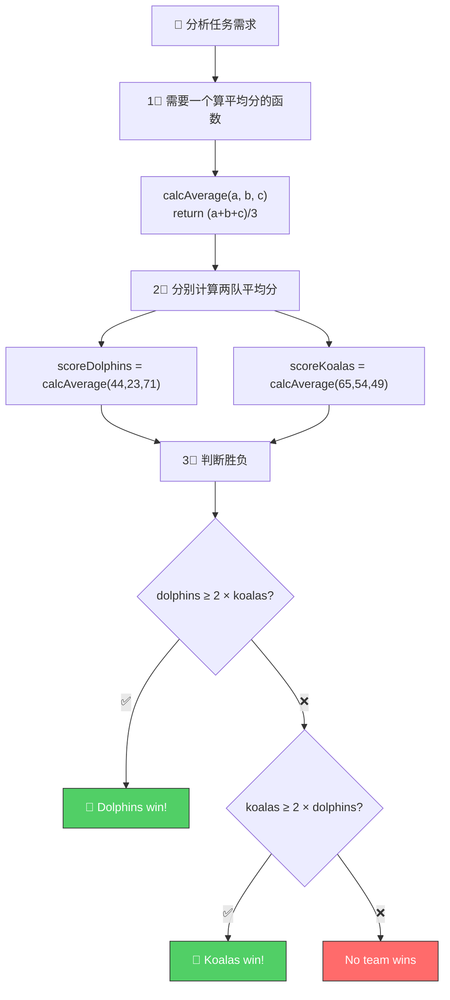

# 🏆 Coding Challenge #1

> 📺 来源：009 CHALLENGE #1 Video Solution.en.srt
> 📂 章节：第 03 章

## 📌 知识脉络
- **前置知识**：函数声明 / 函数表达式 / 箭头函数、参数与返回值、`if/else` 条件语句、模板字符串
- **后续扩展**：数组（Array）、循环（Loop）

## 🎯 概述

本挑战综合运用函数相关知识，模拟一场"海豚 vs 考拉"的体操比赛。你需要编写计算平均分的函数和判断胜负的函数，并处理"必须至少双倍分数才能获胜"的特殊规则。

---

## 📋 Tasks（任务清单）

1. 创建**箭头函数** `calcAverage`，接收 3 个分数，返回平均值
2. 用 `calcAverage` 分别计算海豚队（Dolphins）和考拉队（Koalas）的平均分
3. 创建函数 `checkWinner`，接收两队的平均分作为参数
4. 判断规则：**一队只有在平均分至少是对方两倍时才能获胜**
5. 获胜时在控制台打印 `"Dolphins win 🏆 (XX vs. YY)"`，否则打印 `"No team wins..."`
6. 本题忽略平局情况

## 📊 Test Data（测试数据）

**数据集 1：**
- 🐬 Dolphins: 44, 23, 71
- 🐨 Koalas: 65, 54, 49

**数据集 2：**
- 🐬 Dolphins: 85, 54, 41
- 🐨 Koalas: 23, 34, 27

> 💡 **提示**：判断 A 是否至少是 B 的两倍 → `A >= 2 * B`

---

## 🧪 实战沙盒

```js {runnable} {title="challenge1.js"}
'use strict';

// 1. 创建 calcAverage 箭头函数（接收 3 个参数）


// 2. 用 calcAverage 计算两队的平均分
// 数据集 1：Dolphins: 44, 23, 71 | Koalas: 65, 54, 49


// 3. 创建 checkWinner 函数
// - 判断是否有队伍达到对方两倍分数
// - 在控制台打印获胜信息或 "No team wins..."


// 4. 调用 checkWinner


// 🔁 用数据集 2 再测试一次
// Dolphins: 85, 54, 41 | Koalas: 23, 34, 27
```

---

<details><summary>💡 Jonas 官方解法拆解</summary>

### 思考链路



### 完整代码

```js
'use strict';

// 1. 箭头函数计算平均值
const calcAverage = (a, b, c) => (a + b + c) / 3;

// 2. 计算两队平均分 —— 数据集 1
let scoreDolphins = calcAverage(44, 23, 71);
let scoreKoalas = calcAverage(65, 54, 49);
console.log(scoreDolphins, scoreKoalas); // 46 56

// 3. 判断胜负
const checkWinner = function (avgDolphins, avgKoalas) {
  if (avgDolphins >= 2 * avgKoalas) {
    console.log(`Dolphins win 🏆 (${avgDolphins} vs. ${avgKoalas})`);
  } else if (avgKoalas >= 2 * avgDolphins) {
    console.log(`Koalas win 🏆 (${avgKoalas} vs. ${avgDolphins})`);
  } else {
    console.log('No team wins...');
  }
};

// 4. 测试数据集 1
checkWinner(scoreDolphins, scoreKoalas);
// No team wins...（56 不足 46 的两倍）

// 🔁 测试数据集 2
scoreDolphins = calcAverage(85, 54, 41);
scoreKoalas = calcAverage(23, 34, 27);
console.log(scoreDolphins, scoreKoalas); // 60 28
checkWinner(scoreDolphins, scoreKoalas);
// Dolphins win 🏆 (60 vs. 28)（60 ≥ 28 × 2 = 56 ✅）
```

### 🔍 执行追踪（数据集 2）

| 步骤 | 代码 | 变量 | 说明 |
|------|------|------|------|
| ① | `calcAverage(85,54,41)` | `scoreDolphins = 60` | (85+54+41)/3 |
| ② | `calcAverage(23,34,27)` | `scoreKoalas = 28` | (23+34+27)/3 |
| ③ | `60 >= 2 * 28` ? | `60 >= 56` → ✅ | 海豚分数是考拉两倍以上 |
| ④ | `console.log(...)` | — | 输出: Dolphins win 🏆 |

### 关键设计要点

- `calcAverage` 是**通用函数**——不关心输入来自哪里（分数/身高/钱都行）
- `checkWinner` 也是**独立函数**——可以传入任意两个数字，不绑定特定数据
- 用 `let` 声明分数变量，因为数据集 2 需要**重新赋值**

</details>

---

## 📖 词汇速查表 (Cheat Sheet)
| 中文术语 | 英文术语 | 简明释义 | 速查代码 | 📚 官方文档 |
|---------|---------|---------|---------|-----------|
| 平均值 | Average | 所有数之和除以个数 | `(a+b+c)/3` | — |
| 箭头函数 | Arrow Function | ES6 简写函数 | `(a,b) => a+b` | [MDN](https://developer.mozilla.org/zh-CN/docs/Web/JavaScript/Reference/Functions/Arrow_functions) |
| 函数表达式 | Function Expression | 匿名函数赋给变量 | `const fn = function(){}` | [MDN](https://developer.mozilla.org/zh-CN/docs/Web/JavaScript/Reference/Operators/function) |

---

## 🧪 学习验证

### ❓ 理解检测

:::quiz {correct="B"}
**1. 判断 A 是否至少是 B 的两倍，正确的表达式是？**
- A) `A > B * 2`
- B) `A >= 2 * B`
- C) `A === B * 2`
- D) `A * 2 >= B`

> **解析**："至少两倍"用 `>=`（大于等于）而非 `>`（大于），因为等于两倍也算赢。`A >= 2 * B` 读作"A 大于等于 B 的两倍"。
:::

:::quiz {correct="C"}
**2. 为什么 `scoreDolphins` 和 `scoreKoalas` 用 `let` 而不是 `const`？**
- A) `let` 更安全
- B) `const` 不能存储数字
- C) 需要在数据集 2 时重新赋值，`const` 不可重赋值
- D) 函数返回值只能存在 `let` 变量中

> **解析**：`const` 声明的变量不可重新赋值。因为我们需要用数据集 2 覆盖之前的分数值，所以必须用 `let`。
:::

:::quiz {correct="A"}
**3. `calcAverage` 函数为什么设计成通用的而不是专门计算"海豚平均分"？**
- A) 遵循 DRY 原则，通用函数可以在不同场景下复用
- B) JavaScript 要求函数不能使用特定名称
- C) 通用函数运行更快
- D) 特定名称的函数不能接收参数

> **解析**：函数应该是**通用的、可复用的**。`calcAverage` 不关心输入是什么——分数、身高、收入都行。这遵循了 DRY 原则和函数设计的最佳实践。
:::

### 🔧 代码填空

:::fill-blank
const calcAverage = (a, b, c) => ___( a + b + c ) / 3___;

const scoreDolphins = calcAverage(44, 23, ___71___);
const scoreKoalas = ___calcAverage___(65, 54, 49);
:::
