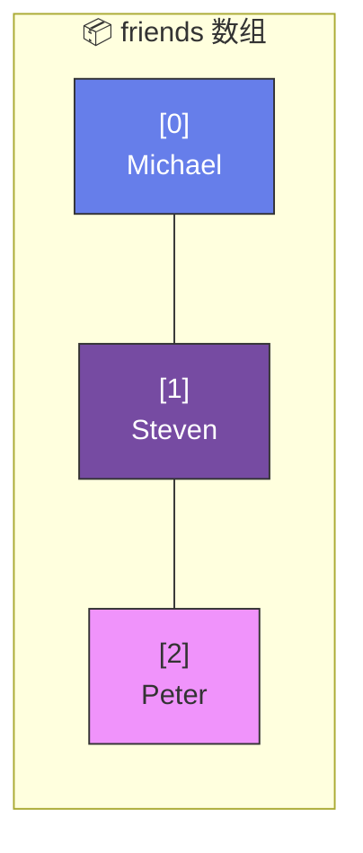
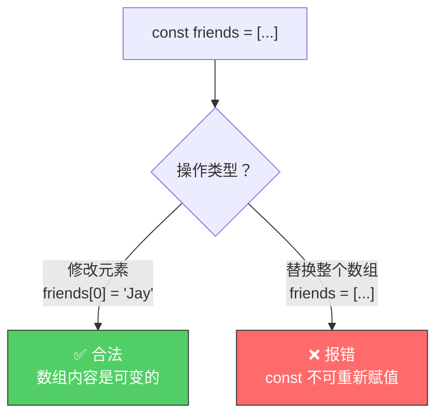
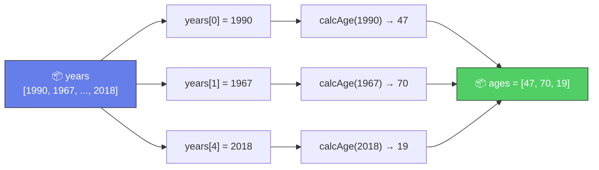
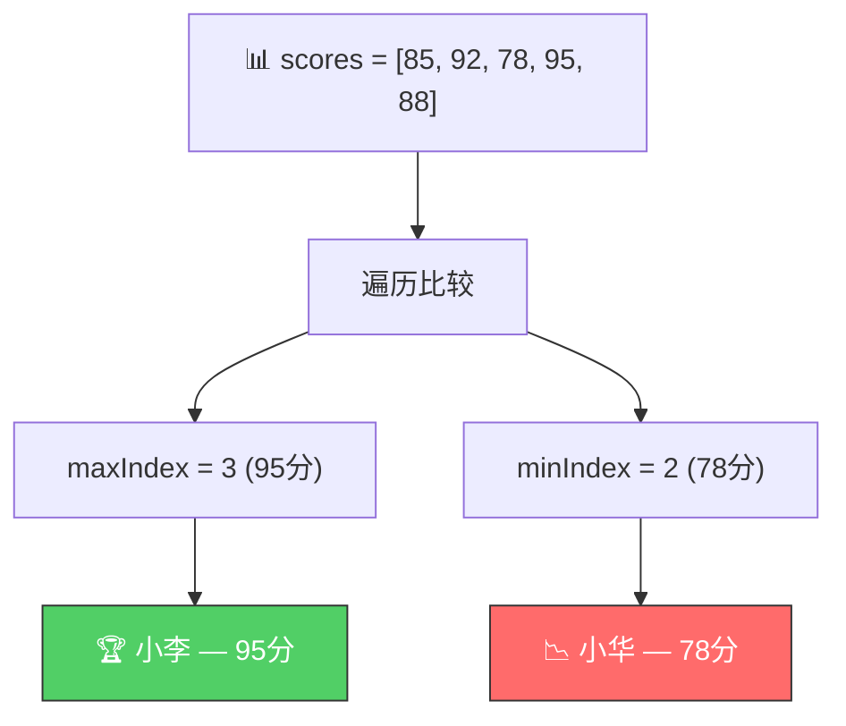

# 数组入门（Introduction to Arrays）

> 📺 来源：010 Introduction to Arrays.en.srt
> 📂 章节：第 03 章

## 📌 知识脉络
- **前置知识**：变量声明（`let`、`const`）、函数、数据类型
- **后续扩展**：数组方法（`push`、`pop`、`shift`、`unshift`）、循环遍历数组、数组解构（Destructuring）

## 🎯 概述

数组（Array）是 JavaScript 中最重要的**数据结构**之一。它是一个**有序集合**，可以在一个变量中存储多个值（甚至不同类型的值）。数组使用**从 0 开始的索引**访问元素，并通过 `.length` 属性获取元素数量。

## 核心知识点

### 1. 创建数组的两种方式

> 🧩 **生活类比**：数组就像一排**储物柜**🗄️——每个柜子有自己的编号（索引），从 0 号开始。你可以往任何一个柜子里放东西，也可以随时打开某个编号查看内容。

```js {runnable} {title="create_array.js"}
'use strict';

// 方式 1：字面量语法（最常用 ✅）
const friends = ['Michael', 'Steven', 'Peter'];
console.log(friends); // ['Michael', 'Steven', 'Peter']

// 方式 2：new Array() 构造函数
const years = new Array(1991, 1984, 2008, 2020);
console.log(years); // [1991, 1984, 2008, 2020]
```



---

### 2. 访问与修改数组元素

```js {runnable} {title="access_array.js"}
'use strict';

const friends = ['Michael', 'Steven', 'Peter'];

// 访问元素（索引从 0 开始）
console.log(friends[0]); // Michael（第一个）
console.log(friends[2]); // Peter（第三个）

// 获取数组长度
console.log(friends.length);     // 3
// 获取最后一个元素
console.log(friends[friends.length - 1]); // Peter

// 修改元素
friends[2] = 'Jay';
console.log(friends); // ['Michael', 'Steven', 'Jay']
```

**🔍 执行追踪**：

| 操作 | 索引 | `friends` 状态 | 说明 |
|------|------|---------------|------|
| 初始 | — | `['Michael', 'Steven', 'Peter']` | 3 个元素 |
| `friends[0]` | `0` | — | 返回 `'Michael'` |
| `friends.length` | — | — | 返回 `3` |
| `friends[friends.length - 1]` | `3-1=2` | — | 返回 `'Peter'`（最后一个） |
| `friends[2] = 'Jay'` | `2` | `['Michael', 'Steven', 'Jay']` | Peter → Jay |

> 💡 **记忆口诀**：**最后一个元素 = `arr[arr.length - 1]`** —— 因为索引从 0 起步，最大索引永远比长度少 1。

---

### 3. `const` 数组可以修改元素！

> 🧩 **生活类比**：`const` 就像你买的一间**公寓**🏠——你不能卖掉并换成另一间（不可重新赋值），但你完全可以重新装修里面的房间（可以修改数组元素）。

```js {runnable} {title="const_array.js"}
'use strict';

const friends = ['Michael', 'Steven', 'Peter'];

// ✅ 可以修改元素
friends[2] = 'Jay'; // 合法！

// ❌ 不能替换整个数组
// friends = ['Bob', 'Alice']; 
// TypeError: Assignment to constant variable.
```



---

### 4. 数组可以存储不同类型的值

```js {runnable} {title="mixed_array.js"}
'use strict';

const firstName = 'Jonas';
const jonas = [firstName, 'Schmedtmann', 2037 - 1991, 'teacher', friends];
console.log(jonas);
// ['Jonas', 'Schmedtmann', 46, 'teacher', Array(3)]
console.log(jonas.length); // 5
```

数组的**每个位置只需要一个表达式**——可以是字面量、变量、计算结果，甚至是函数调用或另一个数组。

---

### 5. 数组与函数结合使用

```js {runnable} {title="array_with_function.js"}
'use strict';

const calcAge = function (birthYear) {
  return 2037 - birthYear;
};

const years = [1990, 1967, 2002, 2010, 2018];

// ❌ 不能直接对数组做算术运算
// console.log(calcAge(years)); // NaN

// ✅ 对单个元素调用函数
const age1 = calcAge(years[0]);                    // 1990 → 47
const age2 = calcAge(years[1]);                    // 1967 → 70
const age3 = calcAge(years[years.length - 1]);     // 2018 → 19

console.log(age1, age2, age3); // 47 70 19

// ✅ 直接在数组字面量中调用函数
const ages = [
  calcAge(years[0]),
  calcAge(years[1]),
  calcAge(years[years.length - 1])
];
console.log(ages); // [47, 70, 19]
```



---

## 🛠️ 代码实战与真实场景

> **💼 业务场景**：管理学生成绩——用数组存储一个班级的考试成绩，计算最高分和最低分。

```js {runnable} {title="student_scores.js"}
'use strict';

const studentNames = ['小明', '小红', '小华', '小李', '小张'];
const scores = [85, 92, 78, 95, 88];

// 找出最高分和最低分的学生
let maxIndex = 0;
let minIndex = 0;

for (let i = 1; i < scores.length; i++) {
  if (scores[i] > scores[maxIndex]) maxIndex = i;
  if (scores[i] < scores[minIndex]) minIndex = i;
}

console.log(`🏆 最高分: ${studentNames[maxIndex]} — ${scores[maxIndex]}分`);
console.log(`📉 最低分: ${studentNames[minIndex]} — ${scores[minIndex]}分`);
```



**📊 输入输出示例：**
| 索引 | 学生 | 分数 | 备注 |
|------|------|------|------|
| `0` | 小明 | 85 | — |
| `1` | 小红 | 92 | — |
| `2` | 小华 | 78 | 📉 最低分 |
| `3` | 小李 | 95 | 🏆 最高分 |
| `4` | 小张 | 88 | — |

## 💡 关键要点
- ✅ 数组用 `[]` 创建，索引从 **0** 开始
- ✅ 用 `arr.length` 获取数组长度，`arr[arr.length - 1]` 获取最后一个元素
- ✅ `const` 数组**可以修改元素**，但**不能替换整个数组**
- ✅ 数组可以存储**不同类型**的值（数字、字符串、布尔值、甚至其他数组）
- ✅ 数组的每个位置可以放任何**表达式**（包括函数调用的结果）

## ⚠️ 常见误区
- ⚠️ **误区 1**：以为数组索引从 1 开始——JavaScript 数组索引从 **0** 开始
- ⚠️ **误区 2**：以为 `const` 声明的数组完全不可修改——只是不能**重新赋值**为另一个数组
- ⚠️ **误区 3**：对整个数组执行算术运算——`calcAge(years)` 返回 `NaN`，必须对**单个元素**操作

## 🐛 报错实验室

**❌ 错误写法：**
```js
'use strict';

const names = ['Alice', 'Bob', 'Charlie'];
console.log(names[3]); // ⚠️ 越界访问
```

**浏览器报错：**
```
undefined
```

**🔑 解读**：访问不存在的索引不会报错，但返回 `undefined`。数组长度为 3，有效索引为 0、1、2。访问 `names[3]` 超出范围，返回 `undefined`。

---

## 📖 词汇速查表 (Cheat Sheet)
| 中文术语 | 英文术语 | 简明释义 | 速查代码 | 📚 官方文档 |
|---------|---------|---------|---------|-----------|
| 数组 | Array | 有序数据集合 | `const arr = [1,2,3];` | [MDN](https://developer.mozilla.org/zh-CN/docs/Web/JavaScript/Reference/Global_Objects/Array) |
| 索引 | Index | 元素在数组中的位置编号 | `arr[0]` | — |
| 长度 | Length | 数组中元素的数量 | `arr.length` | [MDN](https://developer.mozilla.org/zh-CN/docs/Web/JavaScript/Reference/Global_Objects/Array/length) |

---

## 🧪 学习验证

### 📝 动手练习

**练习 1：家庭年龄计算器**
```js {runnable} {title="exercise1.js"}
'use strict';

// 创建一个家庭成员出生年份数组 birthYears
// 用函数 calcAge(birthYear) 计算每个人的年龄
// 将结果存入新的 ages 数组
// 假设当前年份为 2037


// 测试
console.log(ages); // 应输出每个人的年龄
```
<details><summary>💡 参考答案</summary>

```js
'use strict';

const calcAge = birthYear => 2037 - birthYear;
const birthYears = [1965, 1990, 2015, 2020];

const ages = [
  calcAge(birthYears[0]),
  calcAge(birthYears[1]),
  calcAge(birthYears[2]),
  calcAge(birthYears[3])
];

console.log(ages); // [72, 47, 22, 17]
```
**解题思路**：对数组每个元素调用 `calcAge` 函数，将返回值放在新数组中。
</details>

**练习 2：混合类型数组**
```js {runnable} {title="exercise2.js"}
'use strict';

// 创建一个数组 profile，包含以下信息：
// 你的名字(string)、年龄(number)、是否为学生(boolean)、爱好数组
// 然后打印出："我叫XX，今年XX岁，我的爱好有：XX, XX"


```
<details><summary>💡 参考答案</summary>

```js
'use strict';

const profile = ['小明', 20, true, ['编程', '游泳', '阅读']];

console.log(`我叫${profile[0]}，今年${profile[1]}岁，我的爱好有：${profile[3].join(', ')}`);
// 我叫小明，今年20岁，我的爱好有：编程, 游泳, 阅读
```
**解题思路**：数组可以嵌套数组。用 `profile[3]` 访问爱好数组，`.join(', ')` 将数组转为逗号分隔的字符串。
</details>

### ❓ 理解检测

:::quiz {correct="C"}
**1. `const arr = [10, 20, 30]; console.log(arr[3]);` 输出什么？**
- A) `30`
- B) 报错
- C) `undefined`
- D) `null`

> **解析**：数组长度为 3，有效索引为 0、1、2。索引 3 超出范围，返回 `undefined`，不会报错。
:::

:::quiz {correct="B"}
**2. 如何获取数组 `arr` 的最后一个元素？**
- A) `arr[arr.length]`
- B) `arr[arr.length - 1]`
- C) `arr[-1]`
- D) `arr.last()`

> **解析**：索引从 0 开始，最后一个元素的索引是 `length - 1`。`arr[arr.length]` 会越界返回 `undefined`，`arr[-1]` 在常规数组中也返回 `undefined`。
:::

:::quiz {correct="A"}
**3. `const` 声明的数组，以下哪个操作是合法的？**
- A) `arr[0] = 'new value'`
- B) `arr = [1, 2, 3]`
- C) 以上都不合法
- D) 以上都合法

> **解析**：`const` 只阻止变量被重新赋值，但数组内容是可变的。修改元素 `arr[0] = ...` 合法，替换整个数组 `arr = [...]` 不合法。
:::

### 🔧 代码填空

:::fill-blank
const fruits = ['🍎', '🍊', '🍇'];
console.log(fruits[___0___]);           // 🍎
console.log(fruits.___length___);       // 3
console.log(fruits[fruits.length ___- 1___]); // 🍇
:::
