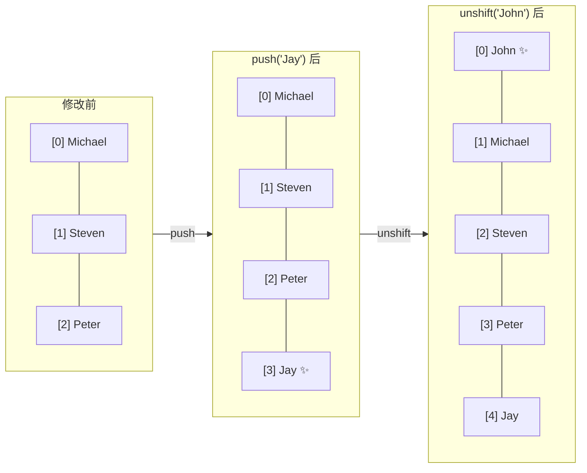
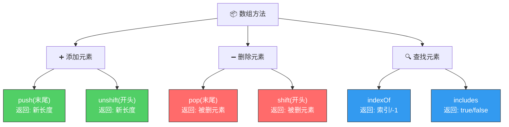
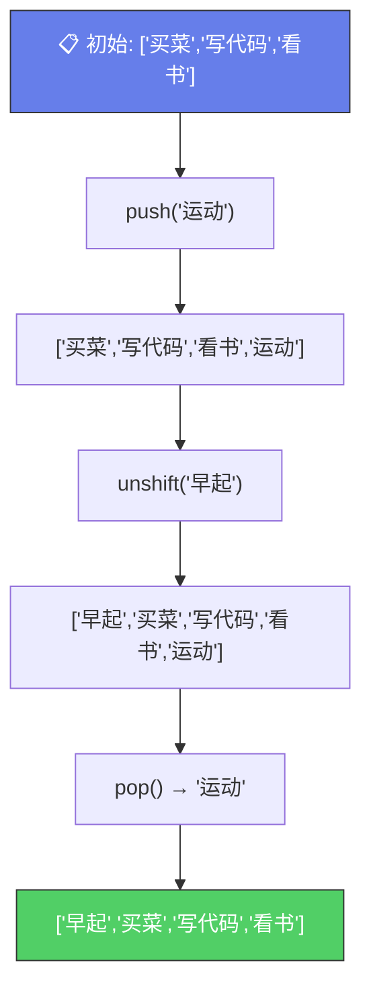

# 数组基本操作（Basic Array Operations / Methods）

> 📺 来源：011 Basic Array Operations (Methods).en.srt
> 📂 章节：第 03 章

## 📌 知识脉络
- **前置知识**：数组创建、索引访问、`const` 的可变性
- **后续扩展**：高阶数组方法（`.map()`、`.filter()`、`.reduce()`）、对象（Object）、循环遍历数组

## 🎯 概述

数组内置了许多**方法（Methods）**，本质上是附着在数组上的函数。本节学习最基础的六个方法：添加元素（`push`、`unshift`）、删除元素（`pop`、`shift`）、查找元素（`indexOf`、`includes`）。

## 核心知识点

### 1. 添加元素

> 🧩 **生活类比**：`push` 像排队时**从队尾加人**，`unshift` 像**插队到最前面**。

```js {runnable} {title="add_elements.js"}
'use strict';

const friends = ['Michael', 'Steven', 'Peter'];

// push：添加到末尾，返回新长度
const newLength = friends.push('Jay');
console.log(friends);    // ['Michael', 'Steven', 'Peter', 'Jay']
console.log(newLength);  // 4

// unshift：添加到开头，返回新长度
friends.unshift('John');
console.log(friends);    // ['John', 'Michael', 'Steven', 'Peter', 'Jay']
```



---

### 2. 删除元素

> 🧩 **生活类比**：`pop` 像从一叠盘子**取走最上面**（最后面）那个，`shift` 像从队伍**送走第一个人**。

```js {runnable} {title="remove_elements.js"}
'use strict';

const friends = ['John', 'Michael', 'Steven', 'Peter', 'Jay'];

// pop：移除最后一个，返回被移除的元素
const popped = friends.pop();
console.log(popped);    // Jay
console.log(friends);   // ['John', 'Michael', 'Steven', 'Peter']

// shift：移除第一个，返回被移除的元素
const shifted = friends.shift();
console.log(shifted);   // John
console.log(friends);   // ['Michael', 'Steven', 'Peter']
```

**🔍 执行追踪**：

| 操作 | 返回值 | `friends` 状态 |
|------|--------|---------------|
| 初始 | — | `['John', 'Michael', 'Steven', 'Peter', 'Jay']` |
| `pop()` | `'Jay'` | `['John', 'Michael', 'Steven', 'Peter']` |
| `shift()` | `'John'` | `['Michael', 'Steven', 'Peter']` |

---

### 3. 查找元素

```js {runnable} {title="search_elements.js"}
'use strict';

const friends = ['Michael', 'Steven', 'Peter'];

// indexOf：返回元素的索引位（不存在返回 -1）
console.log(friends.indexOf('Steven')); // 1
console.log(friends.indexOf('Bob'));    // -1

// includes：返回布尔值（ES6，使用严格等于 ===）
console.log(friends.includes('Steven')); // true
console.log(friends.includes('Bob'));    // false

// ⚠️ includes 使用严格等于，不做类型转换
friends.push(23);
console.log(friends.includes('23')); // false（字符串 '23' ≠ 数字 23）
console.log(friends.includes(23));   // true
```

> 💡 **记忆口诀**：**indexOf 问"在哪里"，includes 问"在不在"**

---

### 4. 方法汇总表

**📊 六大基础数组方法对比：**

| 方法 | 类别 | 作用 | 返回值 | 修改原数组？ |
|------|------|------|--------|:-----------:|
| `push(el)` | ➕ 添加 | 添加到**末尾** | 新长度 | ✅ |
| `unshift(el)` | ➕ 添加 | 添加到**开头** | 新长度 | ✅ |
| `pop()` | ➖ 删除 | 移除**最后**一个 | 被删元素 | ✅ |
| `shift()` | ➖ 删除 | 移除**第一**个 | 被删元素 | ✅ |
| `indexOf(el)` | 🔍 查找 | 查找元素**索引** | 索引 / -1 | ❌ |
| `includes(el)` | 🔍 查找 | 元素**是否存在** | true / false | ❌ |



---

### 5. `includes` 用于条件判断

```js {runnable} {title="includes_condition.js"}
'use strict';

const friends = ['Michael', 'Steven', 'Peter'];

if (friends.includes('Steven')) {
  console.log('You have a friend called Steven ✅');
}

if (friends.includes('Bob')) {
  console.log('You have a friend called Bob');
} else {
  console.log('No friend named Bob ❌');
}
```

---

## 🛠️ 代码实战与真实场景

> **💼 业务场景**：待办事项列表——添加新任务、完成最新任务、检查任务是否存在。

```js {runnable} {title="todo_list.js"}
'use strict';

const todos = ['买菜', '写代码', '看书'];

// 添加新任务
todos.push('运动');
todos.unshift('早起');
console.log('📋 当前任务:', todos);
// ['早起', '买菜', '写代码', '看书', '运动']

// 完成最后一个任务
const done = todos.pop();
console.log(`✅ 完成: ${done}`);

// 检查任务是否存在
const task = '写代码';
if (todos.includes(task)) {
  console.log(`📌 "${task}" 还在待办列表中`);
}

// 查找任务位置
console.log(`"看书" 在位置: ${todos.indexOf('看书')}`);
```



**📊 输入输出示例：**
| 操作 | 返回值 | 数组状态 |
|------|--------|---------|
| `push('运动')` | `4` | `[..., '运动']` |
| `unshift('早起')` | `5` | `['早起', ...]` |
| `pop()` | `'运动'` | 末尾元素移除 |
| `includes('写代码')` | `true` | 不变 |

## 💡 关键要点
- ✅ 数组方法本质上是**附着在数组上的函数**
- ✅ `push` / `unshift` 添加元素，`pop` / `shift` 删除元素——它们都**修改原数组**
- ✅ `indexOf` 返回索引位置，`includes` 返回布尔值
- ✅ `includes` 使用**严格等于**（`===`），不做类型转换
- ✅ `includes` 常与 `if` 结合做条件判断

## ⚠️ 常见误区
- ⚠️ **误区 1**：以为 `push` 返回的是新数组——它返回的是**新数组的长度**
- ⚠️ **误区 2**：以为 `includes('23')` 能找到数字 `23`——它使用严格等于，类型不同就找不到

## 🐛 报错实验室

**❌ 错误写法：**
```js
'use strict';

const arr = [1, 2, 3];
const newArr = arr.push(4); // ⚠️ 以为 push 返回新数组
console.log(newArr);        // 4（是长度，不是数组！）
console.log(newArr[0]);     // undefined 😱
```

**浏览器报错：**
```
4
undefined
```

**🔑 解读**：`push()` 的返回值是新数组的**长度**（数字），不是新数组本身。如果需要链式操作，应直接操作原数组 `arr`。

---

## 📖 词汇速查表 (Cheat Sheet)
| 中文术语 | 英文术语 | 简明释义 | 速查代码 | 📚 官方文档 |
|---------|---------|---------|---------|-----------|
| 方法 | Method | 附着在对象/数组上的函数 | `arr.push()` | — |
| 末尾添加 | push | 向数组末尾添加元素 | `arr.push('x')` | [MDN](https://developer.mozilla.org/zh-CN/docs/Web/JavaScript/Reference/Global_Objects/Array/push) |
| 开头添加 | unshift | 向数组开头添加元素 | `arr.unshift('x')` | [MDN](https://developer.mozilla.org/zh-CN/docs/Web/JavaScript/Reference/Global_Objects/Array/unshift) |
| 末尾删除 | pop | 移除数组最后一个 | `arr.pop()` | [MDN](https://developer.mozilla.org/zh-CN/docs/Web/JavaScript/Reference/Global_Objects/Array/pop) |
| 开头删除 | shift | 移除数组第一个 | `arr.shift()` | [MDN](https://developer.mozilla.org/zh-CN/docs/Web/JavaScript/Reference/Global_Objects/Array/shift) |
| 查索引 | indexOf | 返回元素索引 | `arr.indexOf('x')` | [MDN](https://developer.mozilla.org/zh-CN/docs/Web/JavaScript/Reference/Global_Objects/Array/indexOf) |
| 是否包含 | includes | 返回布尔值 | `arr.includes('x')` | [MDN](https://developer.mozilla.org/zh-CN/docs/Web/JavaScript/Reference/Global_Objects/Array/includes) |

---

## 🧪 学习验证

### 📝 动手练习

**练习 1：购物车操作**
```js {runnable} {title="exercise1.js"}
'use strict';

// 创建一个购物车数组 cart，初始包含 ['苹果', '牛奶']
// 1. 添加 '面包' 到末尾
// 2. 添加 '鸡蛋' 到开头
// 3. 移除最后一个商品并打印被移除的商品
// 4. 检查购物车是否包含 '牛奶'


```
<details><summary>💡 参考答案</summary>

```js
'use strict';

const cart = ['苹果', '牛奶'];
cart.push('面包');
cart.unshift('鸡蛋');
const removed = cart.pop();
console.log(`移除了: ${removed}`); // 移除了: 面包
console.log(cart.includes('牛奶')); // true
console.log(cart); // ['鸡蛋', '苹果', '牛奶']
```
**解题思路**：按序使用 `push`、`unshift`、`pop` 操作数组，用 `includes` 检查。
</details>

**练习 2：去重数组**
```js {runnable} {title="exercise2.js"}
'use strict';

// 给定一个有重复元素的数组，用 includes 方法去重
const numbers = [1, 3, 5, 3, 1, 7, 5, 9];
const unique = [];

// 遍历 numbers，如果 unique 中不包含该元素就添加进去
for (let i = 0; i < numbers.length; i++) {
  // 你的代码
}

console.log(unique); // [1, 3, 5, 7, 9]
```
<details><summary>💡 参考答案</summary>

```js
'use strict';

const numbers = [1, 3, 5, 3, 1, 7, 5, 9];
const unique = [];

for (let i = 0; i < numbers.length; i++) {
  if (!unique.includes(numbers[i])) {
    unique.push(numbers[i]);
  }
}

console.log(unique); // [1, 3, 5, 7, 9]
```
**解题思路**：遍历原数组，用 `includes` 检查新数组是否已有该元素，没有才 `push` 进去。
</details>

### ❓ 理解检测

:::quiz {correct="B"}
**1. `arr.push('x')` 的返回值是什么？**
- A) 修改后的数组
- B) 新数组的长度
- C) 被添加的元素 `'x'`
- D) `undefined`

> **解析**：`push()` 方法修改原数组并返回新数组的**长度**。如果需要数组本身，直接使用 `arr`。
:::

:::quiz {correct="C"}
**2. `['a','b','c'].includes('B')` 的结果是？**
- A) `true`
- B) `1`
- C) `false`
- D) 报错

> **解析**：`includes` 使用严格等于（`===`），区分大小写。`'B'` ≠ `'b'`，所以返回 `false`。
:::

:::quiz {correct="A"}
**3. 以下哪个方法不会修改原数组？**
- A) `indexOf`
- B) `push`
- C) `pop`
- D) `shift`

> **解析**：`indexOf` 只是查找元素位置，不修改原数组。`push`、`pop`、`shift` 都会改变原数组。
:::

### 🔧 代码填空

:::fill-blank
const arr = [10, 20, 30];
arr.___push___(40);           // 添加到末尾
const removed = arr.___pop___();  // 移除最后一个
console.log(arr.___includes___(20)); // true
:::
