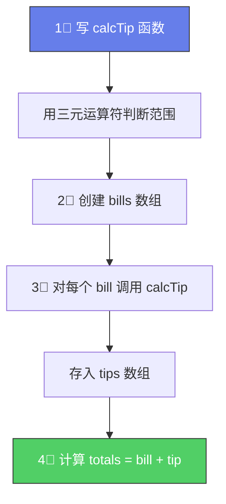

# 🏆 Coding Challenge #2

> 📺 来源：013 CHALLENGE #2 Video Solution.en.srt
> 📂 章节：第 03 章

## 📌 知识脉络
- **前置知识**：函数声明 / 表达式 / 箭头函数、数组创建与索引访问、三元运算符
- **后续扩展**：对象（Object）、循环遍历数组

## 🎯 概述

本挑战综合运用函数和数组知识。你需要编写一个小费（Tip）计算函数，基于账单金额自动计算小费，并使用数组存储账单、小费和总额。

---

## 📋 Tasks（任务清单）

1. 创建函数 `calcTip`，接收账单金额 `bill`
   - 若 50 ≤ bill ≤ 300 → 小费 = bill × 15%
   - 否则 → 小费 = bill × 20%
2. 创建 `bills` 数组：`[125, 555, 44]`
3. 创建 `tips` 数组，包含每笔账单对应的小费（用 `calcTip` 计算）
4. **Bonus**：创建 `totals` 数组 = 每笔 bill + tip

## 📊 Test Data（测试数据）

| 账单 (bill) | 在范围内？ | 小费率 | 预期小费 |
|------------|----------|--------|---------|
| `125` | ✅ 50~300 | 15% | 18.75 |
| `555` | ❌ 超出 | 20% | 111 |
| `44` | ❌ 不足 | 20% | 8.8 |

---

## 🧪 实战沙盒

```js {runnable} {title="challenge2.js"}
'use strict';

// 1. 创建 calcTip 函数（用函数表达式或箭头函数）
// 提示：可以用三元运算符一行搞定


// 2. 创建 bills 数组


// 3. 创建 tips 数组（在每个位置调用 calcTip）


// 4. Bonus: 创建 totals 数组（每个位置 = bills[i] + tips[i]）


// 打印结果
console.log(bills, tips, totals);
```

---

<details><summary>💡 Jonas 官方解法拆解</summary>

### 思考链路



### 完整代码

```js
'use strict';

// 函数表达式
const calcTip = function (bill) {
  return bill >= 50 && bill <= 300 ? bill * 0.15 : bill * 0.2;
};

// 箭头函数版本（更简洁）
// const calcTip = bill => bill >= 50 && bill <= 300 ? bill * 0.15 : bill * 0.2;

const bills = [125, 555, 44];

const tips = [
  calcTip(bills[0]),  // calcTip(125) → 18.75
  calcTip(bills[1]),  // calcTip(555) → 111
  calcTip(bills[2])   // calcTip(44)  → 8.8
];

const totals = [
  bills[0] + tips[0],  // 125 + 18.75 = 143.75
  bills[1] + tips[1],  // 555 + 111 = 666
  bills[2] + tips[2]   // 44 + 8.8 = 52.8
];

console.log(bills);   // [125, 555, 44]
console.log(tips);    // [18.75, 111, 8.8]
console.log(totals);  // [143.75, 666, 52.8]
```

### 🔍 执行追踪

| 索引 | bill | 范围判断 | 小费率 | tip | total |
|------|------|---------|--------|-----|-------|
| 0 | 125 | 50≤125≤300 ✅ | 15% | 18.75 | 143.75 |
| 1 | 555 | 555>300 ❌ | 20% | 111 | 666 |
| 2 | 44 | 44<50 ❌ | 20% | 8.8 | 52.8 |

### ⚠️ 常见错误

- ❌ `bills + tips` → 不能对整个数组做加法，会变成字符串拼接！
- ✅ 必须逐元素相加：`bills[0] + tips[0]`

</details>

---

## 📖 词汇速查表 (Cheat Sheet)
| 中文术语 | 英文术语 | 简明释义 | 速查代码 | 📚 官方文档 |
|---------|---------|---------|---------|-----------|
| 三元运算符 | Ternary Operator | 条件表达式 | `a ? b : c` | [MDN](https://developer.mozilla.org/zh-CN/docs/Web/JavaScript/Reference/Operators/Conditional_operator) |
| 数组 | Array | 有序数据集合 | `[1,2,3]` | [MDN](https://developer.mozilla.org/zh-CN/docs/Web/JavaScript/Reference/Global_Objects/Array) |

---

## 🧪 学习验证

### ❓ 理解检测

:::quiz {correct="B"}
**1. `calcTip(200)` 的返回值是？**
- A) `40`
- B) `30`
- C) `200`
- D) `0.15`

> **解析**：200 在 50~300 范围内，所以小费率为 15%。`200 × 0.15 = 30`。
:::

:::quiz {correct="C"}
**2. 为什么不能用 `const totals = bills + tips;` ？**
- A) 语法错误
- B) `const` 不能存储数组
- C) 对数组使用 `+` 运算符会变成字符串拼接，不是逐元素相加
- D) `bills` 和 `tips` 长度不同

> **解析**：JavaScript 中对数组使用 `+` 会先将两个数组转为字符串再拼接，而不是逐元素相加。必须手动 `bills[0] + tips[0]` 逐项操作。
:::

:::quiz {correct="A"}
**3. 箭头函数 `const f = x => x >= 50 && x <= 300 ? x * 0.15 : x * 0.2;` 和函数表达式的区别？**
- A) 功能相同，箭头函数写法更简洁
- B) 箭头函数不能使用三元运算符
- C) 箭头函数的返回值不同
- D) 箭头函数不能接收参数

> **解析**：两种写法功能完全一致。箭头函数单行自动隐式返回，因此更简洁。
:::

### 🔧 代码填空

:::fill-blank
const calcTip = ___bill___ => bill >= 50 && bill <= 300 ? bill * 0.15 : bill * ___0.2___;
const tips = [calcTip(125), ___calcTip(555)___, calcTip(44)];
:::
