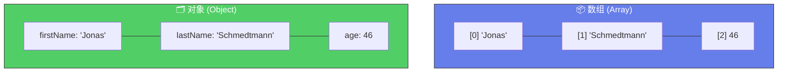
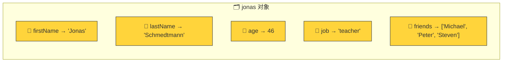
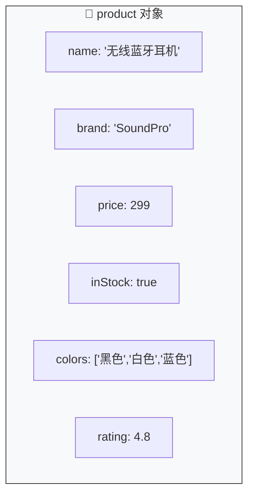

# 对象入门（Introduction to Objects）

> 📺 来源：014 Introduction to Objects.en.srt
> 📂 章节：第 03 章

## 📌 知识脉络
- **前置知识**：数组（Array）、变量声明、数据类型
- **后续扩展**：点号 vs 方括号访问（Dot vs. Bracket Notation）、对象方法（Object Methods）、`this` 关键字

## 🎯 概述

对象（Object）是 JavaScript 中最基础的数据结构之一。与数组不同，对象使用**键值对（Key-Value Pairs）** 来存储数据，每个值都有一个名字（键/属性），可以通过属性名快速访问，而不依赖位置顺序。

## 核心知识点

### 1. 数组 vs 对象：为什么需要对象？

> 🧩 **生活类比**：数组像一个**编号储物柜**（0号、1号、2号……），你必须知道东西放在第几号柜子。对象则像一个**带标签的文件柜**🗂️——每个抽屉上都贴着名字（"姓名"、"年龄"、"工作"），你直接按标签找就行。



| 维度 | 数组 (Array) | 对象 (Object) |
|------|-------------|---------------|
| 标识方式 | 索引（位置编号） | 属性名（键名） |
| 顺序 | ✅ 有序，顺序重要 | ❌ 无序，顺序不重要 |
| 适用场景 | 有序列表（成绩、待办） | 具名属性集（个人信息） |
| 语法 | `[]` 方括号 | `{}` 花括号 |

---

### 2. 对象字面量语法（Object Literal）

```js {runnable} {title="object_literal.js"}
'use strict';

const jonas = {
  firstName: 'Jonas',
  lastName: 'Schmedtmann',
  age: 2037 - 1991,  // 表达式也可以作为值
  job: 'teacher',
  friends: ['Michael', 'Peter', 'Steven']  // 值可以是数组
};

console.log(jonas);
```

**关键概念：**
- 用 `{}` 定义对象
- 每个 `键: 值` 称为一个**属性（Property）**
- 键值对之间用**逗号**分隔
- 值可以是任何类型（字符串、数字、布尔值、数组、甚至另一个对象）



> 这种直接在代码中写出对象内容的方式叫做**对象字面量语法（Object Literal Syntax）**。

---

### 3. 属性（Property）= 键 + 值

**🔍 执行追踪**：

| 属性名（Key） | 值（Value） | 值类型 |
|--------------|------------|--------|
| `firstName` | `'Jonas'` | String |
| `lastName` | `'Schmedtmann'` | String |
| `age` | `46` | Number（表达式 2037-1991 的结果） |
| `job` | `'teacher'` | String |
| `friends` | `['Michael', 'Peter', 'Steven']` | Array |

> 💡 **记忆口诀**：**数组看位置，对象看名字** —— 数组靠索引取值，对象靠属性名取值。

---

## 🛠️ 代码实战与真实场景

> **💼 业务场景**：电商平台的商品信息卡片——用对象存储商品的各项属性。

```js {runnable} {title="product_card.js"}
'use strict';

const product = {
  name: '无线蓝牙耳机',
  brand: 'SoundPro',
  price: 299,
  inStock: true,
  colors: ['黑色', '白色', '蓝色'],
  rating: 4.8
};

console.log(product);
console.log(`📦 ${product.name} | ¥${product.price} | ⭐ ${product.rating}`);
```



**📊 输入输出示例：**
| 属性 | 值 | 类型 |
|------|-----|------|
| `name` | '无线蓝牙耳机' | String |
| `price` | 299 | Number |
| `inStock` | true | Boolean |
| `colors` | ['黑色','白色','蓝色'] | Array |

## 💡 关键要点
- ✅ 对象使用 `{}` 创建，存储**键值对（Key-Value Pairs）**
- ✅ 每个键值对叫做一个**属性（Property）**
- ✅ 对象中值的顺序**不重要**（与数组相反）
- ✅ 值可以是**任何类型**（字符串、数字、布尔、数组、对象……）
- ✅ 用对象存储**具有明确名称的属性集合**，用数组存储**有序列表**

## ⚠️ 常见误区
- ⚠️ **误区 1**：以为对象中的 `{}` 和 `if/else` 的 `{}` 是同一个东西——不是！对象的花括号定义数据结构，代码块的花括号定义执行范围
- ⚠️ **误区 2**：在对象的属性之间忘记写逗号——对象中不是分号 `;`，而是逗号 `,`

## 🐛 报错实验室

**❌ 错误写法：**
```js
'use strict';

const person = {
  name: 'Alice'
  age: 25   // ⚠️ 忘记在上一行末尾加逗号！
};
```

**浏览器报错：**
```
SyntaxError: Unexpected identifier 'age'
```

**🔑 解读**：对象的属性之间必须用**逗号**分隔。上一行 `name: 'Alice'` 末尾缺少逗号，JavaScript 无法识别 `age` 是新属性。

---

## 📖 词汇速查表 (Cheat Sheet)
| 中文术语 | 英文术语 | 简明释义 | 速查代码 | 📚 官方文档 |
|---------|---------|---------|---------|-----------|
| 对象 | Object | 键值对数据结构 | `{ key: value }` | [MDN](https://developer.mozilla.org/zh-CN/docs/Web/JavaScript/Reference/Global_Objects/Object) |
| 属性 | Property | 对象中的一个键值对 | `obj.key` | — |
| 对象字面量 | Object Literal | 直接在代码中写出对象的语法 | `const obj = {}` | [MDN](https://developer.mozilla.org/zh-CN/docs/Web/JavaScript/Guide/Grammar_and_types#object_literals) |
| 键 | Key | 属性的名字 | `firstName` | — |
| 值 | Value | 属性的数据 | `'Jonas'` | — |

---

## 🧪 学习验证

### 📝 动手练习

**练习 1：创建个人档案对象**
```js {runnable} {title="exercise1.js"}
'use strict';

// 创建一个描述你自己的对象 myProfile
// 至少包含：name, age, city, hobbies(数组), isStudent(布尔)
// 然后用 console.log 打印出来


```
<details><summary>💡 参考答案</summary>

```js
'use strict';

const myProfile = {
  name: '小明',
  age: 22,
  city: '北京',
  hobbies: ['编程', '篮球', '阅读'],
  isStudent: true
};

console.log(myProfile);
```
**解题思路**：使用 `{}` 创建对象，注意属性间用逗号分隔，值可以是不同类型。
</details>

**练习 2：对比数组和对象**
```js {runnable} {title="exercise2.js"}
'use strict';

// 同一组数据，分别用数组和对象两种方式存储
// 数据：电影名"星际穿越"，评分8.9，年份2014，类型['科幻','冒险']

// 方式 1：数组
const movieArr = [];

// 方式 2：对象
const movieObj = {};

console.log(movieArr);
console.log(movieObj);
```
<details><summary>💡 参考答案</summary>

```js
'use strict';

// 方式 1：数组（只能靠位置访问，不直观）
const movieArr = ['星际穿越', 8.9, 2014, ['科幻', '冒险']];

// 方式 2：对象（每个值有名字，直观易读）
const movieObj = {
  title: '星际穿越',
  rating: 8.9,
  year: 2014,
  genres: ['科幻', '冒险']
};

console.log(movieArr[0]); // 星际穿越（要记住位置）
console.log(movieObj.title); // 星际穿越（直接通过名字访问）
```
**解题思路**：对象通过属性名访问更直观，不需要记住数据在第几个位置。
</details>

### ❓ 理解检测

:::quiz {correct="B"}
**1. 对象和数组最大的区别是什么？**
- A) 对象只能存储字符串
- B) 对象通过属性名访问值，数组通过索引访问值
- C) 对象不能包含数组
- D) 数组比对象运行更快

> **解析**：数组靠位置编号（索引）访问元素，对象靠属性名（键）访问。对象的值可以是任何类型，包括数组。
:::

:::quiz {correct="C"}
**2. 以下哪种说法正确？**
- A) 对象中的属性有固定顺序
- B) 对象字面量用 `[]` 定义
- C) 对象字面量用 `{}` 定义，属性之间用逗号分隔
- D) 对象的属性值只能是字符串

> **解析**：对象用 `{}` 花括号创建，属性写为 `key: value` 格式，彼此用逗号分隔。属性无固定顺序，值可以是任何类型。
:::

:::quiz {correct="A"}
**3. 在对象 `{ name: 'Bob', age: 30 }` 中，`name` 叫做？**
- A) 属性名（Property name / Key）
- B) 变量
- C) 方法
- D) 索引

> **解析**：对象中冒号左边的 `name` 是**属性名（Key）**，冒号右边的 `'Bob'` 是**属性值（Value）**。合起来 `name: 'Bob'` 叫做一个**属性（Property）**。
:::

### 🔧 代码填空

:::fill-blank
const car = ___{}___;  // 用花括号创建空对象

const book = {
  title: 'JavaScript 高级程序设计',
  ___author___: '马特·弗里斯比',
  pages: 958
};
:::
