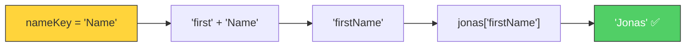
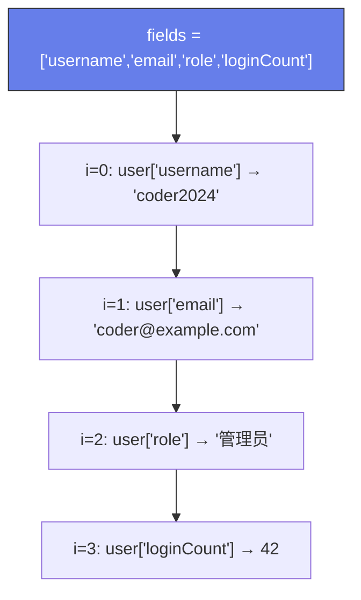

# 点号 vs 方括号表示法（Dot vs. Bracket Notation）

> 📺 来源：015 Dot vs. Bracket Notation.en.srt
> 📂 章节：第 03 章

## 📌 知识脉络
- **前置知识**：对象字面量语法、属性（Property）、数组索引
- **后续扩展**：对象方法（Object Methods）、`this` 关键字、可选链（Optional Chaining）

## 🎯 概述

访问和修改对象属性有两种方式：**点号表示法（Dot Notation）** 和 **方括号表示法（Bracket Notation）**。点号更简洁，方括号更灵活（可以使用表达式计算属性名）。两者都可以用来**读取**和**新增/修改**属性。

## 核心知识点

### 1. 点号表示法（Dot Notation）

> 🧩 **生活类比**：点号就像直接喊一个人的名字——"Jonas，你的工作是什么？"——你必须**已经知道**名字是什么。

```js {runnable} {title="dot_notation.js"}
'use strict';

const jonas = {
  firstName: 'Jonas',
  lastName: 'Schmedtmann',
  age: 2037 - 1991,
  job: 'teacher',
  friends: ['Michael', 'Peter', 'Steven']
};

// 读取属性
console.log(jonas.lastName);  // Schmedtmann
console.log(jonas.age);       // 46
console.log(jonas.job);       // teacher
```

---

### 2. 方括号表示法（Bracket Notation）

> 🧩 **生活类比**：方括号就像通过一张**名片**找人——名片上写的名字可以是动态的、计算出来的，你不需要提前硬编码。

```js {runnable} {title="bracket_notation.js"}
'use strict';

const jonas = {
  firstName: 'Jonas',
  lastName: 'Schmedtmann',
  age: 2037 - 1991,
  job: 'teacher',
  friends: ['Michael', 'Peter', 'Steven']
};

// 方括号内可以放任何表达式
console.log(jonas['lastName']);  // Schmedtmann

// ✅ 动态计算属性名
const nameKey = 'Name';
console.log(jonas['first' + nameKey]);  // Jonas
console.log(jonas['last' + nameKey]);   // Schmedtmann

// ❌ 点号不能用表达式
// console.log(jonas.'last' + nameKey); // SyntaxError!
```

**🔍 执行追踪**：动态属性名

| 步骤 | 表达式 | 计算结果 | 从对象获取 |
|------|--------|---------|-----------|
| ① | `'first' + nameKey` | `'firstName'` | `jonas['firstName']` → `'Jonas'` |
| ② | `'last' + nameKey` | `'lastName'` | `jonas['lastName']` → `'Schmedtmann'` |



---

### 3. 核心区别一览

**📊 点号 vs 方括号对比：**

| 维度 | 点号 `.` | 方括号 `[]` |
|------|---------|------------|
| 语法 | `obj.property` | `obj['property']` 或 `obj[expr]` |
| 属性名 | 必须是**字面量标识符** | 可以是**任何表达式** |
| 动态计算 | ❌ 不支持 | ✅ 支持 |
| 可读性 | ⭐ 更简洁 | 稍冗长 |
| 使用场景 | 知道确切属性名时 | 属性名需要计算时 |

> 💡 **记忆口诀**：**知道名字用点号，动态计算用方括号**

---

### 4. 访问不存在的属性 → `undefined`

```js {runnable} {title="undefined_property.js"}
'use strict';

const jonas = {
  firstName: 'Jonas',
  job: 'teacher'
};

console.log(jonas.location);    // undefined
console.log(jonas['hobby']);    // undefined

// 利用 undefined 是假值做条件判断
const interestedIn = 'location';
if (jonas[interestedIn]) {
  console.log(jonas[interestedIn]);
} else {
  console.log(`⚠️ 属性 "${interestedIn}" 不存在`);
}
```

---

### 5. 添加新属性

```js {runnable} {title="add_property.js"}
'use strict';

const jonas = {
  firstName: 'Jonas',
  lastName: 'Schmedtmann'
};

// 用点号添加
jonas.location = 'Portugal';

// 用方括号添加
jonas['twitter'] = '@jonasschmedtman';

console.log(jonas);
// { firstName: 'Jonas', lastName: 'Schmedtmann', location: 'Portugal', twitter: '@jonasschmedtman' }
```

---

### 6. 综合挑战：动态构建语句

```js {runnable} {title="challenge.js"}
'use strict';

const jonas = {
  firstName: 'Jonas',
  lastName: 'Schmedtmann',
  age: 2037 - 1991,
  job: 'teacher',
  friends: ['Michael', 'Peter', 'Steven']
};

// 动态输出："Jonas has 3 friends, and his best friend is Michael"
console.log(
  `${jonas.firstName} has ${jonas.friends.length} friends, and his best friend is ${jonas.friends[0]}`
);
```

> `jonas.friends` 返回数组 → `.length` 获取长度 → `[0]` 获取第一个元素。**运算符优先级**从左到右执行。

---

## 🛠️ 代码实战与真实场景

> **💼 业务场景**：用户设置面板——根据用户选择的字段名动态显示对应信息。

```js {runnable} {title="user_profile.js"}
'use strict';

const user = {
  username: 'coder2024',
  email: 'coder@example.com',
  role: '管理员',
  loginCount: 42
};

// 模拟用户选择要查看的字段
const fields = ['username', 'email', 'role', 'loginCount'];

for (let i = 0; i < fields.length; i++) {
  // ✅ 必须用方括号，因为 fields[i] 是动态表达式
  console.log(`${fields[i]}: ${user[fields[i]]}`);
}
```



**📊 输入输出示例：**
| 字段名 (动态) | 访问方式 | 值 |
|--------------|---------|-----|
| `'username'` | `user['username']` | `'coder2024'` |
| `'email'` | `user['email']` | `'coder@example.com'` |
| `'role'` | `user['role']` | `'管理员'` |

## 💡 关键要点
- ✅ **点号**简洁直观，适合属性名已知的场景
- ✅ **方括号**可以使用任何**表达式**计算属性名
- ✅ 访问不存在的属性返回 `undefined`（不报错）
- ✅ 两种方式都可以用来**添加新属性**到对象
- ✅ 需要动态属性名时，**必须**用方括号

## ⚠️ 常见误区
- ⚠️ **误区 1**：用点号配合变量——`jonas.interestedIn` 会查找名为 `interestedIn` 的属性，不会读取变量值
- ⚠️ **误区 2**：以为访问不存在的属性会报错——实际返回 `undefined`

## 🐛 报错实验室

**❌ 错误写法：**
```js
'use strict';

const jonas = { firstName: 'Jonas', job: 'teacher' };
const key = 'job';

// ❌ 想用变量 key 访问属性，但用了点号
console.log(jonas.key); // undefined（查找名为 'key' 的属性）

// ✅ 正确做法：用方括号
console.log(jonas[key]); // teacher
```

**浏览器报错：**
```
undefined
teacher
```

**🔑 解读**：`jonas.key` 查找的是字面量属性名 `key`，不是变量 `key` 的值。要使用变量作为属性名，必须用 `jonas[key]`。

---

## 📖 词汇速查表 (Cheat Sheet)
| 中文术语 | 英文术语 | 简明释义 | 速查代码 | 📚 官方文档 |
|---------|---------|---------|---------|-----------|
| 点号表示法 | Dot Notation | 用 `.` 访问固定属性名 | `obj.key` | [MDN](https://developer.mozilla.org/zh-CN/docs/Web/JavaScript/Reference/Operators/Property_accessors#dot_notation) |
| 方括号表示法 | Bracket Notation | 用 `[]` 访问动态属性名 | `obj['key']` | [MDN](https://developer.mozilla.org/zh-CN/docs/Web/JavaScript/Reference/Operators/Property_accessors#bracket_notation) |

---

## 🧪 学习验证

### 📝 动手练习

**练习 1：动态属性访问**
```js {runnable} {title="exercise1.js"}
'use strict';

const car = {
  brand: 'Tesla',
  model: 'Model 3',
  year: 2024,
  color: '白色'
};

// 用方括号表示法，通过循环打印所有属性
const keys = ['brand', 'model', 'year', 'color'];
// 你的代码：

```
<details><summary>💡 参考答案</summary>

```js
'use strict';

const car = { brand: 'Tesla', model: 'Model 3', year: 2024, color: '白色' };
const keys = ['brand', 'model', 'year', 'color'];

for (let i = 0; i < keys.length; i++) {
  console.log(`${keys[i]}: ${car[keys[i]]}`);
}
```
**解题思路**：遍历 keys 数组，用 `car[keys[i]]` 动态访问每个属性。此处必须用方括号，因为属性名是变量。
</details>

**练习 2：构建介绍语句**
```js {runnable} {title="exercise2.js"}
'use strict';

const person = {
  name: '小红',
  age: 25,
  hobbies: ['画画', '游泳', '旅行']
};

// 输出: "小红今年25岁，有3个爱好，最喜欢的是画画"
// 提示: 用 .length 和 [0]

```
<details><summary>💡 参考答案</summary>

```js
console.log(`${person.name}今年${person.age}岁，有${person.hobbies.length}个爱好，最喜欢的是${person.hobbies[0]}`);
```
**解题思路**：`person.hobbies` 是数组，`.length` 获取数量，`[0]` 获取第一个元素。链式访问从左到右执行。
</details>

### ❓ 理解检测

:::quiz {correct="C"}
**1. 以下代码输出什么？**
```js
const obj = { a: 1, b: 2 };
const key = 'a';
console.log(obj.key);
```
- A) `1`
- B) `'a'`
- C) `undefined`
- D) 报错

> **解析**：`obj.key` 查找的是字面量属性名 `key`（不存在），不是变量 `key` 的值 `'a'`。应使用 `obj[key]` 才能得到 `1`。
:::

:::quiz {correct="B"}
**2. 什么时候必须使用方括号表示法？**
- A) 访问数字类型的属性值时
- B) 属性名需要通过表达式计算时
- C) 属性值是数组时
- D) 对象有超过 5 个属性时

> **解析**：当属性名是动态的（存在变量中或需要拼接计算），必须用方括号。点号只能使用字面量属性名。
:::

:::quiz {correct="A"}
**3. `jonas.friends.length` 的执行顺序是？**
- A) 先 `jonas.friends`（得到数组），再 `.length`（得到长度）
- B) 先 `friends.length`，再 `jonas`
- C) 三者同时执行
- D) 先 `.length`，再 `jonas.friends`

> **解析**：点号和方括号运算符都是从**左到右**执行。先计算 `jonas.friends` 得到数组，再在该数组上访问 `.length`。
:::

### 🔧 代码填空

:::fill-blank
const book = { title: 'JS 指南', pages: 300 };
console.log(book___.___ title);    // JS 指南
const prop = 'pages';
console.log(book___[___prop___]___); // 300
:::
