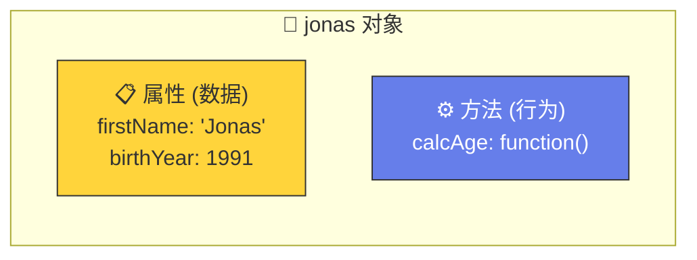
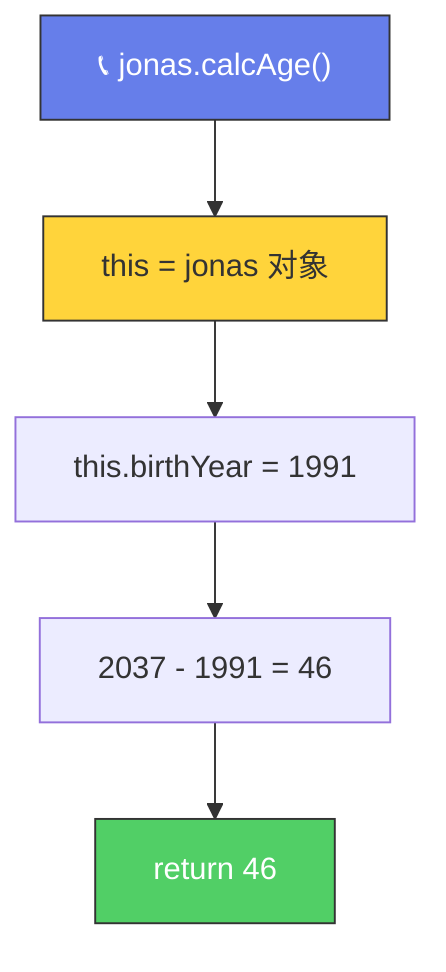
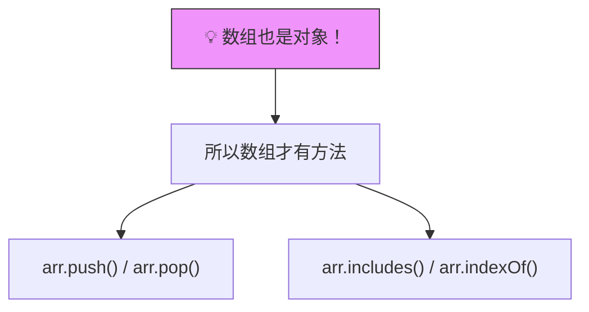
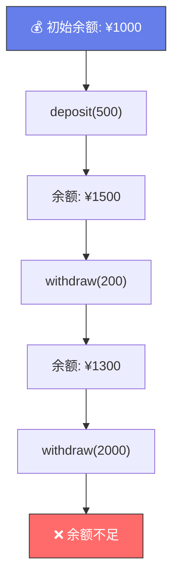

# 对象方法（Object Methods）

> 📺 来源：016 Object Methods.en.srt
> 📂 章节：第 03 章

## 📌 知识脉络
- **前置知识**：对象字面量、点号/方括号表示法、函数表达式
- **后续扩展**：`this` 关键字深入、原型链（Prototype Chain）、类（Class）

## 🎯 概述

对象不仅可以存储数据（属性），还可以存储**函数**作为属性值——这种附着在对象上的函数称为**方法（Method）**。方法内部可以通过 `this` 关键字引用当前对象本身，从而访问和操作对象的其他属性。

## 核心知识点

### 1. 什么是方法？

> 🧩 **生活类比**：如果对象是一个**人**🧑，那属性就是他的个人信息（姓名、年龄），而方法就是他能**做的事情**（自我介绍、计算年龄）。



```js {runnable} {title="object_method.js"}
'use strict';

const jonas = {
  firstName: 'Jonas',
  lastName: 'Schmedtmann',
  birthYear: 1991,
  job: 'teacher',
  friends: ['Michael', 'Peter', 'Steven'],
  hasDriversLicense: true,
  
  // 方法 = 作为属性值的函数表达式
  calcAge: function (birthYear) {
    return 2037 - birthYear;
  }
};

// 用点号调用方法
console.log(jonas.calcAge(1991)); // 46

// 用方括号调用方法
console.log(jonas['calcAge'](1991)); // 46
```

> ⚠️ 只有**函数表达式**可以作为对象的方法。函数声明**不能**直接放在对象字面量中。

---

### 2. `this` 关键字——方法的灵魂

> 🧩 **生活类比**：`this` 就像是"**我自己**"——当 Jonas 说"我的名字是 Jonas"时，"我"就是 `this`，指向说话的那个人（调用方法的对象）。

```js {runnable} {title="this_keyword.js"}
'use strict';

const jonas = {
  firstName: 'Jonas',
  birthYear: 1991,
  
  // ✅ 使用 this 访问同一对象的属性
  calcAge: function () {
    console.log(this); // 输出 jonas 对象本身
    return 2037 - this.birthYear; // this.birthYear = 1991
  }
};

console.log(jonas.calcAge()); // 46
```

**🔍 执行追踪**：`jonas.calcAge()` 中的 `this`

| 步骤 | 代码 | `this` 指向 | 说明 |
|------|------|------------|------|
| ① | `jonas.calcAge()` | `jonas` 对象 | 谁调用方法，`this` 就指谁 |
| ② | `this.birthYear` | — | 即 `jonas.birthYear` = `1991` |
| ③ | `2037 - 1991` | — | 返回 `46` |



> 💡 **记忆口诀**：**谁调用方法，`this` 就指谁**

---

### 3. 缓存计算结果到对象属性

避免重复计算——调用一次方法后，把结果存为新属性：

```js {runnable} {title="cache_result.js"}
'use strict';

const jonas = {
  firstName: 'Jonas',
  birthYear: 1991,
  
  calcAge: function () {
    this.age = 2037 - this.birthYear; // 创建新属性 age
    return this.age;
  }
};

// 第一次调用：计算并缓存
jonas.calcAge();

// 后续直接读取属性（无需重新计算）
console.log(jonas.age); // 46
console.log(jonas.age); // 46
console.log(jonas.age); // 46
```

:::code-comparison
```js {title="🚨 每次都重新计算"}
// 调用 4 次函数 = 计算 4 次
console.log(jonas.calcAge());
console.log(jonas.calcAge());
console.log(jonas.calcAge());
console.log(jonas.calcAge());
```
```js {title="✨ 计算一次，缓存复用"}
// 只计算 1 次，存入 this.age
jonas.calcAge();
// 后续直接读取属性
console.log(jonas.age);
console.log(jonas.age);
console.log(jonas.age);
```
:::

---

### 4. 综合实战：`getSummary` 方法

```js {runnable} {title="get_summary.js"}
'use strict';

const jonas = {
  firstName: 'Jonas',
  birthYear: 1991,
  job: 'teacher',
  hasDriversLicense: true,
  
  calcAge: function () {
    this.age = 2037 - this.birthYear;
    return this.age;
  },
  
  getSummary: function () {
    return `${this.firstName} is a ${this.calcAge()} year old ${this.job}, and he has ${this.hasDriversLicense ? 'a' : 'no'} driver's license.`;
  }
};

console.log(jonas.getSummary());
// Jonas is a 46 year old teacher, and he has a driver's license.
```

> 注意 `this.calcAge()` 在方法内调用**同对象的另一个方法**——用 `this` 而不是 `jonas`，这样如果对象名改变，代码仍然工作。

---

### 5. 数组方法的真相



> 之前学过的 `push`、`pop`、`includes` 等**数组方法**之所以存在，正是因为**数组本质上也是对象**。

---

## 🛠️ 代码实战与真实场景

> **💼 业务场景**：银行账户对象——用方法实现存款、取款和余额查询。

```js {runnable} {title="bank_account.js"}
'use strict';

const account = {
  owner: 'Alice',
  balance: 1000,
  
  deposit: function (amount) {
    this.balance += amount;
    return `✅ 存入 ¥${amount}，余额: ¥${this.balance}`;
  },
  
  withdraw: function (amount) {
    if (amount > this.balance) {
      return `❌ 余额不足！当前余额: ¥${this.balance}`;
    }
    this.balance -= amount;
    return `✅ 取出 ¥${amount}，余额: ¥${this.balance}`;
  },
  
  getInfo: function () {
    return `👤 ${this.owner} | 💰 余额: ¥${this.balance}`;
  }
};

console.log(account.deposit(500));    // ✅ 存入 ¥500，余额: ¥1500
console.log(account.withdraw(200));   // ✅ 取出 ¥200，余额: ¥1300
console.log(account.withdraw(2000));  // ❌ 余额不足！
console.log(account.getInfo());       // 👤 Alice | 💰 余额: ¥1300
```



**📊 输入输出示例：**
| 操作 | 参数 | 余额变化 | 返回 |
|------|------|---------|------|
| `deposit` | `500` | 1000 → 1500 | ✅ 存入成功 |
| `withdraw` | `200` | 1500 → 1300 | ✅ 取出成功 |
| `withdraw` | `2000` | 1300 不变 | ❌ 余额不足 |

## 💡 关键要点
- ✅ **方法 = 作为对象属性值的函数**
- ✅ 方法内部用 `this` 访问当前对象的属性和其他方法
- ✅ **谁调用方法，`this` 就指向谁**（`jonas.calcAge()` → `this = jonas`）
- ✅ 可以用 `this.newProp = value` 在方法中**动态创建新属性**
- ✅ 数组也是对象，所以数组才有 `push`、`pop` 等方法

## ⚠️ 常见误区
- ⚠️ **误区 1**：在方法中用对象名代替 `this`（如 `jonas.birthYear` 而非 `this.birthYear`）——如果变量名改变，代码就会坏掉
- ⚠️ **误区 2**：以为箭头函数也能用 `this` 指向对象——箭头函数**没有自己的 `this`**，在对象方法中会出问题

## 🐛 报错实验室

**❌ 错误写法：**
```js
'use strict';

const person = {
  name: 'Bob',
  // ❌ 用箭头函数作为方法
  greet: () => {
    console.log(`Hi, I'm ${this.name}`);
  }
};

person.greet(); // Hi, I'm undefined 😱
```

**浏览器报错：**
```
Hi, I'm undefined
```

**🔑 解读**：箭头函数**没有自己的 `this`**，它会继承外层作用域的 `this`（这里是全局的 `window` 或 `undefined`）。对象方法应该用**函数表达式**而非箭头函数。

---

## 📖 词汇速查表 (Cheat Sheet)
| 中文术语 | 英文术语 | 简明释义 | 速查代码 | 📚 官方文档 |
|---------|---------|---------|---------|-----------|
| 方法 | Method | 作为对象属性值的函数 | `obj.fn()` | [MDN](https://developer.mozilla.org/zh-CN/docs/Web/JavaScript/Guide/Working_with_objects#defining_methods) |
| `this` 关键字 | this keyword | 指向调用方法的对象 | `this.prop` | [MDN](https://developer.mozilla.org/zh-CN/docs/Web/JavaScript/Reference/Operators/this) |

---

## 🧪 学习验证

### 📝 动手练习

**练习 1：计数器对象**
```js {runnable} {title="exercise1.js"}
'use strict';

// 创建一个 counter 对象，包含：
// - count 属性（初始值 0）
// - increment 方法（count 加 1，返回当前值）
// - decrement 方法（count 减 1，返回当前值）
// - reset 方法（count 归零，返回当前值）


// 测试
console.log(counter.increment()); // 1
console.log(counter.increment()); // 2
console.log(counter.increment()); // 3
console.log(counter.decrement()); // 2
console.log(counter.reset());     // 0
```
<details><summary>💡 参考答案</summary>

```js
'use strict';

const counter = {
  count: 0,
  increment: function () { return ++this.count; },
  decrement: function () { return --this.count; },
  reset: function () { this.count = 0; return this.count; }
};
```
**解题思路**：每个方法通过 `this.count` 操作同一个属性，实现状态的集中管理。
</details>

**练习 2：个人摘要方法**
```js {runnable} {title="exercise2.js"}
'use strict';

const student = {
  name: '小明',
  birthYear: 2005,
  grade: '高一',
  scores: [88, 92, 76],
  
  // 添加 getAverage 方法：返回平均分
  // 添加 getSummary 方法：返回 "小明，高一，平均分XX"
};

// 测试
console.log(student.getAverage());
console.log(student.getSummary());
```
<details><summary>💡 参考答案</summary>

```js
const student = {
  name: '小明',
  birthYear: 2005,
  grade: '高一',
  scores: [88, 92, 76],
  
  getAverage: function () {
    let sum = 0;
    for (let i = 0; i < this.scores.length; i++) {
      sum += this.scores[i];
    }
    this.average = sum / this.scores.length;
    return this.average;
  },
  
  getSummary: function () {
    return `${this.name}，${this.grade}，平均分${this.getAverage().toFixed(1)}`;
  }
};
```
**解题思路**：`getAverage` 遍历 `this.scores` 计算平均分并缓存；`getSummary` 调用 `this.getAverage()` 获取数据。
</details>

### ❓ 理解检测

:::quiz {correct="B"}
**1. 在 `jonas.calcAge()` 中，`this` 指向谁？**
- A) `calcAge` 函数本身
- B) `jonas` 对象
- C) 全局 `window` 对象
- D) `undefined`

> **解析**：`this` 指向**调用方法的对象**。`jonas.calcAge()` 中调用者是 `jonas`，所以 `this = jonas`。
:::

:::quiz {correct="C"}
**2. 为什么建议用 `this.birthYear` 而非 `jonas.birthYear`？**
- A) `this` 运行更快
- B) JavaScript 语法强制要求
- C) 如果对象变量名改变，`this` 仍然有效
- D) `jonas.birthYear` 会报错

> **解析**：使用 `this` 使方法不依赖特定变量名，更加灵活和可维护。如果将 `jonas` 改名为 `person`，用 `this` 的代码无需修改。
:::

:::quiz {correct="A"}
**3. 为什么不能用箭头函数作为对象方法？**
- A) 箭头函数没有自己的 `this`，会继承外层作用域的 `this`
- B) 箭头函数不能有参数
- C) 箭头函数不能作为属性值
- D) 箭头函数执行速度更慢

> **解析**：箭头函数没有自己的 `this`，它会继承定义时外层作用域的 `this`（通常是全局对象或 `undefined`），而不是调用时的对象。
:::

### 🔧 代码填空

:::fill-blank
const dog = {
  name: 'Buddy',
  age: 3,
  bark: ___function___ () {
    return `${___this___.name} says Woof!`;
  }
};
console.log(dog.___bark___()); // Buddy says Woof!
:::
