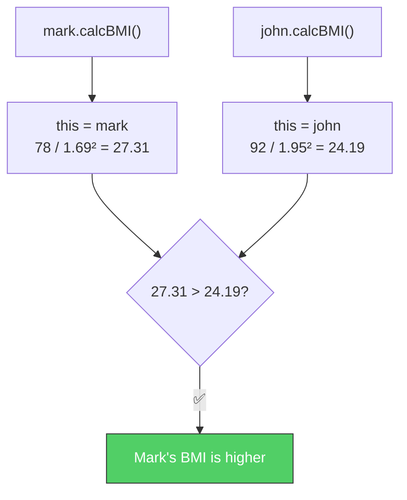

# 🏆 Coding Challenge #3

> 📺 来源：018 CHALLENGE #3 Video Solution.en.srt
> 📂 章节：第 03 章

## 📌 知识脉络
- **前置知识**：对象字面量、对象方法、`this` 关键字、`if/else`、模板字符串
- **后续扩展**：循环（Loops）、面向对象编程（OOP）

## 🎯 概述

本挑战综合运用对象和方法知识。创建两个人物对象，各自包含 `calcBMI` 方法来计算 BMI 值，最后比较并输出结果。

---

## 📋 Tasks（任务清单）

1. 为 Mark 和 John 各创建一个对象，包含 `fullName`、`mass`（kg）和 `height`（m）
2. 在每个对象中创建 `calcBMI` 方法，计算 BMI（`mass / height²`），将结果**存到对象属性**中并返回
3. 输出：`"{fullName}'s BMI ({bmi}) is higher than {fullName}'s BMI ({bmi})!"`

## 📊 Test Data（测试数据）

| 人物 | fullName | mass (kg) | height (m) |
|------|----------|-----------|------------|
| Mark | Mark Miller | 78 | 1.69 |
| John | John Smith | 92 | 1.95 |

> 💡 **提示**：BMI 公式 = `mass / (height ** 2)`

---

## 🧪 实战沙盒

```js {runnable} {title="challenge3.js"}
'use strict';

// 1. 创建 Mark 和 John 的对象（包含 fullName, mass, height）
// 2. 添加 calcBMI 方法（用 this 访问属性，存储到 this.bmi）
// 3. 比较并输出谁的 BMI 更高


```

---

<details><summary>💡 Jonas 官方解法拆解</summary>

### 完整代码

```js
'use strict';

const mark = {
  fullName: 'Mark Miller',
  mass: 78,
  height: 1.69,
  calcBMI: function () {
    this.bmi = this.mass / (this.height ** 2);
    return this.bmi;
  }
};

const john = {
  fullName: 'John Smith',
  mass: 92,
  height: 1.95,
  calcBMI: function () {
    this.bmi = this.mass / (this.height ** 2);
    return this.bmi;
  }
};

// 先调用方法计算 BMI
mark.calcBMI();
john.calcBMI();

console.log(mark.bmi, john.bmi); // 27.31 24.19

if (mark.bmi > john.bmi) {
  console.log(
    `${mark.fullName}'s BMI (${mark.bmi.toFixed(1)}) is higher than ${john.fullName}'s BMI (${john.bmi.toFixed(1)})!`
  );
} else if (john.bmi > mark.bmi) {
  console.log(
    `${john.fullName}'s BMI (${john.bmi.toFixed(1)}) is higher than ${mark.fullName}'s BMI (${mark.bmi.toFixed(1)})!`
  );
}
// Mark Miller's BMI (27.3) is higher than John Smith's BMI (24.2)!
```

### 🔍 执行追踪

| 步骤 | 代码 | `this` 指向 | 结果 |
|------|------|------------|------|
| ① | `mark.calcBMI()` | `mark` | `78 / 1.69² = 27.31` |
| ② | `john.calcBMI()` | `john` | `92 / 1.95² = 24.19` |
| ③ | `mark.bmi > john.bmi` | — | `27.31 > 24.19` ✅ |



### 关键设计要点

- 同一个 `calcBMI` 方法被复制到两个对象中，`this` 根据调用者自动指向不同对象
- `this.bmi = ...` 在方法中动态创建新属性，后续可以直接用 `mark.bmi` 访问
- 未来通过 OOP（面向对象编程）可以避免复制相同方法的重复代码

</details>

---

## 📖 词汇速查表 (Cheat Sheet)
| 中文术语 | 英文术语 | 简明释义 | 速查代码 | 📚 官方文档 |
|---------|---------|---------|---------|-----------|
| 身体质量指数 | BMI | 体重/身高² | `mass / height ** 2` | — |
| 对象方法 | Method | 作为属性值的函数 | `obj.fn()` | [MDN](https://developer.mozilla.org/zh-CN/docs/Web/JavaScript/Guide/Working_with_objects) |
| 幂运算符 | Exponentiation | 求幂 | `2 ** 3` = 8 | [MDN](https://developer.mozilla.org/zh-CN/docs/Web/JavaScript/Reference/Operators/Exponentiation) |

---

## 🧪 学习验证

### ❓ 理解检测

:::quiz {correct="B"}
**1. 同一个 `calcBMI` 方法在 `mark` 和 `john` 中都能工作，是因为？**
- A) JavaScript 自动检测对象的属性名
- B) `this` 关键字会指向调用方法的对象
- C) 两个对象共享同一个函数实例
- D) 对象会自动传入 `mass` 和 `height` 参数

> **解析**：`this` 指向**调用方法的对象**。`mark.calcBMI()` 时 `this` 是 `mark`，`john.calcBMI()` 时 `this` 是 `john`。
:::

:::quiz {correct="C"}
**2. 如果不先调用 `mark.calcBMI()`，直接访问 `mark.bmi` 会得到什么？**
- A) `0`
- B) 报错
- C) `undefined`
- D) 自动计算的 BMI 值

> **解析**：`bmi` 属性是在 `calcBMI()` 方法中通过 `this.bmi = ...` 动态创建的。不调用方法，属性不存在，返回 `undefined`。
:::

:::quiz {correct="A"}
**3. 两个对象中有完全相同的 `calcBMI` 方法，这违反了什么原则？**
- A) DRY 原则（Don't Repeat Yourself）
- B) 单一职责原则
- C) 严格模式
- D) 没有违反任何原则

> **解析**：相同代码出现两次违反 DRY 原则。后续通过 OOP（面向对象编程）的类和继承可以解决。
:::

### 🔧 代码填空

:::fill-blank
const mark = {
  mass: 78,
  height: 1.69,
  calcBMI: function () {
    ___this___.bmi = this.mass / (___this___.height ** 2);
    return this.___bmi___;
  }
};
:::
