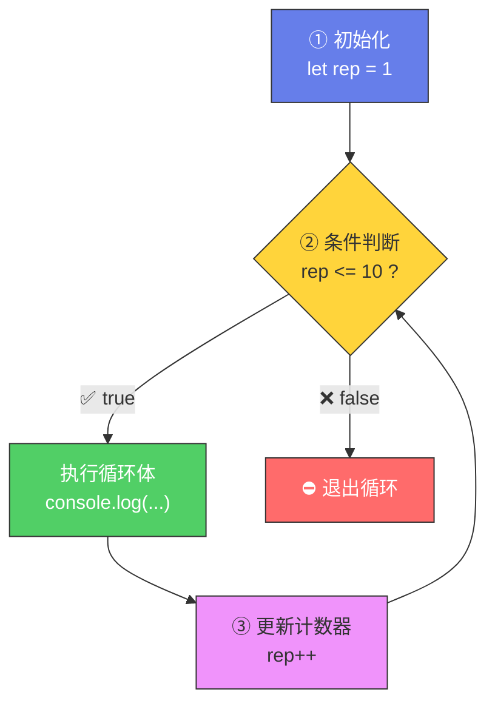
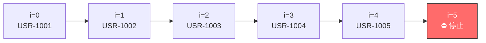

# 迭代：for 循环（Iteration: The for Loop）

> 📺 来源：019 Iteration The for Loop.en.srt
> 📂 章节：第 03 章

## 📌 知识脉络
- **前置知识**：变量声明（`let`）、比较运算符、自增运算符（`++`）、DRY 原则
- **后续扩展**：循环遍历数组、`break` / `continue`、`while` 循环、高阶数组方法

## 🎯 概述

循环（Loop）让我们能够**重复执行**一段代码，而不需要手动复制粘贴。`for` 循环是最常用的循环结构，由三部分组成：**初始化计数器**、**循环条件**、**更新计数器**。只要条件为真，循环体就会一直执行。

## 核心知识点

### 1. 为什么需要循环？

> 🧩 **生活类比**：循环就像健身房里的**重复训练**🏋️——你不会写 10 张纸分别写"举重第1次"到"举重第10次"，而是对教练说"帮我计数，做 10 次"。循环就是你的**自动计数器**。

:::code-comparison
```js {title="🚨 手动重复 (The Naive Way)"}
console.log('Lifting weights rep 1 🏋️');
console.log('Lifting weights rep 2 🏋️');
console.log('Lifting weights rep 3 🏋️');
// ... 还要写 7 行 😩
console.log('Lifting weights rep 10 🏋️');
```
```js {title="✨ for 循环 (The DRY Way)"}
for (let rep = 1; rep <= 10; rep++) {
  console.log(`Lifting weights rep ${rep} 🏋️`);
}
// 一行搞定 10 次！🎉
```
:::

---

### 2. for 循环的三部分结构



```js {runnable} {title="for_loop.js"}
'use strict';

//       ①初始化      ②条件     ③更新
for (let rep = 1; rep <= 10; rep++) {
  console.log(`Lifting weights rep ${rep} 🏋️`);
}
```

**🔍 执行追踪**：

| 迭代 | `rep` 值 | 条件 `rep <= 10` | 执行？ | 输出 |
|------|---------|-----------------|--------|------|
| 1 | 1 | ✅ `1 <= 10` | ✅ | Lifting weights rep 1 🏋️ |
| 2 | 2 | ✅ `2 <= 10` | ✅ | Lifting weights rep 2 🏋️ |
| ... | ... | ... | ... | ... |
| 10 | 10 | ✅ `10 <= 10` | ✅ | Lifting weights rep 10 🏋️ |
| 11 | 11 | ❌ `11 <= 10` | ❌ | 循环结束 |

> 💡 **记忆口诀**：**初始化 → 判条件 → 跑代码 → 加计数 → 回头判**（条件为假时退出）

---

### 3. 三部分详解

| 部分 | 作用 | 语法 | 时机 |
|------|------|------|------|
| ① 初始化 | 创建计数器变量 | `let i = 0` | 循环开始前执行**一次** |
| ② 条件 | 决定是否继续 | `i < 10` | **每次迭代前**检查 |
| ③ 更新 | 改变计数器 | `i++` | **每次迭代后**执行 |

---

## 🛠️ 代码实战与真实场景

> **💼 业务场景**：批量生成用户编号——新用户注册时自动分配从 1001 开始的 ID。

```js {runnable} {title="user_ids.js"}
'use strict';

const startId = 1001;
const count = 5;

for (let i = 0; i < count; i++) {
  const userId = startId + i;
  console.log(`📋 新用户注册，ID: USR-${userId}`);
}
// 📋 新用户注册，ID: USR-1001
// 📋 新用户注册，ID: USR-1002
// ... 直到 USR-1005
```



**📊 输入输出示例：**
| 迭代 `i` | `startId + i` | 输出 |
|----------|---------------|------|
| 0 | 1001 | USR-1001 |
| 1 | 1002 | USR-1002 |
| 4 | 1005 | USR-1005 |

## 💡 关键要点
- ✅ `for` 循环由三部分组成：**初始化**、**条件**、**更新**
- ✅ 循环在条件为 `true` 时**持续执行**，为 `false` 时停止
- ✅ 计数器变量用 `let` 声明（因为每次迭代都要更新它）
- ✅ `i++` 是 `i = i + 1` 的简写
- ✅ 循环体内可以使用计数器变量构建动态内容

## ⚠️ 常见误区
- ⚠️ **误区 1**：条件永远为 `true`（如 `for (let i = 0; i >= 0; i++)`）→ **死循环**！浏览器会卡死
- ⚠️ **误区 2**：计数器用 `const` 声明——`const` 不可重新赋值，循环会报错

## 🐛 报错实验室

**❌ 错误写法：**
```js
'use strict';

// ⚠️ 死循环！条件永远为 true
for (let i = 0; i < 10; i--) {
  console.log(i); // i 越来越小，永远 < 10
}
```

**浏览器报错：**
```
（页面无响应 / 浏览器卡死 🥶）
```

**🔑 解读**：`i--` 让计数器递减，`i < 10` 永远成立。必须确保更新操作（`i++`）能让条件最终变为 `false`。

---

## 📖 词汇速查表 (Cheat Sheet)
| 中文术语 | 英文术语 | 简明释义 | 速查代码 | 📚 官方文档 |
|---------|---------|---------|---------|-----------|
| for 循环 | for Loop | 带计数器的循环结构 | `for(let i=0;i<n;i++){}` | [MDN](https://developer.mozilla.org/zh-CN/docs/Web/JavaScript/Reference/Statements/for) |
| 迭代 | Iteration | 循环执行一次的过程 | — | [MDN](https://developer.mozilla.org/zh-CN/docs/Web/JavaScript/Guide/Loops_and_iteration) |
| 自增运算符 | Increment | 变量值加 1 | `i++` | [MDN](https://developer.mozilla.org/zh-CN/docs/Web/JavaScript/Reference/Operators/Increment) |

---

## 🧪 学习验证

### 📝 动手练习

**练习 1：九九乘法表（单行）**
```js {runnable} {title="exercise1.js"}
'use strict';

// 用 for 循环打印 7 的乘法表（7×1 到 7×9）
// 输出格式: "7 × 1 = 7", "7 × 2 = 14", ...

```
<details><summary>💡 参考答案</summary>

```js
for (let i = 1; i <= 9; i++) {
  console.log(`7 × ${i} = ${7 * i}`);
}
```
**解题思路**：计数器 `i` 从 1 到 9，每次输出 `7 × i` 的结果。
</details>

**练习 2：倒计时**
```js {runnable} {title="exercise2.js"}
'use strict';

// 从 10 倒数到 1，最后输出 "🚀 发射！"
// 提示：计数器可以递减

```
<details><summary>💡 参考答案</summary>

```js
for (let i = 10; i >= 1; i--) {
  console.log(i);
}
console.log('🚀 发射！');
```
**解题思路**：初始化 `i = 10`，条件 `i >= 1`，更新 `i--`。循环结束后输出发射。
</details>

### ❓ 理解检测

:::quiz {correct="B"}
**1. `for (let i = 0; i < 5; i++)` 的循环体会执行几次？**
- A) 4 次
- B) 5 次（i = 0,1,2,3,4）
- C) 6 次
- D) 无限次

> **解析**：`i` 从 0 开始，条件 `i < 5` 在 `i = 0,1,2,3,4` 时为真（5 次），`i = 5` 时为假，停止。
:::

:::quiz {correct="C"}
**2. for 循环三部分的执行顺序是？**
- A) 条件 → 初始化 → 循环体 → 更新
- B) 初始化 → 循环体 → 条件 → 更新
- C) 初始化 → 条件 → 循环体 → 更新（之后重复"条件→循环体→更新"）
- D) 循环体 → 条件 → 更新 → 初始化

> **解析**：首先执行一次初始化，然后每轮先检查条件，为真则执行循环体，最后执行更新操作。
:::

:::quiz {correct="A"}
**3. 循环变量为什么必须用 `let` 而不能用 `const`？**
- A) 因为每次迭代需要更新变量的值，`const` 不允许重新赋值
- B) `const` 会导致死循环
- C) JavaScript 语法不允许在 for 中用 `const`
- D) `let` 变量运行更快

> **解析**：`const` 声明的变量不可重新赋值。循环的更新部分（如 `i++`）需要修改变量值，所以必须用 `let`。
:::

### 🔧 代码填空

:::fill-blank
for (___let___ i = 1; i ___<=___ 5; i___++___) {
  console.log(`第 ${i} 次`);
}
:::
