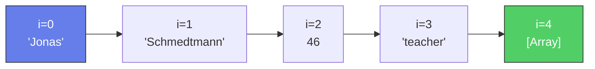
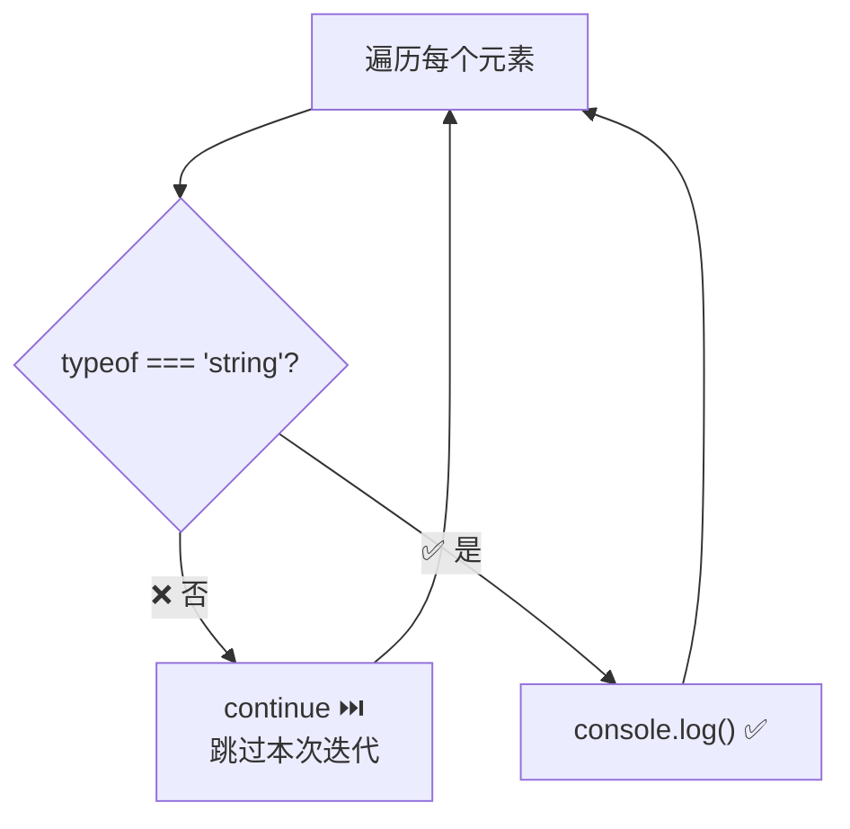
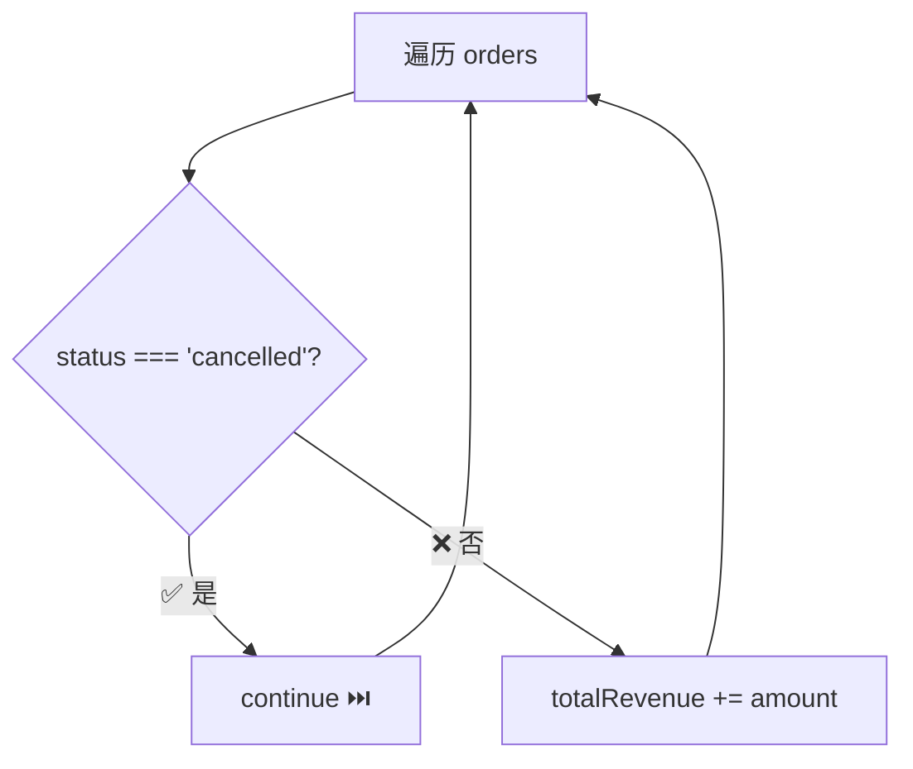

# 循环遍历数组、break 与 continue

> 📺 来源：020 Looping Arrays, Breaking and Continuing.en.srt
> 📂 章节：第 03 章

## 📌 知识脉络
- **前置知识**：`for` 循环、数组（索引、`.length`）、`typeof` 运算符
- **后续扩展**：嵌套循环、`while` 循环、高阶数组方法（`.forEach()`、`.map()`）

## 🎯 概述

`for` 循环最常见的用途是**遍历数组**。本节将学习如何用循环读取数组元素、向新数组中填充数据，以及用 `continue` 和 `break` 控制循环的执行流程。

## 核心知识点

### 1. 用 for 循环遍历数组

> 🧩 **生活类比**：遍历数组就像翻阅一本**相册**📸——从第一页（索引 0）依次翻到最后一页（索引 `length - 1`），每翻一页就看一眼照片内容。

```js {runnable} {title="loop_array.js"}
'use strict';

const jonas = [
  'Jonas',
  'Schmedtmann',
  2037 - 1991,
  'teacher',
  ['Michael', 'Peter', 'Steven']
];

// 遍历数组：i 从 0 到 length-1
for (let i = 0; i < jonas.length; i++) {
  console.log(jonas[i], typeof jonas[i]);
}
```



**🔍 执行追踪**：

| `i` | `jonas[i]` | `typeof` | 说明 |
|-----|-----------|----------|------|
| 0 | `'Jonas'` | `string` | 名 |
| 1 | `'Schmedtmann'` | `string` | 姓 |
| 2 | `46` | `number` | 年龄 |
| 3 | `'teacher'` | `string` | 职业 |
| 4 | `[...]` | `object` | 数组也是对象 |

> 💡 **记忆口诀**：**`i` 从 0 起，到 `length` 止（不含）**——`i < arr.length` 而非 `i <= arr.length`

---

### 2. 在循环中构建新数组

```js {runnable} {title="build_array.js"}
'use strict';

const years = [1991, 2007, 1969, 2020];
const ages = [];

for (let i = 0; i < years.length; i++) {
  ages.push(2037 - years[i]);
}

console.log(ages); // [46, 30, 68, 17]
```

---

### 3. `continue` —— 跳过当前迭代

```js {runnable} {title="continue.js"}
'use strict';

const jonas = ['Jonas', 'Schmedtmann', 46, 'teacher', true];

// 只打印字符串类型的元素
console.log('--- ONLY STRINGS ---');
for (let i = 0; i < jonas.length; i++) {
  if (typeof jonas[i] !== 'string') continue; // 跳过非字符串
  console.log(jonas[i]);
}
// Jonas, Schmedtmann, teacher
```



---

### 4. `break` —— 终止整个循环

```js {runnable} {title="break.js"}
'use strict';

const jonas = ['Jonas', 'Schmedtmann', 46, 'teacher', true];

// 找到第一个数字后就停止
console.log('--- BREAK WITH NUMBER ---');
for (let i = 0; i < jonas.length; i++) {
  if (typeof jonas[i] === 'number') break; // 遇到数字立即终止
  console.log(jonas[i]);
}
// Jonas, Schmedtmann（46 是数字，循环直接终止）
```

**📊 `continue` vs `break` 对比：**

| 关键字 | 作用 | 类比 |
|--------|------|------|
| `continue` | **跳过**当前这一次迭代，继续下一次 | 跳过不喜欢的歌 ⏭️ |
| `break` | **终止**整个循环 | 关掉播放器 ⛔ |

---

## 🛠️ 代码实战与真实场景

> **💼 业务场景**：统计订单列表中的有效订单总金额，跳过已取消的订单。

```js {runnable} {title="order_total.js"}
'use strict';

const orders = [
  { id: 1, amount: 120, status: 'paid' },
  { id: 2, amount: 85, status: 'cancelled' },
  { id: 3, amount: 200, status: 'paid' },
  { id: 4, amount: 50, status: 'paid' }
];

let totalRevenue = 0;

for (let i = 0; i < orders.length; i++) {
  if (orders[i].status === 'cancelled') continue; // 跳过已取消
  totalRevenue += orders[i].amount;
  console.log(`✅ 订单 #${orders[i].id}: ¥${orders[i].amount}`);
}

console.log(`💰 总收入: ¥${totalRevenue}`); // ¥370
```



**📊 输入输出示例：**
| 订单 ID | 金额 | 状态 | 是否计入 |
|---------|------|------|---------|
| 1 | ¥120 | paid | ✅ |
| 2 | ¥85 | cancelled | ⏭️ 跳过 |
| 3 | ¥200 | paid | ✅ |
| 4 | ¥50 | paid | ✅ |

## 💡 关键要点
- ✅ 遍历数组的标准模式：`for (let i = 0; i < arr.length; i++)`
- ✅ 可以在循环中用 `push` 构建新数组
- ✅ `continue` 跳过当前迭代，继续下一次
- ✅ `break` 立即终止整个循环
- ✅ 数组索引从 0 到 `length - 1`

## ⚠️ 常见误区
- ⚠️ **误区 1**：用 `i <= arr.length` 作为条件——最后一次 `i = arr.length` 会越界，得到 `undefined`
- ⚠️ **误区 2**：混淆 `continue` 和 `break`——`continue` 只跳过一次，`break` 终止整个循环

## 🐛 报错实验室

**❌ 错误写法：**
```js
const arr = [1, 2, 3];
for (let i = 0; i <= arr.length; i++) {
  console.log(arr[i]);
}
// 1, 2, 3, undefined ← 多了一个！
```

**浏览器报错：**
```
1
2
3
undefined
```

**🔑 解读**：`i <= arr.length` 当 `i = 3` 时仍会执行，但 `arr[3]` 不存在，返回 `undefined`。正确写法：`i < arr.length`。

---

## 📖 词汇速查表 (Cheat Sheet)
| 中文术语 | 英文术语 | 简明释义 | 速查代码 | 📚 官方文档 |
|---------|---------|---------|---------|-----------|
| 遍历 | Iterate / Loop through | 逐个访问数组元素 | `for(let i=0;...)` | [MDN](https://developer.mozilla.org/zh-CN/docs/Web/JavaScript/Guide/Loops_and_iteration) |
| 跳过 | continue | 跳过本次迭代 | `continue;` | [MDN](https://developer.mozilla.org/zh-CN/docs/Web/JavaScript/Reference/Statements/continue) |
| 终止 | break | 终止整个循环 | `break;` | [MDN](https://developer.mozilla.org/zh-CN/docs/Web/JavaScript/Reference/Statements/break) |

---

## 🧪 学习验证

### 📝 动手练习

**练习 1：过滤偶数**
```js {runnable} {title="exercise1.js"}
'use strict';
const numbers = [3, 7, 12, 5, 8, 20, 1, 15];
const evens = [];

// 用 for 循环 + continue 只收集偶数到 evens 中

console.log(evens); // [12, 8, 20]
```
<details><summary>💡 参考答案</summary>

```js
for (let i = 0; i < numbers.length; i++) {
  if (numbers[i] % 2 !== 0) continue;
  evens.push(numbers[i]);
}
```
</details>

### ❓ 理解检测

:::quiz {correct="B"}
**1. `continue` 和 `break` 的区别是？**
- A) `continue` 终止循环，`break` 跳过一次
- B) `continue` 跳过当前迭代，`break` 终止整个循环
- C) 两者功能相同
- D) `continue` 只能用在 `while` 循环中

> **解析**：`continue` 跳过本次迭代直接进入下一次，`break` 立即退出整个循环。
:::

:::quiz {correct="C"}
**2. `for (let i = 0; i < 3; i++)` 中 `i` 的取值依次是？**
- A) 1, 2, 3
- B) 0, 1, 2, 3
- C) 0, 1, 2
- D) 1, 2

> **解析**：`i` 从 0 开始，条件 `i < 3` 在 0、1、2 时为真（3 次），`i = 3` 时为假，停止。
:::

:::quiz {correct="A"}
**3. 遍历数组的标准条件为什么用 `i < arr.length` 而不是 `i <= arr.length`？**
- A) 索引从 0 开始，最大索引是 `length - 1`，用 `<=` 会越界
- B) `<=` 会导致死循环
- C) JavaScript 语法不允许
- D) 没有区别，两种都可以

> **解析**：数组索引从 0 到 `length - 1`。`i <= arr.length` 时最后一次 `i = arr.length`，越界访问返回 `undefined`。
:::

### 🔧 代码填空

:::fill-blank
const arr = ['a', 'b', 'c'];
for (let i = ___0___; i ___<___ arr.___length___; i++) {
  console.log(arr[i]);
}
:::
