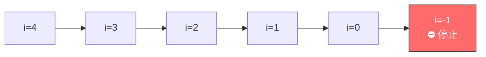
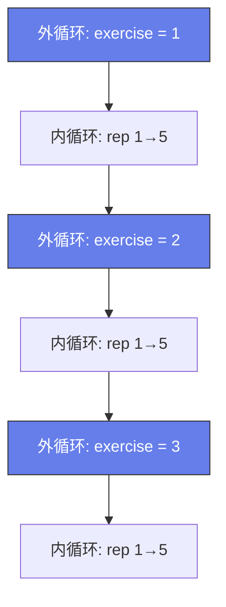

# 嵌套循环与倒序遍历（Looping Backwards and Loops in Loops）

> 📺 来源：021 Looping Backwards and Loops in Loops.en.srt
> 📂 章节：第 03 章

## 📌 知识脉络
- **前置知识**：`for` 循环、数组遍历、`continue` / `break`
- **后续扩展**：`while` 循环、嵌套数据结构、算法复杂度

## 🎯 概述

本节学习两个进阶循环技巧：**倒序遍历数组**（计数器从大到小递减）和**嵌套循环**（循环中套循环）。嵌套循环常用于二维数据处理、排列组合等场景。

## 核心知识点

### 1. 倒序遍历数组

```js {runnable} {title="loop_backwards.js"}
'use strict';

const jonas = [
  'Jonas',
  'Schmedtmann',
  2037 - 1991,
  'teacher',
  ['Michael', 'Peter', 'Steven']
];

// 倒序：从最后一个元素开始
for (let i = jonas.length - 1; i >= 0; i--) {
  console.log(i, jonas[i]);
}
// 4 ['Michael', 'Peter', 'Steven']
// 3 'teacher'
// 2 46
// 1 'Schmedtmann'
// 0 'Jonas'
```

> 💡 **关键点**：初始值 = `arr.length - 1`（最后一个索引），条件 = `i >= 0`，更新 = `i--`



---

### 2. 嵌套循环（Loops in Loops）

> 🧩 **生活类比**：嵌套循环就像**钟表**⏰——秒针转完一圈（内循环），分针才走一格（外循环执行一次）。

```js {runnable} {title="nested_loops.js"}
'use strict';

for (let exercise = 1; exercise <= 3; exercise++) {
  console.log(`----- Starting exercise ${exercise} -----`);
  
  for (let rep = 1; rep <= 5; rep++) {
    console.log(`Exercise ${exercise}: Lifting weight rep ${rep} 🏋️`);
  }
}
```



**🔍 执行追踪**（部分）：

| 外循环 `exercise` | 内循环 `rep` | 输出 |
|-------------------|-------------|------|
| 1 | 1 | Exercise 1: rep 1 |
| 1 | 2 | Exercise 1: rep 2 |
| 1 | ... | ... |
| 1 | 5 | Exercise 1: rep 5 |
| 2 | 1 | Exercise 2: rep 1 |
| ... | ... | ... |

> 总执行次数 = 外循环次数 × 内循环次数 = 3 × 5 = **15 次**

---

## 🛠️ 代码实战与真实场景

> **💼 业务场景**：九九乘法表——经典的嵌套循环应用。

```js {runnable} {title="multiplication_table.js"}
'use strict';

for (let i = 1; i <= 9; i++) {
  let row = '';
  for (let j = 1; j <= i; j++) {
    row += `${j}×${i}=${i * j}\t`;
  }
  console.log(row);
}
```

## 💡 关键要点
- ✅ 倒序遍历：`for (let i = arr.length - 1; i >= 0; i--)`
- ✅ 嵌套循环：内循环每次**完整执行**后，外循环才前进一步
- ✅ 嵌套循环的总执行次数 = 外循环次数 × 内循环次数

## ⚠️ 常见误区
- ⚠️ 嵌套循环的内外计数器变量**不能同名**——否则会冲突覆盖

---

## 📖 词汇速查表 (Cheat Sheet)
| 中文术语 | 英文术语 | 简明释义 | 速查代码 |
|---------|---------|---------|---------|
| 倒序遍历 | Loop backwards | 从最后到最前遍历 | `for(let i=n-1;i>=0;i--)` |
| 嵌套循环 | Nested loop | 循环中套循环 | `for(){for(){}}` |

---

## 🧪 学习验证

### ❓ 理解检测

:::quiz {correct="C"}
**1. 嵌套循环外层 3 次、内层 4 次，内层代码体总共执行几次？**
- A) 7
- B) 4
- C) 12
- D) 3

> **解析**：3 × 4 = 12。每次外循环迭代，内循环都完整执行一遍。
:::

:::quiz {correct="B"}
**2. 倒序遍历长度为 5 的数组，初始值和条件应该是？**
- A) `i = 5; i > 0`
- B) `i = 4; i >= 0`
- C) `i = 5; i >= 0`
- D) `i = 4; i > 0`

> **解析**：最后一个索引是 `length - 1 = 4`，第一个索引是 `0`，所以 `i = 4; i >= 0`。
:::

### 🔧 代码填空

:::fill-blank
// 倒序遍历
for (let i = arr.length ___- 1___; i ___>=___ 0; i___--___) {
  console.log(arr[i]);
}
:::
