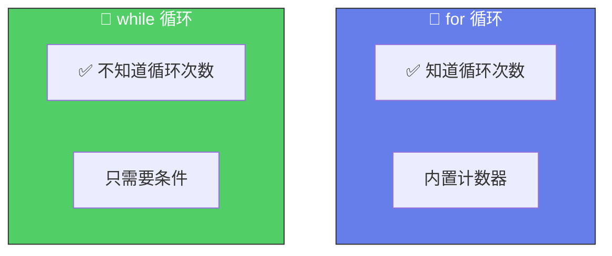
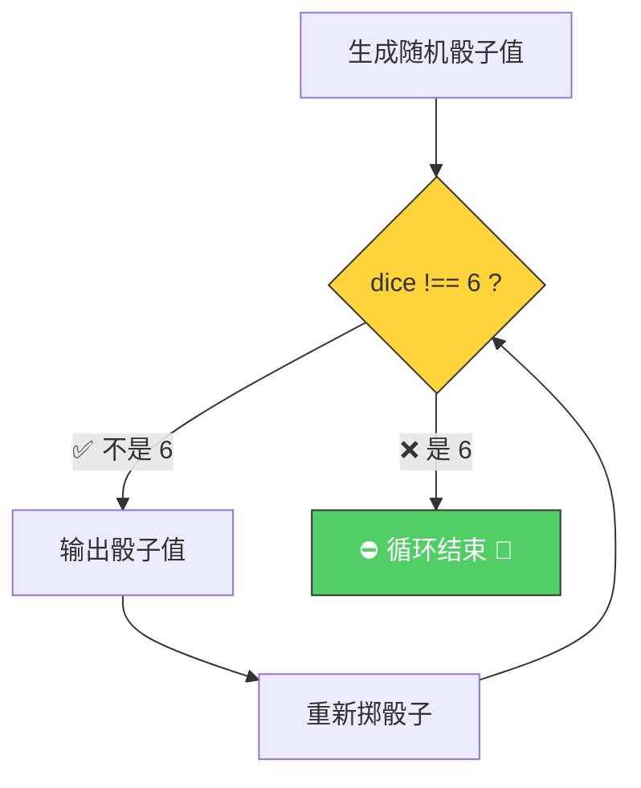

# while 循环（The while Loop）

> 📺 来源：022 The while Loop.en.srt
> 📂 章节：第 03 章

## 📌 知识脉络
- **前置知识**：`for` 循环、布尔条件、`Math.random()`、`Math.trunc()`
- **后续扩展**：`do...while` 循环、`for...of` 循环、异步编程中的循环

## 🎯 概述

`while` 循环是另一种循环结构。与 `for` 循环不同，`while` 只需要一个**条件**——只要条件为真就一直执行。当你**不知道需要循环多少次**时，`while` 比 `for` 更适合。

## 核心知识点

### 1. for vs while 对比



:::code-comparison
```js {title="🔢 for 循环"}
for (let rep = 1; rep <= 10; rep++) {
  console.log(`Rep ${rep} 🏋️`);
}
```
```js {title="🔄 while 循环（同等效果）"}
let rep = 1;
while (rep <= 10) {
  console.log(`Rep ${rep} 🏋️`);
  rep++;
}
```
:::

---

### 2. while 循环的真正优势

> 🧩 **生活类比**：`while` 就像掷骰子🎲——你不知道需要掷多少次才能掷到 6，你只知道"还没掷到 6 就继续掷"。

```js {runnable} {title="dice_roll.js"}
'use strict';

let dice = Math.trunc(Math.random() * 6) + 1;

while (dice !== 6) {
  console.log(`You rolled a ${dice} 🎲`);
  dice = Math.trunc(Math.random() * 6) + 1;
  if (dice === 6) console.log('Loop is about to end... 🎉');
}
```



> 💡 **何时用 `while`？** 当你**不依赖计数器**，只关心**某个条件何时变为 false** 时。

---

### 3. for vs while 使用场景

| 场景 | 推荐循环 | 原因 |
|------|---------|------|
| 遍历数组 | `for` | 已知长度，需要计数器 |
| 重复固定次数 | `for` | 次数确定 |
| 等待条件满足 | `while` | 不知道需要多少次 |
| 用户输入验证 | `while` | 直到输入正确才停止 |
| 游戏循环 | `while` | 直到游戏结束 |

---

## 🛠️ 代码实战与真实场景

> **💼 业务场景**：密码重试机制——用户输入错误密码时持续提示，直到正确或超过最大尝试次数。

```js {runnable} {title="retry.js"}
'use strict';

// 模拟：随机生成"用户输入"直到匹配目标
const targetPassword = 'abc123';
let attempts = 0;
const maxAttempts = 10;

// 模拟输入
let userInput = '';

while (userInput !== targetPassword && attempts < maxAttempts) {
  attempts++;
  // 模拟随机输入（实际场景用 prompt 或表单）
  userInput = Math.random() > 0.8 ? 'abc123' : 'wrong' + attempts;
  console.log(`🔐 第 ${attempts} 次尝试: ${userInput}`);
}

if (userInput === targetPassword) {
  console.log(`✅ 密码正确！共尝试 ${attempts} 次`);
} else {
  console.log(`❌ 超过最大尝试次数 (${maxAttempts})`);
}
```

## 💡 关键要点
- ✅ `while` 只需要一个**条件**，没有内置计数器
- ✅ 当**不知道需要循环多少次**时，用 `while` 而不是 `for`
- ✅ 必须确保条件**最终会变为 false**，否则死循环
- ✅ `for` 循环能做的，`while` 都能做（只是写法不同）

## ⚠️ 常见误区
- ⚠️ **误区 1**：忘记在循环体内更新条件变量——导致**死循环**
- ⚠️ **误区 2**：以为 `while` 和 `for` 完全不同——本质上都是"条件为真就执行"

## 🐛 报错实验室

**❌ 错误写法：**
```js
'use strict';

let i = 0;
while (i < 5) {
  console.log(i);
  // ⚠️ 忘记 i++！
}
// 死循环：0, 0, 0, 0, ... 永远不停
```

**🔑 解读**：`i` 永远是 `0`，条件 `0 < 5` 永远为真。必须在循环体内更新条件变量。

---

## 📖 词汇速查表 (Cheat Sheet)
| 中文术语 | 英文术语 | 简明释义 | 速查代码 | 📚 官方文档 |
|---------|---------|---------|---------|-----------|
| while 循环 | while Loop | 条件为真就持续执行 | `while(cond){}` | [MDN](https://developer.mozilla.org/zh-CN/docs/Web/JavaScript/Reference/Statements/while) |
| 随机数 | Math.random | 生成 0~1 之间的随机数 | `Math.random()` | [MDN](https://developer.mozilla.org/zh-CN/docs/Web/JavaScript/Reference/Global_Objects/Math/random) |
| 截断取整 | Math.trunc | 去掉小数部分 | `Math.trunc(4.7)` → 4 | [MDN](https://developer.mozilla.org/zh-CN/docs/Web/JavaScript/Reference/Global_Objects/Math/trunc) |

---

## 🧪 学习验证

### ❓ 理解检测

:::quiz {correct="B"}
**1. 什么时候应该用 `while` 而不是 `for`？**
- A) 需要遍历数组时
- B) 不知道需要循环多少次，只知道停止条件时
- C) 需要计数器时
- D) 任何时候都应该优先用 `while`

> **解析**：`while` 的优势在于不依赖计数器，只关心条件。当循环次数不确定时（如等待用户输入、掷骰子），`while` 更合适。
:::

:::quiz {correct="C"}
**2. `Math.trunc(Math.random() * 6) + 1` 生成的范围是？**
- A) 0~5
- B) 0~6
- C) 1~6
- D) 1~5

> **解析**：`Math.random()` 生成 `[0, 1)`，乘 6 得 `[0, 6)`，`trunc` 后得 `0~5`，加 1 得 `1~6`。
:::

:::quiz {correct="A"}
**3. while 循环和 for 循环在功能上有什么关系？**
- A) 功能相同，for 循环能做的 while 都能做
- B) for 循环只能向前计数，while 可以向后
- C) while 循环不能使用 break
- D) for 循环不能使用条件判断

> **解析**：两者在功能上等价，任何 `for` 循环都可以改写为 `while` 循环。区别只在于语法结构和适用场景。
:::

### 🔧 代码填空

:::fill-blank
let dice = Math.trunc(Math.___random___() * 6) + 1;

___while___ (dice !== 6) {
  console.log(`🎲 ${dice}`);
  dice = Math.trunc(Math.random() * ___6___) + 1;
}
:::
