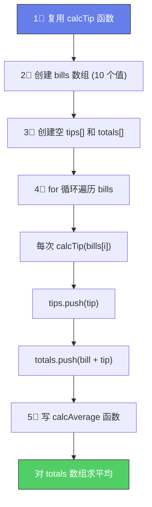

# 🏆 Coding Challenge #4

> 📺 来源：024 CHALLENGE #4 Video Solution.en.srt
> 📂 章节：第 03 章

## 📌 知识脉络
- **前置知识**：`for` 循环、数组遍历、函数调用、模板字符串
- **后续扩展**：高阶数组方法（`.map()`、`.forEach()`）、模块化编程

## 🎯 概述

本挑战将之前 Challenge #2 的小费计算器升级——使用**循环**自动遍历账单数组，取代手动逐个计算。这是函数 + 数组 + 循环三大核心知识的综合应用。

---

## 📋 Tasks（任务清单）

1. 前面 Challenge #2 中已创建 `calcTip` 函数（50~300 之间小费 15%，否则 20%），直接复用
2. 创建 `bills` 数组：`[22, 295, 176, 440, 37, 105, 10, 1100, 86, 52]`
3. 创建空数组 `tips` 和 `totals`
4. 用 **`for` 循环**遍历 `bills`，对每个账单计算小费，分别 `push` 到 `tips` 和 `totals`
5. **Bonus**：编写函数 `calcAverage`，接收一个数组，返回所有元素的平均值，用它计算 `totals` 的平均值

## 📊 Test Data（测试数据）

| 索引 | bill | 范围内？ | 小费率 | tip | total |
|------|------|---------|--------|-----|-------|
| 0 | 22 | ❌ | 20% | 4.4 | 26.4 |
| 1 | 295 | ✅ | 15% | 44.25 | 339.25 |
| 2 | 176 | ✅ | 15% | 26.4 | 202.4 |
| 3 | 440 | ❌ | 20% | 88 | 528 |
| 4 | 37 | ❌ | 20% | 7.4 | 44.4 |
| 5 | 105 | ✅ | 15% | 15.75 | 120.75 |
| 6 | 10 | ❌ | 20% | 2 | 12 |
| 7 | 1100 | ❌ | 20% | 220 | 1320 |
| 8 | 86 | ✅ | 15% | 12.9 | 98.9 |
| 9 | 52 | ✅ | 15% | 7.8 | 59.8 |

---

## 🧪 实战沙盒

```js {runnable} {title="challenge4.js"}
'use strict';

// 1. calcTip 函数（复用 Challenge #2）


// 2. bills 数组


// 3. 空的 tips 和 totals 数组


// 4. 用 for 循环遍历 bills，计算 tip 和 total


// 5. Bonus: calcAverage 函数（接收数组，返回平均值）


// 打印结果
console.log(bills, tips, totals);
```

---

<details><summary>💡 Jonas 官方解法拆解</summary>

### 思考链路



### 完整代码

```js
'use strict';

// 1. 复用 calcTip（箭头函数版）
const calcTip = bill =>
  bill >= 50 && bill <= 300 ? bill * 0.15 : bill * 0.2;

// 2. bills 数组
const bills = [22, 295, 176, 440, 37, 105, 10, 1100, 86, 52];

// 3. 空数组
const tips = [];
const totals = [];

// 4. 循环遍历
for (let i = 0; i < bills.length; i++) {
  const tip = calcTip(bills[i]);
  tips.push(tip);
  totals.push(bills[i] + tip);
}

console.log(bills);
console.log(tips);
console.log(totals);

// 5. Bonus: 计算数组平均值
const calcAverage = function (arr) {
  let sum = 0;
  for (let i = 0; i < arr.length; i++) {
    sum += arr[i]; // sum = sum + arr[i]
  }
  return sum / arr.length;
};

console.log(calcAverage(totals));   // 245.19
console.log(calcAverage(tips));     // 42.89
```

### 🔍 执行追踪（前 3 次迭代）

| `i` | `bills[i]` | `calcTip(bill)` | `tip` | `total` |
|-----|-----------|-----------------|-------|---------|
| 0 | 22 | `22 * 0.2` | 4.4 | 26.4 |
| 1 | 295 | `295 * 0.15` | 44.25 | 339.25 |
| 2 | 176 | `176 * 0.15` | 26.4 | 202.4 |

### 关键设计要点

- 用循环替代手动逐个调用——**10 个账单只需 1 个循环**，而非 10 次 `calcTip(bills[0])`
- `calcAverage` 是**通用函数**——可以对任何数字数组求平均，不限于 `totals`
- `sum += arr[i]` 是 `sum = sum + arr[i]` 的简写——累加器模式

:::code-comparison
```js {title="🚨 Challenge #2 的写法 (手动)"}
const tips = [
  calcTip(bills[0]),
  calcTip(bills[1]),
  calcTip(bills[2])
];
// 只能处理 3 个账单 😩
```
```js {title="✨ Challenge #4 的写法 (循环)"}
const tips = [];
for (let i = 0; i < bills.length; i++) {
  tips.push(calcTip(bills[i]));
}
// 自动处理任意数量的账单 🎉
```
:::

</details>

---

## 📖 词汇速查表 (Cheat Sheet)
| 中文术语 | 英文术语 | 简明释义 | 速查代码 |
|---------|---------|---------|---------|
| 累加器 | Accumulator | 在循环中累加求和 | `sum += arr[i]` |
| 平均值 | Average | 总和 / 个数 | `sum / arr.length` |
| 遍历数组 | Loop through array | 逐个访问每个元素 | `for(let i=0;i<arr.length;i++)` |

---

## 🧪 学习验证

### ❓ 理解检测

:::quiz {correct="B"}
**1. 相比 Challenge #2 手动写法，Challenge #4 用循环的最大优势是？**
- A) 运行速度更快
- B) 自动适应任意长度的数组，无需手动逐个处理
- C) 代码行数更少
- D) 不需要 `calcTip` 函数了

> **解析**：循环让代码自适应数组长度。无论 `bills` 有 3 个还是 1000 个元素，同一个循环都能处理。
:::

:::quiz {correct="C"}
**2. `calcAverage` 函数中，为什么除以 `arr.length` 而不是一个固定数字？**
- A) 固定数字会导致语法错误
- B) `arr.length` 运算更快
- C) 使函数通用——能处理任意长度的数组
- D) 固定数字不能参与除法运算

> **解析**：使用 `arr.length` 让函数**不依赖特定数组长度**。传入 3 个元素的数组就除以 3，传入 100 个就除以 100。
:::

:::quiz {correct="A"}
**3. `sum += arr[i]` 等价于什么？**
- A) `sum = sum + arr[i]`
- B) `sum = arr[i]`
- C) `sum + arr[i]`
- D) `sum++`

> **解析**：`+=` 是**加法赋值运算符**，`sum += x` 完全等价于 `sum = sum + x`。
:::

### 🔧 代码填空

:::fill-blank
const arr = [10, 20, 30];
let sum = ___0___;

for (let i = 0; i < arr.___length___; i++) {
  sum ___+=___ arr[i];
}

const average = sum / arr.___length___;
:::
