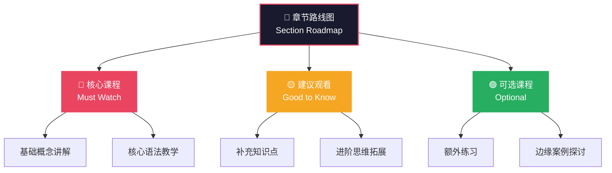
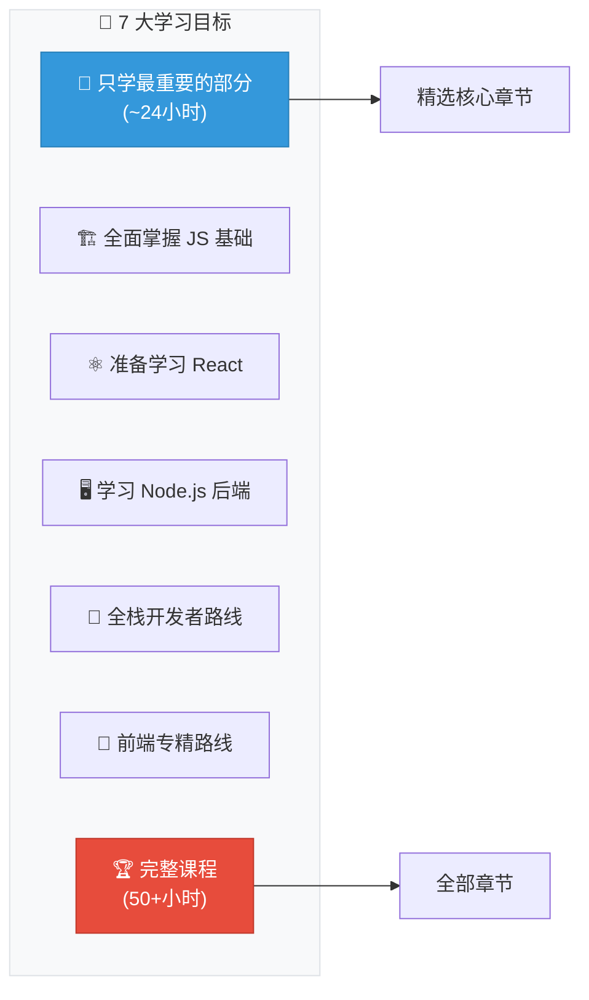
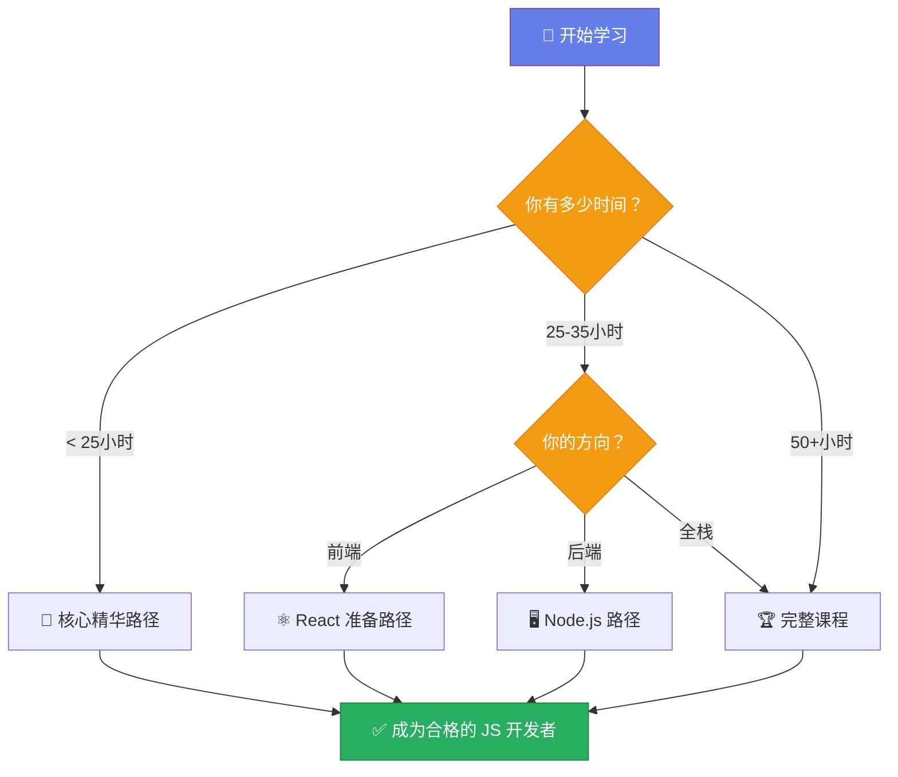

# 课程路径与章节路线图

> 📺 来源：001 Pathways and Section Roadmaps.en.srt
> 📂 章节：第 04 章

## 📌 知识脉络
- **前置知识**：JavaScript 基础语法（变量、数据类型、运算符）、基本控制流（`if/else`、`switch`）
- **后续扩展**：后续各章节的深入学习（DOM 操作、数据结构、面向对象编程、异步 JavaScript 等）

## 🎯 概述

本节课是一堂**学习策略规划课**，讲师 Jonas 为学习者提供了课程导航工具——**课程路径（Course Pathways）** 和 **章节路线图（Section Roadmaps）**。目标是帮助不同时间预算和学习目标的学习者，找到最适合自己的学习路线，避免因课程体量庞大（超过 50 小时）而迷失方向。

## 核心知识点

### 1. 章节路线图（Section Roadmaps）

> 🧩 **生活类比**：想象你要穿越一座大型博物馆。章节路线图就像每个展厅入口处的「精选推荐」，告诉你哪些展品是镇馆之宝（必看）、哪些是补充了解（可选），让你在有限时间内获得最大收获。

章节路线图是 Jonas 为**每个章节**精心制作的学习导航图，标注了每节课的重要程度：



**使用方式**：
1. 在每个章节的**开头**找到该章节的路线图
2. 根据你的时间和目标，选择只看「核心课程」还是全部观看
3. 如果赶时间，跳过「可选课程」不会影响后续章节的理解

**🔍 执行追踪：学习路径决策过程**

| 步骤 | 动作 | 当前状态 | 结果 |
|------|------|----------|------|
| ① | 打开新章节 | 未开始学习 | 查看章节路线图 |
| ② | 阅读路线图标注 | 了解课程分级 | 识别出「必看 / 建议 / 可选」三类 |
| ③ | 评估自己的时间 | 时间充裕 or 紧张 | 决定观看策略 |
| ④ | 执行学习计划 | 按标注顺序学习 | 高效完成该章节 |

> 💡 **记忆口诀**：「🔴红灯必停看，🟡黄灯量力看，🟢绿灯随心看」

---

### 2. 课程路径（Course Pathways）

> 🧩 **生活类比**：课程路径就像旅游攻略中的「三日游」「五日游」「深度游」路线——同一座城市，不同时间预算的旅行者可以选择不同的路线，但每条路线都能让你获得完整的体验。

Jonas 设计了 **7 种学习路径**，每种对应一个特定的学习目标。每条路径都指定了哪些章节是必修、哪些是选修、哪些可以跳过。



**关键信息**：
- 7 种路径的详细说明在课程的 **PDF 附件**中提供
- 最精简的路径可以将 50+ 小时的课程**压缩到约 24 小时**
- 每种路径同样使用三级标注系统：「非常重要 / 建议了解 / 可选」

---

## 🛠️ 代码实战与真实场景

> **💼 业务场景**：假设你是一个团队的技术主管，需要为团队成员制定 JavaScript 学习计划。不同成员有不同的技术背景和学习目标，你需要根据路径系统为他们推荐合适的学习路线。

```js {runnable} {title="learning_planner.js"}
// 学习路径规划器 —— 模拟课程路径推荐系统
const courseSections = [
  { id: '01', name: 'Welcome', hours: 0.5, importance: { core: true, react: true, node: true } },
  { id: '02', name: 'JS Fundamentals Part 1', hours: 4, importance: { core: true, react: true, node: true } },
  { id: '03', name: 'JS Fundamentals Part 2', hours: 5, importance: { core: true, react: true, node: true } },
  { id: '04', name: 'How to Navigate This Course', hours: 0.2, importance: { core: false, react: false, node: false } },
  { id: '05', name: 'Developer Skills & Editor Setup', hours: 2, importance: { core: true, react: true, node: true } },
  { id: '08', name: 'Behind the Scenes', hours: 3, importance: { core: false, react: true, node: true } },
  { id: '09', name: 'Data Structures & Operators', hours: 5, importance: { core: true, react: true, node: true } },
  { id: '10', name: 'Functions', hours: 4, importance: { core: true, react: true, node: true } },
  { id: '11', name: 'Arrays', hours: 5, importance: { core: true, react: true, node: false } },
  { id: '12', name: 'Numbers, Dates, Timers', hours: 3, importance: { core: false, react: false, node: true } },
  { id: '13', name: 'DOM & Events', hours: 3, importance: { core: true, react: false, node: false } },
  { id: '16', name: 'Asynchronous JS', hours: 4, importance: { core: true, react: true, node: true } },
];

// 根据学习路径过滤章节
function getPathway(goal) {
  return courseSections
    .filter(section => section.importance[goal]) // 只保留该路径的必修章节
    .map(s => `第${s.id}章: ${s.name} (${s.hours}h)`);
}

// 计算学习时长
function totalHours(goal) {
  return courseSections
    .filter(s => s.importance[goal])
    .reduce((sum, s) => sum + s.hours, 0);
}

// 三种路径推荐
const goals = ['core', 'react', 'node'];
goals.forEach(goal => {
  const pathway = getPathway(goal);
  const hours = totalHours(goal);
  console.log(`\n🎯 ${goal.toUpperCase()} 路径 (${hours} 小时):`);
  pathway.forEach(s => console.log(`  📖 ${s}`));
});
```

**📊 输入输出示例：**

| 学习目标 | 推荐章节数 | 预估总时长 | 适合人群 |
|----------|-----------|-----------|---------|
| `core` (核心精华) | 8 | ~24h | 时间紧张的在职学习者 |
| `react` (React 准备) | 9 | ~28h | 准备学习 React 的前端开发者 |
| `node` (Node.js 后端) | 8 | ~24h | 后端方向的开发者 |
| `full` (完整课程) | 全部 | ~50h+ | 有充足时间的全栈学习者 |



## 💡 关键要点
- ✅ **不必看完全部课程**也能成为优秀的 JavaScript 开发者——关键是选择适合自己的路径
- ✅ **章节路线图**在每章开头提供，标注了每节课的重要程度（核心 / 建议 / 可选）
- ✅ **课程路径 PDF** 提供了 7 种预设学习路线，覆盖不同学习目标
- ✅ 最精简路径可将 50+ 小时课程**压缩至约 24 小时**
- ✅ 完整观看当然是最佳选择，但有策略地学习同样可以达到目标

## ⚠️ 常见误区
- ⚠️ **误区 1：必须按顺序看完每一个视频**。真相是 Jonas 特意设计了"可选"标记，允许你跳过非核心内容。利用路线图裁剪自己的学习计划效率更高。
- ⚠️ **误区 2：跳过的内容以后就学不到了**。真相是你随时可以回看。路径推荐的是"优先级顺序"，而非"唯一路径"。先掌握核心再回来补充，是更高效的学习策略。
- ⚠️ **误区 3：精简路径 = 走捷径**。真相是精简路径只是去掉了对你当前目标不关键的章节，核心知识点一个都没少。

## 🐛 报错实验室

> 这节课不涉及代码语法教学，但学习路径规划中也存在常见的"报错"：

**❌ 错误做法：盲目跳章**
```js
// 错误：跳过了基础章节直接学高级内容
// 相当于这样写代码——使用未声明的变量
console.log(myVariable); // 没有先声明就使用
```
**浏览器报错：**
```
ReferenceError: myVariable is not defined
```
**🔑 解读**：正如代码中"变量未定义"的错误一样，如果你跳过了前置章节直接学高级内容（比如直接学异步 JS 而不先学基础），你会发现"知识未定义"——后续内容根本看不懂。**路径系统的核心是帮你跳过"可选"内容，而非"前置"内容**。

---

## 📖 词汇速查表 (Cheat Sheet)

| 中文术语 | 英文术语 | 简明释义 | 相关概念 | 📚 参考资料 |
|---------|---------|---------|---------|------------|
| 章节路线图 | Section Roadmap | 每章开头的学习导航图，标注课程优先级 | 课程路径 | 课程内置 PDF |
| 课程路径 | Course Pathway | 按学习目标定制的跨章节学习路线 | 学习目标 | 课程内置 PDF |
| 核心课程 | Must Watch | 路线图中标注为"必看"的课程 | 基础知识 | — |
| 建议观看 | Good to Know | 路线图中标注为"值得看"的补充课程 | 拓展知识 | — |
| 可选课程 | Optional | 路线图中标注为"可跳过"的课程 | 进阶内容 | — |
| DRY 原则 | Don't Repeat Yourself | 避免代码重复的编程原则 | 代码重构 | [MDN](https://developer.mozilla.org/en-US/docs/Glossary/DRY) |

---

## 🧪 学习验证

### 📝 动手练习

**练习 1：制定你的个人学习计划**
```js {runnable} {title="my_plan.js"}
// 根据你的实际情况，创建你的个人学习计划对象
const myLearningPlan = {
  name: '你的名字',
  availableHoursPerWeek: 10,     // 每周可用学习时间（小时）
  targetGoal: 'core',            // 你的目标: 'core' | 'react' | 'node' | 'full'
  totalCourseHours: 50,          // 课程总时长
  pathwayHours: 24,              // 你选择的路径时长
};

// 计算你需要多少周完成
const weeksNeeded = Math.ceil(myLearningPlan.pathwayHours / myLearningPlan.availableHoursPerWeek);
const timeSaved = myLearningPlan.totalCourseHours - myLearningPlan.pathwayHours;

console.log(`📋 学习计划：${myLearningPlan.name}`);
console.log(`🎯 目标路径：${myLearningPlan.targetGoal}`);
console.log(`⏱️ 预计完成时间：${weeksNeeded} 周`);
console.log(`💰 节省时间：${timeSaved} 小时`);
console.log(`📊 学习效率提升：${Math.round((timeSaved / myLearningPlan.totalCourseHours) * 100)}%`);
```
<details><summary>💡 参考答案</summary>

```js
const myLearningPlan = {
  name: '小明',
  availableHoursPerWeek: 8,
  targetGoal: 'react',
  totalCourseHours: 50,
  pathwayHours: 28,
};

const weeksNeeded = Math.ceil(myLearningPlan.pathwayHours / myLearningPlan.availableHoursPerWeek);
const timeSaved = myLearningPlan.totalCourseHours - myLearningPlan.pathwayHours;

console.log(`📋 学习计划：${myLearningPlan.name}`);
console.log(`🎯 目标路径：${myLearningPlan.targetGoal}`);
console.log(`⏱️ 预计完成时间：${weeksNeeded} 周`); // 4 周
console.log(`💰 节省时间：${timeSaved} 小时`);      // 22 小时
console.log(`📊 学习效率提升：${Math.round((timeSaved / myLearningPlan.totalCourseHours) * 100)}%`); // 44%
```
**解题思路**：根据自己的实际情况修改 `availableHoursPerWeek` 和 `targetGoal`，使用 `Math.ceil` 向上取整确保周数计算准确。
</details>

**练习 2：实现路径筛选函数**
```js {runnable} {title="filter_sections.js"}
// 实现一个函数，根据重要程度过滤章节
const sections = [
  { name: 'JS Fundamentals', level: 'must' },
  { name: 'Behind the Scenes', level: 'good' },
  { name: 'DOM Manipulation', level: 'must' },
  { name: 'Mapty Project', level: 'optional' },
  { name: 'Async JS', level: 'must' },
  { name: 'Modern JS Modules', level: 'good' },
  { name: 'Forkify Project', level: 'optional' },
];

// 请完成这个函数：返回指定重要程度的章节名称数组
function filterByLevel(sections, level) {
  // 在这里写你的代码

}

// 测试
console.log('🔴 必修:', filterByLevel(sections, 'must'));
console.log('🟡 建议:', filterByLevel(sections, 'good'));
console.log('🟢 可选:', filterByLevel(sections, 'optional'));
```
<details><summary>💡 参考答案</summary>

```js
function filterByLevel(sections, level) {
  return sections
    .filter(section => section.level === level)
    .map(section => section.name);
}

// 输出：
// 🔴 必修: ['JS Fundamentals', 'DOM Manipulation', 'Async JS']
// 🟡 建议: ['Behind the Scenes', 'Modern JS Modules']
// 🟢 可选: ['Mapty Project', 'Forkify Project']
```
**解题思路**：使用 `filter` 方法筛选出匹配 `level` 的章节，再用 `map` 提取章节名称。这种链式调用模式在 JavaScript 中极为常见。
</details>

### ❓ 理解检测

:::quiz {correct="B"}
**1. 章节路线图（Section Roadmap）在课程中的什么位置？**
- A) 课程末尾的附录中
- B) 每个章节的开头
- C) 课程首页的公告中

> **解析**：Jonas 将每个章节的路线图放在该章节的**开头**，方便学习者在开始新章节前快速了解哪些课程是核心内容、哪些可以跳过。
:::

:::quiz {correct="C"}
**2. 使用最精简的学习路径，大约可以将课程压缩到多少小时？**
- A) 10 小时
- B) 35 小时
- C) 24 小时

> **解析**：Jonas 在视频中明确提到，使用「核心精华」路径可以将 50+ 小时的课程压缩到大约 **24 小时**。
:::

:::quiz {correct="A"}
**3. 关于课程路径（Course Pathways），以下说法正确的是？**
- A) Jonas 定义了 7 种不同的学习路径，可在 PDF 文档中找到
- B) 学习路径是固定的，不能根据个人情况调整
- C) 只有完成完整路径才能获得课程证书

> **解析**：Jonas 共定义了 **7 种学习路径**，对应不同的学习目标，详情在课程附带的 **PDF 文档**中。学习者可以根据自己的时间和目标自由选择和调整。
:::

### 🔧 代码填空

:::fill-blank
// 使用数组方法筛选出重要程度为 'must' 的章节
const mustWatch = sections.___filter___(s => s.level === ___'must'___);

// 计算完成所有必修章节需要的总时长
const totalHours = mustWatch.___reduce___((sum, s) => sum + s.hours, ___0___);
:::
