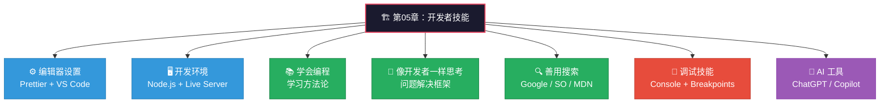
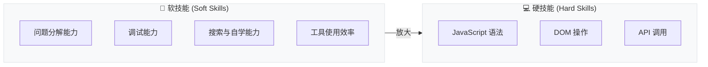

# 章节导读：开发者技能与编辑器设置

> 📺 来源：001 Section Intro.en.srt
> 📂 章节：第 05 章

## 📌 知识脉络
- **前置知识**：JavaScript 基础语法（变量、数据类型、运算符、控制流）
- **后续扩展**：DOM 操作与事件处理、高级函数、异步 JavaScript、项目实战

## 🎯 概述

在完成 JavaScript 基础语法学习后，本章将聚焦于开发者必备的**软技能**：如何高效学习编程、如何像开发者一样思考并解决问题、如何调试代码中的错误，以及如何搭建专业的开发环境。

## 核心知识点

### 1. 本章学习路线

> 🧩 **生活类比**：学会了驾驶理论（基础语法）之后，还需要学习如何看地图导航（解决问题的能力）、如何处理汽车故障（调试技能），以及如何调整座椅后视镜（开发环境配置）——这些"元技能"决定了你能否真正上路。



**🔍 执行追踪：本章内容概览**

| 步骤 | 课题 | 类型 | 核心收获 |
|------|------|------|----------|
| ① | Prettier + VS Code 设置 | 工具配置 | 代码格式化自动化 |
| ② | Node.js 安装与开发环境 | 环境搭建 | Live Server 实时预览 |
| ③ | 如何学习编程 | 方法论 | 学习路径与心态管理 |
| ④ | 像开发者一样思考 | 思维模式 | 四步问题解决框架 |
| ⑤ | 使用搜索工具 | 实战技能 | Google / Stack Overflow / MDN |
| ⑥ | 调试概论 + 实践 | 核心技能 | Console + Breakpoints |
| ⑦ | AI 工具的崛起 | 前沿视野 | ChatGPT / Copilot 使用原则 |

> 💡 **记忆口诀**：「设环学思搜调AI」—— 设置环境、学习方法、思考框架、搜索技能、调试能力、AI 辅助，七大模块成就专业开发者。

---

### 2. 为什么需要"元技能"

> 🧩 **生活类比**：一个厨师不仅需要掌握烹饪技巧（语法），还需要知道如何选购食材（搜索能力）、如何品尝调味（调试能力）、如何管理厨房工具（开发环境）。这些"元技能"是从新手到专业厨师的关键跨越。

本章的内容不涉及新的 JavaScript 语法，但涵盖的技能**对实际开发至关重要**：



**📊 概念对比：**

| 维度 | 只有硬技能 | 硬技能 + 软技能 |
|------|-----------|----------------|
| 遇到 Bug | 反复试错，靠运气 | 系统化调试，快速定位 |
| 不会的功能 | 卡住不动 | Google / MDN 查文档自学 |
| 写代码速度 | 手动格式化，低效 | Prettier 自动化，专注逻辑 |
| 解决问题 | 一团乱麻 | 分治法逐个击破 |

> **💼 业务场景**：在真实项目中，开发者花在"调试 + 搜索 + 思考"上的时间远超"写代码"的时间。掌握这些元技能是从"会写代码"到"能做项目"的关键飞跃。

---

## 🛠️ 代码实战与真实场景

> **💼 业务场景**：模拟一个开发者的日常工作流——从设置环境到解决问题的完整循环。

```js {runnable} {title="dev_workflow.js"}
// 模拟开发者的日常工作流
const devWorkflow = {
  setup: ['安装 VS Code', '配置 Prettier', '安装 Node.js', '启动 Live Server'],
  coding: ['分析需求', '分解问题', '编写代码', '测试运行'],
  debugging: ['发现 Bug', '定位原因', '修复代码', '验证修复'],
  learning: ['阅读 MDN 文档', '搜索 Stack Overflow', '参考 AI 建议', '动手实践'],
};

// 统计每个阶段的步骤数
for (const [phase, steps] of Object.entries(devWorkflow)) {
  console.log(`📋 ${phase} 阶段: ${steps.length} 个步骤`);
  steps.forEach((step, i) => console.log(`   ${i + 1}. ${step}`));
}

// 计算总步骤
const totalSteps = Object.values(devWorkflow).flat().length;
console.log(`\n🎯 开发者日常工作总共涉及 ${totalSteps} 个关键步骤`);
```


**📊 输入输出示例：**

| 阶段 | 步骤数 | 占日常工作比例 |
|------|--------|---------------|
| 环境设置 | 4 | 10%（一次性） |
| 编写代码 | 4 | 30% |
| 调试修复 | 4 | 40% |
| 持续学习 | 4 | 20% |

## 💡 关键要点
- ✅ JavaScript 基础语法只是起点，**开发者技能**（调试、搜索、问题解决）才是核心竞争力
- ✅ 搭建专业开发环境（Prettier + Live Server）可以显著提升编码效率
- ✅ 学会用 Google、Stack Overflow 和 MDN 自主解决问题，是开发者最重要的日常技能
- ✅ 调试不是"猜测 + 重试"，而是有方法论的系统化流程

## ⚠️ 常见误区
- ⚠️ **误区 1：学完语法就等于会编程**。真相是：语法只是工具，解决问题的能力才是编程的本质。
- ⚠️ **误区 2：开发环境配置不重要**。真相是：高效的工具链（格式化、热重载、调试器）能让你的工作效率翻倍。

## 🐛 报错实验室

**❌ 错误做法：不配置开发环境直接硬编码**
```js
// 没有 Live Server，每次修改代码都要手动刷新浏览器
// 没有 Prettier，代码格式混乱难以维护
function calcAge(birthYear){return 2037-birthYear}
console.log(calcAge(1991))
```
**浏览器报错：**
```
// 虽然不会报错，但可读性极差
// 团队协作时会造成代码风格冲突
```
**🔑 解读**：虽然这段代码技术上能运行，但缺少格式化和开发工具会严重影响**开发效率**和**代码可维护性**。Prettier 会自动将其格式化为清晰可读的代码。

---

## 📖 词汇速查表 (Cheat Sheet)

| 中文术语 | 英文术语 | 简明释义 | 相关工具 | 📚 参考资料 |
|---------|---------|---------|---------|------------|
| 代码格式化 | Code Formatting | 自动统一代码风格（缩进、引号等） | Prettier | [Prettier 官网](https://prettier.io/) |
| 实时服务器 | Live Server | 文件保存后自动刷新浏览器 | VS Code 插件 / npm | [npm live-server](https://www.npmjs.com/package/live-server) |
| 调试 | Debugging | 发现、定位并修复代码错误 | Chrome DevTools | [MDN](https://developer.mozilla.org/en-US/docs/Learn/Common_questions/Tools_and_setup/What_are_browser_developer_tools) |
| 断点 | Breakpoint | 暂停代码执行以检查变量状态 | Chrome Sources | [Chrome DevTools](https://developer.chrome.com/docs/devtools/) |
| 伪代码 | Pseudo-code | 用类人类语言描述算法逻辑 | — | — |

---

## 🧪 学习验证

### 📝 动手练习

**练习 1：列出你的开发工具清单**
```js {runnable} {title="my_tools.js"}
// 创建你的开发工具清单
const myDevTools = {
  editor: 'VS Code',
  formatter: '在这里填写',      // 提示：代码格式化工具
  browserTool: '在这里填写',    // 提示：浏览器调试工具
  searchEngine: '在这里填写',   // 提示：搜索引擎
  documentation: '在这里填写',  // 提示：官方文档网站
};

for (const [category, tool] of Object.entries(myDevTools)) {
  console.log(`🔧 ${category}: ${tool}`);
}
```
<details><summary>💡 参考答案</summary>

```js
const myDevTools = {
  editor: 'VS Code',
  formatter: 'Prettier',
  browserTool: 'Chrome DevTools',
  searchEngine: 'Google',
  documentation: 'MDN Web Docs',
};
```
**解题思路**：作为 JavaScript 开发者，这五个工具是你的基本装备。随着学习深入，你还会添加更多工具（如 Git、npm、ESLint 等）。
</details>

**练习 2：模拟问题解决流程**
```js {runnable} {title="problem_solving.js"}
// 用 Jonas 的四步框架模拟问题解决
function solveProblem(problem) {
  const steps = [];
  
  // 第一步：理解问题
  steps.push(`1️⃣ 理解问题: "${problem}"`);
  
  // 第二步：分解问题（在这里添加子问题）
  steps.push('2️⃣ 分解为子问题: [在这里添加]');
  
  // 第三步：研究未知部分
  steps.push('3️⃣ 搜索解决方案: Google / MDN');
  
  // 第四步：编写伪代码
  steps.push('4️⃣ 编写伪代码后再写真正的代码');
  
  return steps;
}

const result = solveProblem('编写一个函数反转字符串');
result.forEach(step => console.log(step));
```
<details><summary>💡 参考答案</summary>

```js
function solveProblem(problem) {
  const steps = [];
  steps.push(`1️⃣ 理解问题: "${problem}"`);
  steps.push('2️⃣ 分解为子问题: [将字符串转为数组, 反转数组, 将数组转回字符串]');
  steps.push('3️⃣ 搜索: "JavaScript reverse string MDN"');
  steps.push('4️⃣ 伪代码: 输入字符串 → split → reverse → join → 返回');
  return steps;
}
```
**解题思路**：Jonas 的四步框架是"理解 → 分解 → 研究 → 伪代码"。核心在于**分解子问题**——把大问题拆成可以独立解决的小块。
</details>

### ❓ 理解检测

:::quiz {correct="C"}
**1. Jonas 认为开发者最重要的"元技能"是什么？**
- A) 打字速度快
- B) 背诵所有 JavaScript API
- C) 解决问题的能力和自主学习能力

> **解析**：Jonas 反复强调，编程的本质不是语法记忆，而是**解决问题的能力**。配合 Google / MDN 等工具的自主学习能力，才是开发者的核心竞争力。
:::

:::quiz {correct="B"}
**2. 本章涵盖的内容中，哪项不是技术技能而是方法论？**
- A) 配置 Prettier
- B) 如何学习编程
- C) 使用 Chrome 断点调试

> **解析**：「如何学习编程」是一种**学习方法论**而非具体技术。它教你如何规划学习路径、保持动力、避免常见陷阱。
:::

:::quiz {correct="A"}
**3. 在调试过程中，第一步应该做什么？**
- A) 确认 Bug 的存在并理解其表现
- B) 立即修改代码试试看
- C) 删掉出错的函数重新写

> **解析**：调试的第一步是**意识到 Bug 的存在**并理解它的表现。盲目修改代码只会引入更多问题。
:::

### 🔧 代码填空

:::fill-blank
// Jonas 的四步问题解决框架
// 第一步：___理解问题___
// 第二步：___分解为子问题___
// 第三步：如果卡住了，___研究搜索___
// 第四步：写___伪代码___后再编码
:::
