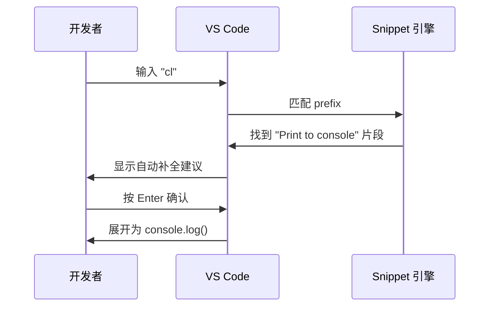
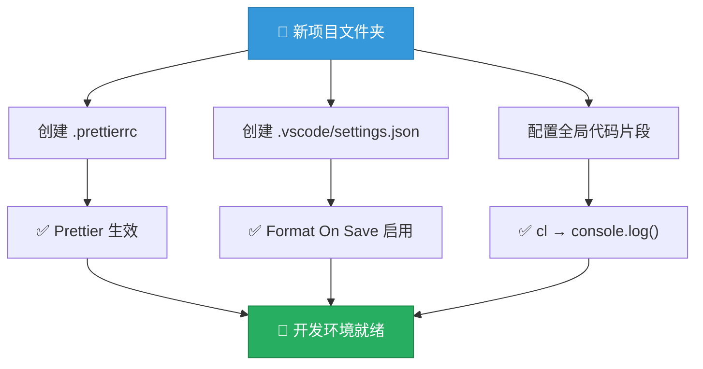

# 配置 Prettier 与 VS Code

> 📺 来源：003 Setting up Prettier and VS Code.en.srt
> 📂 章节：第 05 章

## 📌 知识脉络
- **前置知识**：VS Code 基本操作（打开文件夹、安装扩展）、JavaScript 基础语法
- **后续扩展**：ESLint 代码检查、Webpack/Vite 构建工具、项目级配置管理

## 🎯 概述

本节课详细讲解如何配置 **Prettier** 代码格式化工具和 **VS Code** 编辑器，实现保存即格式化的高效编码工作流。还将学习如何创建自定义代码片段（Snippets），以及 Jonas 推荐的 VS Code 扩展列表。

## 核心知识点

### 1. Prettier —— 代码格式化工具

> 🧩 **生活类比**：Prettier 就像洗碗机——你把脏碗（杂乱的代码）放进去，它自动帮你洗得整整齐齐。你不需要关心"碗要怎么摆"，只需要按下按钮（保存文件）。

Prettier 是一个**强制性代码格式化工具（Opinionated Code Formatter）**，它会自动统一你的代码风格，不需要手动调整缩进、引号、分号等。


**安装步骤**：
1. 打开 VS Code 扩展面板（`Ctrl+Shift+X`）
2. 搜索 "Prettier - Code formatter"
3. 点击安装
4. 设置为默认格式化工具：`设置 → Default Formatter → Prettier`
5. 启用保存时格式化：`设置 → Format On Save → ✅`

**🔍 执行追踪：Prettier 格式化过程**

| 步骤 | 操作 | 代码状态 | 结果 |
|------|------|----------|------|
| ① | 编写代码 | `const x=10;let y = "hello"  ;` | 格式混乱 |
| ② | 按下 `Ctrl+S` | 触发 Prettier | 开始格式化 |
| ③ | Prettier 处理 | 统一缩进、引号、分号 | `const x = 10;\nlet y = 'hello';` |
| ④ | 文件保存 | 格式化完成 | 代码整洁统一 |

> 💡 **记忆口诀**：「保存即整理，Prettier 帮你做家务」

---

### 2. Prettier 配置文件 (.prettierrc)

> 🧩 **生活类比**：`.prettierrc` 就像洗碗机的模式选择——你可以选择"快洗"还是"精洗"，告诉洗碗机你的偏好（用单引号还是双引号、要不要分号等）。

在项目根目录创建 `.prettierrc` 文件来自定义格式化规则：

```js {runnable} {title="prettierrc_demo.js"}
// .prettierrc 配置文件内容（JSON 格式）
const prettierConfig = {
  singleQuote: true,      // 使用单引号代替双引号
  arrowParens: 'avoid',   // 箭头函数单参数时省略括号
};

// 展示配置效果对比
console.log('=== Prettier 配置效果 ===');
console.log('');
console.log('📋 singleQuote: true');
console.log('  默认:  const name = "Jonas"');
console.log('  配置后: const name = \'Jonas\'');
console.log('');
console.log('📋 arrowParens: "avoid"');
console.log('  默认:  const calcAge = (birthYear) => 2037 - birthYear');
console.log('  配置后: const calcAge = birthYear => 2037 - birthYear');
```

:::code-comparison
```js {title="🚨 Prettier 默认设置"}
// 双引号
const name = "Jonas";
// 箭头函数参数带括号
const calcAge = (birthYear) => 2037 - birthYear;
```
```js {title="✨ Jonas 的自定义配置"}
// 单引号 (singleQuote: true)
const name = 'Jonas';
// 省略单参数括号 (arrowParens: 'avoid')
const calcAge = birthYear => 2037 - birthYear;
```
:::

**📊 常用 Prettier 配置选项对比：**

| 配置项 | 默认值 | Jonas 的选择 | 说明 |
|--------|--------|-------------|------|
| `singleQuote` | `false` | `true` | 使用单引号 |
| `arrowParens` | `"always"` | `"avoid"` | 单参数箭头函数省略括号 |
| `semi` | `true` | `true` | 保留分号 |
| `tabWidth` | `2` | `2` | 缩进2个空格 |
| `printWidth` | `80` | `80` | 每行最大字符数 |

> **💼 业务场景**：在团队协作中，`.prettierrc` 配置文件提交到 Git 仓库后，所有团队成员的代码风格自动统一，彻底消除"代码风格之争"。

---

### 3. VS Code 代码片段 (Snippets)

> 🧩 **生活类比**：代码片段就像手机的「快捷短语」功能——你只需要输入两个字母 `cl`，VS Code 就会自动展开为完整的 `console.log()`，就像输入"地址"会自动展开为你的完整家庭住址。

创建自定义代码片段的步骤：

1. 打开菜单：`文件 → 首选项 → 配置用户代码片段`
2. 选择 `新建全局代码片段文件`
3. 输入文件名（如 `jonas`）
4. 编辑代码片段配置

```js {runnable} {title="snippet_config.js"}
// VS Code 代码片段配置示例 (JSON)
const snippetExample = {
  "Print to console": {
    scope: "javascript,typescript",  // 适用语言
    prefix: "cl",                     // 触发缩写
    body: ["console.log();"],         // 展开内容
    description: "Log output to console" // 描述
  }
};

// 使用方式演示
console.log('💡 配置完成后的使用方式:');
console.log('1. 在 JS 文件中输入 "cl"');
console.log('2. 按 Enter 确认');
console.log('3. 自动展开为 console.log()');
console.log('4. 手动移动光标到括号内填写内容');
```



---

### 4. Jonas 推荐的 VS Code 扩展

> 🧩 **生活类比**：VS Code 扩展就像手机上的 App——基础系统已经很好用了，但安装合适的扩展可以让你的开发体验从"可用"提升到"极致"。

| 扩展名称 | 用途 | 重要程度 |
|----------|------|----------|
| **Prettier** | 代码格式化 | 🔴 必装 |
| **ESLint** | 代码质量检查 | 🔴 必装（后续使用） |
| **Live Server** | 实时浏览器预览 | 🔴 必装 |
| **Monokai Pro** | 编辑器主题 | 🟡 推荐 |
| **TODO Highlight** | 高亮 TODO/BUG 注释 | 🟡 推荐 |
| **Image Preview** | 图片预览 | 🟢 可选 |
| **Settings Sync** | 设置同步 | 🟢 可选 |

**TODO Highlight 扩展使用示例**：

```js {runnable} {title="todo_highlight.js"}
// TODO Highlight 让特殊注释一目了然
// BUG 修复优先级最高的错误
// FIXME 需要修改但不紧急
// TODO 计划中的新功能

// 在代码中标注待处理项
function processOrder(order) {
  // TODO: 添加订单验证逻辑
  // BUG: 当数量为负数时不会报错
  // FIXME: 价格计算使用了硬编码
  const total = order.quantity * 9.99;
  console.log(`订单总价: $${total}`);
  return total;
}

processOrder({ quantity: 3 });
```

---

## 🛠️ 代码实战与真实场景

> **💼 业务场景**：你刚加入一个新团队，需要按照团队规范配置开发环境。以下是一个典型的项目初始化配置过程。

```js {runnable} {title="project_setup.js"}
// 模拟项目初始化 —— 创建配置文件内容
const prettierConfig = {
  singleQuote: true,
  arrowParens: 'avoid',
  semi: true,
  tabWidth: 2,
  printWidth: 80,
};

const vsCodeSettings = {
  'editor.defaultFormatter': 'esbenp.prettier-vscode',
  'editor.formatOnSave': true,
  'editor.wordWrap': 'on',
  'editor.tabSize': 2,
};

const snippet = {
  'Print to console': {
    scope: 'javascript,typescript',
    prefix: 'cl',
    body: ['console.log();'],
  },
};

console.log('📁 .prettierrc:');
console.log(JSON.stringify(prettierConfig, null, 2));
console.log('\n📁 .vscode/settings.json:');
console.log(JSON.stringify(vsCodeSettings, null, 2));
console.log('\n📁 snippet 配置:');
console.log(JSON.stringify(snippet, null, 2));
```



**📊 输入输出示例：**

| 操作 | 输入文件 | 输出效果 |
|------|---------|---------|
| 保存 JS 文件 | 格式混乱的代码 | 自动格式化为统一风格 |
| 输入 `cl` + Enter | 2个字符 | 展开为 `console.log()` |
| 写 `// BUG` 注释 | 普通注释 | 红色高亮突出显示 |

## 💡 关键要点
- ✅ **Prettier** 是强制性代码格式化工具，保存时自动统一代码风格
- ✅ 通过 `.prettierrc` 配置文件可以自定义格式化规则（引号、括号等）
- ✅ **代码片段 (Snippets)** 通过缩写快速展开为常用代码模板，如 `cl → console.log()`
- ✅ Prettier 不影响代码运行结果，只改变代码的**视觉呈现**
- ✅ 团队项目中应将 `.prettierrc` 提交到版本控制

## ⚠️ 常见误区
- ⚠️ **误区 1：Prettier 会影响代码逻辑**。真相是 Prettier 只改变代码的格式（空格、换行、引号等），绝不会修改代码的运行逻辑。
- ⚠️ **误区 2：不配置 Prettier 也没关系**。真相是在团队协作中，不统一的代码风格会导致 Git 提交充斥无意义的格式变更，严重影响代码审查效率。
- ⚠️ **误区 3：Snippet 用 `$1` 光标定位更好**。Jonas 发现使用 `$1` 会导致 VS Code 自动补全功能失效，因此推荐不使用 `$1`，手动移动光标。

## 🐛 报错实验室

**❌ 错误做法：`.prettierrc` 配置语法错误**
```js
// 错误的 .prettierrc 内容——使用了 JavaScript 对象语法而非 JSON
{
  singleQuote: true,  // ❌ JSON 中键名必须用双引号
  arrowParens: avoid   // ❌ JSON 中字符串值必须用引号
}
```
**浏览器报错：**
```
SyntaxError: Unexpected token s in JSON at position 4
```
**🔑 解读**：`.prettierrc` 使用 JSON 格式，所有键名和字符串值必须用**双引号**包裹。正确写法：
```json
{
  "singleQuote": true,
  "arrowParens": "avoid"
}
```

---

## 📖 词汇速查表 (Cheat Sheet)

| 中文术语 | 英文术语 | 简明释义 | 速查代码 | 📚 官方文档 |
|---------|---------|---------|---------|------------|
| 代码格式化工具 | Code Formatter | 自动统一代码风格 | `.prettierrc` | [Prettier](https://prettier.io/docs/en/options.html) |
| 保存时格式化 | Format On Save | 保存文件时自动运行格式化 | `editor.formatOnSave: true` | [VS Code](https://code.visualstudio.com/docs/editor/codebasics#_formatting) |
| 代码片段 | Snippet | 用缩写快速展开的代码模板 | `prefix: "cl"` | [VS Code Snippets](https://code.visualstudio.com/docs/editor/userdefinedsnippets) |
| 配置文件 | Configuration File | 存储项目级设置的文件 | `.prettierrc` | [Prettier Config](https://prettier.io/docs/en/configuration.html) |
| 扩展/插件 | Extension | 为 VS Code 添加额外功能 | `Ctrl+Shift+X` | [VS Code Marketplace](https://marketplace.visualstudio.com/) |

---

## 🧪 学习验证

### 📝 动手练习

**练习 1：编写 Prettier 配置**
```js {runnable} {title="exercise_prettier.js"}
// 请根据以下需求编写 .prettierrc 配置内容
// 需求：
// 1. 使用单引号
// 2. 不加分号
// 3. 每行最多 100 个字符
// 4. 使用 4 个空格缩进
// 5. 箭头函数单参数不加括号

const myPrettierConfig = {
  // 在这里填写你的配置
};

console.log('你的配置:');
console.log(JSON.stringify(myPrettierConfig, null, 2));
```
<details><summary>💡 参考答案</summary>

```js
const myPrettierConfig = {
  singleQuote: true,
  semi: false,
  printWidth: 100,
  tabWidth: 4,
  arrowParens: 'avoid',
};
```
**解题思路**：Prettier 的配置项名称直观易记——`singleQuote` 控制引号、`semi` 控制分号、`printWidth` 控制行宽、`tabWidth` 控制缩进、`arrowParens` 控制箭头函数括号。
</details>

**练习 2：创建自定义 Snippet**
```js {runnable} {title="exercise_snippet.js"}
// 请设计一个 VS Code Snippet 配置
// 需求：输入 "fn" 后自动展开为一个函数声明模板

const mySnippet = {
  // 在这里填写你的 snippet 配置
  // 提示：需要 scope, prefix, body, description
};

console.log('你的代码片段配置:');
console.log(JSON.stringify(mySnippet, null, 2));
```
<details><summary>💡 参考答案</summary>

```js
const mySnippet = {
  "Function declaration": {
    scope: "javascript,typescript",
    prefix: "fn",
    body: ["function () {\n  \n}"],
    description: "Create a function declaration"
  }
};
```
**解题思路**：Snippet 配置由四部分组成：`scope`（适用语言）、`prefix`（触发缩写）、`body`（展开内容数组）、`description`（描述说明）。
</details>

### ❓ 理解检测

:::quiz {correct="B"}
**1. Prettier 的 `.prettierrc` 配置文件使用什么格式？**
- A) JavaScript 对象格式
- B) JSON 格式
- C) YAML 格式

> **解析**：`.prettierrc` 默认使用 **JSON 格式**，键名和字符串值必须用双引号包裹。虽然 Prettier 也支持其他格式（如 `.prettierrc.js`），但 JSON 是最简单和最常用的方式。
:::

:::quiz {correct="A"}
**2. Jonas 为什么不在 `console.log` 片段中使用 `$1` 光标定位？**
- A) 因为使用 `$1` 会导致 VS Code 自动补全功能失效
- B) 因为 `$1` 语法太复杂
- C) 因为 Prettier 不支持 `$1`

> **解析**：Jonas 发现，当在 snippet 的 body 中使用 `$1` 将光标置于括号内时，VS Code 的**自动补全（autocomplete）功能会失效**——无法自动提示变量名等。因此他选择不使用 `$1`，而是手动移动光标。
:::

:::quiz {correct="C"}
**3. 以下哪个 VS Code 设置是启用"保存时格式化"的关键？**
- A) `editor.defaultFormatter`
- B) `editor.tabSize`
- C) `editor.formatOnSave`

> **解析**：`editor.formatOnSave` 设为 `true` 后，每次保存文件时 VS Code 会自动调用已配置的格式化工具（如 Prettier）来格式化代码。`defaultFormatter` 指定使用哪个格式化工具，但不会自动触发格式化。
:::

### 🔧 代码填空

:::fill-blank
// .prettierrc 配置文件
{
  "___singleQuote___": true,
  "___arrowParens___": "avoid"
}

// VS Code 代码片段的触发缩写字段叫做
"___prefix___": "cl"
:::
