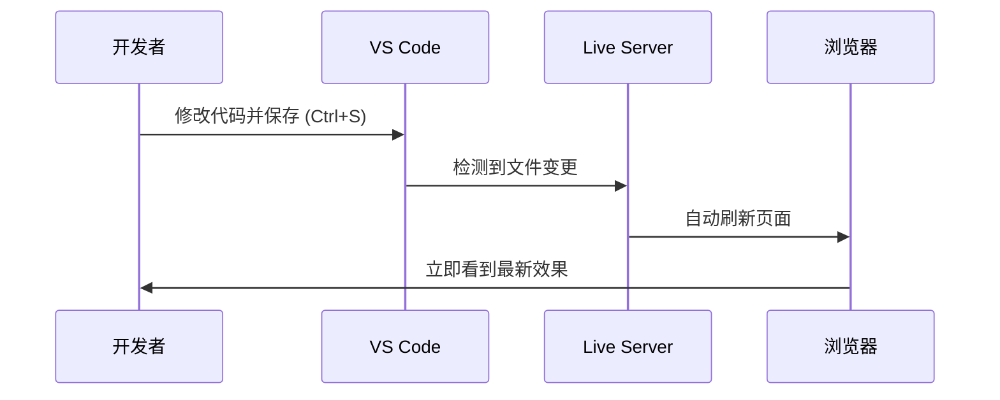
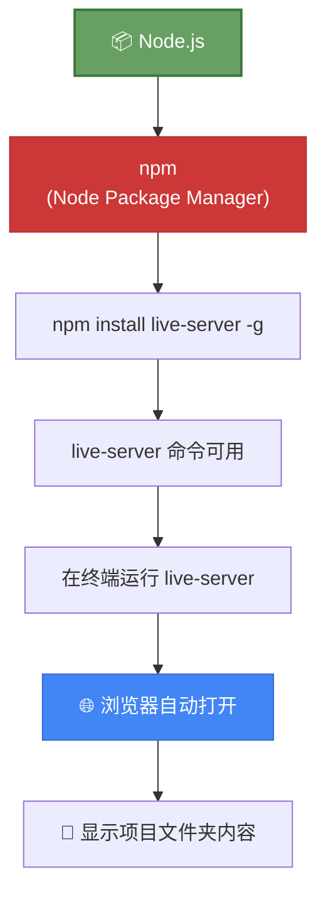

# 安装 Node.js 与搭建开发环境

> 📺 来源：004 Installing Node.js and Setting Up a Dev Environment.en.srt
> 📂 章节：第 05 章

## 📌 知识脉络
- **前置知识**：VS Code 基本操作、HTML 文件结构（`index.html`）、`console.log()` 基础使用
- **后续扩展**：npm 包管理（`npm install`）、Webpack/Vite 打包工具、Node.js 后端开发

## 🎯 概述

本节课介绍两种启动 **Live Server（实时服务器）** 的方式：一种是安装 VS Code 扩展（简单方式），另一种是通过 Node.js 的 npm 包安装（专业方式）。Live Server 可以在你保存文件时自动刷新浏览器，显著提升开发效率。

## 核心知识点

### 1. Live Server 扩展（简单方式）

> 🧩 **生活类比**：Live Server 扩展就像智能电视的"投屏"功能——你在手机上改了什么，电视屏幕（浏览器）立即同步显示，不需要你手动切换。

VS Code 的 Live Server 扩展是搭建实时开发环境的最简单方式：



**安装步骤**：
1. 打开 VS Code 扩展面板（`Ctrl+Shift+X`）
2. 搜索 "Live Server"
3. 安装由 Ritwick Dey 开发的 Live Server 扩展
4. 安装后在底部状态栏出现 **"Go Live"** 按钮
5. 点击 "Go Live" 启动服务器

**🔍 执行追踪：Live Server 启动流程**

| 步骤 | 动作 | 状态 | 结果 |
|------|------|------|------|
| ① | 点击 "Go Live" | 启动中 | Live Server 开始运行 |
| ② | 浏览器自动打开 | `http://127.0.0.1:5500` | 显示 index.html 内容 |
| ③ | 修改 JS 文件 + `Ctrl+S` | 文件变更检测 | 浏览器自动刷新 |
| ④ | 查看 Console | 新输出出现 | 无需手动刷新 |

> 💡 **记忆口诀**：「Go Live 一点，浏览器自动翻新」

---

### 2. Node.js + npm Live Server（专业方式）

> 🧩 **生活类比**：如果说 VS Code 的 Live Server 扩展是"微波炉加热"（简便快速），那么通过 Node.js 安装的 Live Server 就是"专业烤箱"——多了安装步骤，但更专业、功能更强大。

**Node.js** 是一个可以在浏览器外运行 JavaScript 的运行时环境，同时也是运行各种开发工具的基础平台。



**安装与使用步骤**：

```js {runnable} {title="node_setup_steps.js"}
// Node.js 安装与 Live Server 启动步骤模拟
const setupSteps = [
  { step: 1, action: '下载 Node.js', command: '访问 nodejs.org 下载 LTS 版本' },
  { step: 2, action: '安装 Node.js', command: '运行下载的安装程序' },
  { step: 3, action: '验证安装', command: 'node -v  // 输出版本号即成功' },
  { step: 4, action: '安装 live-server', command: 'npm install live-server -g' },
  { step: 5, action: '启动 live-server', command: 'live-server  // 在项目目录中运行' },
];

// Mac 用户额外步骤
const macNote = '⚠️ Mac 用户需在 npm install 前加 sudo: sudo npm install live-server -g';

setupSteps.forEach(({ step, action, command }) => {
  console.log(`${step}️⃣ ${action}`);
  console.log(`   💻 ${command}`);
});
console.log(`\n${macNote}`);
```

**📊 两种 Live Server 方式对比：**

| 特性 | VS Code 扩展 | npm Live Server |
|------|-------------|----------------|
| 安装难度 | ⭐ 一键安装 | ⭐⭐⭐ 需安装 Node.js |
| 使用方式 | 点击 "Go Live" | 终端输入 `live-server` |
| 适用范围 | 仅 VS Code | 任何编辑器 + 终端 |
| 专业程度 | 入门级 | 专业级 |
| 是否需要 Node.js | 否 | 是 |
| Jonas 推荐 | 入门可用 | ✅ 课程中使用 |

> 💡 **记忆口诀**：「扩展求快，npm 求专；入门用扩展，进阶用终端」

---

### 3. VS Code 终端基础

> 🧩 **生活类比**：终端（Terminal）就像你和电脑之间的"对讲机"——你通过输入文字指令来告诉电脑该做什么，电脑再通过文字回复你结果。

VS Code 内置终端的基本操作：

```js {runnable} {title="terminal_basics.js"}
// 终端常用命令一览
const terminalCommands = [
  { command: 'node -v', description: '查看 Node.js 版本', example: 'v22.0.0' },
  { command: 'npm install live-server -g', description: '全局安装 live-server', example: 'added 1 package' },
  { command: 'live-server', description: '启动实时服务器', example: 'Serving at http://127.0.0.1:8080' },
  { command: 'Ctrl+K / Cmd+K', description: '清空终端输出', example: '(终端清空)' },
];

console.log('📋 VS Code 终端常用命令:');
terminalCommands.forEach(({ command, description, example }) => {
  console.log(`\n  💻 ${command}`);
  console.log(`  📝 ${description}`);
  console.log(`  📤 输出: ${example}`);
});
```


> **💼 业务场景**：在专业开发中，终端是不可或缺的工具。除了启动 Live Server，你还会用它来运行构建工具、管理 Git 版本控制、安装项目依赖等。

---

## 🛠️ 代码实战与真实场景

> **💼 业务场景**：你正在搭建一个新项目的开发环境。需要确认 Node.js 是否安装、安装必要的开发工具、并启动实时服务器。

```js {runnable} {title="dev_env_check.js"}
// 模拟开发环境检查工具
function checkDevEnvironment() {
  const requirements = {
    'VS Code': { installed: true, version: '1.85.0' },
    'Node.js': { installed: true, version: 'v22.0.0' },
    'npm': { installed: true, version: '10.2.0' },
    'Live Server': { installed: true, version: '1.2.2' },
    'Prettier': { installed: true, version: '3.1.0' },
  };

  console.log('🔍 开发环境检查报告');
  console.log('='.repeat(40));
  
  let allPassed = true;
  for (const [tool, info] of Object.entries(requirements)) {
    const status = info.installed ? '✅' : '❌';
    if (!info.installed) allPassed = false;
    console.log(`${status} ${tool}: ${info.installed ? `v${info.version}` : '未安装'}`);
  }
  
  console.log('='.repeat(40));
  console.log(allPassed ? '🎉 环境检查通过！可以开始开发' : '⚠️ 部分工具未安装，请先完成安装');
  
  return allPassed;
}

checkDevEnvironment();
```

**📊 输入输出示例：**

| 检查项 | 状态 | 版本 | 安装方式 |
|--------|------|------|---------|
| VS Code | ✅ 已安装 | 1.85.0 | 官网下载 |
| Node.js | ✅ 已安装 | v22.0.0 | 官网下载 LTS |
| npm | ✅ 已安装 | 10.2.0 | 随 Node.js 自带 |
| Live Server | ✅ 已安装 | 1.2.2 | `npm install -g` |
| Prettier | ✅ 已安装 | 3.1.0 | VS Code 扩展 |


## 💡 关键要点
- ✅ **Live Server** 让你保存代码后浏览器自动刷新，告别手动 F5
- ✅ VS Code 扩展方式最简单，npm 方式更专业——两种方式效果一致
- ✅ **Node.js** 不仅是后端运行时，更是运行各种开发工具的基础平台
- ✅ `npm install -g` 中的 `-g` 表示全局安装，让工具在任何目录都可用
- ✅ Live Server 会自动打开项目目录中的 `index.html`，这也是为什么每个项目都需要这个文件

## ⚠️ 常见误区
- ⚠️ **误区 1：必须安装 Node.js 才能学 JavaScript**。真相是：Node.js 只是为了运行开发工具。VS Code 的 Live Server 扩展完全可以替代，你可以跳过 Node.js 的安装。
- ⚠️ **误区 2：Mac 上 npm install 报权限错误就放弃**。真相是：Mac 用户需要在命令前加 `sudo`，然后输入系统密码即可（密码输入时不会显示字符，这是正常的）。

## 🐛 报错实验室

**❌ 错误做法：未安装 Node.js 就运行 npm 命令**
```js
// 在终端中直接运行
// npm install live-server -g
```
**终端报错：**
```
'npm' is not recognized as an internal or external command,
operable program or batch file.
```
**🔑 解读**：`npm` 是随 Node.js 一起安装的包管理器。如果没有安装 Node.js，系统就找不到 `npm` 命令。解决方法是先到 [nodejs.org](https://nodejs.org) 下载并安装 Node.js LTS 版本，安装后重启终端再试。

---

## 📖 词汇速查表 (Cheat Sheet)

| 中文术语 | 英文术语 | 简明释义 | 速查代码 | 📚 官方文档 |
|---------|---------|---------|---------|------------|
| 实时服务器 | Live Server | 文件变更后自动刷新浏览器 | `live-server` | [npm](https://www.npmjs.com/package/live-server) |
| 包管理器 | npm (Node Package Manager) | 下载和管理 JavaScript 工具包 | `npm install -g` | [npm docs](https://docs.npmjs.com/) |
| 全局安装 | Global Install | 工具安装到系统级别，所有项目可用 | `-g` 标志 | [npm install](https://docs.npmjs.com/cli/v10/commands/npm-install) |
| 终端 | Terminal | 用文字指令操控计算机的界面 | `Ctrl+`` ` | [VS Code Terminal](https://code.visualstudio.com/docs/terminal/basics) |
| 运行时 | Runtime | 执行代码的引擎环境 | Node.js | [Node.js](https://nodejs.org/en/docs) |

---

## 🧪 学习验证

### 📝 动手练习

**练习 1：模拟 npm 命令解析器**
```js {runnable} {title="npm_parser.js"}
// 解析 npm 命令的各个部分
function parseNpmCommand(command) {
  const parts = command.split(' ');
  const result = {
    manager: parts[0],       // npm
    action: parts[1],        // install
    package: parts[2],       // live-server
    flag: parts[3] || '无',  // -g
  };
  return result;
}

const command = 'npm install live-server -g';
const parsed = parseNpmCommand(command);

console.log(`📋 命令解析: "${command}"`);
console.log(`  📦 包管理器: ${parsed.manager}`);
console.log(`  🔧 操作: ${parsed.action}`);
console.log(`  📥 包名: ${parsed.package}`);
console.log(`  🏷️ 标志: ${parsed.flag} ${parsed.flag === '-g' ? '(全局安装)' : ''}`);
```
<details><summary>💡 参考答案</summary>

```js
// 命令各部分含义：
// npm        → Node 的包管理器
// install    → 安装操作
// live-server → 要安装的工具名
// -g         → 全局安装标志（global）
```
**解题思路**：npm 命令的结构是 `npm <操作> <包名> [标志]`。`-g` 标志表示全局安装，即安装后任何目录都可以使用该工具。
</details>

**练习 2：环境自检清单**
```js {runnable} {title="self_check.js"}
// 请补全这个环境自检函数
function environmentChecklist() {
  const checklist = [
    { item: 'VS Code 已安装', done: true },
    { item: 'Prettier 扩展已安装', done: true },
    { item: 'Format On Save 已启用', done: true },
    { item: 'Live Server 已安装', done: true },
    { item: 'console.log 代码片段已配置', done: false },
  ];
  
  let score = 0;
  checklist.forEach(({ item, done }) => {
    const icon = done ? '✅' : '⬜';
    console.log(`${icon} ${item}`);
    if (done) score++;
  });
  
  const percentage = Math.round((score / checklist.length) * 100);
  console.log(`\n📊 完成度: ${score}/${checklist.length} (${percentage}%)`);
  console.log(percentage === 100 ? '🎉 完美！' : '💪 继续完善配置！');
}

environmentChecklist();
```
<details><summary>💡 参考答案</summary>

```js
// 将所有 done 设为 true 后运行：
// ✅ VS Code 已安装
// ✅ Prettier 扩展已安装
// ✅ Format On Save 已启用
// ✅ Live Server 已安装
// ✅ console.log 代码片段已配置
// 📊 完成度: 5/5 (100%)
// 🎉 完美！
```
**解题思路**：确保你已逐项完成所有配置。如果某项未完成，回到前面的课程重新配置即可。
</details>

### ❓ 理解检测

:::quiz {correct="B"}
**1. `npm install live-server -g` 命令中的 `-g` 是什么意思？**
- A) 安装最新版本（get）
- B) 全局安装（global），让该工具在任何目录可用
- C) 安装到 Git 仓库中

> **解析**：`-g` 是 `--global` 的缩写，表示将包安装到系统级别，而不是当前项目。这样你可以在任何目录的终端中直接运行 `live-server` 命令。
:::

:::quiz {correct="C"}
**2. 为什么每个项目目录下都需要一个 `index.html` 文件？**
- A) 这是 JavaScript 的语法要求
- B) 没有它代码会报错
- C) Live Server 会默认打开该文件；浏览器也默认寻找它

> **解析**：当 Live Server 启动并在浏览器中打开一个目录时，浏览器会**自动寻找并打开** `index.html` 文件。这是 Web 服务器的标准约定。
:::

:::quiz {correct="A"}
**3. 以下哪种场景可以不安装 Node.js？**
- A) 使用 VS Code 的 Live Server 扩展代替 npm live-server
- B) 使用 npm 安装任何工具时
- C) 运行构建工具 Webpack 时

> **解析**：VS Code 的 **Live Server 扩展**不依赖 Node.js，它作为 VS Code 内置插件独立运行。但如果你需要使用 npm 安装任何工具，则必须先安装 Node.js。
:::

### 🔧 代码填空

:::fill-blank
// 在终端验证 Node.js 是否安装成功
// 命令: ___node___ -v

// 全局安装 live-server
// 命令: npm ___install___ live-server ___-g___

// Mac 用户需要在命令前加
// ___sudo___ npm install live-server -g
:::
