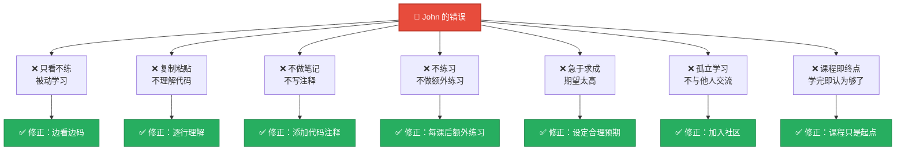
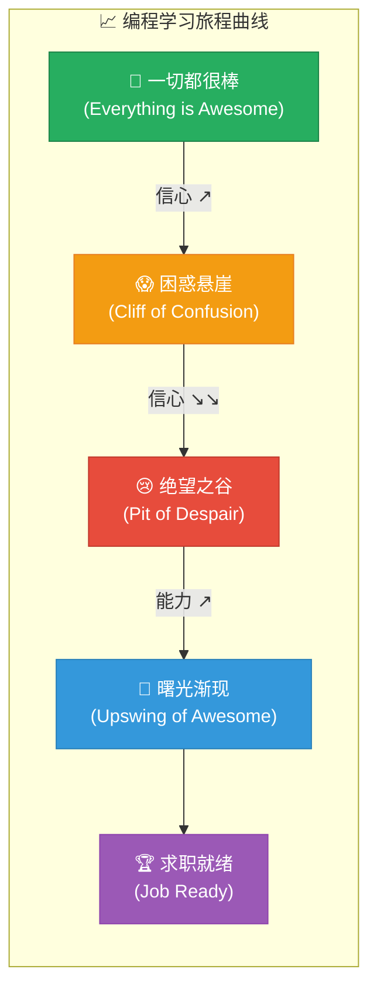
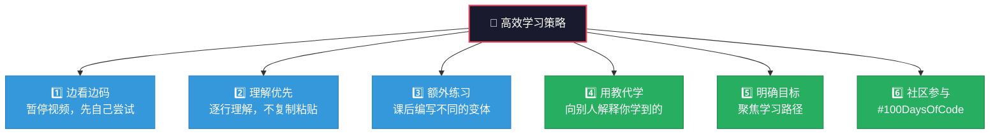
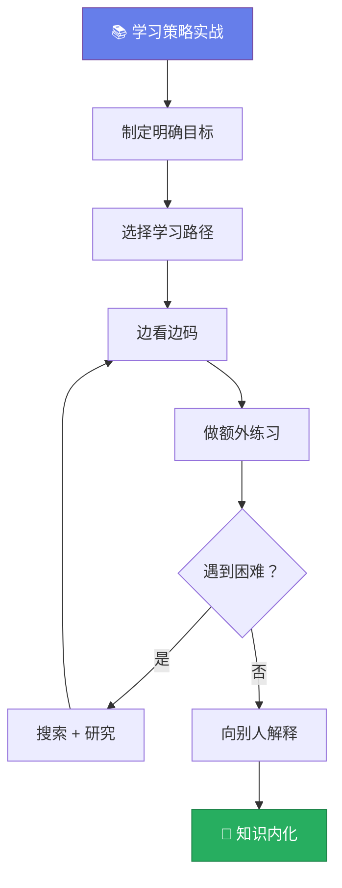

# 如何学习编程

> 📺 来源：005 Learning How to Code.en.srt
> 📂 章节：第 05 章

## 📌 知识脉络
- **前置知识**：JavaScript 基础语法已入门、对编程有初步了解
- **后续扩展**：像开发者一样思考（问题解决框架）、实战项目历练、求职与面试准备

## 🎯 概述

本节课是 Jonas 精心设计的**学习方法论**课程，通过虚构人物"John"的学习误区，总结了编程学习中常见的陷阱及应对策略。还展示了从初学者到求职就绪的**完整学习旅程曲线**，帮助学习者建立正确的心态预期。

## 核心知识点

### 1. 初学者常犯的学习错误

> 🧩 **生活类比**：学编程就像学游泳——你不能只在泳池边看教练示范（看视频课程），你必须跳入水中亲自练习（写代码），即使一开始会呛水（遇到 Bug）。

Jonas 通过 "John" 的故事，列举了初学者最常见的学习陷阱：



**🔍 执行追踪：正确 vs 错误的学习对比**

| 行为 | ❌ John 的做法 | ✅ 正确的方式 | 效果差异 |
|------|-------------|-------------|---------|
| 看视频课程 | 被动观看，觉得"都懂了" | 暂停视频，先自己尝试 | 主动学习记忆留存率 ×5 |
| 遇到代码示例 | 直接复制粘贴 | 逐行手打并理解 | 形成肌肉记忆 |
| 遇到不懂的 | 跳过继续看下一课 | 做笔记、Google 研究 | 知识链条不断裂 |
| 练习频率 | 只做课内练习 | 做额外的编程挑战 | 举一反三能力 |
| 学完一门课 | 以为自己是开发者了 | 知道课程只是起点 | 心态更健康 |

> 💡 **记忆口诀**：「看了不练假把式，练了不思白用功」

---

### 2. 学习旅程曲线（The Learning Journey）

> 🧩 **生活类比**：学编程的信心变化就像坐过山车——刚开始兴奋上升（什么都新鲜有趣），然后急剧下降（现实打击），但只要坚持住，最终会重新攀升到更高的位置。

Jonas 分享了一张经典的"信心 vs 能力"曲线图，标注了四个关键阶段：



**四个阶段详解**：

| 阶段 | 名称 | 信心 | 能力 | 你在做什么 | 建议 |
|------|------|------|------|-----------|------|
| ① | 🎉 一切都很棒 | 📈 高 | 📉 低 | 看课程，做练习 | 享受这个阶段，但不要高估自己 |
| ② | 😱 困惑悬崖 | 📉 下降 | 📈 上升 | 尝试独立做项目 | 不要放弃！继续写代码 |
| ③ | 😢 绝望之谷 | 📉 最低 | 📈 持续上升 | 自觉什么都不会 | 找学习伙伴或导师 |
| ④ | 🌅 曙光渐现 | 📈 回升 | 📈 较高 | 开始构建真实项目 | 学习最佳实践、工具链 |

> 💡 **记忆口诀**：「初学觉得都简单，独立编码才知难；坚持过了低谷期，豁然开朗在眼前」

---

### 3. 高效学习的核心策略

> 🧩 **生活类比**：学编程就像练乐器——读乐谱（学语法）很重要，但真正的进步来自反复练琴（写代码）。没有人通过只看别人弹钢琴就学会了钢琴。



**📊 学习策略效果对比：**

| 策略 | 被动学习 | 主动学习（推荐） | 效率提升 |
|------|---------|----------------|---------|
| 看视频 | 直接看完 | 暂停 + 先自己试 | ×3 |
| 写代码 | 复制粘贴 | 手打 + 理解每行 | ×5 |
| 练习 | 只做课内 | 课后额外变体 | ×2 |
| 遇到困难 | 跳过继续 | 研究搜索理解 | ×4 |
| 学习方式 | 独自学习 | 教别人 + 社区互动 | ×3 |

> **💼 业务场景**：Kyle Simpson（JavaScript 领域的传奇人物，著有《You Don't Know JS》系列）公开表示："在 20 多年后的今天，让代码工作然后第二天能看懂它，仍然是一件困难的事。" ——即便是顶级专家也在持续学习。

---

## 🛠️ 代码实战与真实场景

> **💼 业务场景**：创建一个学习进度追踪器，帮助你可视化自己在学习旅程中的位置。

```js {runnable} {title="learning_tracker.js"}
// 学习旅程追踪器
const learningJourney = {
  stages: [
    { name: '🎉 一切都很棒', confidence: 80, competence: 10, activities: '看课程、做练习' },
    { name: '😱 困惑悬崖', confidence: 50, competence: 30, activities: '尝试独立项目' },
    { name: '😢 绝望之谷', confidence: 20, competence: 50, activities: '不断写代码、修 Bug' },
    { name: '🌅 曙光渐现', confidence: 70, competence: 75, activities: '构建真实项目' },
    { name: '🏆 求职就绪', confidence: 85, competence: 90, activities: '学习工具链、准备作品集' },
  ],
};

// 你当前可能在哪个阶段？
const currentStage = 0; // 修改这个数字 (0-4) 来定位你的位置

console.log('📊 编程学习旅程追踪器\n');
learningJourney.stages.forEach((stage, index) => {
  const marker = index === currentStage ? ' 👈 你在这里!' : '';
  const confidenceBar = '█'.repeat(Math.round(stage.confidence / 10));
  const competenceBar = '█'.repeat(Math.round(stage.competence / 10));
  
  console.log(`${stage.name}${marker}`);
  console.log(`  信心: ${confidenceBar} ${stage.confidence}%`);
  console.log(`  能力: ${competenceBar} ${stage.competence}%`);
  console.log(`  活动: ${stage.activities}\n`);
});
```



**📊 输入输出示例：**

| 当前阶段 | 信心指数 | 能力指数 | 建议行动 |
|----------|---------|---------|---------|
| 一切都很棒 | 80% | 10% | 保持热情，但要动手练习 |
| 困惑悬崖 | 50% | 30% | 不放弃，继续写代码 |
| 绝望之谷 | 20% | 50% | 找学习伙伴，构建项目 |
| 曙光渐现 | 70% | 75% | 学习最佳实践 |
| 求职就绪 | 85% | 90% | 准备作品集和面试 |

## 💡 关键要点
- ✅ **编程不能只看不练**——主动编码的学习效果是被动观看的 5 倍以上
- ✅ 学习旅程中**信心下降是正常的**——困惑悬崖和绝望之谷是每个人都会经历的
- ✅ **课程只是起点**，不是终点——真正的成长来自独立做项目和解决真实问题
- ✅ 向别人解释所学内容（**以教代学**）是最有效的巩固知识的方式
- ✅ 设定明确的学习目标，避免"什么都学但什么都不精"

## ⚠️ 常见误区
- ⚠️ **误区 1：编程很简单，两个月就能找到工作**。真相是：成为就业水平的开发者通常需要 6-12 个月的持续学习和实践。不要被"速成"营销误导。
- ⚠️ **误区 2：遇到困难就是因为自己不适合编程**。真相是：编程本身就是困难的事情，所有成功的开发者都经历过同样的挣扎。
- ⚠️ **误区 3：不跟别人比较就不知道自己水平**。真相是：每个人的起点和节奏不同，与其和别人比，不如跟昨天的自己比。

## 🐛 报错实验室

**❌ 错误做法：复制粘贴代码不理解就运行**
```js
// 从网上复制来的代码，不理解其含义
const result = [1,2,3].reduce((acc, cur) => acc + cur, 0);
console.log(result); // 6
// 但你不知道 reduce 是什么、acc 和 cur 代表什么
```
**浏览器报错：**
```
// 当你尝试修改这段代码时：
const result = [1,2,3].reduce((acc, cur) => acc * cur);
// 你期望得到 0（因为"初始值是0"），但实际得到 6
// TypeError in your understanding: 你不知道省略初始值时 acc = array[0]
```
**🔑 解读**：复制粘贴的代码虽然能运行，但你不理解原理就无法修改和调试。正确做法是逐行拆解理解，如果不懂 `reduce`，先在 MDN 上学习，再自己手写实现一遍。

---

## 📖 词汇速查表 (Cheat Sheet)

| 中文术语 | 英文术语 | 简明释义 | 相关概念 | 📚 参考资料 |
|---------|---------|---------|---------|------------|
| 困惑悬崖 | Cliff of Confusion | 从课程过渡到独立编程时的信心骤降期 | 学习曲线 | — |
| 绝望之谷 | Pit of Despair | 意识到知识差距巨大时的低谷期 | 学习旅程 | — |
| 以教代学 | Teaching to Learn | 通过教别人来加深自己的理解 | 费曼学习法 | — |
| 主动学习 | Active Learning | 动手实践而非被动观看 | 学习策略 | — |
| 分治策略 | Divide and Conquer | 将大问题拆解为小问题逐个解决 | 问题解决 | — |

---

## 🧪 学习验证

### 📝 动手练习

**练习 1：创建学习日志**
```js {runnable} {title="learning_diary.js"}
// 用代码记录你的学习日志
const todayEntry = {
  date: new Date().toLocaleDateString(),
  chapter: '第05章',
  lesson: '如何学习编程',
  hoursStudied: 1.5,
  keyTakeaways: [
    '在这里写下你今天学到的第1个要点',
    '在这里写下你今天学到的第2个要点',
    '在这里写下你今天学到的第3个要点',
  ],
  practiceProjects: '在这里写下你今天练习了什么',
  mood: '😊',  // 今天学习的心情
};

console.log(`📅 ${todayEntry.date} 学习日志`);
console.log(`📖 ${todayEntry.chapter} - ${todayEntry.lesson}`);
console.log(`⏱️ 学习时长: ${todayEntry.hoursStudied} 小时`);
console.log(`\n💡 今日要点:`);
todayEntry.keyTakeaways.forEach((point, i) => {
  console.log(`  ${i + 1}. ${point}`);
});
console.log(`\n🛠️ 练习: ${todayEntry.practiceProjects}`);
console.log(`\n😊 心情: ${todayEntry.mood}`);
```
<details><summary>💡 参考答案</summary>

```js
const todayEntry = {
  date: new Date().toLocaleDateString(),
  chapter: '第05章',
  lesson: '如何学习编程',
  hoursStudied: 1.5,
  keyTakeaways: [
    '编程学习要主动练习，不能只看不写',
    '信心曲线是正常的，低谷期每个人都会经历',
    '课程只是起点，要持续做项目和学习',
  ],
  practiceProjects: '完成了学习追踪器代码练习',
  mood: '💪',
};
```
**解题思路**：学习日志的核心是记录"今天学到了什么"和"今天练习了什么"。坚持每天记录可以帮助你追踪进步。
</details>

**练习 2：实现学习策略打分器**
```js {runnable} {title="strategy_scorer.js"}
// 根据你的学习习惯给自己打分
function scoreLearningHabits(habits) {
  let score = 0;
  const feedback = [];
  
  if (habits.codesAlongWithVideo) { score += 20; feedback.push('✅ 边看边码'); }
  else feedback.push('❌ 需要开始边看边码');
  
  if (habits.doesExtraPractice) { score += 20; feedback.push('✅ 额外练习'); }
  else feedback.push('❌ 需要做更多课外练习');
  
  if (habits.takesNotes) { score += 15; feedback.push('✅ 做笔记'); }
  else feedback.push('❌ 建议开始记笔记');
  
  if (habits.teachesOthers) { score += 25; feedback.push('✅ 以教代学'); }
  else feedback.push('❌ 试着向别人解释你学到的');
  
  if (habits.hasGoal) { score += 20; feedback.push('✅ 有明确目标'); }
  else feedback.push('❌ 需要设定学习目标');
  
  return { score, feedback };
}

// 修改这些值来反映你的真实情况
const myHabits = {
  codesAlongWithVideo: true,
  doesExtraPractice: false,
  takesNotes: true,
  teachesOthers: false,
  hasGoal: true,
};

const result = scoreLearningHabits(myHabits);
console.log(`📊 你的学习效率得分: ${result.score}/100`);
result.feedback.forEach(f => console.log(`  ${f}`));
```
<details><summary>💡 参考答案</summary>

```js
// 理想的学习习惯是所有项都为 true
const idealHabits = {
  codesAlongWithVideo: true,
  doesExtraPractice: true,
  takesNotes: true,
  teachesOthers: true,
  hasGoal: true,
};
// 得分: 100/100
```
**解题思路**：这不是一个有"正确答案"的练习——重点是诚实评估自己的学习习惯，找出可以改进的方面。
</details>

### ❓ 理解检测

:::quiz {correct="B"}
**1. Jonas 认为学习编程的"最佳方法"是什么？**
- A) 看完一门课程就够了
- B) 边看课程边动手编码，并做大量额外练习
- C) 只看书不看视频

> **解析**：Jonas 反复强调，**主动编码**（边看边码 + 额外练习）是学习编程最有效的方式。课程只提供基础，真正的成长来自实践。
:::

:::quiz {correct="C"}
**2. 在学习旅程的"绝望之谷"阶段，最好的应对方法是？**
- A) 放弃编程，选择其他职业
- B) 回到第一门课程重新学习
- C) 找学习伙伴或导师，继续构建项目

> **解析**：绝望之谷是**正常**的阶段。Jonas 建议找到学习伙伴或导师互相支持，同时继续构建越来越大的项目来锻炼技能。
:::

:::quiz {correct="A"}
**3. Kyle Simpson 的例子说明了什么？**
- A) 即使是 20 年经验的专家，编程仍然充满挑战——这是正常的
- B) 只要学够 20 年就能掌握所有知识
- C) 编程专家不需要继续学习

> **解析**：Kyle Simpson（《You Don't Know JS》作者）公开承认编程"仍然是一场挣扎"。Jonas 引用他来说明：**不要因为觉得编程困难而气馁**，因为所有人都面临同样的挑战。
:::

### 🔧 代码填空

:::fill-blank
// 学习旅程的四个阶段
const stages = [
  '___一切都很棒___',      // Everything is Awesome
  '___困惑悬崖___',        // Cliff of Confusion
  '___绝望之谷___',        // Pit of Despair
  '___曙光渐现___',        // Upswing of Awesome
];
:::
