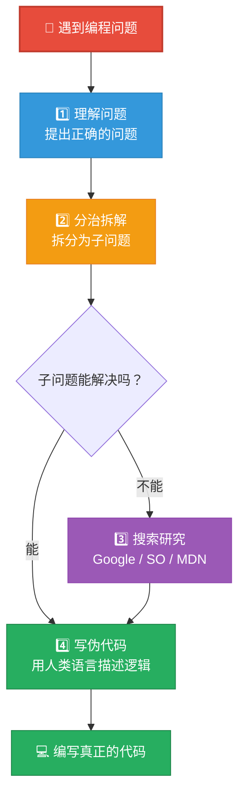
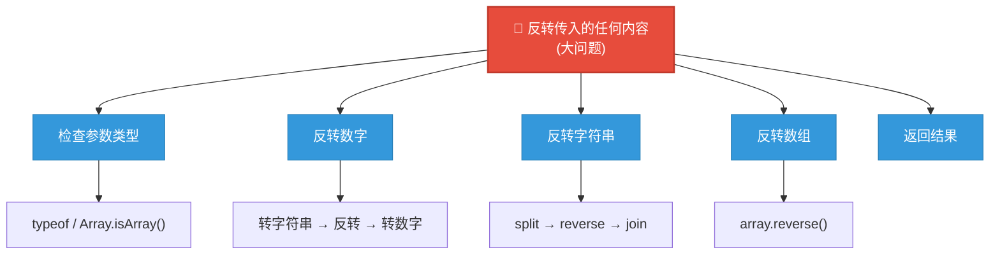
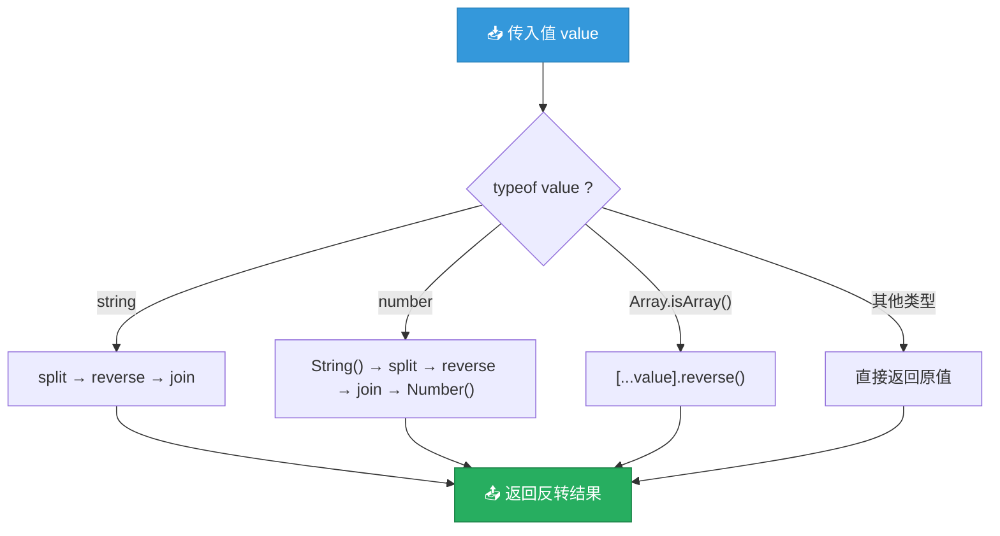

# 像开发者一样思考：成为问题解决者

> 📺 来源：007 How to Think Like a Developer Become a Problem Solver!.en.srt
> 📂 章节：第 05 章

## 📌 知识脉络
- **前置知识**：JavaScript 基础语法、函数、数组、循环、条件判断
- **后续扩展**：使用 Google / Stack Overflow / MDN 解决实际问题、调试技巧、算法思维

## 🎯 概述

本节课介绍 Jonas 的**四步问题解决框架**——理解问题、分治拆解、搜索研究、编写伪代码。通过一个"反转任意值"的案例，详细演示了如何从模糊需求出发，一步步到达清晰可实现的解决方案。

## 核心知识点

### 1. 四步问题解决框架

> 🧩 **生活类比**：解决编程问题就像组装宜家家具——不能打开盒子就直接上手（John 的做法）。你需要先看说明书确认零件（理解问题），然后按步骤分组零件（分治拆解），不会的查 YouTube（搜索研究），最后在脑中预演一遍（伪代码）再开始组装。



**🔍 执行追踪：John vs Jonas 的解题方式**

| 维度 | ❌ John 的做法 | ✅ Jonas 的框架 |
|------|-------------|----------------|
| 拿到问题后 | 直接跳入写代码 | 先停下来理解问题 |
| 思考方式 | 无结构，随意尝试 | 逻辑化、系统化 |
| 不会的部分 | 硬撑，不愿搜索 | Google / MDN 研究 |
| 编码前 | 直接写代码 | 先写伪代码 |
| 遇到困难 | 焦虑、放弃 | 拆分子问题逐个攻破 |

> 💡 **记忆口诀**：「理解拆解搜伪码，四步框架不怕大」

---

### 2. 第一步：理解问题（Ask the Right Questions）

> 🧩 **生活类比**：如果有人说"给我做道菜"，你不能立刻冲进厨房——你得先问清楚：做给谁吃？几个人？有忌口吗？什么时候要？这些"正确的问题"决定了你的整个方案。

**案例**：项目经理说"我们需要一个函数来反转传入的任何内容"。

```js {runnable} {title="understand_problem.js"}
// 第一步：通过提问来理解问题
const problemAnalysis = {
  originalRequest: '编写一个函数，反转传入的任何内容',

  questions: [
    { q: '"任何内容"具体指什么？', a: '字符串、数字和数组（对象没有顺序，无法反转）' },
    { q: '如果传入其他类型怎么办？', a: '直接返回原值，不做处理' },
    { q: '返回值应该是什么类型？', a: '与传入类型相同' },
    { q: '如何判断传入值的类型？', a: '使用 typeof 运算符 + Array.isArray()' },
  ],
};

console.log(`📋 原始需求: "${problemAnalysis.originalRequest}"\n`);
console.log('❓ 通过提问澄清需求:');
problemAnalysis.questions.forEach(({ q, a }, i) => {
  console.log(`\n  ${i + 1}. ${q}`);
  console.log(`     → ${a}`);
});
```

---

### 3. 第二步：分治拆解（Divide and Conquer）

> 🧩 **生活类比**：搬家不是"一次性把所有东西搬走"——你需要先按房间分类（客厅的、卧室的），然后按物品大小排序（先搬大件再搬小件），每次只搬一类。编程问题也一样：拆成小块，逐个解决。

```js {runnable} {title="divide_conquer.js"}
// 第二步：将大问题拆解为子问题
const subProblems = [
  '1. 检查传入值是数字、字符串还是数组',
  '2. 实现反转数字的逻辑',
  '3. 实现反转字符串的逻辑',
  '4. 实现反转数组的逻辑',
  '5. 返回反转后的值',
];

console.log('📋 子问题清单（类似任务列表）:\n');
subProblems.forEach(problem => {
  console.log(`  ☐ ${problem}`);
});
console.log('\n💡 每个子问题都比原始问题简单得多！');
```



---

### 4. 第三步 & 第四步：搜索研究 + 伪代码

> 🧩 **生活类比**：搜索研究就像查菜谱——你不是什么都要自己发明，查找已有的解决方案并加以理解，才是高效的做法。伪代码则像在脑中"试做一遍"，确保思路通顺后再真正下厨。

```js {runnable} {title="pseudocode_demo.js"}
// 第四步：伪代码 —— 用人类语言描述逻辑
const pseudoCode = `
function reverse(value):
  if type of value is NOT string AND NOT number AND NOT array:
    return value  // 不支持的类型直接返回

  if value is string:
    reverse the string
  if value is number:
    reverse the number
  if value is array:
    reverse the array

  return reversed value
`;

console.log('📝 伪代码 (Pseudo-code):');
console.log(pseudoCode);
console.log('💡 注意：这不是任何编程语言的语法！');
console.log('   伪代码是"给人看的"，不是给计算机执行的。');
```

**📊 搜索研究的常用资源：**

| 资源 | 适合场景 | 示例搜索 |
|------|---------|---------|
| **Google** | 快速找到解决方案 | "how to reverse a string in JavaScript" |
| **Stack Overflow** | 具体技术问题 | "JavaScript check if value is array" |
| **MDN Web Docs** | 查官方 API 文档 | "Array.prototype.reverse()" |

> **💼 业务场景**：在真实项目中，大量搜索研究是完全正常的。据统计，专业开发者平均每天要进行 30+ 次搜索。搜索能力是开发者最重要的"隐性技能"之一。

---

## 🛠️ 代码实战与真实场景

> **💼 业务场景**：实现一个通用的 `reverse` 函数，按照四步框架从理解问题到最终编码。

```js {runnable} {title="reverse_anything.js"}
// 最终实现：反转任意类型的值
function reverse(value) {
  // 步骤 1: 类型检查 —— 只处理字符串、数字、数组
  const type = typeof value;
  const isArray = Array.isArray(value);
  
  if (type !== 'string' && type !== 'number' && !isArray) {
    return value; // 不支持的类型直接返回
  }
  
  // 步骤 2-4: 根据类型执行不同的反转逻辑
  if (type === 'string') {
    return value.split('').reverse().join(''); // 字符串反转
  }
  
  if (type === 'number') {
    const reversed = String(value).split('').reverse().join('');
    return Number(reversed); // 数字 → 字符串 → 反转 → 数字
  }
  
  if (isArray) {
    return [...value].reverse(); // 数组浅拷贝后反转（不修改原数组）
  }
}

// 测试各种类型
console.log('字符串:', reverse('hello'));     // "olleh"
console.log('数字:', reverse(12345));         // 54321
console.log('数组:', reverse([1, 2, 3, 4])); // [4, 3, 2, 1]
console.log('布尔值:', reverse(true));        // true（不支持，原样返回）
console.log('对象:', reverse({a: 1}));        // {a: 1}（不支持，原样返回）
```

**📊 输入输出示例：**

| 输入 | 类型 | 输出 | 说明 |
|------|------|------|------|
| `'hello'` | 字符串 | `'olleh'` | split → reverse → join |
| `12345` | 数字 | `54321` | 转字符串 → 反转 → 转数字 |
| `[1,2,3]` | 数组 | `[3,2,1]` | 浅拷贝 → reverse() |
| `true` | 布尔值 | `true` | 不支持的类型，原样返回 |
| `{a:1}` | 对象 | `{a:1}` | 不支持的类型，原样返回 |



## 💡 关键要点
- ✅ **不要拿到问题就写代码**——先理解问题，再拆解，最后才编码
- ✅ **分治策略**是最强大的问题解决工具——把大问题拆成可管理的小子问题
- ✅ **搜索研究不丢脸**——专业开发者每天都在 Google / Stack Overflow 上寻找答案
- ✅ **伪代码**帮你在编码前理清逻辑，减少"边写边改"的混乱
- ✅ 培养对"事物如何运作"的**好奇心**是成为优秀开发者的底层驱动力

## ⚠️ 常见误区
- ⚠️ **误区 1：好的开发者不需要 Google**。真相是：Google 搜索是开发者日常工作的核心部分，即使是高级工程师也在不断搜索。
- ⚠️ **误区 2：伪代码是浪费时间**。真相是：在复杂问题中，伪代码可以帮你避免大量的返工和调试时间。

## 🐛 报错实验室

**❌ 错误做法：不理解问题就直接编码**
```js
// 误解为"反转"是将值变成负数
function reverse(value) {
  return -value; // ❌ 这不是"反转"的意思！
}

console.log(reverse('hello')); // NaN
console.log(reverse(123));     // -123（不是 321）
```
**浏览器报错：**
```
NaN  // 字符串无法取负
-123 // 数字取负不等于数字反转
```
**🔑 解读**：不理解问题的本质，就会写出完全偏离需求的代码。"反转"在此指颠倒顺序（`hello → olleh`、`123 → 321`），而非数学意义上的取反。**第一步"理解问题"决定了整个方案的方向**。

---

## 📖 词汇速查表 (Cheat Sheet)

| 中文术语 | 英文术语 | 简明释义 | 速查代码 | 📚 官方文档 |
|---------|---------|---------|---------|------------|
| 分治策略 | Divide and Conquer | 将大问题拆分为小问题逐个解决 | — | — |
| 伪代码 | Pseudo-code | 用人类语言描述程序逻辑 | — | — |
| 类型检测 | typeof | 检测值的数据类型 | `typeof value` | [MDN](https://developer.mozilla.org/en-US/docs/Web/JavaScript/Reference/Operators/typeof) |
| 数组判断 | Array.isArray() | 判断值是否为数组 | `Array.isArray([1,2])` | [MDN](https://developer.mozilla.org/en-US/docs/Web/JavaScript/Reference/Global_Objects/Array/isArray) |
| 字符串拆分 | String.split() | 将字符串拆分为数组 | `'abc'.split('')` | [MDN](https://developer.mozilla.org/en-US/docs/Web/JavaScript/Reference/Global_Objects/String/split) |
| 数组反转 | Array.reverse() | 颠倒数组元素顺序 | `[1,2,3].reverse()` | [MDN](https://developer.mozilla.org/en-US/docs/Web/JavaScript/Reference/Global_Objects/Array/reverse) |

---

## 🧪 学习验证

### 📝 动手练习

**练习 1：用四步框架解决问题**
```js {runnable} {title="exercise_framework.js"}
// 问题：编写函数统计字符串中元音字母的数量
// 请按四步框架来解决

// 第一步：理解问题
// - 元音字母是哪些？a, e, i, o, u
// - 大小写都算吗？是的

// 第二步：分解子问题
// 1. 遍历字符串的每个字符
// 2. 检查当前字符是否为元音
// 3. 如果是，计数器 +1
// 4. 返回计数

// 第三步：搜索（如果需要）
// "JavaScript check if string contains character"

// 第四步：伪代码
// function countVowels(str):
//   counter = 0
//   for each character in str:
//     if character is a vowel: counter++
//   return counter

// 你的实现：
function countVowels(str) {
  // 在这里写代码
}

console.log(countVowels('hello'));      // 应输出 2
console.log(countVowels('JavaScript')); // 应输出 3
```
<details><summary>💡 参考答案</summary>

```js
function countVowels(str) {
  const vowels = 'aeiouAEIOU';
  let count = 0;
  for (let i = 0; i < str.length; i++) {
    if (vowels.includes(str[i])) {
      count++;
    }
  }
  return count;
}
```
**解题思路**：将元音字母存入字符串，用 `includes()` 逐字符检查。关键是先按四步框架分析问题，再动手编码。
</details>

**练习 2：分治策略实践**
```js {runnable} {title="exercise_divide.js"}
// 问题：编写函数判断一个数是否为回文数（正着读和倒着读一样，如121、1221）
// 请先列出子问题，再编码

// 子问题列表：
// 1. 把数字转成字符串
// 2. 反转字符串
// 3. 比较反转前后是否相同

function isPalindrome(num) {
  // 在这里写代码
}

console.log(isPalindrome(121));    // true
console.log(isPalindrome(1234));   // false
console.log(isPalindrome(12321));  // true
```
<details><summary>💡 参考答案</summary>

```js
function isPalindrome(num) {
  const str = String(num);
  const reversed = str.split('').reverse().join('');
  return str === reversed;
}
```
**解题思路**：三个子问题逐个击破——①转字符串 `String(num)`，②反转 `split → reverse → join`，③比较 `===`。每个子问题都是我们已经掌握的知识。
</details>

### ❓ 理解检测

:::quiz {correct="B"}
**1. Jonas 四步框架的正确顺序是？**
- A) 编码 → 研究 → 理解 → 测试
- B) 理解问题 → 分治拆解 → 搜索研究 → 伪代码
- C) 搜索 → 理解 → 编码 → 伪代码

> **解析**：正确顺序是 **理解 → 分治 → 搜索 → 伪代码**。先确保100%理解问题，再拆分为子问题，遇到不会的再搜索，最后用伪代码梳理逻辑后再编码。
:::

:::quiz {correct="A"}
**2. 什么是伪代码（Pseudo-code）？**
- A) 用类似人类自然语言描述算法逻辑的非正式代码
- B) 有语法错误的 JavaScript 代码
- C) 用注释写的 JavaScript

> **解析**：伪代码是用**类人类语言**描述程序逻辑的非正式文本。它不属于任何编程语言，没有固定语法规则，目的是帮助你在编码前理清思路。
:::

:::quiz {correct="C"}
**3. 如果一个子问题你无法自行解决，下一步应该做什么？**
- A) 跳过该子问题继续写代码
- B) 放弃整个项目
- C) 使用 Google、Stack Overflow 或 MDN 进行研究

> **解析**：Jonas 强调，当你"不断碰壁"时，不要浪费更多时间——立刻通过 **Google / Stack Overflow / MDN** 搜索解决方案。研究是开发者工作的核心部分，不是"作弊"。
:::

### 🔧 代码填空

:::fill-blank
// 用四步框架解决问题
// 1. ___理解问题___：提出正确的问题
// 2. ___分治拆解___：将大问题拆分为小子问题
// 3. ___搜索研究___：不会的部分去 Google / MDN
// 4. ___编写伪代码___：用人类语言描述逻辑

// 检查值是否为数组
const isArray = ___Array.isArray___([1, 2, 3]); // true
:::
